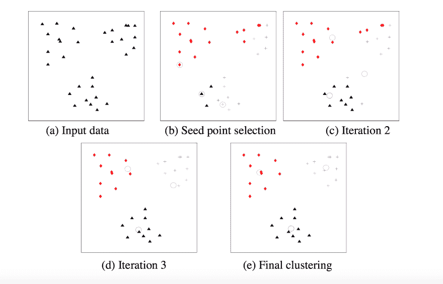

# 使用机器学习生成人类可读的新闻文章

> 原文:[https://dev . to/tra/using-machine-learning-to-generate-human-readable-news-articles](https://dev.to/tra/using-machine-learning-to-generate-human-readable-news-articles)

**TL；抽象博士** -我构建了[僵尸编辑器](https://github.com/tra38/ZombieWriter)，这是一个 Ruby 宝石，它将使用户能够通过聚合其他来源的段落来生成新闻文章。它可以使用机器学习算法(潜在语义分析和 k-means 聚类)或随机化来生成人类可读的文章。在这篇文章中，我演示了 ZombieWrtier 如何使用机器学习来创建[一个包含 17 篇人类可读文章的 Markdown 文件](https://gist.github.com/tra38/aa7e9c63708f6e21c32db5c3616162b5)。

在完成演示并将输出与随机化过程进行比较之后，我将解释可能的“未来研究”计划来改进文本生成过程。我还没准备好宣称这项技术是颠覆性的。但它非常接近“生产就绪”。

* * *

## 简介

机器学习很热(说得委婉一点)。使用数据而不是代码对机器编程的范例已经被应用于解决各种现实世界的问题。它也被应用于创造性艺术，神经网络被用来生成绘画和音乐。

然而，使用机器学习的文本生成远没有那么先进。许多著名的尝试都集中在[训练神经网络来生成文本](http://machinelearningmastery.com/text-generation-lstm-recurrent-neural-networks-python-keras/)，输出往往是短脉冲串的唤起。然而，这些文本没有适当地“缩放”。神经网络偶然产生的任何一致性都会被它通常产生的不一致性淹没。

我以前写过关于文本生成的博客。但我一直对**“人类可读”**文本生成——达到人类文学同等质量标准的文本生成感兴趣。机器学习算法令人印象深刻，但它们不能很好地扩大规模。所以我通常在我的博客中忽略它们，支持“结构建模”(我[定义](https://dev.to/tra/nanogenmo-2016-and-my-predictions-about-text-generation)为“编写代码，大规模地‘编码’情节/风格/人物”)。

然而，技术在不断进步。随着机器学习变得越来越流行和可用，人们能够尝试不同的方法和技术来解决文本生成的问题。当结合结构建模应用时，这些技术中的一些实际上是成功的。例如，迈克·林奇使用神经网络[为幻想设定](http://mikelynch.org/2016/Dec/10/annales-1-vocab/)生成文字。

这种技术进步不应该令人惊讶。有无限多台打字机的无限多只猴子可以写出莎士比亚...类似地，无限多的程序员进行无限多的实验也能有伟大的发现。

几个月前，我承认机器学习可能会在未来的文本生成中发挥作用，并做了一个预测——[“统计方法将是文本生成中‘工具包’的一部分”](https://dev.to/tra/nanogenmo-2016-and-my-predictions-about-text-generation)。与此同时，我正在完成一个秘密项目，在我自己的文本生成中使用机器学习。(如果你对实际的研究细节感兴趣，这里有【2016 年 9 月关于我的实验的一次闲聊的一些摘录。)

我的项目最终结果是 [ZombieWriter](https://github.com/tra38/ZombieWriter) 。根据 GitHub 的简介，ZombieWriter 是“一个 Ruby 宝石，它将使用户能够通过聚合其他来源的段落来生成新闻文章”。你必须提供段落，但是一旦这样做了，ZombieWriter 会以一种看起来像新闻文章的方式来排列段落。

虽然您可以下载 gem 并亲自试用，但了解它的工作原理可能更有趣。以下是 ZombieWriter 的机器学习算法如何工作的分步指南。

## 步骤一——潜在语义分析

潜在语义分析是一种机器学习算法，用于确定段落之间的相似程度。它发明于 20 世纪 80 年代末，通常用于“信息检索”。

LSA 的工作方法是创建包含一个段落中所有重要单词的“单词包”，然后比较不同的“单词包”来确定它们的“相似性”。与其处理数学(因为我自己也不太明白)，这里有一个可视化的例子，有四个文档。

| 文件 | 词汇袋 |
| --- | --- |
| A | 猫，喵 |
| B | 猫，猫科动物，宠物 |
| C | 宠物、食物 |
| D | 猫科动物，狮子 |

文档 A 和文档 B 彼此非常相似，因为它们都共享同一个单词(“cat”)。文档 B 和文档 C 彼此相似，因为它们共享同一个单词(“pet”)。文档 B 和文档 D 彼此相似，因为它们共享同一个单词(“猫科动物”)。等等。等。

LSA 的一个有趣特性是，它能够根据不同单词在文档中的出现来确定它们之间的关系...这也有助于它识别相似之处。

例如，文档 B 包含单词“cat”和“caterpillar”，这表明这两个单词彼此相关。因为文档 D 包含术语“猫科动物”，所以文档 D 显然类似于文档 B(其包含“猫科动物”)。文档 D 也类似于文档 A，因为文档 A 包含单词“cat”，并且“cat”与“猫科动物”相关。

关于 LSA 背后的数学的更多信息，请查看博客文章[Ruby 中的潜在语义分析](http://blog.josephwilk.net/ruby/latent-semantic-analysis-in-ruby.html)。我使用了[分类器-重生](https://github.com/jekyll/classifier-reborn)，一个红宝石，为我的段落进行 LSA。

## 两步 K-均值聚类

一旦确定了哪些段落彼此相似，就需要使用一种称为“聚类”的方法将相似的段落分组在一起。聚类往往用于探索性数据分析；你有很多想要容易理解的数据，所以你有一个算法把数据分成不同的组。

对数据进行聚类有许多不同的方法，但最流行的聚类方法是“k-means 聚类”( *k* 代表您想要的聚类数)。 *k* 聚类中心被创建，并且该算法四处移动聚类中心，以最小化聚类中心到聚类中每个元素之间的距离。 [Anil K. Jain](http://ce.sharif.edu/courses/90-91/2/ce725-1/resources/root/Readings/Data%20Clustering%20-%20%2050%20Years%20Beyond%20K-Means.pdf) 写了一篇出色的论文，概述了各种不同的聚类方法，并提供了出色的可视化，包括这个使用任意数据集进行 k-means 聚类的示例:

[T2】](https://res.cloudinary.com/practicaldev/image/fetch/s--47e7jdiY--/c_limit%2Cf_auto%2Cfl_progressive%2Cq_auto%2Cw_880/http://i.imgur.com/L6rEOIV.png)

我选择 k-means 聚类是因为它是一种久经考验的聚类方法，这意味着它的所有优点和缺点都得到了很好的证明。为了实现 k 均值聚类，我使用了[kmeanscluster](https://github.com/gbuesing/kmeans-clusterer)ruby gem。

## 第三步-头条新闻

最后，我们需要为每个段落簇生成一个标题，使这些簇看起来不像是相似段落的集合，而更像是新闻文章。我可以采取三种方法:

*   找出段落中的关键词，直接用它们作为标题。( [Highscore](https://github.com/domnikl/highscore) 红宝石宝石。)
*   寻找文章中的关键短语，并复述这些关键短语。( [N-Gram](https://github.com/reddavis/N-Gram) 红宝石。)
*   通过挑选文章中“最重要的句子”来“总结”文章。用这个总结作为你的标题。)

最后一种方法以最少的人工干预产生了可读性最强的标题，所以我选择了这种方法。然而，我随后意识到 Classifier-Reborn 也有自己内置的 Summarizer。为了避免不必要的依赖，我决定使用 Classifer-Reborn 的 summarizer，而不是“缩影”。

分类器再生使用 LSA 为其总结。它首先将“簇”分解成句子，然后选择与所有其他句子相比具有最高相似度的句子。所以，让我们再来看看我的表格，这次将每个“文档”视为一篇更大的文章中的一个句子。

| 文件 | 词汇袋 |
| --- | --- |
| A | 猫，喵 |
| B | 猫，猫科动物，宠物 |
| C | 宠物、食物 |
| D | 猫科动物，狮子 |

文档 B 似乎具有最大的相似性，因为它与集合中的所有其他文档(A、C 和 D)共享相同的单词。因此，我们可能会选择文档 B，并将其作为我们的标题。

## 僵尸写手的演示

国家小说世代月(或 NaNoGenMo)是一个非常有趣的竞赛，有很多关于它的评论。与其写我们自己的评论，为什么不简单地重用和混合现有的评论呢？

为了这次演示，我首先准备了一个 CSV 文件 [`nanogenmo.csv`](https://gist.github.com/tra38/805003ef51ff63093b3c2775f161ce3c) 。这个 CSV 文件包含 90 个关于 NaNoGenMo(国家小说生成月)竞赛的段落，在互联网上随处可见。为了确保我们不从事抄袭，我们将始终为每个来源提供适当的归属。

然后，我编写一个小脚本来解析这个 CSV，将它包含到 ZombieWriter 中，然后在一个外部文件中生成一些新闻文章。ZombieWriter 还将包括适当的引用，链接回原始资料。

```
require 'zombie_writer'

#I like to use the smarter_csv gem as my CSV parser. It's a personal taste of mine.

require 'smarter_csv'

zombie = ZombieWriter::MachineLearning.new

array_of_paragraphs = SmarterCSV.process("nanogenmo.csv")

array_of_paragraphs.each do |paragraph|
  zombie.add_string(paragraph)
end

array = zombie.generate_articles

File.open("articles.md", "w+") do |f|
  array.each { |article| f.puts("#{article}\n- - -\n\n") }
end 
```

<svg width="20px" height="20px" viewBox="0 0 24 24" class="highlight-action crayons-icon highlight-action--fullscreen-on"><title>Enter fullscreen mode</title></svg> <svg width="20px" height="20px" viewBox="0 0 24 24" class="highlight-action crayons-icon highlight-action--fullscreen-off"><title>Exit fullscreen mode</title></svg>

这里是 Markdown 文件，包含关于 NaNoGenMo 的 17 篇不同的文章。这是一篇生成的文章示例:

> ## 电脑正在取代我们的工作，比如作家
> 
> 创造性和艺术性的技艺通常被视为人类努力躲避即将到来的机器人启示录的最后避难所。但如果 NaNoGenMo 站稳脚跟并有所改善，至少我们都会对失业感到满意。- [“电脑写小说比你快”，史密森尼杂志](http://www.smithsonianmag.com/smart-news/computers-write-novels-faster-you-do-180953491/?no-ist)
> 
> 作为作家，计算机将取代我们的工作。怪异。汤姆·特里姆斯
> 
> 但也许这场竞赛只是反映了我们向更科技化社会的进化。在过去的 16 年里，11 月是“全国小说写作月”(或 NaNoWriMo)，这是一项挑战业余作家在 12 月 1 日之前创作 5 万字小说的免费活动。但两年前，这项针对有艺术倾向的计算机程序员的配套活动突然加入了进来，被称为 NaNoGenMo——在 Twitter 上画一些合适的极客笑话。对于某些有创造力倾向的极客来说，这是一个不可抗拒的挑战。“这听起来是一个很棒的主意……”竞赛公告的一个回复这样写道。“怎么会有人不参加呢？”- [电脑为全国小说创作月忙碌](https://thenewstack.io/computers-get-busy-national-novel-generating-month/)
> 
> 对于程序员来说，即使预计 AI 不会有突破，NaNoGenMo 也有很多有趣的东西。(像这样的练习，重点不在于做得好不好，而在于到底做了没有。一个月的时间不足以构建一个健壮的系统，但足以实验和原型化生成五万字可理解文本的新方法。NaNoWriMo 的参与者能够很好地理解压缩实验时间框架的价值。)- [另一句话:我们一起写个故事吧，MacBook](http://clarkesworldmagazine.com/another_word_01_16/)

## 局限性

虽然生成文章的质量很好，但是这个演示有几个问题需要注意。

1.  生成这 17 篇文章需要 15 秒。对于精通机器学习的人来说，这可能不算太坏，但对于需要等待一段时间才能看到结果的新手来说，这有点令人震惊。

2.  文章的长度可以变化，从很短(1-2 段)到很长(11 段)。我可能不得不将一些较大的集群分开，以便每篇文章的长度看起来更均匀。

3.  标题可能需要加工。一些标题可能会变得很长(因为它们使用了很长的句子)，这意味着我倾向于中途跳过标题，直接开始阅读生成的文章。如果我用它来写我自己的文章，我可能会手写我自己的标题。尤其是一个标题，非常奇怪——“比如，这里是先生”。这种奇怪的现象可以追溯到 ClassifierReborn 的摘要方法——当它将一篇文章分成单独的句子时，它使用句点来表示一个句子何时结束。“先生”，显然，有一个时期。

## 随机化

ZombieWriter 还可以通过使用随机化生成新闻文章。ZombieWriter 不需要费心用机器学习来创建聚类，而是可以随机选取段落放入每个聚类中。在 ZombieWriter 中使用随机化真的很简单:

```
 zombie = ZombieWriter::Randomization.new 
```

<svg width="20px" height="20px" viewBox="0 0 24 24" class="highlight-action crayons-icon highlight-action--fullscreen-on"><title>Enter fullscreen mode</title></svg> <svg width="20px" height="20px" viewBox="0 0 24 24" class="highlight-action crayons-icon highlight-action--fullscreen-off"><title>Exit fullscreen mode</title></svg>

我想测试机器学习是否会产生比随机化更好的文章，所以我也使用了 ZombieWriter::Randomization 的同一个`nanogenmo.csv`文件。这里有一个包含 [17 篇文章](https://gist.github.com/tra38/a65408790642560498aa1d40a05be9fe)的降价文件，使用随机生成。

使用机器学习生成的文章似乎比使用随机化生成的文章质量略高。这可能是因为使用机器学习生成的文章可能看起来更“连贯”，因为文章中的段落通常讨论相同的主题。

然而，随机化比机器学习更快，能够在不到一秒的时间内生成 17 篇文章。随机化还依赖于更少的代码行，这意味着程序员更容易维护。

也就是说，质量的提高可能会超过较慢的速度和较高的维护成本。因此，就目前而言，机器学习比随机化更重要。

## 未来研究

当然还有一些问题需要解决，比如修复 bug，编写单元测试，将库移植到 Python 上。这种维护工作非常重要。还需要探索新的方法来提高 ZombieWriter 的输出，以便生成的文本能够“投入生产”——能够在各种不同的行业中使用。

显然，写下应该做什么比实际去做要容易得多。不过，这里有一些我感兴趣的想法:

*   **更有效地收集源数据** - ZombieWriter 需要一个 CSV 文件，其中包含它认为合适的需要重新混合的段落。我能够手动收集 90 个段落，但这是一个繁琐而耗时的过程。为了让 ZombieWriter 成功扩展，我们需要从一个 API (Reddit/Hacker News comments？)或者编写一个新的脚本来在线搜索新闻文章并从这些文章中提取段落。必须注意确保我们为内容的作者提供正确的署名。

    *   对于那些喜欢写小说而不是非小说的人来说，你可以使用神经网络来生成一堆无意义的文本，并将其用作 ZombieWriter 的源数据。然后，ZombieWriter 会将无意义的文本排列到不同的簇中，由于每个簇中的无意义文本都有某些相似之处，因此产生的散文可能会显得更加连贯。
*   **生成更好的标题**——谷歌尝试使用神经网络生成标题，[于 2016 年 8 月 24 日](https://research.googleblog.com/2016/08/text-summarization-with-tensorflow.html)在博客上讲述了他们的经历。让这些生成的标题有趣的是，它们试图从事“抽象概括”(改写文章)，而不是“提取概括”(使用文章中的确切单词)。因此，他们的标题读起来比我目前的方法更流畅。

*   **重写生成的文章**——现在，ZombieWriter 只是简单地引用其他人的话。但是，尽管人类作家确实依赖其他人的引用，他们通常不会只是重复引用。他们通常想“用自己的话”重述别人所说的话。僵尸写手会以同样的方式行动吗？这实际上是一个“机器翻译”问题——目标是将现有的作品翻译成一种新的“说话方式”。对这个问题感兴趣的人可能想看看 [Tensorflow-Shakespeare](https://github.com/tokestermw/tensorflow-shakespeare) ，这是一个可以将现代英语翻译成莎士比亚英语的神经网络，反之亦然。相似类型的神经网络在这里也可能是有用的。

*   **探索确定相似性和聚类**的不同方式——例如，[概率潜在语义分析](http://citeseerx.ist.psu.edu/viewdoc/download?doi=10.1.1.33.3584&rep=rep1&type=pdf)可能产生比普通潜在语义分析好得多的结果。不过请注意，这项任务的优先级较低，因为通过改进步骤 1(相似性确定)和步骤 2(聚类)可能获得的任何质量改进都可能相当有限，不值得付出努力。

    *   我最近听说的一个有趣的想法是根据**相异度**而不是相似度来“聚类”段落——将完全不同的段落放在一起。对一个话题提出不同的观点可能是抵消“过滤泡沫”和向读者介绍新观点的好方法。

在我感兴趣的想法中，“更有效地收集源数据”是最重要的。毕竟，改进文本生成器的最好方法是扩展它的语料库。不过，在获得足够的数据后，就该考虑如何更有效地利用这些数据了。

## 附录

与我之前关于计算机生成文学的博文不同，这篇博文是人类生成的。这可能是因为它本质上是一个技术“如何做”的教程，其中段落的顺序非常重要。文本生成在慢慢推进的同时，还有很长的路要走。

## 电子书上的文字生成

过去，每当我写关于文本生成的文章时，我都会提供我以前所有关于 dev.to 的文章的链接。使用标记系统实际上是行不通的，因为前两篇文章是在引入标记系统之前写的。

我没有提供越来越多的链接，而是创建了一本包含我所有文章的电子书...以及原始资料的链接。电子书([“计算机生成作品入门指南”](https://tra38.gitbooks.io/procedurally-generated-narratives/content/))托管在 GitBook 上。它提供了我在计算机生成的文本上写过的各种文章的链接，以及那些文章的全文，如果你喜欢使用 GitBook 的 UI 或者想离线阅读这些文章的话。您可以使用此链接下载/订阅电子书[。](https://www.gitbook.com/book/tra38/procedurally-generated-narratives/details)

我希望你喜欢它。