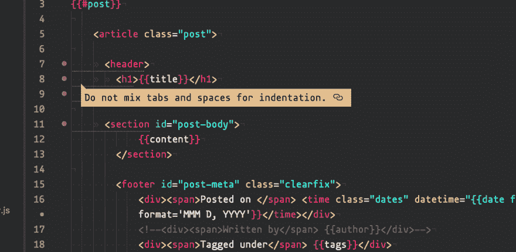

# 代码林挺如何改变我的生活

> 原文:[https://dev . to/zackphilipps/how-code-林挺-改变了我的生活](https://dev.to/zackphilipps/how-code-linting-changed-my-life)

[T2】](https://res.cloudinary.com/practicaldev/image/fetch/s--8skCcNwF--/c_limit%2Cf_auto%2Cfl_progressive%2Cq_auto%2Cw_880/http://zackphilipps.com/conteimg/2017/03/linting-in-action.png)

谈到林挺，我总是保持沉默。“老兄那太讨厌了，关了吧！”但我没有意识到的是，每种语言有 30 秒的配置时间，通常是以我的主文件夹中的点文件的形式，我可以选择具体显示哪些错误和警告。因此，如果我不想在每次同事决定编写冒号后不带空格的 CSS 时都得到通知，我就不必这样做。或者如果我不想被通知我的部分分支模板没有以`<!doctype>`声明开始...你明白了。

现在我被迷住了！与浏览器刷新时相比，在输入时看到语法错误有很多用处。林挺是另一个将你的文本编辑器转换成 IDE 的工具。所有酷孩子都这么做，开始永远不会晚。...是啊。你可以看出我很久没写博客了...

基本上，如果你使用 Atom，你所要做的就是安装 [base linter 包](https://atom.io/packages/linter)，然后在上面添加你想要的语言。然后，弄清楚如何根据自己的喜好配置它们。享受吧。:)

* * *

相关:[我如何从崇高的文本转换到原子](https://dev.to/zackphilipps/how-i-switched-from-sublime-text-to-atom-temp-slug-339130)