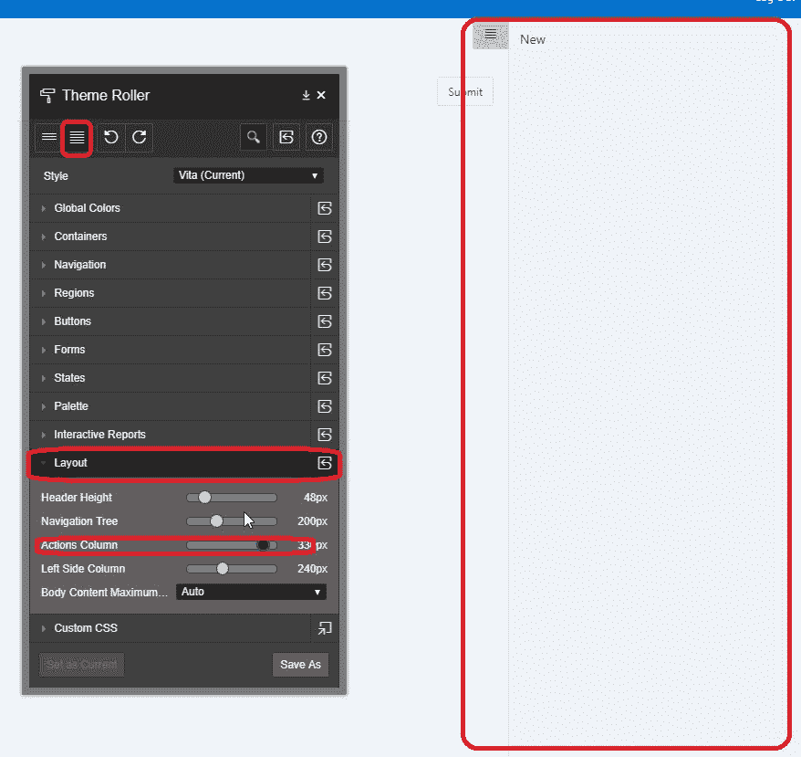

# Oracle Apex 5.0。*右侧列宽

> 原文:[https://dev . to/isabolic 99/Oracle-apex-5-right-side-column-width](https://dev.to/isabolic99/oracle-apex-5-right-side-column-width)

顶点 5。*带有通用主题，包括名为
**右侧栏**的页面模板。
该模板提供了一个可折叠的右侧显示位置，对于显示按钮或列表等面向操作的控件非常有用。
现在这个区域位置把我的区域限制在 **200px 宽**。对我来说太薄了。
所以我试着用 css 扩展它，我发现切换“打开”和“关闭”并不基于任何 javascript 函数。相反，使用了 css 属性**转换**:**translate 3d(200 px，0，0)；**。

这个 css 规则的规范可以在这里找到:[https://goo.gl/5qnxqJ](https://goo.gl/5qnxqJ)

这个 css 规则应用于按钮点击，css 选择器完成剩下的工作。
这意味着当用户点击按钮扩展区域时，类**。js-rightExpanded** 设置在机身上。当用户点击关闭时，该类被替换为**。js-right 崩了**。

我的问题的解决方案是在页面上设置 CSS:

```
body.t-PageBody.js-rightCollapsed .t-Body-actions {
    -webkit-transform: translate3d(300px, 0, 0);
    -ms-transform: translate(300px);
    transform: translate3d(300px, 0, 0);
}

.t-Body .t-Body-actions {
    width: 300px;
} 
```

<svg width="20px" height="20px" viewBox="0 0 24 24" class="highlight-action crayons-icon highlight-action--fullscreen-on"><title>Enter fullscreen mode</title></svg> <svg width="20px" height="20px" viewBox="0 0 24 24" class="highlight-action crayons-icon highlight-action--fullscreen-off"><title>Exit fullscreen mode</title></svg>

Apex 的例子可以在这里找到:[https://goo.gl/7sboEj](https://goo.gl/7sboEj)

**注意**
如果您使用 APEX 5.1 及更高版本，您可以在新版本 apex ( > 5.1)的主题滚轮中使用名为“操作栏”的选项。

[T2】](https://res.cloudinary.com/practicaldev/image/fetch/s--wrEV1jNJ--/c_limit%2Cf_auto%2Cfl_progressive%2Cq_auto%2Cw_880/https://pbs.twimg.com/media/DYY__PJUQAAbwhy.jpg)

[https://twitter.com/isabolic99/status/974537323084828672](https://twitter.com/isabolic99/status/974537323084828672)