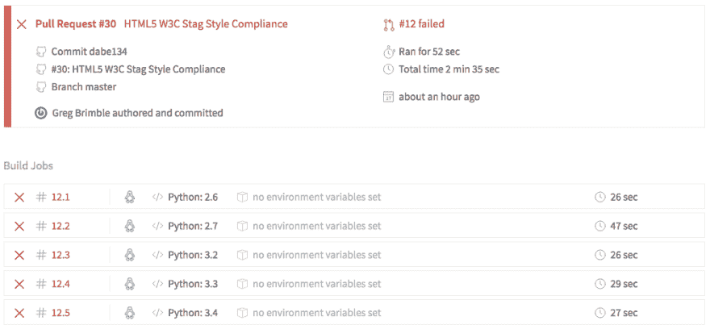
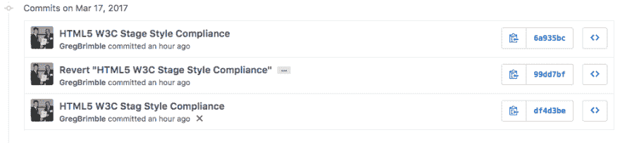

# 我第一次尝试开源

> 原文:[https://dev.to/gregbrimble/my-first-attempt-at-open-source](https://dev.to/gregbrimble/my-first-attempt-at-open-source)

昨晚，我对一个现有的开源库做了第一次贡献: [yattag](https://github.com/leforestier/yattag) 。这是一个小的 Python 项目(4 个项目文件、12 个拉请求和 5 个贡献者)，但是我已经在我的几个项目中使用过它，并且非常喜欢它的工作方式。基本上，它动态生成 HTML:

```
>>> from yattag import Doc
>>> doc, tag, text = Doc().tagtext()
>>> scripts = ["jquery.js", "customJS.js"]
>>> with tag("html"):
...     with tag("head"):
...         for script in scripts:
...             with tag("script", src=script):
...                 pass
>>> print(doc.getvalue())
<html>
    <head>
        <script src="jquery.js"></script>
        <script src="customJS.js"></script>
    </head>
</html> 
```

反正有一个方法，`stag`，生成一个没有结束标签的元素(比如`doc.stag("br")`会生成`<br />`)。然而，这并不真正适合一些较新的 HTML5 的东西:[根据 W3C](https://www.w3.org/TR/html5/text-level-semantics.html#the-br-element) ，这些类型的标签不应该有结束斜杠(`/`)(例如`<br />`应该是`<br>`)。

所以， [**排队我的两行修改**(在我发现一个错别字的地方多加 1)](https://github.com/leforestier/yattag/pull/30/commits/df4d3be1b395458efb121cbb0fa87f101397ac94)。我检查了 repo 中的所有其他文件，看它们是否引用了`stag`方法(`README.md`是否需要任何更新的例子等等。)，我检查了测试文件中任何可能失败的检查(他们是否比较了`doc.stag("test")`的输出和字符串`<test />`等)。)，**不过看起来都不错**。

老实说，我花了很长时间来解决所有的`git`命令和[没有让我的编辑器删除所有的空白](https://github.com/leforestier/yattag/pull/30/commits/6a935bcad12cb028d69db885a24008371ea157ec)，**这个改变真的不值得做**。旧的 HTML 仍然可以被浏览器很好地阅读(并将永远如此)。旧的风格，真的不会消失。

反正我点了按钮:PR 制作。支票旋转起来。而 **2 分 35 秒后，[的建造失败](https://travis-ci.org/leforestier/yattag/builds/211962336)T3。我错过了考试的一部分。它获取输出并将其传递给 XML 解析器，然后检查属性等。众所周知，XML 要求严格遵守语法模板，所以当它不能解析不符合 XML 的标签时，测试就失败了。**

[T2】](https://res.cloudinary.com/practicaldev/image/fetch/s--xkRs05Fc--/c_limit%2Cf_auto%2Cfl_progressive%2Cq_auto%2Cw_880/https://cdn-images-1.medium.com/1%2Athn0YoMDLOpeg_kN4FzaQw.png)

[T2】](https://res.cloudinary.com/practicaldev/image/fetch/s--hXzf-Di6--/c_limit%2Cf_auto%2Cfl_progressive%2Cq_auto%2Cw_880/https://cdn-images-1.medium.com/1%2AgHEzjXVTz00U2aOIowo21w.png)

*我的失败*

结果是(在阅读了`README.md` …)这个项目可以用来生成 XML 或者 HTML，所以结束斜杠确实需要保留在那里。哎呀。

好了，现在我们知道了:我和特拉维斯的第一次冲突；第一个，永远的红色，在网上和我的名字交叉；还有*我第一次尝试开源*T3。

#### 吸取的教训

*   首先，请阅读您正在编辑的存储库的描述。
*   别在网上为难自己，格雷格。首先在本地运行测试。
*   多写 [~~中~~](https://medium.com/@gregbrimble/my-first-attempt-at-open-source-a9799d31c66b) dev.to 帖子(这是我的第一篇，要好看)！