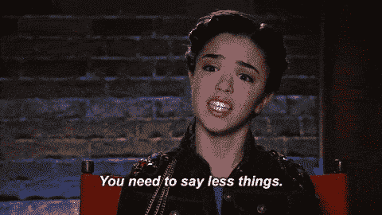
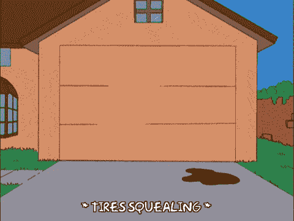

# 如何在 45 分钟的编码面试中失败

> 原文:[https://dev . to/fahimulhaq/how-not-to-success-in-your-45 分钟编码面试](https://dev.to/fahimulhaq/how-not-to-succeed-in-your-45-minute-coding-interview)

我最近发表了一篇文章[如何在你的 45 分钟系统设计面试中不设计网飞？](https://dev.to/fahimulhaq/how-not-to-design-netflix-in-your-45-minute-system-design-interview)。首先，令人惊讶的是，它变得非常受欢迎。其次，更令人惊讶的是，有几个人向我咨询在他们的编码面试中有没有什么不要做的提示。这些人中的大多数都有如下问题:

> 即使做了几个月的准备，我还是无法成功地安排面试。

其中一些候选人已经解决了 200-300 个编码问题，所以典型的“多练习”反馈对他们不起作用。

*下面这篇文章关注的是**在**面试中不要做的事情。如果你正在寻找编程或设计面试准备资源，看看 **[寻找编码面试:编码问题的模式](https://www.educative.io/courses/grokking-the-coding-interview)** 和 **[寻找系统设计面试](https://www.educative.io/courses/grokking-the-system-design-interview)** 。*

* * *

无论是作为被面试者还是面试官，我都注意到有一些非技术性的实践可以增加你在面试中成功的机会。以下许多建议都是基于我的经历和我犯过的错误(是的，我也有过犯错误和被拒绝的经历)。

以下是考生通常会犯的 5 大错误(根据我的经验)。

## 1。你花了太多时间谈论你现在和过去的项目

[T2】](https://res.cloudinary.com/practicaldev/image/fetch/s--dPncX0-D--/c_limit%2Cf_auto%2Cfl_progressive%2Cq_66%2Cw_880/http://i.imgur.com/CXWAfjd.gif)

面试官走进房间，问“你现在的公司在做什么”，然后你花了 10 分钟详细描述你现在的项目。

从你的角度来看，这是你讲述过去两年你所做的出色工作的机会。你开始描述没人能理解的细微差别**或者**你幻想你可以花很多时间谈论你当前的项目，得到一个更简单的问题(不会发生)。

你没有给面试官留下深刻印象，只是浪费了 45 分钟面试中的 10 分钟。你的面试官也是你的工程师同事，她可能很难在你演讲中途打断你。

> 她只是问了一下你目前的项目，希望能花几分钟描述一下你目前的项目，然后她可以问编码或设计方面的问题。

记住两件事:

1.  即使您在开始时浪费了时间，您仍然会遇到您想要避免的相同的动态编程问题。你现在只有不到十分钟的时间来解决那个问题。
2.  她不会雇用你，因为你几乎解决了问题，如果有更多的时间，你可以做得更好。这从来没有发生过。

以下是两个在描述你当前项目时不该说的例子( ***警告:以下是故意的荒谬描述*** ):

*“在我最后一年的项目中，我开发了一个 web 应用程序，它使用 MongoDB 来存储世界上最著名的旅游目的地的旅行数据，并可以将你与其他来自火星的旅行者进行匹配，这些旅行者将与你乘坐同一艘飞船，首先在希腊着陆，然后在澳大利亚着陆，所有这些只需一杯星巴克脱脂拿铁的价格”*

“我在微软的 Visual Studio 调试器团队工作，我的团队负责在调试器连接到进程之前执行的引导指令，查看由管理员在进程上设置的权限。基于 Windows-10 的 SKU，可以有 3 组权限，这些权限可以由管理员或家长配置，管理员还可以在进程上添加自定义 ACL，然后在该用户的凭证下运行该进程时应用这些 ACL……iggily biggly woo pie doo”。

**以上答案看起来都是胡言乱语(因为是)**。我故意写下这些难以理解的描述，只是为了让你意识到，你所说的话，你的面试官一个字也没听懂。

> 你试图在几分钟内解释一款产品的细微差别，而你已经为此工作了数月或数年。

相反，答案可能是:

“我开发了一个旅游应用程序，将志同道合的游客连接到同一个目的地。

运筹学

“我在 Visual Studio 的调试器团队工作，从事过将调试器附加到已经运行的进程的各个方面的工作。”

以上回答简短直白。更重要的是，它把控制权还给你的面试官，她可以继续你一直试图回避的动态编程问题。好消息是，现在你有 10 多分钟来解决这个问题。

无论你什么时候去面试，都要准备好以下问题的 1-2 行答案(*如果面试官感兴趣的话，可以询问更多细节*):

1.  你目前在做什么项目？
2.  你当前项目中最具挑战性的方面是什么？
3.  在过去的 6 个月里，你修复的最困难的 bug 是什么？

**简而言之，管理好你的时间**。默认情况下你不会被录用，你有 45 分钟的时间来证明你没有被录用。如果在白板上写代码能让你得到一份工作，你应该尽可能多的在白板上花时间。

## 2。你没有完全理解这个问题

这里我有个故事要讲。几年前，我在找工作，给科技屏。不知何故，在我给出的每个技术屏幕中，我都被要求反转一个链表。

> 不知道为什么，但不知何故我给人一种感觉，我不知道如何反转一个链表。

当第四任招聘经理问我关于倒链表的问题时，我甚至不屑于假装以前没听过这个问题。我走到白板前写下代码(大概几分钟)。当我结束时，我看着我的面试官。他在笑(嗯，几乎是在笑)。他说他要让我逆序打印一个链表，不要反转一个链表。**哎哟**。

我知道我犯了一个错误。我开玩笑的告诉他，我准备把链表反转后打印出来，然后再反转回来恢复原来的链表。我还告诉他为什么我对这个问题过敏，我们都笑了。如果我没记错的话，他还是让我进了下一轮。

对你们大多数人来说，不理解这个问题可能没那么戏剧化(因为希望你们会比我更仔细地听面试官说话)。但是，我还是看到考生在知道自己没有掌握全部数据的情况下，跳到了解决方案上。这不是一个好主意。首先，你现在要浪费 10-15 分钟才能意识到理解上的差距，然后你必须彻底改变你的代码。

这是另一个故事。我曾经试图通过给定的旋转因子来解决旋转链表的问题。我一听到这个问题，就开始解决它，但没有意识到旋转因子也可以表示相反方向的旋转。又哎哟。至少可以说，浪费 15 分钟后试图从头重写代码并不好玩。

## 3。你没有完全解决问题就匆忙开始编码

[T2】](https://res.cloudinary.com/practicaldev/image/fetch/s--BE7y9J3j--/c_limit%2Cf_auto%2Cfl_progressive%2Cq_66%2Cw_880/http://i.imgur.com/GV3pYU1.gif)

这里有一个关于编码面试问题的有趣事实。这些问题被称为玩具问题。

> 关于**玩具问题**的一件好事是，解决方案很少超过 15-20 行代码。

现在，如果我让你在白板上写 20 行代码，你需要 2-3 分钟。因此，如果你花了 30 分钟找出解决方案，你仍然能够在规定时间内写下代码。

然而，你紧张和忧虑。你的大脑告诉你尽快开始编码。相反，告诉自己为一个玩具问题写代码从来都不是问题。需要几分钟。你应该花尽可能多的时间来确定解决方案，然后开始编码。在开始编写代码之前，用一个例子来模拟你的解决方案。如果你偏离了轨道，这也能让你的面试官把你推向正确的方向。

简而言之，理解问题，然后花大量时间找出解决方案，而不用担心编写代码。一旦你想出了解决办法，应该不会花很多时间。

## 4。您首先编码强力解决方案，然后尝试优化的解决方案

[T2】](https://res.cloudinary.com/practicaldev/image/fetch/s--NRmt6vlz--/c_limit%2Cf_auto%2Cfl_progressive%2Cq_66%2Cw_880/http://i.imgur.com/8x7dind.gif)

残酷的事实。你的面试官在某个问题上很谨慎，希望你能拿出最佳解决方案来获得聘用。如果你已经阅读了以上几点，你现在应该知道把时间浪费在那些不会让你得到工作的活动上对你没有好处。不要试图 ***在白板上写一些代码*** ，而是花时间找出解决方案。如果她要求一个线性时间复杂度和 O(1)内存复杂度的解决方案，任何不太优化的方案都不会被录用。

## 5。你不测试你的解决方案

[T2】](https://res.cloudinary.com/practicaldev/image/fetch/s--bGXZEgV1--/c_limit%2Cf_auto%2Cfl_progressive%2Cq_66%2Cw_880/http://i.imgur.com/SH9eUyz.gif)

一旦你完成了编码，用一个例子来测试它。这会让你在面试官指出错误之前就发现它们。每一次，你的面试官都要给你一个提示来找到错误，你就会失去一些分数。通常，当你用一个例子遍历你的代码时，你会意识到打字错误和遗漏的边缘情况。另外，不测试你的代码会发出一个消极的信号，所以即使你对你的代码有 100%的把握，也要测试你的代码。

## 额外收获:询问你在面试中表现如何

[T2】](https://res.cloudinary.com/practicaldev/image/fetch/s--KsjchgJT--/c_limit%2Cf_auto%2Cfl_progressive%2Cq_66%2Cw_880/http://i.imgur.com/Pp31DQB.gif)

这可能不会对招聘决定产生负面影响，但确实会让你的面试官陷入尴尬的境地。

祝你面试好运。

* * *

同样，如果您正在寻找编程或设计面试准备资源，请查看以下资源:

1.  **[摸底编码面试:编码题模式](https://www.educative.io/courses/grokking-the-coding-interview)** 。
2.  **[钻研系统设计面试](https://www.educative.io/courses/grokking-the-system-design-interview)** 。
3.  **[3 个月编码面试训练营](https://dev.to/fahimulhaq/3-month-coding-interview-bootcamp-5gpl)**

如果你喜欢这篇文章，请关注我的更多文章。如果你有任何反馈，请通过推特联系我。

法希姆是[教育机构](https://www.educative.io)的联合创始人。我们正在为软件工程师和教师构建下一代学习平台。学习者通过互动课程来学习。教师可以使用我们的课程生成器快速创建和发布交互式课程。如果你有兴趣发布课程或了解更多，请随时联系。