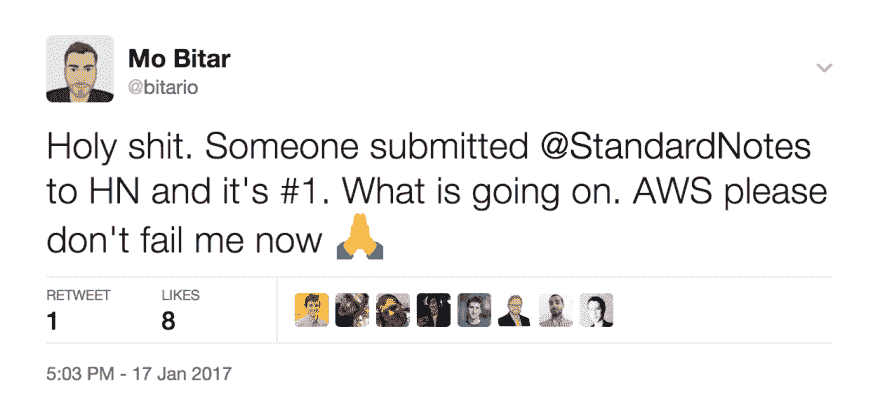
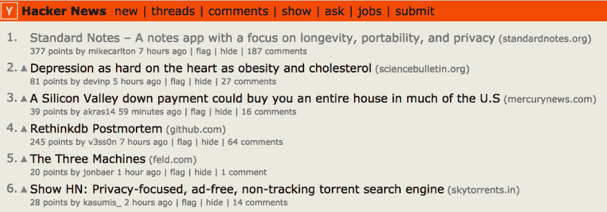

# 一个小的 EC2 实例可以处理 HN front Page

> 原文:[https://dev . to/devtouser 432/a-small-ec2-instance-can-handle-HN-front page](https://dev.to/devtouser432/a-small-ec2-instance-can-handle-hn-frontpage)

试着问“一个典型的服务器设置能处理多少页面点击？”在 StackOverflow 上。去吧。我就在这里等。如果你得到的答案不是“很大程度上取决于你的设置”，那就把它截图下来，永远珍藏起来。

对于我们这些没有丰富管理生产服务器经验的 web 应用程序开发人员来说，存在这样的想法是很常见的:“如果我开发的这个令人惊叹的产品得到了如此多的关注，以至于服务器在所有压倒性的热情和支持下崩溃了怎么办？!"

不幸的是，这种热情很少与实际现实相结合。几年前，在我第一次构建我真正关心的产品时，我有这些存在主义的想法，并认为其他人也可能有。我给 Marco Arment 发了一封电子邮件，询问他是如何处理存在压力的，他的回复基本上是“大多数产品从来没有达到需要担心这些事情的地步。”好吧，谢谢你，马可。这让我感觉好多了。当然，他是对的，该产品的用户从未超过 100 人。从那以后，我尽量不把任何产品发布会*看得太重*，因为在大多数情况下，我的应用从未超过 100 个用户。因此，Standard Notes 也不例外，它是一个跨平台的 Notes 应用程序，专注于隐私和长寿。我把它建得很小，然后悄悄地把它放了出来。在之前的发布中，我的第一次(也是唯一一次)营销尝试是立即在 Product Hunt 和 Hacker News 上发帖，而我决定让 Standard Notes 有机增长。我开始意识到 PH 和 HN 更好地被用作优化生长的“类固醇”,而不是培育它。你不会想在锻炼的第一天就立即服用类固醇——有许多自然的过程可以轻松完成，这对了解你自己和你的产品至关重要。也许你会开始服用类固醇，一旦你实现了所有你能控制的自然增长，现在正在寻找一个“优势”。

此外，在像 Product Hunt 这样的加速器出现之前，数以百万计的公司和产品已经找到了获得成功和名声的方法——为什么我唯一的营销策略是“我会把它发到 HN！”然后呢？最有可能的是，它不会得到我想象中的关注，我对这个产品的热情很快就消失了。

不会了。我不会一直做同样的事情，然后期待不同的结果。我太在乎这个新产品了，不会让一个随机排名算法决定我的命运。我试图用每一种策略来发展这家公司，但不把它提交给产品搜索或黑客新闻。

就这样过去了。我在几周内采用了各种小策略，让我拥有了一百名用户。在此期间，Evernote 更新了他们的隐私政策，声明员工现在可以阅读客户笔记。科技界爆发出愤怒和厌恶。Standard Notes 注重隐私，由于客户现在感觉他们的隐私受到了威胁，这是插话并提供替代方案的绝佳机会。我写了几个博客帖子，得到了一些推文，也在 Twitter 上给几个人发了推文，他们在询问 Evernote 的替代品。

这让我有了大约 500 个用户。增长率是完美的。很好，很慢，很有条理，有足够的时间来解决早期的问题并跟上支持票的进度。

然后就发生了这样的事情:

哦。是的，还记得我说过，由于对可见性的现实期望，我尽量不要过早地优化服务器设置吗？妈的。

我运行一个附加了 8gb 卷的小型 EC2 实例。1 个 vCPU 和 2GB 内存。就是这样。没有负载平衡器。没有弹性豆茎或自动缩放。没有“kubernetes 集群”。没有。只是一个用来招待 1000 名客人的小服务器。

我对结果感到震惊。在累积超过 120，000 次访问和数千个并发请求的整个过程中，服务器没有出现任何停顿。网站加载速度一如既往地快，笔记同步请求几乎瞬间完成(每当用户在笔记中键入一个字母时，这些请求或多或少都会发生)。

[T2】](https://res.cloudinary.com/practicaldev/image/fetch/s--4tsWAgce--/c_limit%2Cf_auto%2Cfl_progressive%2Cq_auto%2Cw_880/https://cdn-images-1.medium.com/max/1600/1%2AqPU5OXyRDR8maDwNwN4FTw.png)

当我对服务器崩溃的恐惧减轻时，我无法向你描述我的得意和喜悦。在登上头版的第一个小时里，我的心脏比以往任何时候都要剧烈地跳动。当我试图回复数百条评论、电子邮件和推文时，我的手在颤抖。在某个时刻，看到服务器如此自信地处理流量，我放下了，并开始有信心:这是一个小服务器可以。

至于后果，这是苦乐参半:一方面，我很感激新用户的涌入和可见性。另一方面，我知道这只是从这里开始走下坡路。我以前经历过这种匆忙，我知道从某一天处于顶峰到另一天成为无名小卒可能带来的沮丧。不断涌入的拉请求和赞扬维持了一小段时间，直到它回到独奏。我打起精神，这肯定是漫长的几个星期。

之后，各种各样的文章和产品登上了首页，吸引了更多的用户。Standard Notes 现在处于一个很好的位置，每天新用户的数量与构成有机增长的数量相当。它让我能够专注于当前可寻址用户群的需求，并确保在发展到下一阶段之前解决他们的问题。

如果你正在创造一个你关心的新产品，我建议不要给它类固醇，在第一天就把它发布到产品搜索、Reddit 或黑客新闻上。相反，慢慢地、有机地了解你的产品。培养一个小的用户群，只有当你确信已经满足了他们的需求时，才寻求增长。当你通过自然和有机的方式突破了可能的界限，你可能会开始考虑使用营销类固醇来加速你的成长。

哦，还有你担心的那个小服务器？你会没事的。

* * *

_ 有关 Standard Notes 的更多信息，这是一款专注于隐私、可扩展性和寿命的免费 Notes 应用，请访问[https://standardnotes.com](https://standardnotes.com)。

*有类似推出产品的经历？在推特上联系: [@bitario](https://twitter.com/bitario) 。*