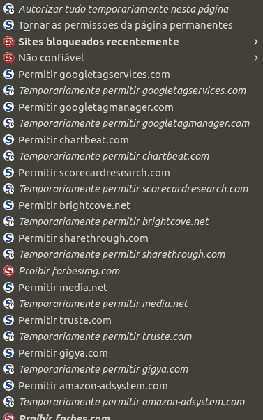

# 我机器上有点奇怪的工具

> 原文：<https://dev.to/adambrandizzi/the-slightly-weird-tools-on-my-machine>

我不使用任何真正晦涩难懂的东西:我最喜欢的工具大部分都很有名或者曾经很流行。然而，我真的真的很想参加关于神秘工具的讨论，所以我列出了我的清单。我的平台是 Ubuntu，但是大多数时候，其他地方也会有替代平台。

首先，没有剪贴板管理器是不可能的。我的是 [ClipIt](https://github.com/CristianHenzel/ClipIt) 。说真的，[每个人都需要一个剪贴板管理器](https://blog.codinghorror.com/reinventing-the-clipboard/)。

终端多路复用器是另一种值得更多采用的工具。我是 GNU 屏幕的重度用户，其他人更喜欢 T2 的 tmux，但是概念才是最重要的。这就像有大量开放的终端，但没有大量的窗口。它也可以作为一个穷人的守护进程。而且关闭窗口也没有杀死进程的风险！一旦你习惯了，你就能做出一些漂亮的把戏。例如，我编写了脚本来在启动不同的概要文件时设置环境变量。挺有用的！

作为一个火狐用户，我发现一些扩展非常有用。 [GreaseMonkey](http://www.greasespot.net/) 就是其中之一。它会在任何页面中自动执行 JS 脚本。它曾经更受欢迎，我相信它应该得到更多的关注！

还有一个是 [NoScript](http://noscript.net/) ，防止 JavaScript 在我的浏览器上执行。大量的 JS 基本上是不必要的，或者是完全有害的。选择运行什么有时会很烦人，但是可以节省很多性能并加强安全性和隐私性。此外，我发现这个扩展很有启发性！

 
*一篇区区福布斯文章就能在我的机器上执行大量代码。这一切都在做什么？*

(还是关于 Firefox，它的 profile 系统非常有用，尤其是在搭配正确的扩展时。顺便说一下，我已经在另一篇文章中谈到了这个问题[。)](https://medium.com/@adambrandizzi/using-multiple-firefox-profiles-70fb22614b3#.yzqcdq1wx)

最后回到终端，不得不推荐[白银搜索者](http://geoff.greer.fm/ag/)，又名`ag`。我那几天在交互终端很少用`grep`(或者 [ack](https://beyondgrep.com/) )。毕竟，`ag`在默认情况下是递归的，支持扩展的正则表达式，可以只搜索一种类型的文件，而且打字更短。自然地，`grep`将永远统治我的剧本，但`ag`被证明是一个伟大的选择。

你呢，你曾经用过这些东西(或它们的替代品)吗？如果不是，您使用哪些不太为人所知的工具？请在评论中告诉我们！:)

*(横幅由[比瑟·托多洛夫](https://commons.wikimedia.org/wiki/User:Biso)从[维基共享](https://commons.wikimedia.org/wiki/File:Rusty_tools.JPG) )*