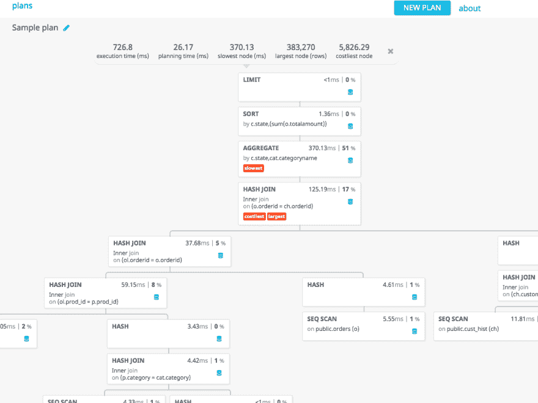

# Postgresql 解释专家指南

> 原文:[https://dev . to/evied elemently/a-ruby ists-guide-to-PostgreSQL-explain](https://dev.to/eviedently/a-rubyists-guide-to-postgresqls-explain)

*[本帖原载 RubyLetter.com](http://www.rubyletter.com/)*

如果你想知道为什么你的数据库查询没有以前那么快，没有什么比 postgres 的一个小特性`explain`更好的了。

这是个简单的想法。只要让 postgres 解释它计划如何执行查询，它就会告诉你。您甚至可以让它执行查询，并将预期性能与实际性能进行比较。

## 听着耳熟吗？

你可能以前看过《解释》。从 3.2 版本开始，Rails 将自动对任何耗时超过 500 毫秒的查询运行它。

唯一的问题是输出相当神秘。这里有一个例子，是我从 rails 开发博客上偷来的:

```
% User.where(:id => 1).joins(:posts).explain

EXPLAIN for: SELECT "users".* FROM "users" INNER JOIN "posts" ON "posts"."user_id" = "users"."id" WHERE "users"."id" = 1
                                  QUERY PLAN
-----------------------------------------------------------------------------------
 Nested Loop Left Join  (cost=0.00..37.24 rows=8 width=0)
   Join Filter: (posts.user_id = users.id)
   ->  Index Scan using users_pkey on users  (cost=0.00..8.27 rows=1 width=4)
         Index Cond: (id = 1)
   ->  Seq Scan on posts  (cost=0.00..28.88 rows=8 width=4)
         Filter: (posts.user_id = 1)
(6 rows) 
```

<svg width="20px" height="20px" viewBox="0 0 24 24" class="highlight-action crayons-icon highlight-action--fullscreen-on"><title>Enter fullscreen mode</title></svg> <svg width="20px" height="20px" viewBox="0 0 24 24" class="highlight-action crayons-icon highlight-action--fullscreen-off"><title>Exit fullscreen mode</title></svg>

这到底是什么意思？

在本文中，我将带你了解如何解释这样的结果，并特别关注它如何影响 Ruby 中的 web 开发。

## 语法

如果您使用的是 Rails，那么您可以将`.explain`附加到任何活动的记录查询中来进行解释:

```
> User.where(id: 1).explain
  User Load (10.0ms)  SELECT "users".* FROM "users" WHERE "users"."id" = $1  [["id", 1]]
=> EXPLAIN for: SELECT "users".* FROM "users" WHERE "users"."id" = $1 [["id", 1]]
                                QUERY PLAN
-------------------------------------------------------------------------------
 Index Scan using users_pkey on users  (cost=0.29..8.30 rows=1 width=812)
   Index Cond: (id = 1)
(2 rows) 
```

<svg width="20px" height="20px" viewBox="0 0 24 24" class="highlight-action crayons-icon highlight-action--fullscreen-on"><title>Enter fullscreen mode</title></svg> <svg width="20px" height="20px" viewBox="0 0 24 24" class="highlight-action crayons-icon highlight-action--fullscreen-off"><title>Exit fullscreen mode</title></svg>

虽然`explain`方法很方便，但是它不能让你直接访问 postgres 中更高级的选项。

要在 postgres 中直接使用 explain，只需运行`psql -d yourdb`来打开您的 postgres 客户端，并运行如下代码:

```
explain select * from users where id=1;
                                QUERY PLAN
-------------------------------------------------------------------------------
 Index Scan using users_pkey on users  (cost=0.29..8.30 rows=1 width=812)
   Index Cond: (id = 1)
(2 rows) 
```

<svg width="20px" height="20px" viewBox="0 0 24 24" class="highlight-action crayons-icon highlight-action--fullscreen-on"><title>Enter fullscreen mode</title></svg> <svg width="20px" height="20px" viewBox="0 0 24 24" class="highlight-action crayons-icon highlight-action--fullscreen-off"><title>Exit fullscreen mode</title></svg>

这为我们提供了关于 postgres 计划如何执行查询的信息，包括它对需要做多少工作的最佳猜测。

要实际运行查询并查看它与估计值相比如何，您可以执行`explain analyze` :

```
explain analyze select * from users where id=1;
                               QUERY PLAN
-----------------------------------------------------------------------------------------
 Index Scan using users_pkey on users  (cost=0.29..8.30 rows=1 width=812) (actual time=0.043..0.044 rows=1 loops=1)
   Index Cond: (id = 1)
 Total runtime: 0.117 ms 
```

<svg width="20px" height="20px" viewBox="0 0 24 24" class="highlight-action crayons-icon highlight-action--fullscreen-on"><title>Enter fullscreen mode</title></svg> <svg width="20px" height="20px" viewBox="0 0 24 24" class="highlight-action crayons-icon highlight-action--fullscreen-off"><title>Exit fullscreen mode</title></svg>

## 解释输出

Postgres 很聪明。它会尽最大努力找出最有效的方法来执行您的查询。换句话说，它制定了一个“查询计划”explain 命令只是将它打印出来。

考虑以下情况:

```
# explain select * from users order by created_at limit 10;
                               QUERY PLAN
------------------------------------------------------------------------------
 Limit  (cost=892.98..893.01 rows=10 width=812)
   ->  Sort  (cost=892.98..919.16 rows=104 width=812)
         Sort Key: created_at
         ->  Seq Scan on users  (cost=0.00..666.71 rows=104 width=812)
(4 rows) 
```

<svg width="20px" height="20px" viewBox="0 0 24 24" class="highlight-action crayons-icon highlight-action--fullscreen-on"><title>Enter fullscreen mode</title></svg> <svg width="20px" height="20px" viewBox="0 0 24 24" class="highlight-action crayons-icon highlight-action--fullscreen-off"><title>Exit fullscreen mode</title></svg>

该输出由两部分组成:

1.  描述执行查询的动作序列的“节点列表”
2.  性能评估，描述执行列表中每个项目的成本。

#### 节点列表

让我们去掉所有的性能评估，这样我们只有节点列表:

```
 Limit
   ->  Sort (Sort Key: created_at)
         ->  Seq Scan on users 
```

<svg width="20px" height="20px" viewBox="0 0 24 24" class="highlight-action crayons-icon highlight-action--fullscreen-on"><title>Enter fullscreen mode</title></svg> <svg width="20px" height="20px" viewBox="0 0 24 24" class="highlight-action crayons-icon highlight-action--fullscreen-off"><title>Exit fullscreen mode</title></svg>

这有点像 postgres 编写的执行查询的“程序”。有三种操作:“限制”、“排序”和“顺序扫描”每个子节点的输出通过管道传递给其父节点。

如果是 Ruby，可能会是这样:

```
all_users.sort(:created_at).limit(10) 
```

<svg width="20px" height="20px" viewBox="0 0 24 24" class="highlight-action crayons-icon highlight-action--fullscreen-on"><title>Enter fullscreen mode</title></svg> <svg width="20px" height="20px" viewBox="0 0 24 24" class="highlight-action crayons-icon highlight-action--fullscreen-off"><title>Exit fullscreen mode</title></svg>

postgresql 可以在其查询计划中使用许多不同的操作。你不需要知道它们都是什么意思，但是知道几个是有帮助的:

*   索引扫描:Postgres 将使用索引获取记录。这有点像在 Ruby hash 中查找项目。
*   Seq Scan: Postgres 将通过循环记录集来获取记录。
*   筛选:仅从记录集中选择符合条件的记录。
*   排序:对记录集进行排序。
*   聚合:用于计数、最大值、最小值等。
*   位图堆扫描:使用位图来表示匹配的记录。像 and-ing 和 or-ing 这样的操作有时对位图比对实际记录更容易完成。
*   ...更多。:)

### 性能估算

节点列表中的每个节点都有一组性能评估。它们看起来是这样的:

```
Limit  (cost=892.98..893.01 rows=10 width=812) 
```

<svg width="20px" height="20px" viewBox="0 0 24 24" class="highlight-action crayons-icon highlight-action--fullscreen-on"><title>Enter fullscreen mode</title></svg> <svg width="20px" height="20px" viewBox="0 0 24 24" class="highlight-action crayons-icon highlight-action--fullscreen-off"><title>Exit fullscreen mode</title></svg>

这些数字是:

*   **代价:**执行动作需要付出多少努力。这个数字没有单位，只是为了与其他成本数字进行比较。
*   **行数:**执行操作时必须循环的估计行数。
*   **宽度:**每行的估计大小，以字节为单位

我发现自己使用“行”最多。这对于查看查询是否可伸缩非常有用。如果它等于“1 ”,那么我知道这个查询是有效的。如果它等于表中的记录数，那么对于大型数据集，查询可能不是很高效。

### 实际性能值

如果您使用`explain analyze`特性来实际运行查询，那么您将得到两组数字。第一个包含估计值，如上所示。第二个包含实际值:

```
# explain analyze select * from users order by created_at limit 10;
                                                       QUERY PLAN
-----------------------------------------------------------------------------------------------------------------------------
 Limit  (cost=892.98..893.01 rows=10 width=812) (actual time=22.443..22.446 rows=10 loops=1)
   ->  Sort  (cost=892.98..919.16 rows=10471 width=812) (actual time=22.441..22.443 rows=10 loops=1)
         Sort Key: created_at
         Sort Method: top-N heapsort  Memory: 31kB
         ->  Seq Scan on users  (cost=0.00..666.71 rows=10471 width=812) (actual time=0.203..15.221 rows=10472 loops=1)
 Total runtime: 22.519 ms
(6 rows) 
```

<svg width="20px" height="20px" viewBox="0 0 24 24" class="highlight-action crayons-icon highlight-action--fullscreen-on"><title>Enter fullscreen mode</title></svg> <svg width="20px" height="20px" viewBox="0 0 24 24" class="highlight-action crayons-icon highlight-action--fullscreen-off"><title>Exit fullscreen mode</title></svg>

这些项目是:

*   **实际时间:**执行动作所需的时间，以毫秒为单位。
*   **行数:**实际要处理的行数。
*   **循环:**有时候一个给定的动作发生不止一次。如果是这样，循环将是> 1。

## 更详细的输出

默认情况下,`explain`输出一个它所知道的非常精简的版本。然而，你可以要求它给你更多的细节。你甚至可以告诉它输出像 JSON 或 YAML 这样的格式。

```
# EXPLAIN (ANALYZE, FORMAT YAML) select * from users order by created_at limit 10;
                QUERY PLAN
-----------------------------------------------
 - Plan:                                 +
     Node Type: "Limit"                  +
     Startup Cost: 892.98                +
     Total Cost: 893.01                  +
     Plan Rows: 10                       +
     Plan Width: 812                     +
     Actual Startup Time: 12.945         +
     Actual Total Time: 12.947           +
     Actual Rows: 10                     +
     Actual Loops: 1                     +
     Plans:                              +
       - Node Type: "Sort"               +
         Parent Relationship: "Outer"    +
         Startup Cost: 892.98            +
         Total Cost: 919.16              +
         Plan Rows: 10471                +
         Plan Width: 812                 +
         Actual Startup Time: 12.944     +
         Actual Total Time: 12.946       +
         Actual Rows: 10                 +
         Actual Loops: 1                 +
         Sort Key:                       +
           - "created_at"                +
         Sort Method: "top-N  heapsort"   +
         Sort Space Used: 31             +
         Sort Space Type: "Memory"       +
         Plans:                          +
           - Node Type: "Seq  Scan"       +
             Parent Relationship: "Outer"+
             Relation Name: "users"      +
             Alias: "users"              +
             Startup Cost: 0.00          +
             Total Cost: 666.71          +
             Plan Rows: 10471            +
             Plan Width: 812             +
             Actual Startup Time: 0.008  +
             Actual Total Time: 5.823    +
             Actual Rows: 10472          +
             Actual Loops: 1             +
   Triggers:                             +
   Total Runtime: 13.001
(1 row) 
```

<svg width="20px" height="20px" viewBox="0 0 24 24" class="highlight-action crayons-icon highlight-action--fullscreen-on"><title>Enter fullscreen mode</title></svg> <svg width="20px" height="20px" viewBox="0 0 24 24" class="highlight-action crayons-icon highlight-action--fullscreen-off"><title>Exit fullscreen mode</title></svg>

使用`EXPLAIN (ANALYZE, VERBOSE, FORMAT YAML) select ...`可以得到更详细的输出

## 可视化工具

Explain 会生成大量输出。当分析更复杂的查询时，解析会变得很困难。

有几个免费的工具可以帮助你。它们解析`explain`的输出，并为您生成漂亮的图表。他们甚至可以标记潜在的性能问题供您检查。[这里有一个我喜欢的。](http://tatiyants.com/pev/#/plans/new)

[T2】](https://res.cloudinary.com/practicaldev/image/fetch/s--TIxfsujb--/c_limit%2Cf_auto%2Cfl_progressive%2Cq_auto%2Cw_880/http://www.rubyletter.cimg/2016/12/explain.png)

## 例子

让我们把它们放在一起，做几个简单的例子。您知道有几种常见的 Rails 习惯用法会产生伸缩性很差的数据库查询吗？

### 计数难题

在 Rails 视图中看到这样的代码真的很常见:

```
Total Faults <%= Fault.count %> 
```

<svg width="20px" height="20px" viewBox="0 0 24 24" class="highlight-action crayons-icon highlight-action--fullscreen-on"><title>Enter fullscreen mode</title></svg> <svg width="20px" height="20px" viewBox="0 0 24 24" class="highlight-action crayons-icon highlight-action--fullscreen-off"><title>Exit fullscreen mode</title></svg>

这导致 SQL 看起来像这样:

```
select count(*) from faults; 
```

<svg width="20px" height="20px" viewBox="0 0 24 24" class="highlight-action crayons-icon highlight-action--fullscreen-on"><title>Enter fullscreen mode</title></svg> <svg width="20px" height="20px" viewBox="0 0 24 24" class="highlight-action crayons-icon highlight-action--fullscreen-off"><title>Exit fullscreen mode</title></svg>

让我们插入`explain`看看会发生什么。

```
# explain select count(*) from faults;
                            QUERY PLAN
------------------------------------------------------------------------
 Aggregate  (cost=1840.31..1840.32 rows=1 width=0)
   ->  Seq Scan on faults  (cost=0.00..1784.65 rows=22265 width=0)
(2 rows) 
```

<svg width="20px" height="20px" viewBox="0 0 24 24" class="highlight-action crayons-icon highlight-action--fullscreen-on"><title>Enter fullscreen mode</title></svg> <svg width="20px" height="20px" viewBox="0 0 24 24" class="highlight-action crayons-icon highlight-action--fullscreen-off"><title>Exit fullscreen mode</title></svg>

哇哦。我们的简单计数查询遍历整个表的 22，265 行！在 postgres 中，计数总是在整个记录集上循环。

### 分拣丑闻

看到按字段排序的项目列表是很常见的。例如:

```
Fault.order("created_at desc").limit(10) 
```

<svg width="20px" height="20px" viewBox="0 0 24 24" class="highlight-action crayons-icon highlight-action--fullscreen-on"><title>Enter fullscreen mode</title></svg> <svg width="20px" height="20px" viewBox="0 0 24 24" class="highlight-action crayons-icon highlight-action--fullscreen-off"><title>Exit fullscreen mode</title></svg>

你只是在检索 10 条记录，对吗？但是要得到它们，你必须对整个表进行排序。正如您在下面看到的，`Sort`节点必须处理 22，265 行。

```
# explain select * from faults order by created_at limit 10;
                                 QUERY PLAN
---------------------------------------------------------------------------------
 Limit  (cost=2265.79..2265.81 rows=10 width=1855)
   ->  Sort  (cost=2265.79..2321.45 rows=22265 width=1855)
         Sort Key: created_at
         ->  Seq Scan on faults  (cost=0.00..1784.65 rows=22265 width=1855) 
```

<svg width="20px" height="20px" viewBox="0 0 24 24" class="highlight-action crayons-icon highlight-action--fullscreen-on"><title>Enter fullscreen mode</title></svg> <svg width="20px" height="20px" viewBox="0 0 24 24" class="highlight-action crayons-icon highlight-action--fullscreen-off"><title>Exit fullscreen mode</title></svg>

通过添加一个索引，我们可以用一个更快的`Index Scan`来替换`Sort`节点。

```
# CREATE INDEX index_faults_on_created_at ON faults USING btree (created_at);
CREATE INDEX

# explain select * from faults order by created_at limit 10;
                                               QUERY PLAN
--------------------------------------------------------------------------------------------------------------
 Limit  (cost=0.29..2.66 rows=10 width=1855)
   ->  Index Scan using index_faults_on_created_at on faults  (cost=0.29..5288.04 rows=22265 width=1855)
(2 rows) 
```

<svg width="20px" height="20px" viewBox="0 0 24 24" class="highlight-action crayons-icon highlight-action--fullscreen-on"><title>Enter fullscreen mode</title></svg> <svg width="20px" height="20px" viewBox="0 0 24 24" class="highlight-action crayons-icon highlight-action--fullscreen-off"><title>Exit fullscreen mode</title></svg>

## 结论

我希望这篇文章对您有所帮助，并鼓励您使用`explain`命令。这对于理解您的应用程序将如何随着您引入越来越多的数据而扩展非常重要。