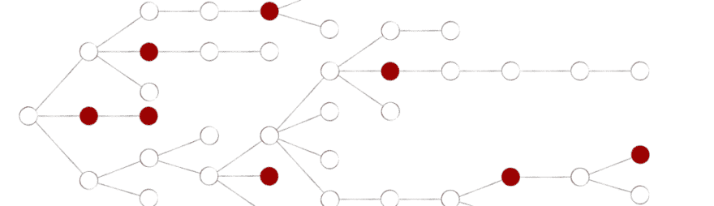
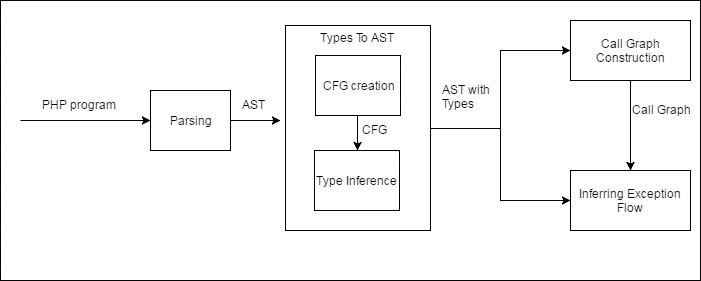

# 了解异常流量

> 原文：<https://dev.to/tddenbraber/understanding-exceptional-flow-8jd>

[T2】](https://res.cloudinary.com/practicaldev/image/fetch/s--EYeNnu0V--/c_limit%2Cf_auto%2Cfl_progressive%2Cq_auto%2Cw_880/https://cdn-images-1.medium.com/max/1024/0%2A9e-SVkTcV9Vl37Df.png)

也许你认识到下面的情况。您正在实现一个新特性，并且您知道您可以使用某个方法，因为它已经包含了您需要的一些功能。简单地看一下，您看不到任何异常处理构造。方法文档不包含可以抛出什么异常的信息，例如通过`@throws`声明。您的结论是，没有理由认为该方法会引发或传播任何异常。

但是你能确定吗？为了得出不能抛出或传播异常的结论，您需要跟踪您正在查看的方法可能进行的每个方法调用，并对您遇到的所有方法重复这个过程。您还需要查找所有使用的内部 php 函数或方法的定义，看看它们是否抛出任何异常。这需要大量的工作，而且做起来很乏味。这将是非常有益的自动化过程！

这正是为什么我目前正在开发一个工具，作为我的理学硕士论文项目的一部分，对异常流进行建模。在这篇介绍性的文章中，将简要讨论这个工具的构建模块。在本系列的后续文章中，将会更深入地讨论这些构建模块。

本系列文章的结尾将概述在许多开源项目中使用该工具的结果。

### 积木

异常流模型由几个构件组成。这在下面的图片中被形象化了。

[T2】](https://res.cloudinary.com/practicaldev/image/fetch/s--WVjmG4Pt--/c_limit%2Cf_auto%2Cfl_progressive%2Cq_auto%2Cw_880/https://cdn-images-1.medium.com/max/701/1%2AYr24Rf3WghUtvt4fMVQnpg.jpeg)

系统接受一个完整的 PHP 程序作为输入。代码被解析，这导致一个[抽象语法树(AST)](https://en.wikipedia.org/wiki/Abstract_syntax_tree) 。该 AST 作为完整分析的基础。首先，类型将被推断并映射回 AST。此后，将创建程序的调用图。将 AST 与类型和调用图结合使用，可以推导出异常流。

### 式推断

因为 PHP 是动态类型的，所以 AST 不包含关于表达式类型的信息。因为需要这些类型来构造调用图和检测抛出了哪些异常，所以需要推断 AST 中表达式的类型。然而，在我们可以进行类型推断之前，我们需要有一个[控制流图(CFG)](https://en.wikipedia.org/wiki/Control_flow_graph) ，因为在程序执行期间可以通过代码的路径决定了变量可以有什么类型。请注意，为每个函数或方法创建了一个单独的 CFG，并且这些 CFG 不是通过解析方法和函数调用来连接的。

当 CFG 被创建时，类型可以被推断出来。这些类型被映射回 AST。此时，我们有一个包含表达式类型信息的 AST。

### 调用图形构造

因为我们想知道异常是如何在函数和方法之间传递的，所以我们想知道每个方法可以进行哪些方法调用。因为我们已经完成了类型推断，我们现在可以决定(对于大多数)表达式的类型。如果我们遇到类似于`$a->m()`的语句，并且我们知道`$a`的类型，我们可以限制这个表达式可能解析的方法的数量。多态性在这里扮演着重要的角色。

### 推断异常流量

现在我们有了调用图和 AST 类型，我们可以开始推断异常流了。该分析使用了“作用域”和“保护作用域”的概念[【1】](https://www.moxio.com/blog/14/understanding-exceptional-flow#ref_1)。这个上下文中的作用域是一个方法或函数，而受保护的作用域是一个 try/catch/finally 块。受保护的作用域可以嵌套在另一个(受保护的)作用域中。

在(受保护的)范围内遇到的异常可能源自四个不同的来源。首先，可以使用 throw 语句显式抛出异常。其次，异常可以由语句生成。当代码导致异常发生，但没有显式引发它时，就会发生这种情况。例如，如果您调用一个函数，该函数指定它返回一个 int，但实际上返回一个 string，那么调用这个函数将导致一个 TypeError。异常的第三个来源可能是对遇到异常的方法或函数的调用。然后，遇到的异常被传播到调用方的范围内。最后，在作用域中可能会遇到异常，因为它不是在嵌套的保护作用域中捕获的。

利用这些资源，我们可以模拟一个系统中的异常流动。确切的算法将在后面的文章中介绍。

### 包装完毕

在这篇文章中，我们简要讨论了构建一个能够模拟异常流量的工具的所有要素。请继续关注本系列的下一篇文章，其中将更深入地讨论类型推理的主题。

### 参考文献

[1]罗比拉德议员和墨菲议员(2003 年)。支持面向对象系统中异常结构演化的静态分析。美国计算机学会软件工程和方法汇刊(TOSEM)，12(2)，191–221。

*最初发表于*[*【www.moxio.com】*](https://www.moxio.com/blog/14/understanding-exceptional-flow)*。*

* * *