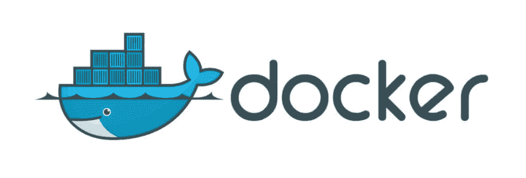
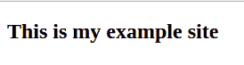
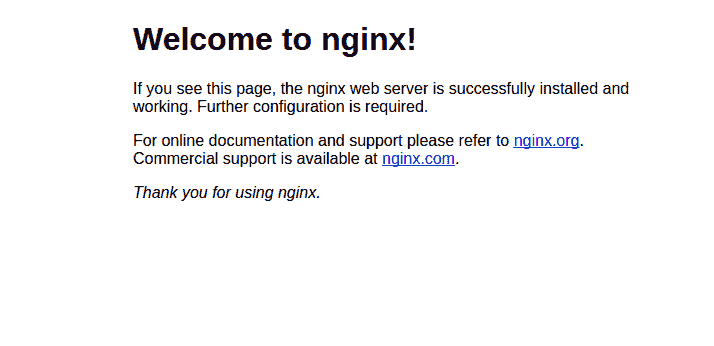

# Docker，Nginx 和让我们为一个安全的网站加密

> 原文：<https://dev.to/stephenafamo/docker-nginx-and-lets-encrypt-for-a-secure-website-3jok>

[T2】](https://res.cloudinary.com/practicaldev/image/fetch/s--8QABjVC1--/c_limit%2Cf_auto%2Cfl_progressive%2Cq_auto%2Cw_880/https://i1.wp.com/stephenafamo.com/blog/wp-content/uploads/2017/03/docker.jpg%3Ffit%3D1024%252C347%26ssl%3D1)

让我向你展示我如何使用 Docker，Nginx 和 Let's encrypt 来托管我的网站和提供安全的 https 内容。

我使用 Docker 来托管我的许多网站，现在让我们加密发布免费的 SSL 证书，没有理由不拥有一个。

## 事情要注意

我的测试服务器运行的是 Ubuntu 16.04。尽管这个过程在大多数其他服务器上应该是相似的。

您应该将域名服务器或 A 记录指向该服务器。

在本教程中，我将使用 _**example.com**_，你应该用你的域名来代替它。

我将使用 _**_ 作为服务器的 IP 地址。你应该用你自己的 IP 来替换它**

 **## 第一步:安装 Docker

我们现在将使用命令安装我们心爱的 Docker。

```
sudo apt install docker.io 
```

更多安装 docker 的方法，请访问官方 [docker 安装页面](https://docs.docker.com/engine/installation)

## 第二步:用 Docker 建立我们的网站

因此，我们将为我们的站点创建一个目录，这个目录将保存我们将挂载到 docker 容器中的代码。

```
sudo mkdir -p /var/www/example.com 
```

接下来，我们将拉动容器。

```
docker pull creativitykills/nginx-php-server:1.1.1 
```

这是一个安装了 nginx 和 php 的容器。容器的 web 根目录是/var/www/public，所以我们必须在那里安装我们的站点。

接下来，我们将启动 docker 容器。

```
docker run -d -p 1234:80 \
 --name example_site \
 -v /var/www/example.com:/var/www/public \
 creativitykills/nginx-php-server:1.1.1 
```

有了这个命令，

1.  我们运行了容器 creativitykills/nginx-PHP-server:1 . 1 . 1
2.  我们告诉 docker 以分离模式[-d]运行这个容器
3.  我们将服务器上的端口 1234 映射到容器的端口 80[-p 1234:80]
4.  我们将该容器命名为 example _ site[–name example _ site]
5.  我们将 sites 文件夹挂载到容器的 web 根目录。[-v/var/www/example . com:/var/www/public]

最后，我们将在/var/www/example . com/index . html 中添加一个 index.html 文件

```
<!-- /var/www/example.com/index.html -->
<!DOCTYPE html>
<html>
<head>
 Example Site
</head>
<body>
 <h2>This is my example site</h2>
</body>
</html> 
```

如果你现在去参观 12.34.56.78:1234，你应该会看到以下这些。

[](https://res.cloudinary.com/practicaldev/image/fetch/s--wVT3YdEy--/c_limit%2Cf_auto%2Cfl_progressive%2Cq_auto%2Cw_880/https://i2.wp.com/blog.stephenafamo.com/wp-content/uploads/2017/03/example.png%3Fresize%3D274%252C73%26ssl%3D1) 

<figcaption>示例地点</figcaption>

## 第二步:用 Nginx 将我们的域指向 docker 容器

我们将在服务器上安装 Nginx，作为 Docker 容器的反向代理。我们可以使用下面的命令安装它。

```
sudo apt install nginx 
```

如果你现在访问 example.com，你应该会看到默认的 nginx 页面。

[](https://res.cloudinary.com/practicaldev/image/fetch/s--laTflpyM--/c_limit%2Cf_auto%2Cfl_progressive%2Cq_auto%2Cw_880/https://i2.wp.com/blog.stephenafamo.com/wp-content/uploads/2017/03/nginx.png%3Fresize%3D714%252C346%26ssl%3D1)

<figcaption>engine 缺省页面</figcaption>

为了将我们的域指向 docker 容器，我们必须设置一些定制的 nginx 配置。

将 example.com.conf 文件添加到/etc/nginx/sites-available。

```
touch /etc/nginx/sites-available/example.com.conf 
```

使用您最喜欢的编辑器将其添加到 example.com.conf

```
server {
 listen 80;
 listen [::]:80;
 server_name example.com www.example.com;

 location / {
   proxy_pass http://0.0.0.0:1234;
   proxy_set_header Host $host;
   proxy_set_header X-Real-IP $remote_addr;
   proxy_set_header X-Forwarded-For $proxy_add_x_forwarded_for;
   proxy_set_header X-Forwarded-Proto $scheme;
 }

} 
```

接下来，使用以下命令将 example.com.conf 添加到 sites-available 列表。

```
ln -s /etc/nginx/sites-available/example.com.conf /etc/nginx/sites-enabled/example.com.conf 
```

现在，重新加载 nginx，让我们的新配置生效

```
/etc/init.d/nginx reload 
```

如果你现在去参观 example.com，你应该会看到以下这些。

[](https://res.cloudinary.com/practicaldev/image/fetch/s--wVT3YdEy--/c_limit%2Cf_auto%2Cfl_progressive%2Cq_auto%2Cw_880/https://i2.wp.com/blog.stephenafamo.com/wp-content/uploads/2017/03/example.png%3Fresize%3D274%252C73%26ssl%3D1) 

<figcaption>示例地点</figcaption>

## 第四步:从 Let's Encrypt 获得一个 SSL 证书

为了发布和更新证书，我们将使用 letsencrypt 包。

只需通过运行以下命令来安装它:

```
sudo apt install letsencrypt 
```

接下来，生成一个 Diffie-Hellman 组。使用此命令

```
sudo openssl dhparam -out /etc/ssl/certs/dhparam.pem 2048 
```

现在，我们将调整 nginx 配置来创建证书。

编辑/etc/nginx/sites-available/example . com . conf 并使其成为这样。

```
server {
 listen 80;
 listen [::]:80;
 server_name example.com www.example.com;

 location "/.well-known/acme-challenge" {
   default_type "text/plain";
   root /var/www/example.com;
   allow all;
 }

 location / {
   proxy_pass http://0.0.0.0:1234;
   proxy_set_header Host $host;
   proxy_set_header X-Real-IP $remote_addr;
   proxy_set_header X-Forwarded-For $proxy_add_x_forwarded_for;
   proxy_set_header X-Forwarded-Proto $scheme;
 }

} 
```

再次重新加载 nginx，以使我们的配置更改生效。

```
/etc/init.d/nginx reload 
```

从“让我们加密”获取证书。

```
letsencrypt certonly -a webroot \
--webroot-path=/var/www/example.com \
-d example.com -d www.example.com 
```

您将被要求输入您的电子邮件并同意条款和条件。

之后，您应该已经成功安装了 ssl 证书。

## 第五步:为你的网站提供 HTTPS 服务

我们再次编辑 example.com.conf 以提供 https 内容。换成这个。

```
server {
 listen 80;
 listen [::]:80;
 server_name example.com www.example.com;

 location "/.well-known/acme-challenge" {
   default_type "text/plain";
   root /var/www/example.com;
   allow all;
 }

 location / {
   proxy_pass http://0.0.0.0:1234;
   proxy_set_header Host $host;
   proxy_set_header X-Real-IP $remote_addr;
   proxy_set_header X-Forwarded-For $proxy_add_x_forwarded_for;
   proxy_set_header X-Forwarded-Proto $scheme;
 }

}

server {
 listen 443 ssl;
 server_name example.com www.example.com;

 ssl_certificate /etc/letsencrypt/live/example.com/fullchain.pem;
 ssl_certificate_key /etc/letsencrypt/live/example.com/privkey.pem;
 ssl_session_cache shared:SSL:10m;
 ssl_session_timeout 5m;
 ssl_protocols TLSv1 TLSv1.1 TLSv1.2;
 ssl_prefer_server_ciphers on;
 ssl_dhparam /etc/ssl/certs/dhparam.pem;
 ssl_ciphers 'EECDH+AESGCM:EDH+AESGCM:AES256+EECDH:AES256+EDH';
 ssl_stapling on;
 ssl_stapling_verify on;
 add_header Strict-Transport-Security max-age=15768000;

 location "/.well-known/acme-challenge" {
   default_type "text/plain";
   root /var/www/example.com;
   allow all;
 }

 location / {
   proxy_pass http://0.0.0.0:1234;
   proxy_set_header Host $host;
   proxy_set_header X-Real-IP $remote_addr;
   proxy_set_header X-Forwarded-For $proxy_add_x_forwarded_for;
   proxy_set_header X-Forwarded-Proto $scheme;
 }
} 
```

再次重新加载 nginx！

```
/etc/init.d/nginx reload 
```

你现在应该可以访问 __

## 步骤 6:为您的 SSL 证书设置自动续订

让我们加密 90 天后过期的证书。更新的命令是

```
letsencrypt renew 
```

如果您现在运行它，它会告诉您您的证书没有到期续订。

我们要做的是建立一个尝试更新证书的每周 cronjob，然后重新加载 nginx。

首先，以 root 用户身份打开 crontab

```
sudo crontab -e 
```

接下来，将下面几行添加到 crontab 中。

```
30 2 * * 1 letsencrypt renew
35 2 * * 1 /etc/init.d/nginx reload 
```

## 第七步:将所有 http 请求重定向到 https(可选)

为了让网络更安全，最好是通过 https 服务所有请求，除非你有很好的理由不这样做。要将所有 http 流量重定向到 https，请将 example.com.conf 修改为。

```
server {
 listen 80;
 listen [::]:80;
 server_name example.com www.example.com;

 location "/.well-known/acme-challenge" {
   default_type "text/plain";
   root /var/www/example.com;
   allow all;
 }

 return 301 https://example.com$request_uri;
}

server {
 listen 443 ssl;
 server_name example.com www.example.com;

 ssl_certificate /etc/letsencrypt/live/example.com/fullchain.pem;
 ssl_certificate_key /etc/letsencrypt/live/example.com/privkey.pem;
 ssl_session_cache shared:SSL:10m;
 ssl_session_timeout 5m;
 ssl_protocols TLSv1 TLSv1.1 TLSv1.2;
 ssl_prefer_server_ciphers on;
 ssl_dhparam /etc/ssl/certs/dhparam.pem;
 ssl_ciphers 'EECDH+AESGCM:EDH+AESGCM:AES256+EECDH:AES256+EDH';
 ssl_stapling on;
 ssl_stapling_verify on;
 add_header Strict-Transport-Security max-age=15768000;

 location "/.well-known/acme-challenge" {
   default_type "text/plain";
   root /var/www/example.com;
   allow all;
 }

 location / {
   proxy_pass http://0.0.0.0:1234;
   proxy_set_header Host $host;
   proxy_set_header X-Real-IP $remote_addr;
   proxy_set_header X-Forwarded-For $proxy_add_x_forwarded_for;
   proxy_set_header X-Forwarded-Proto $scheme;
 }
} 
```

现在，重新加载 nginx。

```
/etc/init.d/nginx reload 
```

就是这样！

帖子 [Docker、Nginx 和让我们为一个安全的网站加密](https://stephenafamo.com/blog/docker-container-nginx-lets-encrypt/)首先出现在[斯蒂芬·阿法莫的博客](https://stephenafamo.com/blog)上。**