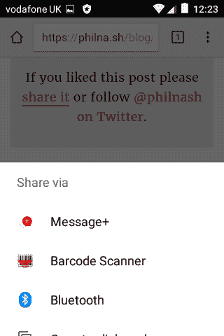

# web 共享 API

> 原文：<https://dev.to/philnash/the-web-share-api>

最近我为[我的网站](https://philna.sh)实现了 [web share API](https://developers.google.com/web/updates/2016/10/navigator-share) 作为测试的手段。如果你在 Android 上使用的是 Chrome 55 或更高版本，那么你可以通过[点击这篇文章](https://philna.sh/blog/2017/03/14/the-web-share-api/)底部的“分享”来观看它的运行。这是我的个人博客，也是这篇文章的权威来源。

如果你没有一个支持 API 的浏览器，那么这就是你点击分享链接时的样子。

Web Share API origin 试用版已经结束，所以你目前还看不到它在 Chrome 中的运行。为了跟上讨论，请关注一下 [WICG 论坛](https://discourse.wicg.io/t/web-share-api-for-sharing-content-to-arbitrary-destination/1561)和 [GitHub 回购](https://github.com/WICG/web-share)。

[T2】](https://res.cloudinary.com/practicaldev/image/fetch/s--IcGZuPCp--/c_limit%2Cf_auto%2Cfl_progressive%2Cq_auto%2Cw_880/https://philna.img/webshare.png)

我想分享一下 API 是如何工作的，以及到目前为止我对它的想法。

## 工作原理

web 共享 API 实际上是一个非常简单的 API。它在`navigator`对象上可用，由一个方法组成；`share`。该方法接受一个可以具有`title`、`text`或`url`属性的对象。必须拥有`text`或`url`房产，尽管你可以两者都拥有。

你只能通过用户的手势来调用`navigator.share`，这样网站就不会让用户惊讶地分享页面。此外，像其他强大的新网络平台功能一样，它只能在 HTTPS 托管的网站上运行。

该 API 是基于承诺的，当一个页面被成功共享时，该承诺将被解决。如果用户不能分享或者选择不分享，承诺就会拒绝。

您可以检测 API 的存在，这样您就可以使用 web share API 逐步增强网站。这是一个好消息，因为 API 现在只作为[原始试用版](https://github.com/jpchase/OriginTrials/blob/gh-pages/developer-guide.md)提供。这意味着它不是广泛可用的，你需要选择在你的网站上测试这个特性。如果你在一个尚不支持 API 的浏览器上，点击这篇文章底部的“分享”，你会被导向到 [Twitter web intent](https://dev.twitter.com/web/tweet-button/web-intent) 。

## 实现 web 共享 API

这就是你调用 web 共享 API 的方式。

```
navigator.share({ title: title, url: url })
  .then(function() { console.log("Share success!"); })
  .catch(function() { console.log("Share failure!"); }); 
```

Enter fullscreen mode Exit fullscreen mode

这是我为我的网站实现的第一个网络共享 API。

```
var shareLinks = [].slice.call(document.querySelectorAll('.share'));
shareLinks.forEach(function(link) {
  link.addEventListener('click', function (event) {
    if (typeof navigator.share !== 'undefined') {
      event.preventDefault();
      var canonicalElement = document.querySelector('link[rel=canonical]');
      if(canonicalElement !== undefined) {
        var url = canonicalElement.href;
      } else {
        var url = window.location.href;
      }
      var pageTitle = document.querySelector('.post-title').textContent;
      navigator.share({ title: pageTitle, url: url })
        .then(function() { console.log("Share success!"); })
        .catch(function() { console.log("Share failure!"); });
    } else {
      // No web share API...
    }
  });
}); 
```

Enter fullscreen mode Exit fullscreen mode

如您所见，这里的大部分代码都是设置监听器、特性检查和获取实际数据来共享。分解一下，情况是这样的:

1.  选择类别为“共享”的所有链接
2.  为每个链接添加一个“点击”监听器
3.  点击共享链接时，检查是否存在`navigator.share`
4.  如果它确实存在，停止链接做任何事情
5.  尝试获取页面的规范 URL，如果存在，首先从 link 元素获取，否则从`window.location.href`获取
6.  从页面的 h1 元素获取页面标题
7.  分享标题和网址

你可以在 GitHub 中看到[完整的代码(在编写时)。](https://github.com/philnash/philna.sh/blob/3075d51dcf723b26eaae0fa1149dd5fa3a14b03e/_assets/js/main.js#L6-L49)

## 关于 API 的思考

我喜欢这个 API，我喜欢它给开发者和用户带来的好处。

首先，它很容易实现。一个方法，三个潜在的论点，成功和失败的承诺。您可以更深入地研究它，但是从表面上看，开发人员可以在几分钟内实现它。如果 API 成为一个标准，希望这种简单性将导致迅速的采用。

我是你的粉丝还有更多原因。

### 用户选择

它会阻止主机网站选择用户可以共享内容的位置。当然，脸书和 Twitter 是受欢迎的分享目的地，但还有很多应用程序可供你分享内容。这种长尾效应意味着，只提供一两个分享按钮是不令人满意的，让随处分享成为可能也是不明智的。分享这可能有一堆分享按钮可用，但这一选择仍然没有触及网络可能性的表面。

最终，像这样的共享 API 将控制权放回用户手中，允许他们共享他们选择安装在设备上的应用程序。

### 最小化 JavaScript

您已经看到了上面我用来实现 web share API 的代码。没多少了。

与流行网站提供的支持共享功能的脚本相比，它显得特别小。Twitter 的脚本大约是 32kB，[脸书的脚本](https://developers.facebook.com/docs/plugins/share-button)大约是 60kB。最佳实践是异步加载这些脚本，因此它们不会影响页面加载时间。但是，仅仅为了一个共享按钮，就需要加载和解析大量的 JavaScript 代码。

这些脚本不只是作为开发人员实现的共享按钮。他们允许脸书、推特之类的网站在网上追踪他们的用户。web share API 不仅为网站所有者提供了一种更有效的用户共享方式，而且还给出了一些用户隐私。

### 更好的反馈

虽然大型社交网络可能更难追踪用户，但 web share API 实际上让网站更容易了解用户的行为。由于 share API 与 Promises 一起工作，您可以发现何时单击了 share 链接，以及何时单击导致了与另一个应用程序的共享。

## 缺什么？

目前，web 共享 API 的实现中缺少的是它的另一面。[web 共享目标 API](https://github.com/WICG/web-share-target) 是一个 API，当调用 web 共享 API 时，它将允许 web 应用程序注册以出现在共享抽屉中。如果没有目标 API，web 共享 API 只能直接共享到用户设备上可用的本地应用程序。虽然对于那些已经在用户设备上安装了应用程序的大型社交网络来说，这可能还可以，但这无助于潜在共享目标的长尾。

我明白成为分享目标是一个比分享复杂得多的过程。对 share API 和 share target API 的研究已经被分开，这是一件好事，这样我们可以更快地试验 web share API。我希望很快就能看到 web share target API 的试用想法。

## 分享掉

web share API 目前是一个实验([你可以注册自己试用](https://docs.google.com/forms/d/e/1FAIpQLSfO0_ptFl8r8G0UFhT0xhV17eabG-erUWBDiKSRDTqEZ_9ULQ/viewform?entry.1999497328=Web+Share+(Experimenting+until+April+2017)))，但我认为这是一个有趣且有意义的实验。最终让用户选择他们可以分享什么对用户更好，对应用程序的长尾更好。

如何看待 web share API？请在推特上告诉我: [@philnash](https://twitter.com/philnash) 。如果你觉得自己很慷慨，为什么[不也分享一下这篇文章呢](https://philna.sh/blog/2017/03/14/the-web-share-api/)！

* * *

*[web share API](https://philna.sh/blog/2017/03/14/the-web-share-api/)最初发布于[philna . sh](https://philna.sh/)2017 年 3 月 14 日。*