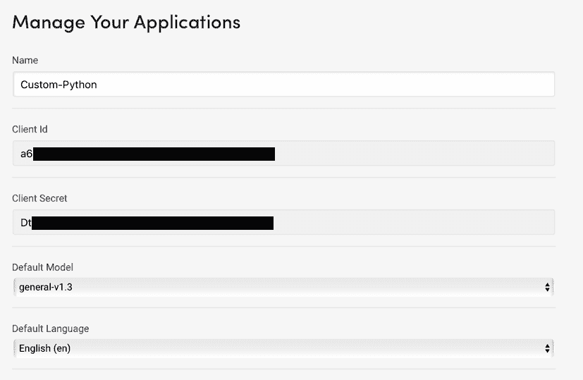
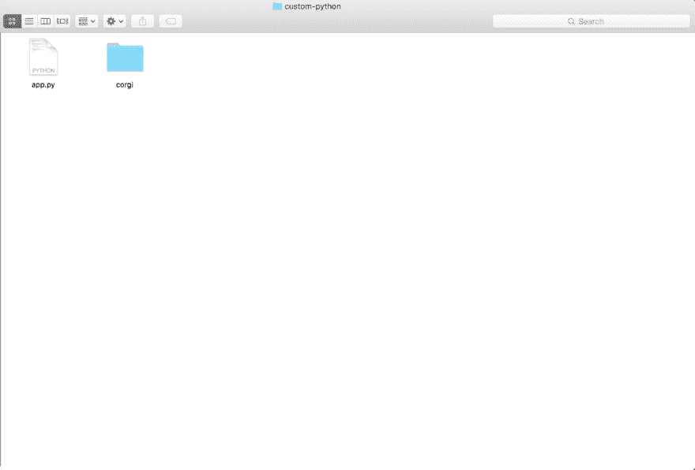
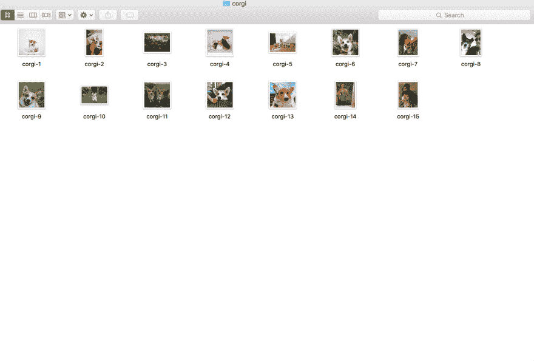
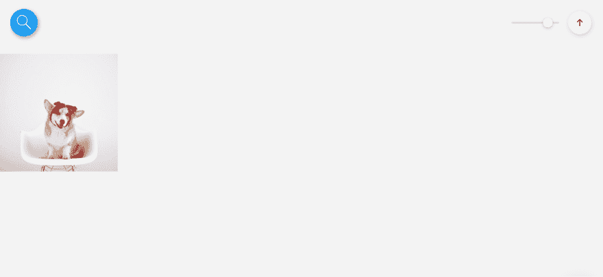
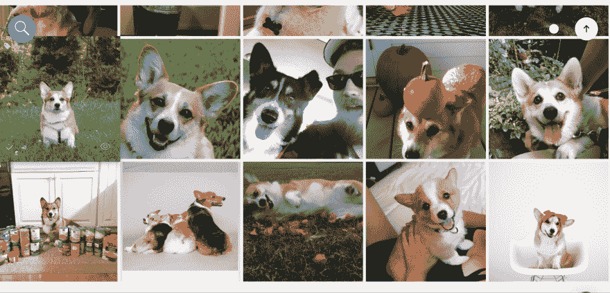

# 使用 Clarifai 的 Python 客户端训练自定义视觉识别模型

> 原文:[https://dev . to/clari fai/train-a-custom-visual-recognition-model-using-clari fais-python-client](https://dev.to/clarifai/train-a-custom-visual-recognition-model-using-clarifais-python-client)

12 月，我们的 v2 API [从开发者预览版升级为正式发布版](http://blog.clarifai.com/side-by-side-guide-how-to-transition-from-clarifai-v1-to-v2-api/#.WMb8bRIrLdQ?&utm_sourch=dev-to&utm_medium=blog)。他们不是长得很快吗？！因此，这里有一个关于如何使用 Clarifai v2 API 最受欢迎的特性之一——定制培训的有用教程。定制培训使您能够教授新概念，以便我们的技术仅使用少量示例和几行代码就能识别！

如果你已经看过我们新的 [v2 API 文档](https://developer.clarifai.com?&utm_sourch=dev-to&utm_medium=blog)，你可能已经注意到事情与 v1 中的有些不同——新的 SDK，一个很酷的新可视化工具，以及等待你使用定制培训来构建它们的新项目！在我们之前的一篇博文中，我们讨论了[如何使用预览界面进行定制培训](http://blog.clarifai.com/get-to-know-clarifais-new-api-a-visual-tutorial-and-guide?&utm_sourch=dev-to&utm_medium=blog)。虽然这很棒(就像真的很棒)，但我们将加速它，并向您展示如何使用*编程*来做一些同样的事情。

它不像拉起我们的[光滑、别致的用户界面](https://preview.clarifai.com?&utm_sourch=dev-to&utm_medium=blog)那样华而不实，但它同样很棒。你可以去找你的朋友，向他们展示你疯狂的教计算机如何看的技能！

* * *

# 一个 API 客户端

首先，我们需要找到一种方法来连接 API 和我们的代码。我们已经为您编写了几个不同的客户端，供您在几种不同的语言中使用。对于本教程，我们将坚持使用 Python 客户端。谁不喜欢出自 [Monty Python](https://docs.python.org/2/faq/general.html#why-is-it-called-python) 的编程语言？

注意:确保已经安装了至少 2.7 或更高版本的 [Python](https://www.python.org/downloads/) 。如果你不确定你会选择哪一个，进入你的终端，看看`python --version`会为你提供什么。例如，这是我的系统上发生的情况:

```
$ python --version
Python 2.7.10
# Or if you are using Python3
# Python 3.5.1 
```

同样为了安装 Clarifai API 客户端，我们要确保我们有 pip，Python 包管理器:

```
$ pip --version
pip 9.0.1 from /path/to/Python/2.7/site-packages (python 2.7)
# or if you are using Python3
# pip 9.0.1 from /path/to/python3.5/site-packages (python 3.5) 
```

这两个问题解决后，我们现在终于可以开始安装 Python 客户机了！

```
$ pip install clarifai
# NOTE: If this doesn't work, consider having a sudo in front of the command 
# to tell your computer who is boss. 
```

如果一切顺利，我们还需要做一件事，然后才能编写自定义培训。我们将把我们的客户 ID 和客户密码添加到我们的应用程序中。每次想打 Clarifai，都要确保至少有这两个！无论你使用什么语言，这将是你唯一可以访问的方式。因此，请访问开发者网站，为自己创建一个新的应用程序:

[T2】](https://res.cloudinary.com/practicaldev/image/fetch/s--ph21SfIP--/c_limit%2Cf_auto%2Cfl_progressive%2Cq_auto%2Cw_880/http://blog.clarifai.com/wp-content/uploads/2016/12/image03.png)

一旦完成，回到终端，输入:

```
$ clarifai config 
```

当你按下回车键时，它会提示你分别输入你的客户 ID 和客户密码。这样，当我们进行调用时，只要您使用特定的应用程序，就不必将它保存在您的项目中，而是保存在您的文件系统中:

```
CLARIFAI_APP_ID: []: ************************************YQEd
CLARIFAI_APP_SECRET: []: ************************************gCqT 
```

恭喜你！如果您已经做到了这一步，那么您已经成功地将 Clarifai Python 客户端添加到了您的系统中。去你的！现在，有了这个方法，我们要写一些代码！

# 用概念添加图像

通过定制训练，你可以教 Clarifai 识别你想要的任何图像！所以对我来说，我会教 Clarifai 关于柯基犬的知识(因为柯基犬是最好的)。对于这一部分，您可以找到 10-20 个您想要用来训练模型的图像。这将被称为“训练集”，你用来训练的一组图像将有你试图让 Clarifai 识别的任何概念的正面和负面例子。

因此，我收集了 15 张从不同角度拍摄的柯基犬的图像(包括最重要的“柯基犬屁股”姿势)，以及各种背景物体，以确保 Clarifai 能够识别我想要它识别的东西。虽然我所有的图片都是 JPG，Clarifai 支持 JPG，PNG，BMP 和 TIFF 文件！取决于你想训练什么，最好有一张你想让 Clarifai 寻找的更真实的照片，有时只希望物体本身在坚实的背景前也是可以的。

在我的项目文件夹中，我制作了一个文件夹来存放我为一个概念收集的所有图像。因此，我的`corgi/`目录中的所有图像都将包含以“corgi”为概念的图像。

[](https://res.cloudinary.com/practicaldev/image/fetch/s--1Rlu-ukG--/c_limit%2Cf_auto%2Cfl_progressive%2Cq_auto%2Cw_880/http://blog.clarifai.com/wp-content/uploads/2016/12/image01.png)
[T6】](https://res.cloudinary.com/practicaldev/image/fetch/s--AaBHnPyq--/c_limit%2Cf_auto%2Cfl_progressive%2Cq_auto%2Cw_880/http://blog.clarifai.com/wp-content/uploads/2016/12/image04.png)

为了用 corgi 的概念添加一个图像对象，我们要写:

```
from clarifai.rest import ClarifaiApp
from clarifai.rest import Image as ClImage

# Our app app = ClarifaiApp()

# Adding our image onto our app app.inputs.create_image_from_filename('./corgi/corgi-1.jpg', concepts=['corgi']) 
```

当我们运行这个(`python.py`)时，我们可以在预览界面上看到我们的输入被添加到我们的应用程序中:

[T2】](https://res.cloudinary.com/practicaldev/image/fetch/s--3Bila-Kh--/c_limit%2Cf_auto%2Cfl_progressive%2Cq_auto%2Cw_880/http://blog.clarifai.com/wp-content/uploads/2016/12/image02.png)

为了利用编程的力量，我们要将这个过程自动化。让我们创建一个函数，将我们所有的图像导入到一个具有相同概念的目录中。在这种情况下，我们将所有的照片放在`corgi/`下，带有我们的“corgi”概念！

```
# Packages for reading local files import os
from glob import glob

def create_image_set(img_path, concepts):
    images = []
    for file_path in glob(os.path.join(img_path, '*.jpg')):
        print(file_path)
        img = ClImage(filename=file_path, concepts=concepts)
        images.append(img)

    return images 
```

这将允许我们很容易地接受任何种类的图像，无论在哪里，也允许我们设置一些图像有概念！这只是我的一些代码，非常欢迎你改进它来满足你的需要。

注意:对于这个函数，我们假设每批图像的数量相对较少。如果您一次发送大量的图像，每个函数调用大约有 100，000 多个图像，您可能需要考虑抽象这个函数来异步处理请求的发送。

所以现在我们的代码看起来更像这样:

```
from clarifai.rest import ClarifaiApp
from clarifai.rest import Image as ClImage
from glob import glob
import os

def main():
    app = ClarifaiApp()
    image_set = create_image_set('corgi/', ['corgi'])
    app.inputs.bulk_create_images(image_set)

def create_image_set(img_path, concepts):
    images = []
    for file_path in glob(os.path.join(img_path, '*.jpg')):
        img = ClImage(filename=file_path, concepts=concepts)
        images.append(img)

    return images

if __name__ == '__main__':
    main() 
```

注意，我们在 main 方法中调用了我们的`create_image_set`,并将我们的`image_set`设置为等于返回的结果。然后我们把这个送到`app.inputs.bulk_create_images`。现在，当您运行脚本时，您应该会看到您添加的所有图像！

[T2】](https://res.cloudinary.com/practicaldev/image/fetch/s--Ap5tH86R--/c_limit%2Cf_auto%2Cfl_progressive%2Cq_auto%2Cw_880/http://blog.clarifai.com/wp-content/uploads/2016/12/image00-1.png)

现在我们已经用我们的柯基概念添加了一些图片！让我们试着将它添加到模型和训练中！

# 创建模型并训练！

因为我们已经添加了输入，所以我们现在需要做的就是创建一个模型并训练它！为了避免添加重复的输入，我们将注释掉图像内容，并将我们的主函数改为 only:

```
def main():
    app = ClarifaiApp()
    # image_set = create_image_set('corgi/', ['corgi'])
    # app.inputs.bulk_create_images(image_set) 
    model = app.models.create(model_id="puppy", concepts=['corgi'])
    model.train() 
```

这里我们创建了模型，模型 id 为“puppy ”,模型上的概念与模型上的概念一致。从那里，我们确定呼叫火车。瞧啊。我们已经训练我们的模型来识别 CORBA 的概念！

现在，假设我们想使用我们的模型，看看它是否有效，我们可以将我们的 main 改为:

```
def main():
    app = ClarifaiApp()
    # image_set = create_image_set('corgi/', ['corgi'])
    # app.inputs.bulk_create_images(image_set)
    # model = app.models.create(model_id="puppy", concepts=['corgi'])
    # model.train()
    model = app.models.get('puppy')

    url = raw_input("URL of image: ")
    # if on Python3, change the above line to
    # url = input("URL of image: ") 
    print model.predict_by_url(url)['outputs'][0]['data']['concepts']
    # if on Python3, change the above line to
    # print(model.predict_by_url(url)['outputs'][0]['data']['concepts']) 
```

我们将要求我们的用户给我们一个网址，然后我们将根据我们的小狗模型打印！这将给我们模型上所有概念的输出:

```
$ python app.py
URL of image: https://s-media-cache-ak0.pinimg.com/236x/37/5d/48/375d488c51f51c72a01e0e88420becca.jpg
[{u'app_id': u'b066d570bcae40b3b0d5d50176d09cef', u'id': u'corgi', u'value': 0.9865137, u'name': u'corgi'}] 
```

本教程到此为止！在定制培训中有更多的功能和做事方式。如果你需要任何帮助，请务必通过[support@clarifai.com](//mailto:support@clarifai.com)联系我们。我们非常乐意帮忙！

在我送你上路之前，这里有一些关于定制培训需要记住的简单提示和技巧:

1.  确保在你的应用程序中有你的输入(图片),并告诉他们它们与什么概念(或不是概念)相关联！
2.  确保你有一个模型(一个放一组概念的地方)和概念！仅仅在你的应用程序中有图片是不够的。
3.  如果您不确定如何使用任何客户端访问 API，请务必查看 repo 的文档。对于 Python，在这里可以看到所有可用的函数[。](https://sdk.clarifai.com/python/docs/latest/index.html?&utm_sourch=dev-to&utm_medium=blog)

出去吧，我的世界同胞们。教计算机如何从你的角度看世界！