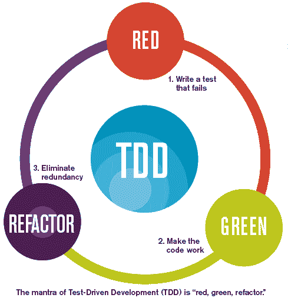

# 测试驱动开发或 TDD

> 原文:[https://dev . to/funky si 1701/test-driven-development-or-TDD-2m 06](https://dev.to/funkysi1701/test-driven-development-or-tdd-2m06)

几周前，我参加了 Oliver Shaw 博士在 Agile Yorkshire 举办的关于测试驱动开发(TDD)的讲座。奥利弗让它看起来如此简单，这给我留下了深刻的印象，因为我从未尝试过，所以我想我应该试一试。

[T2】](https://res.cloudinary.com/practicaldev/image/fetch/s--dHqy9gKZ--/c_limit%2Cf_auto%2Cfl_progressive%2Cq_66%2Cw_880/https://storageaccountblog9f5d.blob.core.windows.net/blazor/wp-content/uploads/2017/03/tdd_flow.gif%3Fresize%3D287%252C300%26ssl%3D1)

测试驱动开发或 TDD 是一种从编写单元测试开始的开发方式。首先编写一个失败的测试，然后编写代码让它通过，然后重构代码。这可以通过思考**红色、绿色、重构**来记忆。红色表示测试失败，绿色表示测试通过，重构表示重构。

在演示过程中，Oliver 使用了一种叫做 scala 的语言和一个在每次修改后自动重新运行所有测试的系统。我用 C#编写 Visual Studio 代码，有没有办法让我的测试也自动运行？

一点谷歌和配置我可以回答这是肯定的。

名为 [Giles](https://testergiles.herokuapp.com/) 的 nuget 包是一个观察器，它将重新运行您的测试，就像 Oliver 在他的标量环境中所做的那样。《吸血鬼猎人巴菲》的粉丝会得到一个笑话，为什么一个守望者被称为贾尔斯。我无法让它与 MSTest 一起工作，但与 NUnit 一起工作很好。有一个 powershell 脚本 giles.ps1，您需要运行它，它会不时地更新测试通过或失败的次数。但是，如果您在 Visual Studio 中编码，您可能看不到这一点，但是有一种方法可以获得通知。

如果你安装了应用程序 [Growl](http://www.growlforwindows.com/gfw/) ，你可以得到来自 Giles 的通知，这些通知会弹出然后消失。因此，无论你在屏幕上看到什么，你几乎都可以立即发现你是否违反了测试。

我想配置的另一件事是查看代码覆盖率的方式，以及哪些方法被测试了，哪些没有。如果你在构建之后熟悉 VSTS，它会给你一个测试覆盖率的百分比分数。我并不觉得这有什么用，因为它并没有告诉你什么是覆盖的，什么是不覆盖的。另外，如果你想使用 Github，你如何计算代码覆盖率呢？

nuget 包 [OpenCover](https://www.nuget.org/packages/OpenCover/) 和 [ReportGenerator](https://www.nuget.org/packages/ReportGenerator/) 允许生成代码覆盖率的 html 报告。我创建了一个批处理脚本，可以在您需要这些信息时运行。

```
[path]\OpenCover.Console.exe -target:"[path]\nunit3-console.exe" -targetargs:"[path]\Test.dll" -output:"[path]\coverage.xml" -register:user

[path]\ReportGenerator.exe "-reports:[path]\coverage.xml" "-targetdir:[path]" 
```

<svg width="20px" height="20px" viewBox="0 0 24 24" class="highlight-action crayons-icon highlight-action--fullscreen-on"><title>Enter fullscreen mode</title></svg> <svg width="20px" height="20px" viewBox="0 0 24 24" class="highlight-action crayons-icon highlight-action--fullscreen-off"><title>Exit fullscreen mode</title></svg>

这些命令相当简单，唯一棘手的是整理出不同程序的所有文件路径。

现在我有足够的时间来尝试 TDD，看看我能做些什么。