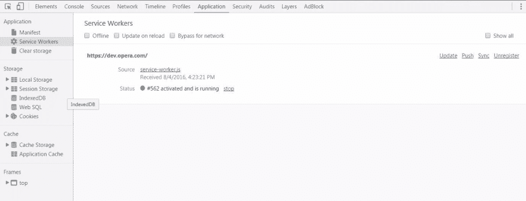
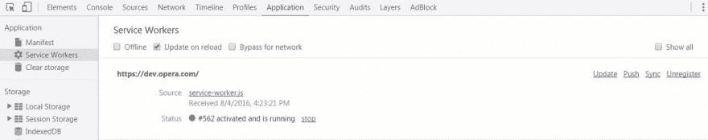
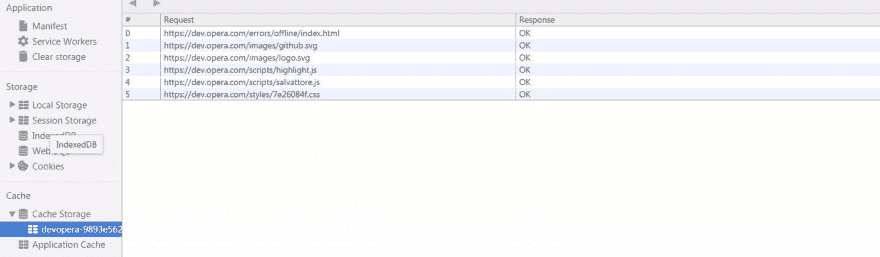

# 服务人员入门

> 原文:[https://dev . to/tarun _ garg 2/getting-started-with-service-worker](https://dev.to/tarun_garg2/getting-started-with-service-worker)

## 什么是服务人员？

服务工作者可以被认为是在[共享工作者](https://developer.mozilla.org/en/docs/Web/API/SharedWorker)的上下文中运行的 JavaScript 文件。它充当浏览器和网络之间的代理。

服务人员帮助开发人员构建`offline first` web 应用程序，我们所说的离线优先是指，即使在这些情况下用户的设备上没有/很慢的互联网连接，我们也能够为用户提供我们的应用程序或其他东西，这与离线工作的本地应用程序相当或更好。

服务工作者运行在不同于普通 JavaScript 线程的线程中，因此服务工作者线程和主线程之间的所有通信都通过经由 [`postMessage`](https://html.spec.whatwg.org/multipage/workers.html#dom-worker-postmessage) 发送的消息进行。一个很少被提及的特性是它是完全异步的，所有同步的 web APIs 都不适合它。

服务人员位于我们的浏览器和网络之间，因此为了防止我们的 web 应用程序受到中间人攻击，服务人员只在 HTTPS 上运行(localhost 是个例外)。

服务人员大量使用现代网络结构，如下所示:

*   [承诺 API](http://www.html5rocks.com/en/tutorials/es6/promises/)
*   [获取 API](https://developers.google.com/web/updates/2015/03/introduction-to-fetch)
*   [缓存 API](https://developer.mozilla.org/en-US/docs/Web/API/Cache)
*   Chrome 开发工具特性

建议您先熟悉以上 API，然后再继续。

服务工人 API 仍然是 web 中的一个新特性，所以只有少数浏览器支持(或部分支持)，你可以在这里检查兼容性。

## 登记

为了能够在我们的应用程序中使用服务人员，我们必须首先注册它。注册服务人员既简单又方便。

首先，我们将检测我们的浏览器是否支持服务人员。

```
// check if Service Worker support exists in browser or not
if( 'serviceWorker' in navigator ) {
    //Service Worker support exists
} else {
    //still not supported
} 
```

既然我们已经检测到浏览器中是否存在服务人员支持，那么是时候注册它了。

下面的代码注册了一个存在于`service-worker.js`文件中的服务工作者，该文件具有我们整个应用程序的范围。

```
// check if Sevice Worker support exist in browser or not
if( 'serviceWorker' in navigator ) {
    navigator.serviceWorker  
                       .register( 'service-worker.js' , { scope : ' ' } )  
                       .then( function( ) { 
                           console.log('Congratulations!!Service Worker Registered');
                       })
                       .catch( function( err) {
                           console.log(`Aagh! Some kind of Error :- ${err}`);
                       });
} else {
    //still not supported
} 
```

在上面的代码片段中

*   我们正在检测我们的浏览器中是否存在服务人员支持。
*   如果支持存在，我们注册一个名为`service-worker.js`的文件(你可以给你的文件起任何名字)。注意，理想情况下`service-worker.js`文件应该在根目录下。如果我们的服务人员文件存在于其他目录中，比如`directory/service-worker.js`，那么服务人员只有在从`directory/`获取数据时才会采取行动。
*   我们将一个对象作为第二个参数传递给`register()`函数，该函数的范围键的值为“”，这意味着我们希望在当前目录的范围内注册服务工作器。您还可以手动将服务工作器范围设置为您选择的任何目录。
*   最后，由于整个服务人员是“基于承诺的”，我们正在捕捉服务人员是否注册。

*如果您没有将任何东西作为第二个参数传递给`register()`函数，那么服务工作者将根据服务工作者文件所在的目录进行注册。*

现在服务人员的注册已经完成。

让我们再深入一点。正如我们之前讨论的，服务工作者使用`messages/events`与主线程通信。每当我们进行网络获取时，网络请求都会通过服务工作者并触发一个`fetch event`。

现在在我们的`service-worker.js`中，让我们为这个事件添加一个监听器。

```
self.addEventListener( "fetch" , function (event) {
    //fetch request as specified by event object 
    console.log(event.request); //Note that Request and Response are also objects 
}); 
```

上面的代码并不花哨。它只是将`Request object`注销到浏览器控制台。

一旦我们有了请求对象，我们就可以按照我们想要的方式拦截这个请求。我们以后再做这些英雄的事。

似乎很容易，直到现在？好了，让我们开始最难，但也是最重要的部分。

## 服务工作者生命周期

如果我们尝试在浏览器中运行上述示例，并查看控制台，我们会看到以下消息

`Congratulations!! Service Worker Registered`

但是这条消息只针对**第一次加载**时，当我们**再次刷新页面时，我们会在控制台**中打印所有请求对象。

这种行为是因为当我们第一次加载页面时，没有注册服务工作者，所以不能触发`fetch`事件的监听器，所以最初，我们只能看到服务工作者被注册。

现在，当我们刷新页面时，产生了一个新的 web 客户端，它发现已经有一个服务工作者针对该域进行了注册，因此`fetch`事件监听器开始动作，我们可以看到在浏览器控制台中打印的请求对象。

现在，如果您试图更改您的`fetch`事件监听器中的某些内容，让我们假设我们更改为:-

```
self.addEventListener( "fetch" , function (event) {
    //fetch request from event object 
    console.log("Resource requested is :- ",event.request.url);
}); 
```

现在，如果我们刷新页面，我们在控制台中看不到任何变化。**似乎有些怪异？？？**

这种罪恶的罪魁祸首是服务工作者的生命周期。

服务人员的生命周期由以下几个阶段组成:

*   安装
*   使活动
*   等待
*   终止/冗余

让我们分析一下上面的场景，我们改变了一些东西，但是当我们刷新页面时，这些东西没有被反映出来。

在这种情况下，我们已经有一个旧的服务人员注册了处于`active`状态的页面，当我们刷新页面时，browser 看到服务人员文件已经更新。它`installs`新的服务人员，但保留这个新的在`waiting state`，因为旧的还没有`terminated`。旧的服务只能通过关闭所有引用它的页面或导航到该服务工作者无法控制的其他域来终止。如果我们通过上述方法终止我们的服务人员，并再次转到我们的页面，我们应该会看到实际的变化，因为现在没有活动页面引用旧的服务人员，所以新页面变成了`active`，旧页面变成了`redundant`。一旦新的服务工作者取得控制权，它将触发一个`activate`事件。

现在，作为开发人员，我们如何知道我们的服务人员处于哪种状态，以及我们如何手动改变生命周期以使我们的开发变得容易。

Chrome 开发工具来拯救了。

在 chrome 开发工具中[可以通过按 F12 或 CTRL+SHIFT+I 或 Ctrl+Shift+J 打开]。转到`Application`面板，我们可以看到一个写为`Service Workers`的独立资源。

在这里，我们可以看到我们处于哪个状态。我们还可以手动取消注册，更新和停止任何服务工作者，我们还可以看到一个是什么时候收到的。

[T2】](https://res.cloudinary.com/practicaldev/image/fetch/s--8v7kXESq--/c_limit%2Cf_auto%2Cfl_progressive%2Cq_auto%2Cw_880/https://cdn.scotch.io/1925/deRKdGFzScmthGVyv8h7_Capture.JPG)

还有更多。

假设我们作为开发人员希望，每次我们在页面中重新加载/更改某些内容时，新的服务人员应该是活动的，而不是进入等待状态，我们也可以这样做。但是请记住，它只对开发者的网站有影响，对于消费者的网站，我们将在以后讨论这个问题；).

要做到以上所提到的，只需勾选与重新加载时更新对应的复选框。

[T2】](https://res.cloudinary.com/practicaldev/image/fetch/s--kPl_M5LQ--/c_limit%2Cf_auto%2Cfl_progressive%2Cq_auto%2Cw_880/https://cdn.scotch.io/1925/RSHNC1ykQcCJTDDip8d3_Capture.JPG)

您还可以做更多的事情，如离线测试，绕过网络，为服务人员使用推送和同步。总而言之，现在有很好的工具支持可供服务人员使用，而且相当稳定。

* * *

## 咱们码吧

我们现在对服务人员的所有知识都有了基本的了解。让我们去看看如何在我们的应用程序中使用它们。

在动手编写代码之前，我们先回忆一下到目前为止所学的内容。

*   服务人员充当我们的浏览器和网络之间的代理。
*   这些本质上是在不同的上下文中运行的工作线程，并且定义了作用域。
*   它们在 HTTPS 上运行，唯一的例外是 localhost。
*   新的服务工作者保持等待状态，直到引用旧的服务工作者的所有页面都没有被关闭。

现在，为了用服务工作者 API 编程，我们将建立一个具有如下所示文件夹结构的项目:

```
- [styles/](https://github.com/tarungarg546/service-worker-intro/tree/master/styles)
- [fonts/](https://github.com/tarungarg546/service-worker-intro/tree/master/fonts)
- [scripts/](https://github.com/tarungarg546/service-worker-intro/tree/master/scripts)
- [index.html](https://github.com/tarungarg546/service-worker-intro/blob/master/index.html)
- [service-worker.js](https://github.com/tarungarg546/service-worker-intro/blob/master/service-worker.js) 
```

其中`styles/`包含通常的样式表，`fonts/`包含通常的字体，`scripts/contains`通常的 JavaScript 文件，`service-worker.js`是我们将处理服务人员的文件。

出于样式化的目的，我们将在这里使用 bootstrap，因为在本教程中，我们主要关注的是使用和部署 Service Worker，而不是样式。

在[index.html](https://github.com/tarungarg546/service-worker-intro/blob/master/index.html)中复制以下内容:

```
<!DOCTYPE html>
<html>
<head>
    <!--Set Meta tags-->
    <meta charset="UTF-8">
    <meta name="description" content="Service Worker introductory tutorial">
    <meta name="author" content="Tarun Garg">
    <meta name="viewport" content="width=device-width, initial-scale=1.0">
    <title>Service Workers intro</title>
    <!-- Compiled and minified CSS -->
    <link rel="stylesheet" href="styles/bootstrap.min.css">
    <script type="text/javascript">
        //detect if browser supports Service Worker
        if('serviceWorker' in navigator) {  
            //browser supports now register it
            navigator.serviceWorker  
                   .register('service-worker.js') //Note that we have not passed scope object here now by default it will pick root scope 
                   .then(function() { 
                        console.log('Service Worker Registered'); 
                    })
                    .catch(function(err) {
                        console.error(err);
                    })
        } else {
            console.log("Ahh! Your browser does not supports serviceWorker");
        }
    </script>
</head>
<body>
    <div class="container">
        Hello world!
    </div>
</body>
</html> 
```

在上面的代码片段中，我们注册了一个名为`service-worker.js`的文件，它包含了所有的服务工作者逻辑。

现在，当我们第一次提供这个服务时，我们将在浏览器控制台中看到`Service Worker Registered`消息。

现在在我们[的 service-worker.js](https://github.com/tarungarg546/service-worker-intro/blob/b5191cdafda1e44e887e78b5e002101d0ffa4782/service-worker.js) 。
让我们为`fetch`和`install`事件添加代码。

```
var log = console.log.bind(console);//bind our console to a variable
//Add event listener for install
self.addEventListener("install", function(event) {
    log('[ServiceWorker] Installed!');
});
//Add event listener for fetch
self.addEventListener("fetch", function(event) {
    log('[ServiceWorker] Requested url :-', event.request.url);
}); 
```

如果我们刷新浏览器，进入 Chrome 开发工具的`Application`面板，我们会看到一个服务人员处于活动状态，另一个处于等待状态。

我们现在可以理解，为什么它处于等待状态。要将其置于当前状态，请关闭并重新打开此选项卡，或者转到不受此服务人员控制的任何页面并返回。您将看到正确的控制台消息和正在活动的服务人员。

到目前为止，我们很少使用服务工作者 API，现在是时候将它与其他 API(如`Cache API`)集成了。

因为，缓存 API 是请求和响应对象的**键值存储，并且可以访问窗口范围和服务工作者范围。**

因为注册后服务人员生命周期的下一步是`installing`。因此，我们将在服务工作器的事件处理程序中缓存所有资源。当我们获取时，我们将查看请求的资源是否存在于缓存中，如果存在，则返回那些缓存的文件，否则从网络获取。

编辑你的 [service-worker.js](https://github.com/tarungarg546/service-worker-intro/blob/ba2f511e50ce7e60bba8e20b79c2e5a167ab9bcb/service-worker.js) 如下:-

```
var log = console.log.bind(console);//bind our console to a variable
var version = "0.0.1";
var cacheName = "sw-demo";
var cache = cacheName + "-" + version;
var filesToCache = [
                    'scripts/bootstrap.min.js',
                    'styles/bootstrap.min.css',
                    'index.html',
                    "/",//Note that this is different from below 
                    "/?app=true"//This is different from above in request object's terminology
                 ];

//Add event listener for install
self.addEventListener("install", function(event) {
    log('[ServiceWorker] Installing....');

    //service-worker will be in installing state till event.waitUntil completes
    event.waitUntil(caches
                        .open(cache)//open this cache from caches and it will return a Promise
                        .then(function(cache) { //catch that promise
                            log('[ServiceWorker] Caching files');
                            cache.addAll(filesToCache);//add all required files to cache it also returns a Promise
                        })
                    ); 
});

//Add event listener for fetch
self.addEventListener("fetch", function(event) {
    //note that event.request.URL gives URL of the request so you could also intercept request and send response based on your URL
    //e.g. you make want to send gif if anything in jpeg form is requested.
    event.respondWith(
    //it either expects a Response object as a parameter or a promise that resolves to a Response object
                        caches.match(event.request)//If there is a match in the cache of this request object
                            .then(function(response) {
                                if(response) {
                                    log("Fulfilling "+event.request.url+" from cache.");
                                    //returning response object
                                    return response;
                                } else {
                                    log(event.request.url+" not found in cache fetching from network.");
                                    //return promise that resolves to Response object
                                    return fetch(event.request);
                                }
                            })
                    );
}); 
```

在上面的代码中`install`和`fetch`看起来很简单。重要的是`fileToCache`数组和`cache`，T3 只是一个变量，是`version`和`cacheName`的组合。

我们维护版本号，因为当我们更新出现在`fileToCache`数组中的任何文件时，服务工作器不会自动选取这一更改，它选取的唯一更改是`service-worker.js`文件本身的更改。因此，在这些情况下，只需更改版本就很容易了，服务工作人员会看到自己的代码发生了变化，因此它会安装新的服务工作人员，在安装新服务工作人员的过程中，它会缓存新的资源，并将其放入具有单独版本的新缓存中。你可以在 chrome 开发工具中查看缓存，如下所示。

[T2】](https://res.cloudinary.com/practicaldev/image/fetch/s--l8hY9301--/c_limit%2Cf_auto%2Cfl_progressive%2Cq_auto%2Cw_880/https://cdn.scotch.io/1925/PuJCdMe3THutwf8XgNM2_Capture.JPG)

现在，如果我们更改我们的版本，我们的服务人员将接受该更改，新的服务人员将经历相同的注册、安装和等待周期，因为旧的服务人员尚未被终止。由于安装了新的服务工作者，新的高速缓存将被创建而不影响旧版本。这就是版本控制的目的。只需轻轻一击，你就可以做所有这些事情，同时不会破坏旧的缓存。

当未来的新服务工作者变得活跃时，我们理想地想要的是删除旧的缓存，因为不再需要它了。为此，我们将利用`activate`事件。

用这个更新你的[service-worker . js【T1:-](https://github.com/tarungarg546/service-worker-intro/blob/da417281a4b36e70c2b2d0c0d6481a6f0600e4e3/service-worker.js)

```
var log = console.log.bind(console);//bind our console to a variable
var version = "0.0.2";
var cacheName = "sw-demo";
var cache = cacheName + "-" + version;
var filesToCache = [
                    'scripts/bootstrap.min.js',
                    'styles/bootstrap.min.css',
                    'index.html',
                    "/",//Note that this is different from below 
                    "/?app=true"//This is different from above in request object's terminology
                 ];

//Add event listener for install
self.addEventListener("install", function(event) {
    log('[ServiceWorker] Installing....');
    event.waitUntil(caches
                        .open(cache)//open this cache from caches and it will return a Promise
                        .then(function(cache) { //catch that promise
                            log('[ServiceWorker] Caching files');
                            cache.addAll(filesToCache);//add all required files to cache it also returns a Promise
                        })
                    ); 
});

//Add event listener for fetch
self.addEventListener("fetch", function(event) {
    //note that event.request.url gives URL of the request so you could also intercept the request and send a response based on your URL
    //e.g. you make want to send gif if anything in jpeg form is requested.
    event.respondWith(//it either takes a Response object as a parameter or a promise that resolves to a Response object
                        caches.match(event.request)//If there is a match in the cache of this request object
                            .then(function(response) {
                                if(response) {
                                    log("Fulfilling "+event.request.url+" from cache.");
                                    //returning response object
                                    return response;
                                } else {
                                    log(event.request.url+" not found in cache fetching from network.");
                                    //return promise that resolves to Response object
                                    return fetch(event.request);
                                }
                            })
                    );
});

self.addEventListener('activate', function(event) {
  log('[ServiceWorker] Activate');
  event.waitUntil(
                    caches.keys()//it will return all the keys in the cache as an array
                    .then(function(keyList) {
                            //run everything in parallel using Promise.all()
                            Promise.all(keyList.map(function(key) {
                                    if (key !== cacheName) {
                                        log('[ServiceWorker] Removing old cache ', key);
                                        //if key doesn`t matches with present key
                                        return caches.delete(key);
                                    }
                                })
                            );
                        })
                );
}); 
```

在上面的代码中，我们从缓存中获取所有的键，然后检查一个键是否不等于当前的缓存名，然后删除它。

现在，如果您尝试离线并重新加载页面，您仍然会看到您的 web 应用程序像在线一样工作，因为当您发出网络请求时，它会被拦截并从缓存中完成。这样，当用户的网站上没有互联网或互联网速度很慢时，你可以给你的用户一个舒缓的 web 应用程序体验。

这只是一个小教程，让你开始与服务人员。还有很多，但对于“开始”，这应该是一个补品。

希望你喜欢这篇文章:)。

* * *

## 资源

*   [离线网络应用](https://www.udacity.com/course/offline-web-applications--ud899)
*   [服务工人的一场革命](https://ponyfoo.com/articles/serviceworker-revolution)
*   [离线食谱](https://jakearchibald.com/2014/offline-cookbook/)
*   [谷歌代码实验室](https://codelabs.developers.google.com/?cat=Web)
*   [服务人员介绍](http://www.html5rocks.com/en/tutorials/service-worker/introduction/)