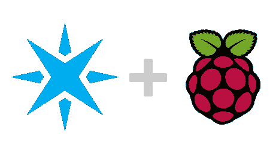
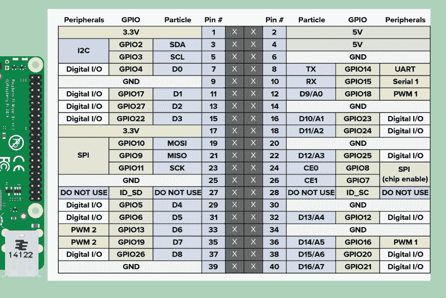
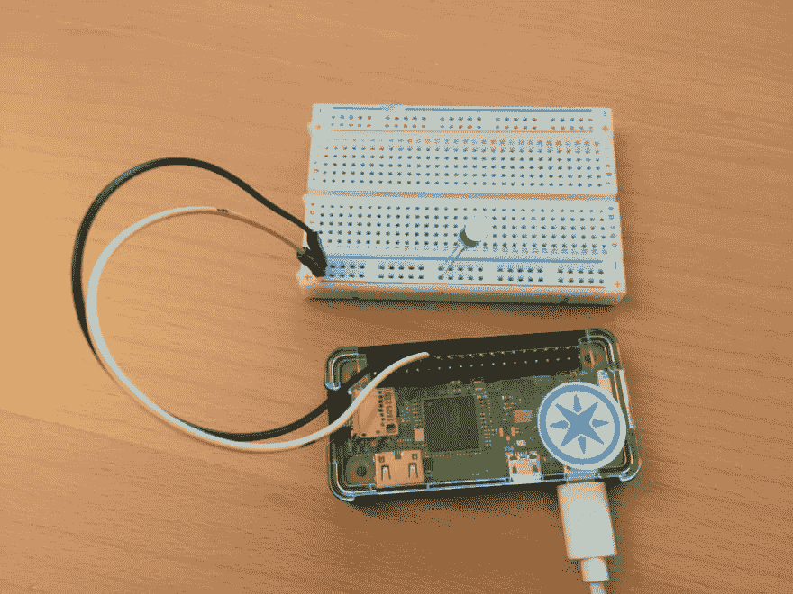

# 如何在树莓 Pi 上运行粒子

> 原文：<https://dev.to/nrobinson2000/how-to-run-particle-on-raspberry-pi>

> **使用最流行的单板电脑，搭配最流行的物联网工具。**

<center>

</center>

# 简介

2016 年 10 月，Particle 宣布将在其物联网云平台上添加对 Raspberry Pi 的支持。我是第一个社区焦点小组的成员，也是他们的 alpha 测试者之一。既然 Particle 已经公开宣布支持 Raspberry Pi，任何人都可以报名参加[公测](https://www.particle.io/products/development-tools/raspberry-pi-on-particle)。

Raspberry Pi 上的粒子允许您将粒子云的功能带到 Raspberry Pi 的完整功能，并创建以前无法轻松创建的惊人项目。

借助 Raspberry Pi 上的 Particle，您可以将相同的 C++代码用于 Particle 的其他设备，以创建强大的解决方案。

Raspberry Pi 上的 Particle 提供了对 Raspberry Pi 上 40 个 IO 引脚的完全访问，允许您与您最喜爱的电子设备进行数字和模拟交互。此外，Raspberry Pi 上的 Particle 允许您创建函数来调用 Raspberry Pi 上存在的几乎任何 Bash 命令或脚本，从而促进固件内部的动态、灵活的交互。

目前，树莓 Pi 上的粒子针对[树莓 Pi 3](https://www.raspberrypi.org/products/raspberry-pi-3-model-b/) 、[树莓 Pi 2](https://www.raspberrypi.org/products/raspberry-pi-2-model-b/) 、[树莓 Pi Zero](https://www.raspberrypi.org/products/pi-zero/) 、[树莓 Pi B+](https://www.raspberrypi.org/products/model-b-plus/) 以及新发布的[树莓 Pi Zero Wireless](https://www.raspberrypi.org/products/pi-zero-wireless/) 进行了优化。

* * *

# 基本设置

> 阅读下面的完整设置。

第一步是确保您的 Raspberry Pi 更新到 Raspbian Jessie 的最新版本，并连接到您的网络。使用以下命令更新您的 Pi 软件:

```
$ sudo apt update && sudo apt upgrade 
```

接下来，一旦你被粒子测试版的[树莓 Pi 接受，在你的树莓 Pi 上运行以下命令来安装](https://www.particle.io/products/development-tools/raspberry-pi-on-particle) [`particle-agent`](https://github.com/spark/particle-agent) :

```
$ bash <( curl -sL https://particle.io/install-pi ) 
```

在安装 [`particle-agent`](https://github.com/spark/particle-agent) 的过程中，您将被要求使用您的粒子凭证登录，以便将您的 Raspberry Pi 归入您的帐户。

一旦安装完成，你就可以用 Particle 的工具来使用你的 Raspberry Pi 了。您可以使用 [Web IDE](https://build.particle.io) 、[粒子开发](https://www.particle.io/products/development-tools/particle-desktop-ide)、[粒子命令行](https://www.particle.io/products/development-tools/particle-command-line-interface)或 [po-util](https://nrobinson2000.github.io/po-util/) 在本地构建并刷新固件。

* * *

# 用粒子运行 bash 命令

Raspberry Pi 上的 Particle 支持将 bash 命令和脚本作为 Linux 进程从固件内部运行。输入可以由参数和标准输入提供，输出可以被捕获以在固件中使用。

下面是一个检索 Raspberry Pi 内部 CPU 温度的示例:

```
# include "Particle.h" 
int getTempC(String args)
{
  Process proc = Process::run("vcgencmd measure_temp");
  proc.wait(); // The output is temp=43.5'C, so read past the = and parse the number
  proc.out().find("=");
  float cpuTemp = proc.out().parseFloat();
  Particle.publish("cpu-temp", String(cpuTemp));
  return 0;
}

void setup()
{
  Particle.function("getTempC", getTempC);
}

void loop()
{
  // Nothing in the loop
} 
```

* * *

## 输入输出

使用树莓 Pi 上的粒子，您可以控制树莓 Pi 上的众多针。其中许多是数字输入和输出，有几个能够执行 I2C、SPI 和 UART 等协议。一些引脚能够通过 PWM(脉宽调制)进行模拟写入。Raspberry Pi 本身没有模拟输入功能，但可以使用 ADC 来获取模拟读数。

<center>

</center>

* * *

## 树莓派零无线全设置

2017 年 3 月 9 日我的树莓派零度无线到货了。经过一个小时的设置，我很高兴修修补补了。安装很成功，Particle 在我的 Pi Zero W 上运行良好，我可以做很多在我的 Pi 3 上可以做的事情。

<center>

</center>

> #### There are several steps to set the zero point of Pi. These instructions also apply to Pi 3\.

### 第一部分:

1.  **打开工具箱:**Pi Zero W 和各种配件都装在单独的小塑料袋里。

2.  **下载 Raspbian:** 我选择使用 [Raspbian Jessie Lite](https://www.raspberrypi.org/downloads/raspbian/) 。

3.  **准备用于焊接的 Pi Zero W:**我收集了 Pi Zero W、40 引脚接头、试验板和外壳，并将其带到我的车间。

4.  **焊接 Pi 零点:**我通过将接头和 Pi 放在试验板中并焊接，将接头焊接到 Pi 零点 W 上。(我是一个完美主义者，所以我花了一段时间才做到完美。)

5.  **Flash Raspbian 到 Micro SD 卡:**我先格式化了 8GB 的卡，然后用 Linux Mint 里的 u 盘 Writer 把 Raspbian Jessie Lite 写到 SD 卡里。

6.  **配置 Wi-Fi，启用 SSH，在 Pi Zero W 上更改主机名:**

*   为了启用 Wi-Fi，我简单地在 SD 卡上的`etc/wpa_supplicant/wpa_supplicant.conf`中创建了一个条目。

```
network={
    ssid="MyWiFiNetwork"
    psk="the_password"
    key_mgmt=WPA-PSK
} 
```

*   为了在我的 Pi Zero W 上启用 SSH(安全 Shell ),我在 SD 卡的根目录下创建了一个名为`ssh`的文件。

*   为了将主机名更改为比`raspberrypi`更有用的名称，我必须对以下文件进行如下更改:

*   在`etc/hostname`我把台词改成了`pizero`。

*   在`etc/hosts`中，我把最后一行的`raspberrypi`改成了`pizero`。

### 第二部分:

1.  **启动 Raspberry Pi Zero Wireless 并使用 SSH 连接:**使用 Linux 或 macOS 上的终端我通过运行:`ssh pi@pizero.local`连接到我的 Pi Zero W。

    *如果您在上一节中选择设置不同的主机名，您的命令会有所不同。*

2.  **可选——更改`pi`用户的密码:**你可以用`passwd`将`raspberry`的密码更改为更安全的密码。

3.  **检查更新:**运行以下命令检查并安装任何可用的更新:
    `sudo apt update && sudo apt upgrade`

4.  **安装 [`particle-agent`](https://github.com/spark/particle-agent) :** 要在 Raspberry Pi 上安装粒子，必须运行以下命令:
    `bash <( curl -sL https://particle.io/install-pi )`

安装完成后，在您自己的终端(不是您的 Pi Zero W)中尝试以下操作来测试您的 Pi:

```
# Here, my device is named `pizero`, but yours can be different

$ particle call pizero digitalwrite D7,LOW # This turns off the onboard lED

$ particle call pizero digitalwrite D7,LOW # This turns it on 
```

现在你应该能够使用 [Web IDE](https://build.particle.io) 、[粒子开发](https://www.particle.io/products/development-tools/particle-desktop-ide)、[粒子命令行界面](https://www.particle.io/products/development-tools/particle-command-line-interface)或 [po-util](https://nrobinson2000.github.io/po-util/) 在本地构建，为 Raspberry Pi 编写你自己的代码。

* * *

## 更多信息

Particle 正在树莓 Pi 上全面记录 Particle。他们的官方文档提供了大量的信息、参考资料和教程。[他们的树莓派安装指南非常全面。](https://docs.particle.io/guide/getting-started/start/raspberry-pi/)

对我来说，文档中最有用的部分是[固件参考](https://docs.particle.io/reference/firmware/raspberry-pi/)。

此外，[粒子社区](https://community.particle.io)随时可以帮助解决任何问题。