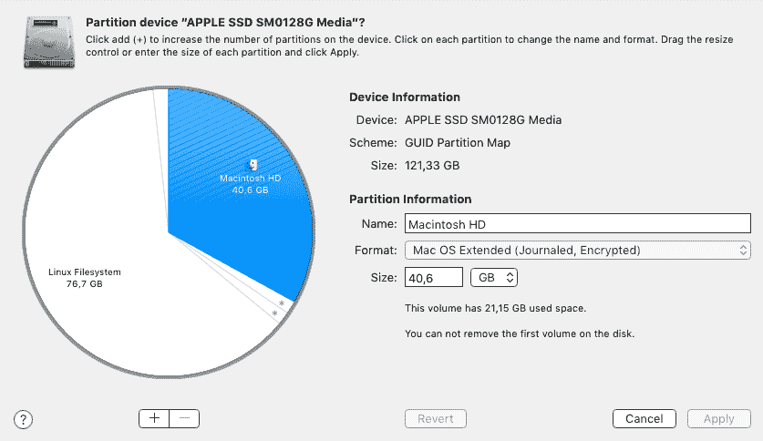
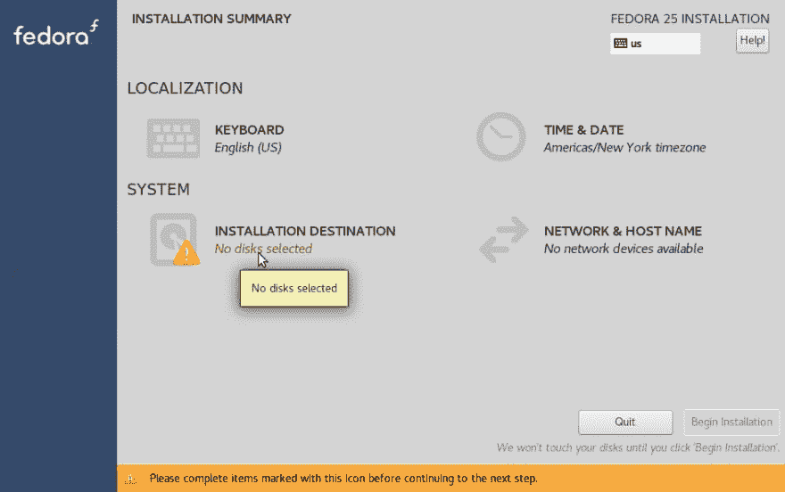
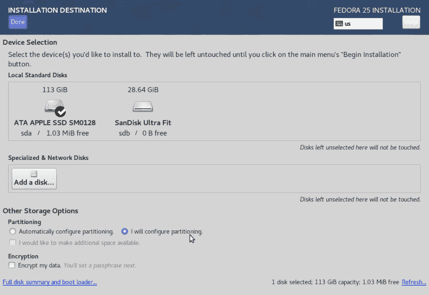
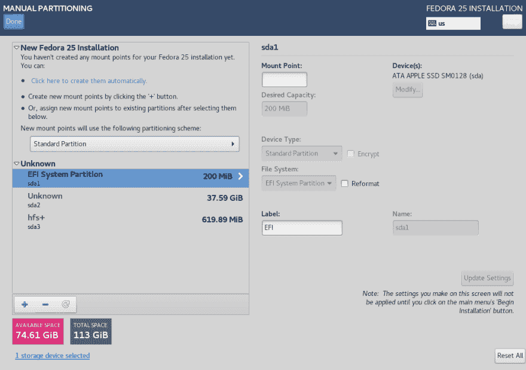
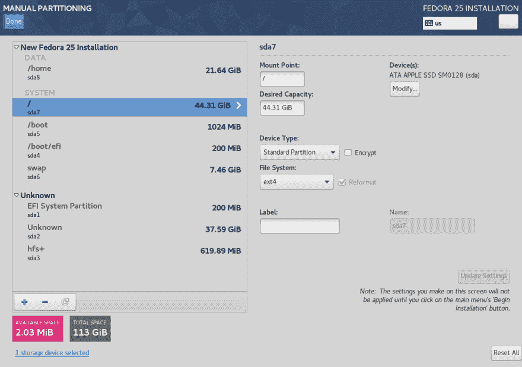
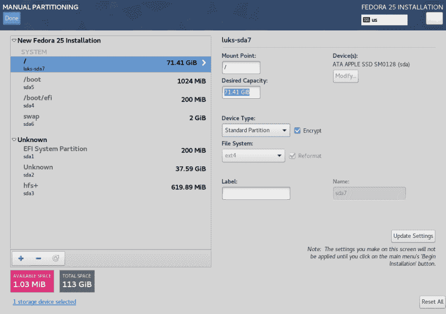

# 在 Macbook Air 上安装 Fedora

> 原文:[https://dev.to/dzeban/installing-fedora-on-macbook-air-2i2l](https://dev.to/dzeban/installing-fedora-on-macbook-air-2i2l)

## 前言

我从来不是笔记本电脑的粉丝，我是说 2000 年代的笔记本电脑，体积大，重量重，难以升级。最后一点对我来说尤其重要，因为在 2000 年代，你必须升级你的工作站，增加更多的内存，更多的硬盘和更新的 CPU。您遵循英特尔的滴答时间表，选择了 Tock，并获得了性能提升(根据基准测试)。

但最近，我突然意识到，我有一台使用了 4 年的英特尔 i3 CPU 和*它很好*。我觉得没有升级的必要。部分原因是因为我很久没用窗户了。在我的 Fedora 上，我通常坐在没有桌面环境的终端上，比如 Gnome 或 KDE，在 Vim 中编辑文本，这就是我所需要的。我的机器上最重的东西——浏览器——也运行良好，我可以播放 1080p 的 youtube 视频，我可以加载[臃肿的网站](http://idlewords.com/talks/website_obesity.htm)。

让我免于升级的另一个原因是，硬件本身不是纵向改进，而是横向改进。简单地切换到更新的 CPU 不会让你的电脑生活充满魔力和独角兽——只是[比较一下 Haswell 和 Kaby Lake 的 CPU](https://ark.intel.com/compare/97128,80806)。唯一增加了时钟频率并可能为您带来一些性能的是总线速度，从 5 GT/s 增加到 8 GT/s。所有其他事情都是关于在您的 CPU 上附加更多的东西-更多的内存，更多的 I/O 设备。有趣的是，2014 年 3 岁的 Haswell 和崭新闪亮的 Kaby Lake 价格一样，都是 310 美元。我并不是说 CPU 的进步已经停止，有一个服务器市场，有一个游戏市场和 HPC 市场需要并感受到所有这些发展。我是说，对于像台式机这样的消费类机器，没有必要经常升级。

所以现在很少需要升级你的电脑，最近的笔记本电脑很好，很轻，电池至少可以用 8 个小时。因此，当我有机会在工作中得到一台笔记本电脑时，我选择了它。问题是这是一台 Macbook Air。

我是一个 Linux 的家伙，所以我必须在这个东西上安装 Fedora。我不在乎你们抱怨“…但是 macOS 更好，更友好，更好，等等…”不不是的。嗯，对我来说是**。我有一个简单有效的设置，非常适合我，看起来很棒，而且不会干扰我的工作。这并不意味着我没有尝试过——我尝试过，但在 macOS 中工作而不平铺 WM，奇怪的键盘快捷键(你不能设置 Alt-Shift 来切换键盘布局)和虚假的用户友好性(我谅你也不敢告诉我如何在 Finder 中显示隐藏文件)让我狗慢。**

 **所以我决定在 Macbook Air 上安装 Fedora，因为有点棘手，所以我写了这个指南。最终，我们将拥有一台具备以下特性的笔记本电脑:

*   双启动 macOS 和 Fedora
*   工作多媒体键
*   工作亮度控制，包括键盘亮度
*   笔记本电脑工作盖关闭/打开

## 制剂

因为我们将离开 macOS，所以我们必须准备 Macbook。由于 Linux 中 UEFI 的进步，我们不需要改装/改进——现代发行版安装起来轻而易举。所以我们唯一要做的就是收缩 macOS 分区，准备 u 盘。

### 为 Linux 制作分区

我的 Macbook 只有 128 GB 的 SSD，我决定让 macOS 留在上面，所以我需要对驱动器进行分区，为 macOS 留出一些可用空间。我没有任何使用 macOS 的经验，认为即使我会使用 40 GBs 也足够了。

为了对驱动器进行分区，我使用了“磁盘工具”。只需按“+”按钮，并为新分区设置所需的大小。让“格式”保持默认(“Mac OS 扩展(日志)”)，因为无论如何你都要用 ext4 格式化它。然后点击“应用”,就这样。

这里是我的，虽然已经是我装了 Fedora 之后了。

[T2】](https://res.cloudinary.com/practicaldev/image/fetch/s--JiS9M1cZ--/c_limit%2Cf_auto%2Cfl_progressive%2Cq_auto%2Cw_880/https://alex.dzyoba.com/img/macbook-disk-partitions.png)

### 创建 u 盘

首先，你不能使用 Fedora netinst image，因为 Macbook Air 中安装的 Broadcom WiFi 卡没有可用的开源驱动程序。所以要像 MATE 或者 Gnome 一样选择不需要网络连接的完整镜像。

现在，你必须用 Fedora 创建一个 u 盘。有一个叫做“Fedora Media Writer”的工具可以在 macOS 上制作引导棒，但不幸的是，我无法用它引导。似乎在 macOS 上重新分区后，它会立即挂载新的分区并接触它，使它无法安装。

所以我在 Linux 上用简单的
创建了 u 盘

```
$ dd if=Fedora-Workstation-netinst-x86_64-25-1.3.iso of=/dev/sdd bs=1M oflag=direct 
```

<svg width="20px" height="20px" viewBox="0 0 24 24" class="highlight-action crayons-icon highlight-action--fullscreen-on"><title>Enter fullscreen mode</title></svg> <svg width="20px" height="20px" viewBox="0 0 24 24" class="highlight-action crayons-icon highlight-action--fullscreen-off"><title>Exit fullscreen mode</title></svg>

现在是安装部分。

## Fedora 安装

### 开机插入 u 盘

将 USB 插入 Macbook，按住“alt”键并按住电源按钮，直到您看到带有 Fedora 的引导选择菜单。

### 最重要！Linux 分区和安装目标

从 USB 启动后，你会看到通常的 Anaconda 安装程序。首先也是最重要的，我们必须配置安装目的地。

[T2】](https://res.cloudinary.com/practicaldev/image/fetch/s--CSm1zgWM--/c_limit%2Cf_auto%2Cfl_progressive%2Cq_auto%2Cw_880/https://alex.dzyoba.com/img/macbook-air-installer-enter.png)

进入此菜单，选择“ATA APPLE SSD”，然后选择“我将配置分区”，并单击窗口顶部的“完成”。

[T2】](https://res.cloudinary.com/practicaldev/image/fetch/s--WYxpbbHO--/c_limit%2Cf_auto%2Cfl_progressive%2Cq_auto%2Cw_880/https://alex.dzyoba.com/img/macbook-air-installation-destination.png)

展开“未知”小部件，找到“hfs+”类型的 80 GBs 或 74 GiBs 分区，并删除它。现在，您将在底部的粉色矩形中看到 74 GiBs 的可用空间。

[T2】](https://res.cloudinary.com/practicaldev/image/fetch/s--tEhB-oi4--/c_limit%2Cf_auto%2Cfl_progressive%2Cq_auto%2Cw_880/https://alex.dzyoba.com/img/macbook-air-fedora-partitions-empty.png)

现在从“新 Fedora 25 安装”窗口小部件的下拉菜单中选择“标准分区”方案，然后单击链接“单击此处自动创建它们”。

[T2】](https://res.cloudinary.com/practicaldev/image/fetch/s--j1apDI_W--/c_limit%2Cf_auto%2Cfl_progressive%2Cq_auto%2Cw_880/https://alex.dzyoba.com/img/macbook-air-fedora-partitions-auto.png)

它将创建单独的/和/home 分区以及一个巨大的 8gb 交换空间。你可以根据自己的喜好调整自动创建的方案，只是**不要碰“/boot/efi”分区**否则它不会启动。我已经将交换空间大小更改为 2gb，删除了/home 和/ partition，并手动添加/ partition 以跨越几乎 80gb 的所有可用空间。

[T2】](https://res.cloudinary.com/practicaldev/image/fetch/s--hB0VMlDu--/c_limit%2Cf_auto%2Cfl_progressive%2Cq_auto%2Cw_880/https://alex.dzyoba.com/img/macbook-air-fedora-partitions-my.png)

此外，我为我的分区设置了 LUKS 加密，因为它毕竟是一台笔记本电脑，如果我丢失了它，你就无法通过直接连接 SSD 驱动器来窃取我的东西。此外，LUKS 加密不会造成任何性能损失。

然后点击“完成”并确认你的磁盘布局。

### 配置安装

现在，当您配置了分区之后，只需用 Anaconda 设置您的安装即可。

为了让硬件工作得更好，比如亮度控制和盖子关闭/打开，在我的例子中安装一些 DE like MATE。DEs 有不错的 udev 规则和硬件配置。它还设置了显示管理器(要求登录和密码的那个)和 X 服务器。令人惊讶的是，一切都是开箱即用的。大约 5 年前，让麦克风和亮度正常工作是一件痛苦的事情，现在你不用担心了。向 distro 和 DE guys 致敬！

你可以继续使用 MATE，但我会在 MATE 上安装和配置 i3 窗口管理器。

### 等到安装完成

然后通过按住“alt”键重新启动你的新 Fedora。

## 安装 WiFi 驱动程序

Macbook Air 有蹩脚的专有 Broadcom WiFi 芯片。为了让它工作，你需要一个替代网络。你可以使用 USB 转以太网电缆，或者像我这样，你可以将你的 Android 手机用作调制解调器。不，说真的，只要连接你的 Android 手机，选择调制解调器模式，你会立即看到网络连接。

现在，当您有网络时，要安装 Broadcom WiFi 驱动程序，请打开根终端并执行以下操作:

```
# Enable RPM fusion repo
dnf install https://download1.rpmfusion.org/free/fedora/rpmfusion-free-release-$(rpm -E %fedora).noarch.rpm https://download1.rpmfusion.org/nonfree/fedora/rpmfusion-nonfree-release-$(rpm -E %fedora).noarch.rpm

# Install packages
dnf install -y broadcom-wl akmods "kernel-devel-uname-r == $(uname -r)"

# Rebuild driver for your kernel
akmods

# Load the new driver
modprobe wl 
```

<svg width="20px" height="20px" viewBox="0 0 24 24" class="highlight-action crayons-icon highlight-action--fullscreen-on"><title>Enter fullscreen mode</title></svg> <svg width="20px" height="20px" viewBox="0 0 24 24" class="highlight-action crayons-icon highlight-action--fullscreen-off"><title>Exit fullscreen mode</title></svg>

在那之后，你就可以使用无线网络了。

## (为我)把事情变好

现在是调整的时候了。我的最爱！

### 启用 fnlock

默认情况下，功能键用作多媒体键。要将其恢复为功能，我们必须启用所谓的 fn 锁。

创建文件`/etc/modprobe.d/hid_apple.conf`作为根目录，并添加以下内容:

```
options hid_apple fnmode=2 
```

<svg width="20px" height="20px" viewBox="0 0 24 24" class="highlight-action crayons-icon highlight-action--fullscreen-on"><title>Enter fullscreen mode</title></svg> <svg width="20px" height="20px" viewBox="0 0 24 24" class="highlight-action crayons-icon highlight-action--fullscreen-off"><title>Exit fullscreen mode</title></svg>

不要试图删除 hid_apple 内核模块-你的键盘停止工作。重启就好。

### 无限小块

Infinality 是 fontconfig 的一组补丁，使字体看起来很华丽。我谅你也不敢尝试——在这之后，其他任何东西，包括 macOS 字体，看起来都像垃圾

```
dnf copr enable caoli5288/infinality-ultimate
dnf install --allowerasing cairo-infinality-ultimate freetype-infinality-ultimate fontconfig-infinality-ultimate 
```

<svg width="20px" height="20px" viewBox="0 0 24 24" class="highlight-action crayons-icon highlight-action--fullscreen-on"><title>Enter fullscreen mode</title></svg> <svg width="20px" height="20px" viewBox="0 0 24 24" class="highlight-action crayons-icon highlight-action--fullscreen-off"><title>Exit fullscreen mode</title></svg>

### 获取我的配置

因为 Linux 软件很棒，而且有文本配置，所以我把大部分存储在 Dropbox 中，并通过简单的复制或符号链接把已知的和喜爱的配置放进去。

安装无头 Dropbox:

```
cd ~ && wget -O - "https://www.dropbox.com/download?plat=lnx.x86_64" | tar xzf - 
```

<svg width="20px" height="20px" viewBox="0 0 24 24" class="highlight-action crayons-icon highlight-action--fullscreen-on"><title>Enter fullscreen mode</title></svg> <svg width="20px" height="20px" viewBox="0 0 24 24" class="highlight-action crayons-icon highlight-action--fullscreen-off"><title>Exit fullscreen mode</title></svg>

并将 dropbox CLI 客户端放入您的~/bin 文件夹:

```
mkdir -p ~/bin && cd ~/bin && wget https://www.dropbox.com/download?dl=packages/dropbox.py 
```

<svg width="20px" height="20px" viewBox="0 0 24 24" class="highlight-action crayons-icon highlight-action--fullscreen-on"><title>Enter fullscreen mode</title></svg> <svg width="20px" height="20px" viewBox="0 0 24 24" class="highlight-action crayons-icon highlight-action--fullscreen-off"><title>Exit fullscreen mode</title></svg>

现在用`dropbox start`启动它。

### 为 MATE 安装 i3

好的，在那之前我用的是 MATE，虽然它很好，但我更喜欢平铺 WM，即 i3。我用 dnf 安装:

```
dnf install i3 
```

<svg width="20px" height="20px" viewBox="0 0 24 24" class="highlight-action crayons-icon highlight-action--fullscreen-on"><title>Enter fullscreen mode</title></svg> <svg width="20px" height="20px" viewBox="0 0 24 24" class="highlight-action crayons-icon highlight-action--fullscreen-off"><title>Exit fullscreen mode</title></svg>

然后用我的 Dropbox 里的配置复制或者 symlink ~/.i3 目录。但是真正牛逼的是，我们可以用 i3wm 代替 MATE 的窗口管理器——Marco。这样，我们将拥有 DE 的所有优点，比如在使用我们光滑漂亮的平铺 WM 时，可以操作多媒体按钮和亮度控制。

要改变 MATE 的窗口管理器，只需在你的用户下发出这两个命令(不需要 sudo):

```
dconf write /org/mate/desktop/session/required-components/windowmanager "'i3'"
dconf write /org/mate/desktop/session/required-components-list "['windowmanager']" 
```

<svg width="20px" height="20px" viewBox="0 0 24 24" class="highlight-action crayons-icon highlight-action--fullscreen-on"><title>Enter fullscreen mode</title></svg> <svg width="20px" height="20px" viewBox="0 0 24 24" class="highlight-action crayons-icon highlight-action--fullscreen-off"><title>Exit fullscreen mode</title></svg>

注销再登录，你就拥有了！

要作为 MATE 的窗口管理器退出 i3，在 i3 配置中使用这个

```
bindsym $mod+Shift+q exec "mate-session-save --logout" 
```

<svg width="20px" height="20px" viewBox="0 0 24 24" class="highlight-action crayons-icon highlight-action--fullscreen-on"><title>Enter fullscreen mode</title></svg> <svg width="20px" height="20px" viewBox="0 0 24 24" class="highlight-action crayons-icon highlight-action--fullscreen-off"><title>Exit fullscreen mode</title></svg>

### 设置

我用`mate-control-center`配置的其他东西。

## 结论

所以在 Macbook Air 上安装 Fedora 最难的就是分区和 WiFi 驱动。其他一切都正常！

在使用这个设置几个月后，我可以说它很棒。有些事情我希望能做得更好，但主要是硬件。比如屏幕是蹩脚的 1440x900，键盘太有限(没有单独的 home/end，必须使用 fn+left/right)。我宁愿用一些轻便的 Thinkpad。但不管怎么说，把你的工作空间带在身边的自由太神奇了，所以我想我再也不会买台式机了。**