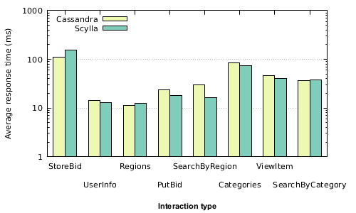

# 基准测试 ScyllaDB

> 原文：<https://dev.to/michaelmior/benchmarking-scylladb-5m1>

ScyllaDB 是 [Apache Cassandra](https://cassandra.apache.org/) 的替代产品，据称其吞吐量比 Cassandra 高 10 倍，同时保持了可伸缩性和易用性的积极属性。Scylla 的功能是替代使用 [CQL](https://docs.datastax.com/en/cql/3.1/index.html) 的 Cassandra 应用程序(目前在功能上有一些[差异](http://www.scylladb.com/technology/status/))。幸运的是，我过去在 NoSQL 为 Cassandra 设计模式的工作只利用了 Scylla 支持的特性。

一段时间以来，我一直想在 Scylla 上做我自己的测试，但最近[一名教员](https://cs.uwaterloo.ca/~jimmylin/)在我们小组的 Slack 频道上分享了关于 Scylla 的内容，并建议我分享一些结果。我决定运行我用来评估我为 [RUBiS](http://rubis.ow2.org/) 网上拍卖基准设计的模式的同一组实验。首先，创建几个柱族并加载数据。接下来，在 RUBiS 基准中执行不同类型的事务，同时测量响应时间。在我继续之前，首先声明结果背后的方法并不尽如人意，但仍然让我对 Scylla 的一些声明持怀疑态度。

这些实验是使用 Cassandra 3.0.9 和 Scylla 1.6.1 的单节点安装运行的。虽然这不是一个典型的设置，但 Scylla 声称的性能改进的大部分原因(例如无锁数据结构和改进的内存管理)仍然应该在单个节点上表现出来。Scylla 的一个优点是,`scylla_setup`命令试图配置操作系统以获得最佳性能，包括对存储数据目录的磁盘进行基准测试。这种配置用于 Scylla 和 Cassandra，其他默认设置用于两个系统。

第一个显著的区别是，Scylla 的数据在磁盘上的大小(9.8 GB)几乎是 Cassandra 的两倍(5.2 GB)。尽管如此，Cassandra 和 Scylla 的加载时间相差不大，分别为 3 小时 43 分钟和 3 小时 59 分钟。下图显示了每种情况下存储数据文件的 SSD 的写入吞吐量。“锡拉”似乎把硬盘推得更紧了，但它还是能跟上。

**更新**:在查看了 Scylla 和 Cassandra 的每个表中的键的数量后，似乎 Scylla 存储了更多的数据。请继续关注解决此问题的更新。

[T2】](https://res.cloudinary.com/practicaldev/image/fetch/s--2ePvM8BR--/c_limit%2Cf_auto%2Cfl_progressive%2Cq_auto%2Cw_880/https://michael.mior.ca/blog/scylladb-benchmarks/write-throughput.png)

最后，运行实际基准的结果。RUBiS 由许多“交互”组成，这些交互对应于用户对网页的请求。下图显示了 Cassandra 和 Scylla 的八大交互频率和平均响应时间。我不会在这里进行详细的分析，但是 Scylla 声称的性能在这里似乎并不适用。

[T2】](https://res.cloudinary.com/practicaldev/image/fetch/s--UAO97XNN--/c_limit%2Cf_auto%2Cfl_progressive%2Cq_auto%2Cw_880/https://michael.mior.ca/blog/scylladb-benchmarks/compare.png)