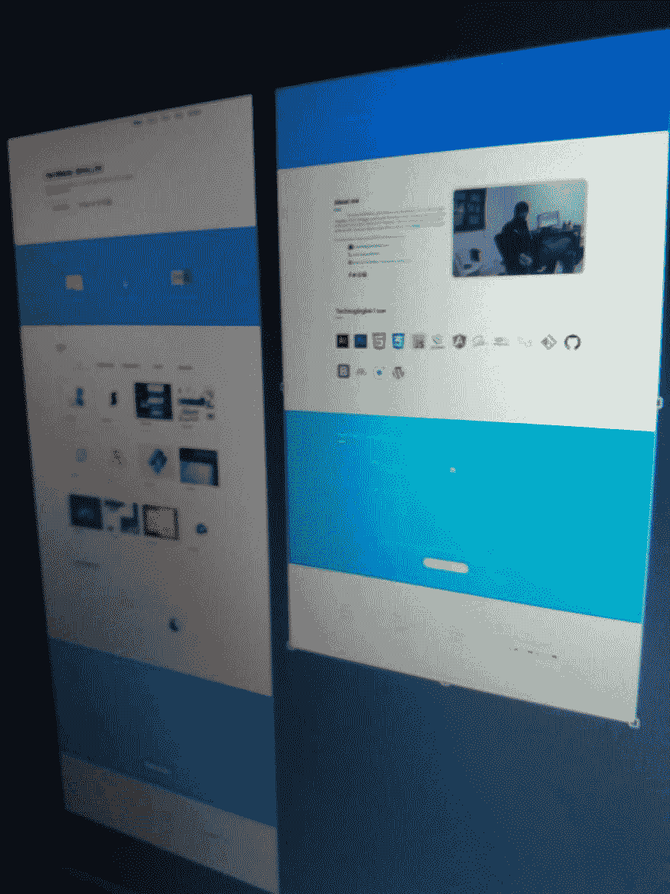
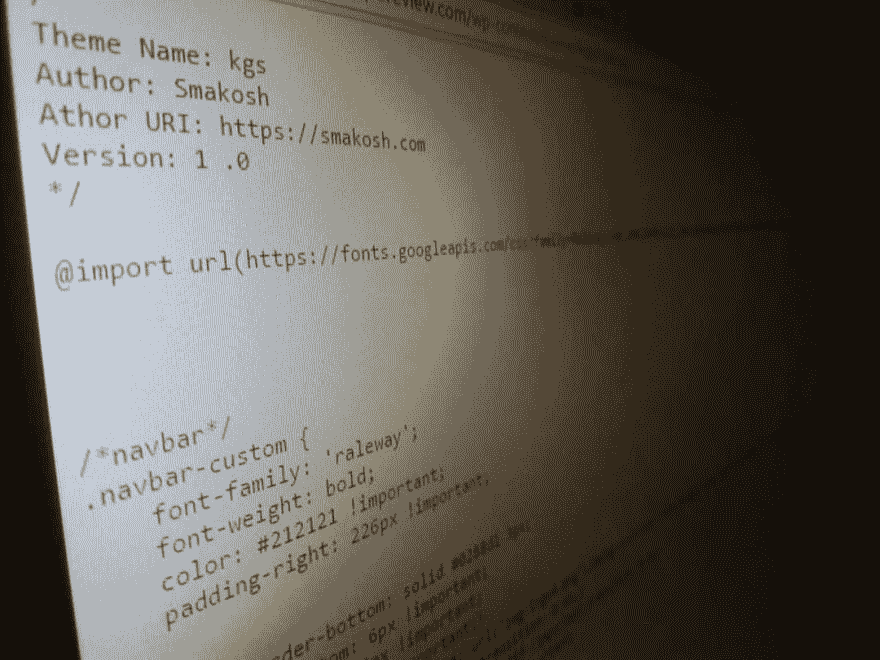
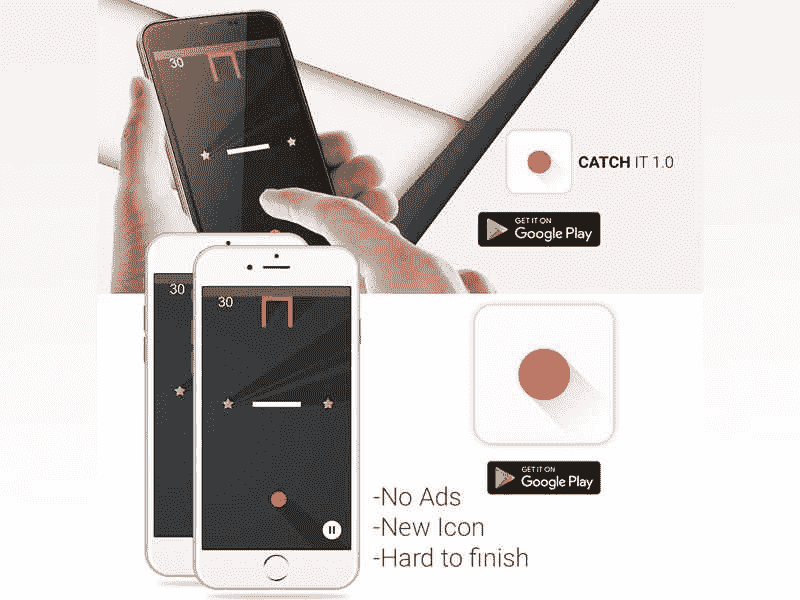
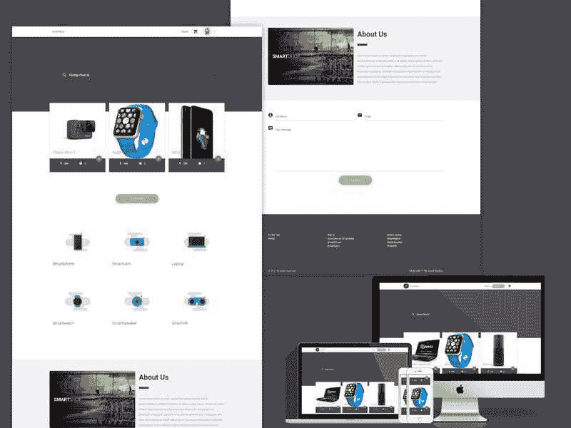
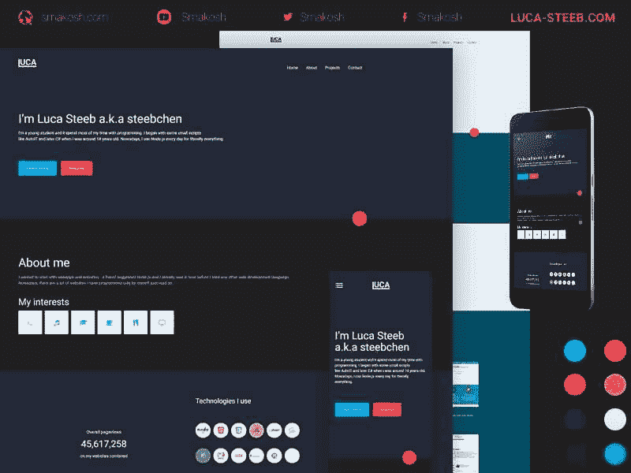

# 我如何在一年半的时间里学会设计和开发

> 原文：<https://dev.to/smakosh/how-i-learned-design--dev-in-a-year--half-158p>

> 这篇文章最初发表在我的个人博客 [Smakosh](https://smakosh.com/blog) 上。

我最早开始学习设计是在:

*   我很容易就学会了 Adobe Illustrator & Photoshop——后来又学会了 Adobe XD——因为我小时候就在玩 Adobe After effects。
*   我开始练习为自己设计东西，比如标志/用户界面/名片/社交媒体横幅/插图和编辑图片…
*   我的一些朋友建议我创建一个 Behance portfolio &开始在那里发布我的作品，我照做了&一旦我创建了一个 twitter 账户，我也开始在那里分享我的作品，我开始有来自世界各地的客户。

然后我开始学习 web 开发，当然是从前端开发开始:

*   我学习了 html/css/js 的基础&制作了一个无响应的单页网站，然后用我自己的基于浮动和宽度的网格系统制作了一个有响应的网站。
*   然后学了一些 Jquery 之类的 js 库然后 2017 年学了 angular 4 但是换了 React 生态系统。
*   我还学习了一些前端框架，比如 Bootstrap、Materialize、布尔玛、Lostgrid，后来我做了自己的小 css 框架，名为。
*   我学了萨斯，帕格(以前叫杰德)和 ES6。
*   我推出了几个版本的个人网站，使用了不同的技术和不同的外观。

[T2】](///static/look1-a3e3c09e6c300da7d826051fcfb45ad8-070e6.jpeg)

我开始得到一些客户，但不幸的是，从头开始要求一个 CMS 模板，作为一个开发人员，这真的很难做到，无论如何，我接受了挑战，设计了用户界面，编码，然后将其转换为 wordpress 模板，可悲的是，我到处使用插件，让客户能够轻松地编辑东西，这使得网站非常慢，[http://singaporeview.com](http://singaporeview.com)他然后付给我更多的钱，删除我的版权，但你仍然可以在风格页面上找到我的名字 http://singaporeview.com/wp-content/themes/kgs/style.css :D

[T2】](///static/wp-199cc8023f64831375d1ce3db5607ee6-187b7.jpeg)

我还用高级模板制作了其他 Wordpress 网站。

我也想进入移动开发，但我不知道如何制作一个移动应用程序，所以在做了一点研究后，我发现有一个叫 Build Box 的软件可以让你在没有任何编程技能的情况下制作移动游戏，你只需要设计所有的东西&拖放就可以了，你的应用程序就完成了，这是我用来制作[Catch it 1.0](https://play.google.com/store/apps/details?id=com.smakosh.atchit)[https://www . behance . net/gallery/38505463/Catch-it-10-My-first-Android-的工具](https://www.behance.net/gallery/38505463/Catch-it-10-My-first-android-mobile-game)

[T2】](///static/catchit-f7836c7982bdebb0a890b9fd31e2443d-30228.jpeg)

我想进入原生开发世界，但我太懒了，不想学习 Java 或 Swift，所以我玩了 Ionic 框架，它不是原生的，而是混合的，但我想尝试一下，我做了一个小的组合应用程序，我打算很快删除它。

1 年过去了，我决定也进入后端开发，很难在 php 和 nodejs(简单的服务器端 javascript)之间做出选择&最后，由于我父亲的决定，我选择了 php 和 MySQL，他当时没有让我从大学退学，因为它在程序中(php/mysql)。

所以，当我理解了核心语言(变量、循环、语句……)之后，我开始通过实践来学习，然后我开始制作一些网络应用，比如论坛、[电子商务](https://github.com/smakosh/Smartshop)、T2【图片尺寸调整工具等等

[T2】](///static/smartshop-87d52f1e320966c42bed414f9f3a1477-30228.jpeg)

在学习后端开发的时候，我也为我的朋友卢卡·斯蒂布&做了一些类似这个[响应式网站](https://luca-steeb.com)的工作。这是我第一次使用 Git，Github & Ubuntu，因为网站的后端使用 Nodejs &我学到了一些关于 npm & CLI 命令:D 的东西

[T2】](///static/lucasteeb-8328a2dd44a8bfd1ae1433f327dffb95-30228.jpg)

但在 2017 年末，我开始学习 MEAN stack，并在我的 [Github 账户](https://github.com/smakosh)上制作了一些开源应用。

目前-2018 年初-我仍然在学习很多东西，如 Express，Mongoose，Gatsby，神经网络，Python，Flask，Tensorflow，Keras…

我真的要感谢互联网上教我这些东西的人，以及开源这么多伟大产品的人。也感谢帮助我度过早期学习生涯的朋友们。

> “教育的目的是帮助你自学”