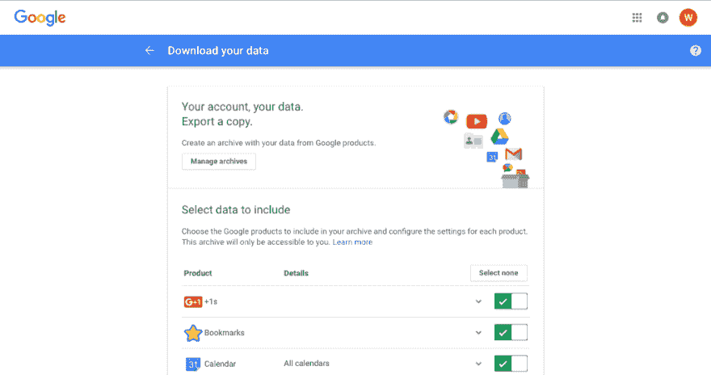
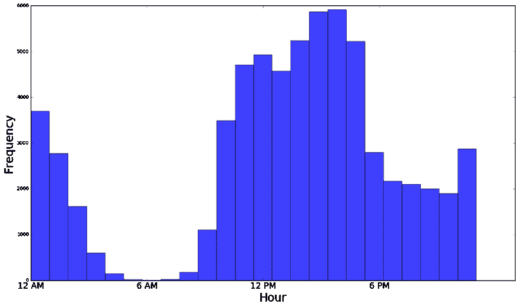
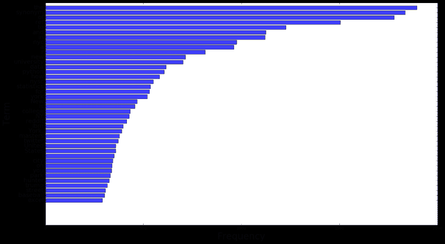
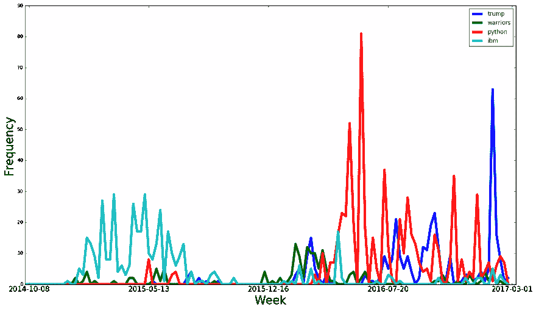

# 寻找自我:如何获得和分析你的谷歌搜索历史

> 原文:[https://dev . to/walker/the-search-for-self-how-to-analyze-your-history of-Google-searches](https://dev.to/walker/the-search-for-self-how-to-obtain-and-analyze-your-history-of-google-searches)

谷歌的搜索引擎如此彻底地融入了我们的日常生活，以至于感觉它更像是一个认知过程的最后阶段，而不是一个独立的软件。现代人不觉得奇怪，他们觉得奇怪，然后谷歌一下，把字符敲进你的地址栏就像最初的想法一样自然合理。

因此，你在一段时间内积累的谷歌搜索量可以作为你的精神状态、好奇心、野心和恐惧的可靠代理。幸运的是(或者不幸运，取决于你对隐私的定义)，谷歌会记录你的搜索并提供给你，前提是你已经登录了谷歌账户(通常是通过 Gmail)。如果你从未[调整过你的设置](https://support.google.com/accounts/answer/7028918)来停止这种行为，以下是如何找到、解析和可视化这些数据，作者扮演豚鼠。

## 1.下载数据

前往[https://takeout.google.com/settings/takeout](https://takeout.google.com/settings/takeout)，在那里你会发现各种可用的个人数据集，包括你的 GChat 对话和电子邮件。取消全部选择(“不选”)，然后重新检查搜索并点击“下一步”在下一页，您可以选择文件类型(*)。tgz* 允许更少的文件)和交付方式(我坚持通过电子邮件发送下载链接)。打开邮件，点击，下载档案，解压后，你会发现文件夹“外卖”和“搜索”下有一堆文件

[T2】](https://res.cloudinary.com/practicaldev/image/fetch/s--OJYnZpSk--/c_limit%2Cf_auto%2Cfl_progressive%2Cq_66%2Cw_880/https://cdn-images-1.medium.com/max/1024/1%2AiHql0gslNV3rRkx90CG5_Q.gif)

## 2.准备数据

数据是 JSON 格式的，但是仍然以相对简单的方式组织，并且可以在 Python 中不太麻烦地展平成向量:

```
import json
import os
import datetime
import numpy as np
import pandas as pd
import matplotlib.pyplot as plt
from collections import Counter

#your file path here!
files= os.listdir('Searches')
del files[0]

searches =[]
dates = []
for file in files:
    with open('Searches/%s'%(file)) as json_data:
        d = json.load(json_data)
    for i in range(len(d['event'])):
        for j in range(len((d['event'][i][u'query'][u'id']))):
            searches.append(d['event'][i][u'query'][u'query_text']) 
            dates.append(d['event'][i][u'query'][u'id'][j][u'timestamp_usec'])

dates = [datetime.datetime.fromtimestamp(int(i)/1000000).strftime('%Y-%m-%d %H:%M:%S') 
        for i in dates]
searches = [i.encode('utf-8') for i in searches] 
```

## 3.分析数据

我们将从一些高层数字开始。从 2014 年秋季开始的 886 天里，我执行了近 64000 次谷歌搜索，平均每天超过 70 次。我每天在工作中使用我的个人笔记本电脑，这有助于解释如此大的数量，但显然介绍中提到的谷歌搜索的普遍性并没有被夸大！

不过，还有更多模式值得挖掘。你可以看看每小时的趋势:

```
hours = [datetime.datetime.strptime(i, '%Y-%m-%d %H:%M:%S').hour for i in dates]
n, bins, patches = plt.hist(hours, 24, facecolor='blue', alpha=0.75)
plt.xticks([0,6,12,18], ['12 AM','6 AM', '12 PM', '6 PM'], fontsize=18)
plt.xlabel('Hour', fontsize=24)
plt.ylabel('Frequency', fontsize=24)
plt.gcf().set_size_inches(18.5, 10.5, forward=True)
plt.show() 
```

[T2】](https://res.cloudinary.com/practicaldev/image/fetch/s--zBSNkqRm--/c_limit%2Cf_auto%2Cfl_progressive%2Cq_auto%2Cw_880/https://cdn-images-1.medium.com/max/1024/1%2AdrWVIJlSMZ1BTGs3VTCp8Q.png)

最简单地说，一小时一小时的图表反映了我的意识:不谷歌的人可能睡着了。不过，上班后不久，我就开始疯狂地搜索，在下午 3 点左右，好奇心达到了顶峰。晚上稍事休息后，我会在晚上 10 点回到搜索工作中，直到午夜过后才结束(我是个有点夜猫子的人)。

我到底在谷歌什么呢？按词频排序并不太难:

```
combo = ' '.join(searches)
freqs = Counter(combo.split())
top = freqs.most_common(40)

words = []
counts = []
for i in range(40):
    words.append(top[i][0])
    counts.append(top[i][1])

words.reverse()
counts.reverse()

plt.barh(range(40), counts, align='center', color='b', alpha=0.75)
plt.yticks(range(40), words, fontsize=16)
plt.gcf().set_size_inches(18.5, 10.5, forward=True)
plt.show() 
```

[T2】](https://res.cloudinary.com/practicaldev/image/fetch/s--t1h5wELb--/c_limit%2Cf_auto%2Cfl_progressive%2Cq_auto%2Cw_880/https://thepracticaldev.s3.amazonaws.com/i/on7i3xcjecvg64a2ndp1.png)

英语中常见的疑点如“The”和“of”冲淡了列表，但你仍然可以看出我过去几年的想法。我定期写博客，喜欢避免过度使用一个词，因此非常依赖于搜索同义词。我总是希望体育参考网站成为我的首选结果，所以我会在任何棒球或篮球查询中添加“ref”。我住在纽约，经常去健身房。我是一名有抱负的数据科学家(“数据”、“python”、“r”)。我是典型的美国人(“棒球”、“国家”)，但也担心如今这意味着什么(“特朗普”)。

当然，每一项都有时间的成分。出于同样的原因，人们不会每天都用谷歌搜索同样的东西，他们也不会每天都想同样的事情。因此，如果我编写一个函数，它接受我的搜索数据、开始和结束日期，以及我感兴趣的一组术语...

```
def term_by_week(data, start, end, terms, normalized=False):
    start = datetime.datetime.strptime(start, '%Y-%m-%d')
    end = datetime.datetime.strptime(end, '%Y-%m-%d')
    weeks=[]
    while start < end:
        weeks.append(start.strftime('%Y-%m-%d'))
        start += datetime.timedelta(days=7)

    for term in terms:
        term_weeks = []
        for i in range(len(weeks)-1):
            term_weeks.append(sum((data['time'] > weeks[i]) & 
                      (data['time'] < weeks[i+1]) &
                      (data['search'].str.contains(term))))
        termlength = len(term_weeks)
        if normalized == True:
            term_weeks = [i/float(max(term_weeks)) for i in term_weeks]
        plt.plot(range(termlength), term_weeks, label=term, linewidth=5.0)

    ticks = range(1, len(weeks), len(weeks)/4)[0:4] + [len(weeks)-1]
    plt.xticks(ticks, [weeks[i] for i in ticks], fontsize=15)
    plt.xlim((0,len(weeks)))
    plt.xlabel('Week', fontsize=24)
    plt.ylabel('Frequency', fontsize=24)
    plt.legend()
    plt.gcf().set_size_inches(18.5, 10.5, forward=True)
    plt.show() 
```

...我可以挑选一些熟悉的话题，并检查它们随时间的波动，让我感觉到随着时间的推移，我的兴趣和重点是如何变化的(这需要几分钟时间):

```
d = {"search": searches, "time": dates}
googled = pd.DataFrame(d)

term_by_week(googled, '2014-10-01', '2017-03-05', 
        ('trump', 'warriors', 'python', 'ibm')) 
```

[T2】](https://res.cloudinary.com/practicaldev/image/fetch/s--LcpG7ny0--/c_limit%2Cf_auto%2Cfl_progressive%2Cq_auto%2Cw_880/https://thepracticaldev.s3.amazonaws.com/i/prz47mfjph64qaz6jpmd.png)

在没有见过我的情况下，你可以使用这样的图表来了解我是谁，以及我在很长一段时间内都在想些什么(当然，这也是 Google *为了赚大钱而做的事情)。毕业后一直在 IBM (teal)工作，直到 2015 年夏天跳槽。几个月来，我密切关注金州勇士队破纪录的赛季(绿色)。2016 年春天，我决定学习 Python (red)，这是用于这一切的编程语言。随着选举的临近，我非常关注特朗普(蓝色),休息了一段非常必要的时间，然后重新参加了他的就职典礼。*

不幸的是，你对这篇文章的持久关注可能会提醒你谷歌的无所不知。你可能已经注意到了我在导出数据时没有检查的所有其他东西，从地图到 GChat 对话到个人日历。关于你的数字足迹应该有多大，以及谁应该可以访问它，还有漫长而复杂的对话要进行。

有一件事是肯定的，那就是你有权利查看你过去的在线行为，正如上面所展示的，你有能力发现这些行为的意义。在一个我们所有人都太分心而无法在睡觉前写日记的时代，谷歌提供了一种近似于日记的东西，而且在这一点上可能更诚实一点。

所以我鼓励你至少下载你的数据，甚至尝试分析一下。完整的代码链接在这里，我很乐意帮助那些发现语法难以理解的人，并尝试回答你对这个过程可能有的任何问题…

…或者你可以谷歌一下。😉

*这篇文章最初发表在我的数据博客上，[complem . city](https://perplex.city/the-search-for-self-60e2149cffa3)T3】*