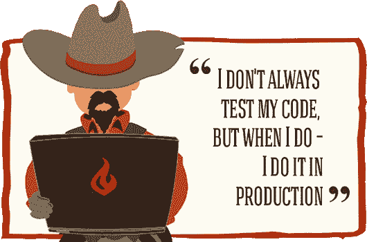

# 成为更好的开发人员的技巧

> 原文:[https://dev . to/chuksfestus/tips-to-being-a-better-developer-2n0a](https://dev.to/chuksfestus/tips-to-becoming-a-better-developer-2n0a)

[T2】](https://res.cloudinary.com/practicaldev/image/fetch/s--ls9XC1xo--/c_limit%2Cf_auto%2Cfl_progressive%2Cq_auto%2Cw_880/https://cdn-images-1.medium.com/max/900/1%2AuOse74deMh527tMfhQ9JfA.png)

几个月前，我在 Django girls Minna 活动上做了一个演讲，我不断收到类似这样的问题:你是如何成为一个如此厉害的开发者的？我如何从一个 Genin 变成一个 Kage…？

所以这是我回答这些问题的尝试。请不要说我还不是一个“kage ”,但我认为这些年来我已经学到了一些东西。

### 永远计划你的项目

T3 有什么计划

你看到的开发人员犯的最常见的错误是没有计划，有些人甚至认为这不是他们的工作。事实是，好的计划有助于节省大量时间，减轻压力，并且每天按时完成工作。

有很多很棒的计划工具，比如 [trello](https://trello.com) (为你的每个模板和元素创建一个项目板和卡片) [writemaps](https://www.writemaps.com) ，哦，还有很好的旧纸笔

### 永远不要停止好奇

[T2】](https://res.cloudinary.com/practicaldev/image/fetch/s--H3d_Li7o--/c_limit%2Cf_auto%2Cfl_progressive%2Cq_auto%2Cw_880/https://cdn-images-1.medium.com/max/501/1%2AU3fvHOvu9PBnQ8rQrgHGsA.jpeg)

几乎每天都有新的工具、插件、技术和语言发布，对所有新事物保持开放态度并努力探索和理解它们是非常重要的

前端开发的坏处和好处在于，它的发展速度非常快(T2 和 T3)。这意味着你可以**很快成为专家**，但是你的技能也可以**很快过时**。

你不需要知道所有的事情，只需要对一个主题或技术有一个大概的了解就可以了。当合适的项目出现时，你可以更深入地研究它。

### 投资你的技能

但这和好奇不一样吗？没有。

为了成长，你需要**投资自己。我不是说**把钱**花在昂贵的课程、研讨会或书籍上，我更想的是**投资你的时间**。成功没有捷径，研究表明掌握一项技能需要大约 10000 小时，也就是大约 4 年，每周练习 40 小时。**

**做好准备**忍受深夜探索其他网站，尝试新的插件和框架，阅读网络开发博客，听播客，咀嚼成千上万条推文。

### 找到导师

[T2】](https://res.cloudinary.com/practicaldev/image/fetch/s--pS5c_3C0--/c_limit%2Cf_auto%2Cfl_progressive%2Cq_auto%2Cw_880/https://cdn-images-1.medium.com/max/279/1%2AK77m1FaQ4DJF1fNJ7nHlDw.jpeg)

我不是说你只是钦佩的人，可能直到你死都不会遇到，而是找一个比你更有经验的人，一个渴望帮助你成长的人。

#### 一个好的导师会帮助你:

*   获得关于你的项目方法的建议
*   获得方向感
*   帮助你预见任何**潜在的障碍**

### 保持简单

[T2】](https://res.cloudinary.com/practicaldev/image/fetch/s--LTVkwUcO--/c_limit%2Cf_auto%2Cfl_progressive%2Cq_auto%2Cw_880/https://cdn-images-1.medium.com/max/800/1%2A5Km684vkhoXop27fgCeD0Q.jpeg)

为不可能的事情做计划会使代码变得不必要的复杂。不要试图预见你的项目在两年后的需求——太多的事情会改变(并且**将会**改变)!你会浪费时间在一个过于复杂的解决方案上，而这个解决方案被证明与你想象的不同。

谨记:保持简单不应该和“快速肮脏”混为一谈。你还是要彻底认真的工作！

### 单元测试

[T2】](https://res.cloudinary.com/practicaldev/image/fetch/s--3yYkA2Xg--/c_limit%2Cf_auto%2Cfl_progressive%2Cq_auto%2Cw_880/https://cdn-images-1.medium.com/max/530/1%2AE5RxhO_18-PElvUMcV2rFg.png)

每个程序员都经历过这样的事情:你在一个角落里修改了一点代码，而在一个(看似)不相关的角落里，有东西坏掉了！痛苦的事实是:新的和改变的代码将不可避免地包含 bug。使用自动化测试来帮助您保持旧代码的稳定性。

就是这样，伙计们，让我知道你的想法，或者如果你认为我错过了什么…继续杀死那个强大的开发者的代码