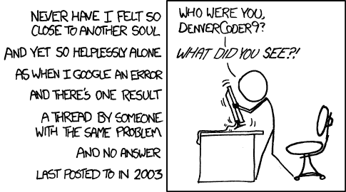

# 上下文切换扼杀了你的心流，是什么让你保持心流呢？

> 原文:[https://dev . to/iana Kelly/context-switching-kills-you-flow-what-keep-you-in-the-flow](https://dev.to/ianakelly/context-switching-kills-your-flow-what-would-keep-you-in-the-flow)

我爱上了一个问题...这是一个我看到许多软件开发人员都在努力解决的问题。*如何呆在自己的 IDE 里做自己喜欢的事情*与在网上、技术文档、水冷却器/slack 等地方寻找答案相比。有几个伟大的团队正在努力解决这个问题，比如 kite.com、qbitlogic.com、fluentcode.com、sourcegraph.com 和*，我祝他们一切顺利。*

为开发者解决这个问题能够改善我们所有人的生活。

如果你怀疑这个问题是否存在，看看 Stack Overflow 每天发布的问题数量(大约 10，000 个！很多可能是重复的，但是你得到了要点)或者问问你自己，你上一次不得不寻找编码问题的答案是什么时候。如果你仍然不服气，检查[这个](https://blog.codinghorror.com/the-multi-tasking-myth/)或者[这个](http://seriouspony.com/blog/2013/7/24/your-app-makes-me-fat)。
大多数时候，这是我们都做过的简单愚蠢的事情，我们只是很难把它们都载入我们的大脑(这是我最沮丧的时候，因为它让我感觉“我甚至不知道我在做什么吗？”).但其他时候，你希望有人已经解决了更难的问题，并写出了很好的答案，但并不总是可能找到正确的答案。

我非常喜欢这个问题，所以我决定全力以赴，我正在研究[精益创业方法](http://theleanstartup.com/principles)，希望成为为开发者解决这个问题的人之一。我们知道并喜欢这个问题，我们心中有一些解决方案的想法，我们正在寻找也喜欢这个问题并希望看到它得到解决的人！我很想听听你现在如何解决这个问题，你会用什么方法解决这个问题，以及你是否愿意[参与](https://codepilot.ai/?utm_source=dev)帮助我设定这个过程。

本着请求和提供的精神——如果你正在计划一个精益创业，或者需要我向你请求的那种帮助，我愿意加倍回报。随便问！ [Ian@CodePilot.ai](mailto:Ian@CodePilot.ai) 。