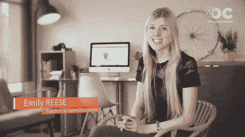

# 然而，艾米丽·里斯编码

> 原文：<https://dev.to/eclairereese/nevertheless-emily-reese-coded>

## 我开始编码是因为...

我当时 23 岁，在社区团队 Kickstarter 工作，对网站本身是如何运作的感到好奇。我一直学习艺术，以前没有任何编码经验。一旦我真正理解了用代码可以构建什么——致力于学习、创造、艺术、减少不平等等等的平台——我知道我想参与这个领域。

我刚刚完成我的硕士论文，所以用 HTML、CSS、Ruby 和 JavaScript 填满了我最近空闲的夜晚和周末。

一年后，我转到了 Kickstarter 工程团队！

## 我目前正在入侵...

科技教育！几年前我从纽约搬到法国巴黎，现在是欧洲最大的在线教育平台 OpenClassrooms 的教学经理(这就是我):

[T2】](https://res.cloudinary.com/practicaldev/image/fetch/s--O_JdI9V6--/c_limit%2Cf_auto%2Cfl_progressive%2Cq_66%2Cw_880/https://s3.amazonaws.com/eclairereese.com/android.gif)

我正在 OpenClassrooms 上建立一条学习路径，教人们成为前端开发人员，最终获得国际认可的学位。学生们通过完成我们的项目、选修我们的课程以及每周一次从导师那里获得帮助来获得学位。

这是一个不可思议的方法来帮助人们像我一样过渡到编码。我很荣幸已经为一家初创公司工作，但也有人试图成为缺乏相同资源和支持系统的开发人员。(同样令人难以置信的是:当法国总统来看我们时，我见到了他！)

## 我很兴奋...

帮助难民和贫困社区找到报酬丰厚的技术工作，而无需为其他领域的机构教育支付数千美元。我们，技术社区，在这里有很多伟大的工作要做，尤其是在欧洲。

我也很兴奋终于在法国有了家的感觉。我心血来潮搬到这里，完全独自一人，在这个新的国家建立我所拥有的一切需要付出艰苦的努力。我真的鼓励其他女性这样做:完全为自己搬到某个地方，在一个新的环境中重建/重新思考你的生活。

## 我对其他代码女性的建议是...

找到你的激情和代码，以帮助这种激情。你不必为了编码而编码。你可以为艺术编码(例如在博物馆)，为人类(例如在非营利组织)，或者其他任何事情，你都会有所作为。

坚持你的观点，但总是倾听并重新考虑你的世界观。

最后，交叉性很重要。我是一个身体健全的直女白人，虽然我已经处理了很多无意义的性别歧视，但我仍然很有特权。只有通过从种族、阶级、能力、民族和性别的角度倾听和支持所有边缘化群体的故事，我们才能为每个人创造一个更好的环境。