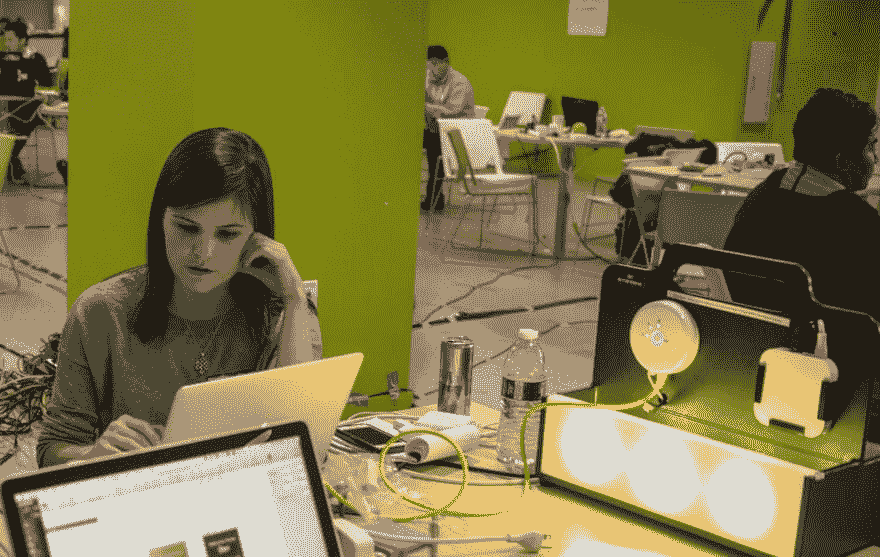

# 然而，艾普丽尔·温塞尔编码了

> 原文：<https://dev.to/aprilwensel/nevertheless-april-wensel-coded>

  [在去年的一次黑客马拉松上编了一些情绪灯光](http://aprilwensel.com/mood_rooms)

## 我开始编码是因为...

在高中，我发现编码是一种全新的方式，通过创造互动体验来表达自己并与他人联系。

此外——坦白说——当时，我梦想以制作电脑游戏为生。；-)

## 我目前正在入侵...

自 2002 年以来，我一直坚持编码，我从来没有用“黑客”这个术语来描述我所做的事情(即使当我在“黑客马拉松”的时候)。

目前，我正在构建[富有同情心的编码](http://compassionatecoding.com),通过研讨会和指导让科技行业成为一个更友好的地方。

作为这项工作的一部分，我正在进行一个针对堆栈溢出和 Github 评论的情感分析项目，该项目可以比现有的算法更有效地处理技术语言。我的目标是唤起人们对这些社区中存在的有毒语气的关注，以便改善这种情况。如果你想帮忙或有想法，[我很乐意收到你的来信](mailto:april@compassionatecoding.com)。

## 我很兴奋...

我很高兴越来越多的人从非传统背景转向编码。你们是这个行业的未来，我指望你们帮助这个行业变得更有同情心！

我还对那些利用技术解决现实社会问题的人感到兴奋，而不仅仅是建立另一家广告公司或约会应用程序。

## 我对其他代码女性的建议是...

我对所有性别的编码员和非编码员的建议都是一样的:花时间接触你的核心价值观，让这些价值观每天指导你的行动。不要让外界的力量(如同龄人的压力、高薪或有利可图但不光明的商业机会)动摇你的道德基础。

要谦虚。

轻易原谅(尤其是自己)。💙