# 选择集中式日志记录和监控系统

> 原文：<https://dev.to/maklipsa/choosing-centralized-logging-and-monitoring-system>

当我在研究如何加速计算 170 亿个相似性的下一个角度时，我开始研究如何从 T2 cookit 获得更好的遥测数据。获取遥测数据很容易，但理解它才是难的部分。这也带来了当前设置的另一个痛点——日志和监控。
既然 [cookit](http://cookit.pl) 是我的宠物，是时候做点什么非营利项目了。

# **TL；DR；**

最后有一个[对照表](#Comparison_table)，和[我选的](#What_Ive_choose)。

# 目录:

*   [记录和监控的当前状态](#The_current_state)
*   [要求](#Requirements)
*   [摊牌](#The_showdown)
    *   [谷歌分析](#Google_Analytics)
    *   elk+石墨/石墨烯
    *   新遗迹
    *   [回撤](#Retrace)
    *   [应用洞察](#Application_Insights)
    *   [射线枪](#Raygun)
    *   [Datadog](#Datadog)
*   [对照表](#Comparison_table)
*   [我选择了什么](#What_Ive_choose)。

# 记录和监控当前状态

当前设置基于:

*   **NLog**——用于网站和 Windows 服务中几乎所有的登录(你可以在这里阅读更多关于 cookit 架构[)。大多数错误都被记录到文件中，关键的错误会通过电子邮件发给我。](How-is-cookit-build/)
*   **Hangfire dashboard** -用于检查作业状态以及作业是否以失败结束。如果它崩溃了，只显示主异常。
*   **远程桌面** -用于故障排除、性能计数器和所有监控工具(相信我，我知道 RDP 和监控放在一句话里听起来有多糟糕:()。

除了最后一个，设置在日常基础上或多或少还可以。但是在更高级的场景中，它开始越来越缺乏:

*   电子邮件通知可以被告知有问题，但对于细节，我必须 RDP 和查看文件，这是可以容忍的，只有在 PC 上。在平板电脑或手机上做这些是在浪费时间。另一个问题是，如果出了问题，我会收到成千上万封电子邮件。
*   除了 Hangfire 仪表板，没有其他性能指标。
*   自从[我在蹩脚的硬件上运行 cookit 以来](https://indexoutofrange.com/The-importance-of-running-on-crapp/) RDP 很慢。
*   任何分析或寻找相关性都必须手动完成。这样做是一种痛苦和浪费我的时间。
*   没有办法做事后分析，为什么网站在一个小时前很慢。唯一的来源是 NLog 文件。

# 要求

所以我想达到的目标(按重要性排序):

*   **可视化。**——对，这是第一名。查看表格是了解正在发生的事情的最糟糕的方式。一张简单的图表会带来巨大的不同。
*   **随处可得。** -这意味着需要安装 RDP 或任何应用程序。它必须基于网络。
*   没有在我的机器上运行。每个系统都需要一些维护。偶尔检查日志，升级到新版本等等。这需要时间和知识(知识可以转化为拥有它所需的时间)。目前，这不是我想投入时间的领域，所以 SaaS 是。
*   **机器的性能计数器。** -当事情变得混乱时，知道应用程序的统计信息而不知道整个机器的统计信息几乎是没有意义的。
*   **集中伐木。** -不再挖掘多个 NLog 文件。它必须在一个地方。
*   **习俗事件。** -我想为我在数据处理工作流程中使用的每个第三方物流数据流块添加自定义计时。此外，查看 Hangfire 作业的总时间会很好，并会告诉我在优化方面投入时间。
*   **实时。** -当我收到来自 [Pingdom](https://www.pingdom.com/) 的报告说站点没有响应时，我想检查一下机器上现在发生了什么。在这种情况下，一小时前的数据是没有用的。
*   **警报** -只有当你在一个挤满了专门监控一个应用程序的人的房间里有巨大的显示器显示仪表盘时，没有警报的监控才有效。即使这样，它也只在电影中起作用。提醒是必须的，可以节省时间。
*   **历史数据。在我的情况下，从收到警告到有时间查看它之间的时间几乎总是非零的。拥有至少 8 个小时(记住，睡眠是件好事？)的数据是必须具备的。**

# 摊牌[Google Analytics](#Google_Analytics)vs[ELK+Graphite/Grafana](#ELK)vs[new relic](#NewRelic)vs[Retrace](#Retrace)vs[应用洞察](#Application_Insights)vs[ray gun](#Raygun)vs[Datadog](#Datadog):

[T4】](https://res.cloudinary.com/practicaldev/image/fetch/s--5Cm6uwOR--/c_limit%2Cf_auto%2Cfl_progressive%2Cq_auto%2Cw_880/http://indexoutofrange.com/data/2017-02-12-Choosing-centralized-logging-and-monitoring-system/google-analytics_01.png)

## 谷歌分析

谷歌分析不仅仅是 SEO/SEM 工具。在自定义客户端和服务器事件的支持下，它可以变成监控工具。使用它的另一个好处是我已经有了它，并且会不时地查看它。

**好人**

*   良好/体面的可视化
*   非常好的用户界面(快速和直观)
*   随处可得
*   免费(按我的比例)
*   我已经有了
*   有自定义事件
*   监控浏览器性能
*   支持自定义客户端和服务器事件
*   具有自定义仪表板
*   优秀的 Android 应用程序

**坏的**

*   使用自定义事件并没有那么好
*   没有系统性能计数器的集合(很容易编写，但仍然是减号)
*   没有日志聚合
*   没有警报

[T4】](https://res.cloudinary.com/practicaldev/image/fetch/s--zwYgj2OZ--/c_limit%2Cf_auto%2Cfl_progressive%2Cq_auto%2Cw_880/https://indexoutofrange.com/data/2017-02-12-Choosing-centralized-logging-and-monitoring-system/elk.png)

## 麋鹿栈+石墨/Graphana

ELK stack with Graphite 和 Grafana 是监控和中央测井的市场标准。这意味着很容易找到 Docker 图片、帮助和几乎所有需要的东西。
在移动设备上观看是可能的，但还远远不够好，从[Github 问题](https://github.com/elastic/kibana/issues/2563)来看，这种情况不会很快改变。

Grafana 面板:
[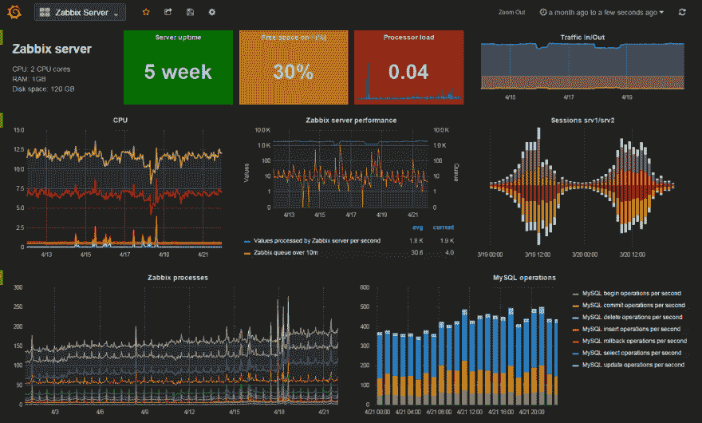](https://res.cloudinary.com/practicaldev/image/fetch/s--Vo2ymaX0--/c_limit%2Cf_auto%2Cfl_progressive%2Cq_auto%2Cw_880/https://indexoutofrange.com/data/2017-02-12-Choosing-centralized-logging-and-monitoring-system/Grafana_panel.png)

木叶面板:
[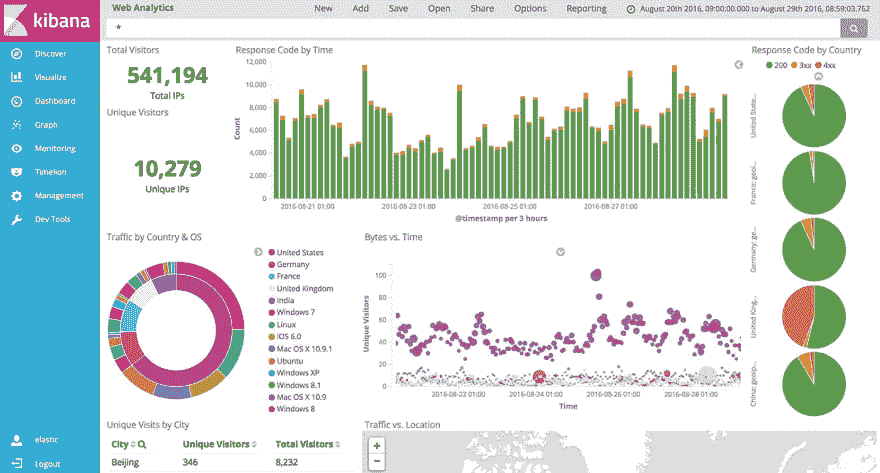](https://res.cloudinary.com/practicaldev/image/fetch/s--fDW1Z933--/c_limit%2Cf_auto%2Cfl_progressive%2Cq_auto%2Cw_880/https://indexoutofrange.com/data/2017-02-12-Choosing-centralized-logging-and-monitoring-system/Kibana_panel.png)

**好人**

*   市场标准
*   出色的可视化效果(Grafana 和 Kibana)
*   伟大的数据处理工具
*   有一些麋鹿 SaaS 供应商。
*   出色的用户界面和可视化
*   基于网络
*   现有的服务器统计数据监控应用程序

**坏的**

*   大部分是基于 Linux 的，因为我运行在一个 Windows 服务器上，这意味着得到另一台 Linux 机器。设置间隔
*   大多数提供商都不是免费的
*   我自己有很多事情要处理
*   没有现成的监控

[T4】](https://res.cloudinary.com/practicaldev/image/fetch/s--Zf0MweoB--/c_limit%2Cf_auto%2Cfl_progressive%2Cq_auto%2Cw_880/https://indexoutofrange.com/data/2017-02-12-Choosing-centralized-logging-and-monitoring-system/newRelic.svg)

## 新遗迹

新遗迹在功能上是一匹马力强劲的马。从 APM(应用程序性能管理)到日志聚合，它几乎什么都有。这是一个非常有趣的产品，因为它的制作方式对于非技术人员来说是可读的。它会自动设置违反 [apdex index](https://en.wikipedia.org/wiki/Apdex) 的通知，用户界面会显示主要的 [KPI](https://en.wikipedia.org/wiki/Performance_indicator) 性能(如谷歌分析)，而不是技术细节，如 Azure Application Insights (next)

主仪表盘:
[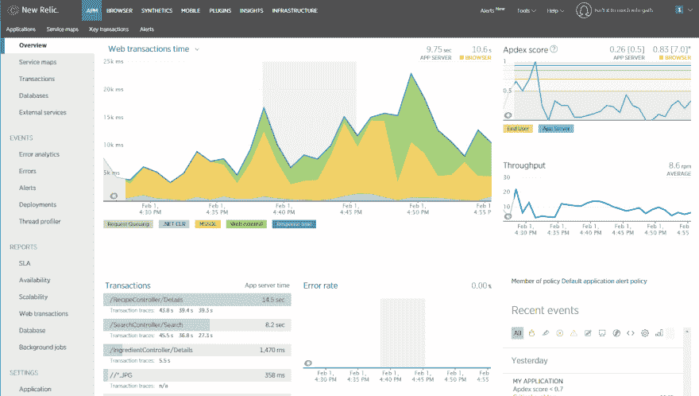](https://res.cloudinary.com/practicaldev/image/fetch/s--6yEFxSYI--/c_limit%2Cf_auto%2Cfl_progressive%2Cq_auto%2Cw_880/https://indexoutofrange.com/data/2017-02-12-Choosing-centralized-logging-and-monitoring-system/newRelic_panel.png)

我对 New Relic 检查每个请求的能力印象深刻。这是请求监控页面:
[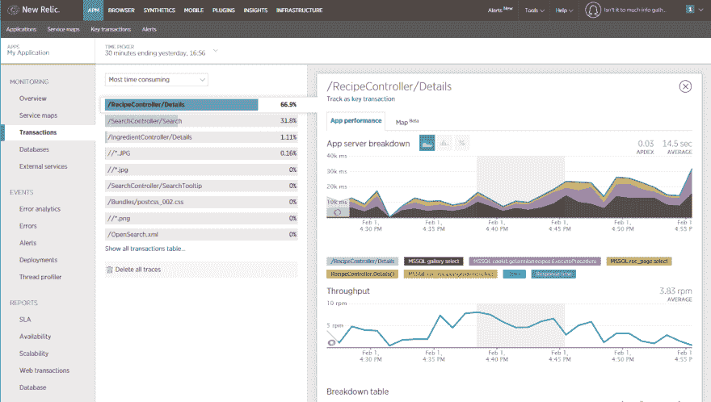](https://res.cloudinary.com/practicaldev/image/fetch/s--xnbVGKCe--/c_limit%2Cf_auto%2Cfl_progressive%2Cq_auto%2Cw_880/https://indexoutofrange.com/data/2017-02-12-Choosing-centralized-logging-and-monitoring-system/newRelic_requestDetails.png)

另一个很好也很独特的功能是地理视图。它显示了不同地理位置的页面速度差异。如你所见，我对俄国有问题(我不知道为什么):
[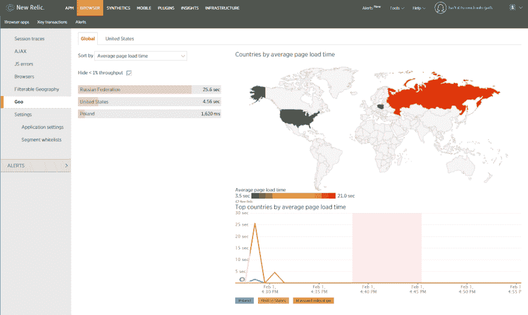](https://res.cloudinary.com/practicaldev/image/fetch/s--x0wcx9OB--/c_limit%2Cf_auto%2Cfl_progressive%2Cq_auto%2Cw_880/https://indexoutofrange.com/data/2017-02-12-Choosing-centralized-logging-and-monitoring-system/NewRelic_geoPanel.png)

安装是所有检查中最容易的。所有需要做的就是在服务器上安装 NewRelic 代理。依赖性检测、计量，甚至浏览器性能跟踪都是现成的。

最后要提的是，**而且可能是主观的**。我的印象是，在服务器上安装了 NewRelic 的代理后，速度有所下降。我可能是因为 Application Insights 也在上面运行，或者我的机器就是这么慢。如果别人也有这种印象平我。

综上所述-新遗迹是一个强大的野兽，拥有一个经理可以理解的外观:)

**好人**

*   开箱即用的监控。NET、Ruby、Node.js、PHP、Java、Python 和 Go 应用程序
*   支持 web 和非 web 应用程序
*   支持浏览器监控
*   快速和非常好的用户界面
*   浏览器分析不需要添加脚本(它是由安装的 NewRelic 代理自动添加的)
*   非常容易安装

**坏的**

*   只有付费版本(我明白为什么他们只有付费版本。在选择这个用例时，这对我是一个不利因素。记住这是个人评论)。
*   它由多种产品组成，即使在试用模式下，启用其中一些产品也需要联系销售部门。
*   每个子产品都是单独支付的。
*   at 注册(演示)需要电话号码、公司名称、公司规模和角色。
*   卸载需要重新启动机器。
*   昂贵的
*   混乱的定价

[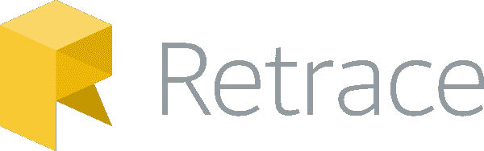T4】](https://res.cloudinary.com/practicaldev/image/fetch/s--YHUG7mJM--/c_limit%2Cf_auto%2Cfl_progressive%2Cq_auto%2Cw_880/https://indexoutofrange.com/data/2017-02-12-Choosing-centralized-logging-and-monitoring-system/retrace.png)

## 回撤(Stackify)

[Retrace](https://stackify.com/retrace/) 是同一个[男孩(和女孩)](https://stackify.com/about/)开发的[前缀](https://stackify.com/prefix/)的产品——一个优秀的本地剖析器。我必须说，我对这款产品的特点和精致印象深刻。UI 可能没有完全展示出来，但离大玩家也没那么远。在某些功能上，它甚至遥遥领先。

回扫面板:
[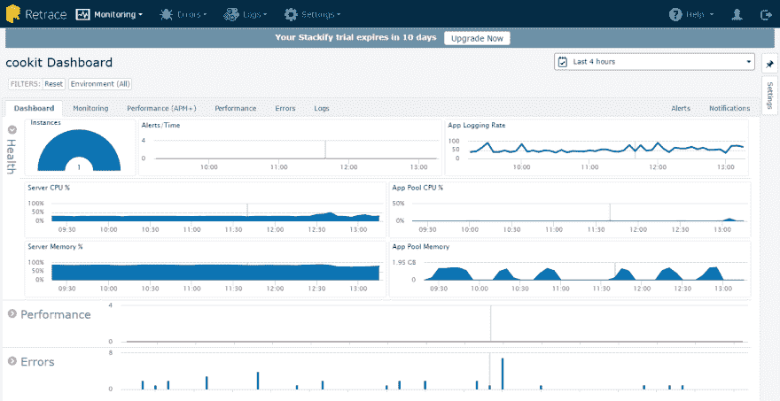](https://res.cloudinary.com/practicaldev/image/fetch/s--tL34Kc6E--/c_limit%2Cf_auto%2Cfl_progressive%2Cq_auto%2Cw_880/https://indexoutofrange.com/data/2017-02-12-Choosing-centralized-logging-and-monitoring-system/Retrace_panel.png)

追溯 APM+面板(从他们提供的演示应用程序。我无法让它在我的项目上工作):
[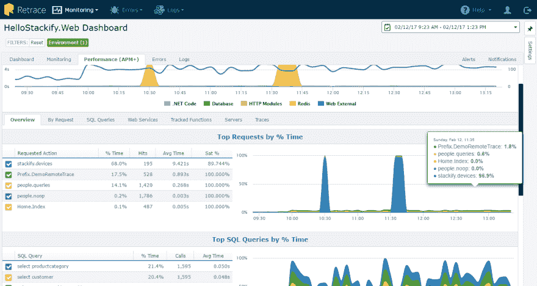](https://res.cloudinary.com/practicaldev/image/fetch/s--2OCc6zpd--/c_limit%2Cf_auto%2Cfl_progressive%2Cq_auto%2Cw_880/https://indexoutofrange.com/data/2017-02-12-Choosing-centralized-logging-and-monitoring-system/Retrace_APM.png)

**好人**

*   注册最初只需要姓名、姓氏和电子邮件👍。不幸的是，在电子邮件验证后，他们想要剩下的👎
*   代理正在收集的内容由网站控制。因此，在服务器上安装代理后，不需要在服务器上做额外的工作。
*   注意细节——安装 NLog 适配器时，系统会提示我们输入密钥。
*   它们中最好的现成警报触发器。唯一监视磁盘队列长度的系统。
*   机器性能警报与应用程序的请求相关联。
*   针对日志的快速全文搜索和数据分析
*   将错误标记为“已修复”的选项
*   相当快的用户界面
*   非常好的电子邮件提醒。它们看起来不错，而且信息量很大。
*   非常好的客户服务:)(邮件和评论)

**坏的**

*   核实之后，他们需要大量的信息
*   我无法获得任何 APM+统计数据。一切看起来配置正确，但它并不工作。我已经给支持部门发了电子邮件，但是没有回复(假设是在周末)。支持部门在周末之后联系了我，非常有帮助，但是我们无法让它工作。
*   Dashboard page 处于测试阶段，所以它没有 Application Insights 或 New Relic 那么多功能或好看。

[T4】](https://res.cloudinary.com/practicaldev/image/fetch/s--wEsBN6H_--/c_limit%2Cf_auto%2Cfl_progressive%2Cq_auto%2Cw_880/https://indexoutofrange.com/data/2017-02-12-Choosing-centralized-logging-and-monitoring-system/applicationInsights.png)

## 应用见解

微软正在对其 Azure 云进行大量投资，从他们每三个月推出的功能数量可以看出这一点。他们正在加大对 SaaS 模式的投资， [Application Insights](https://azure.microsoft.com/en-us/services/application-insights/) 非常适合这种环境。
Application Insights 感觉比 New Relic 更像一个面向开发者的平台。很容易看出，他们更多考虑的是查询能力(AND、OR 操作符)、内部请求细节、特性，而不是如何获得非常好的可视化效果。

我定制的主仪表盘:
[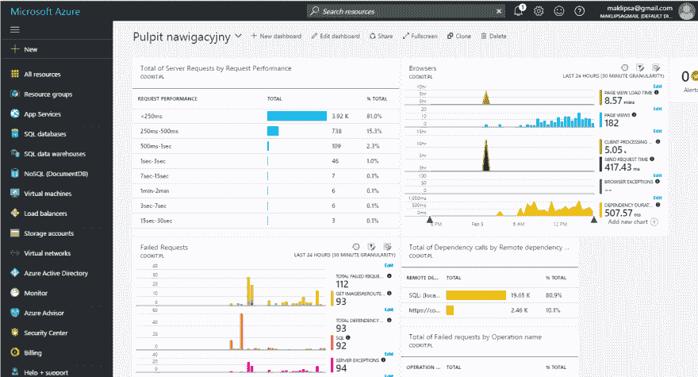](https://res.cloudinary.com/practicaldev/image/fetch/s--TKaciUIp--/c_limit%2Cf_auto%2Cfl_progressive%2Cq_auto%2Cw_880/https://indexoutofrange.com/data/2017-02-12-Choosing-centralized-logging-and-monitoring-system/azure_panel.png)

而请求详情:
[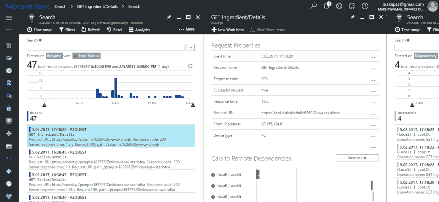](https://res.cloudinary.com/practicaldev/image/fetch/s--hQP4igPS--/c_limit%2Cf_auto%2Cfl_progressive%2Cq_auto%2Cw_880/https://indexoutofrange.com/data/2017-02-12-Choosing-centralized-logging-and-monitoring-system/azure_requestDetails.png) 
可以看到所有依赖项都被检测得干干净净。

还有一件事有力地表明了 Application Insights 是针对 IT 专家的。通过单击顶栏中的 Analyze，我们可以看到每个图背后的查询，更改它并将其用于自定义报告。使用的语言与 F#非常相似。这意味着我们拥有所有功能性的好东西，比如管道和对数据操作函数的支持。作为一个使用 F#的人，我必须说“干得好微软”:)
[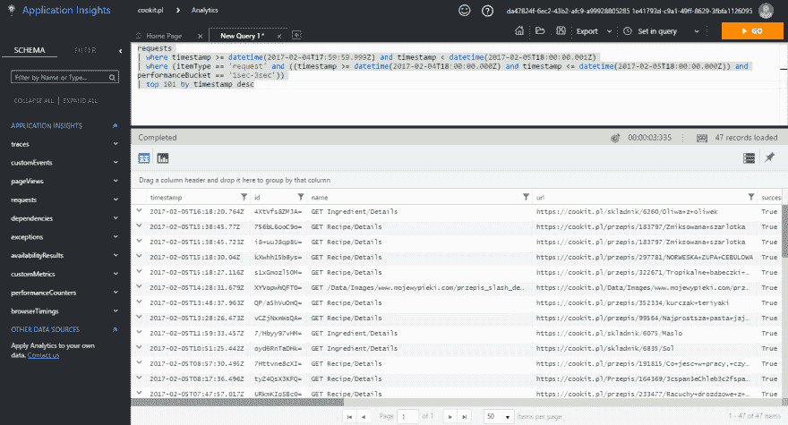](https://res.cloudinary.com/practicaldev/image/fetch/s--c3Hr1yyy--/c_limit%2Cf_auto%2Cfl_progressive%2Cq_auto%2Cw_880/https://indexoutofrange.com/data/2017-02-12-Choosing-centralized-logging-and-monitoring-system/azure_querryEditor.png)

**好人**

*   开箱即用的下水道和浏览器的监控(需要像脚本添加谷歌分析)。
*   可以在不访问代码的情况下添加。这并不允许全部的功能(依赖跟踪和性能监控是可用的)，但是大部分功能。
*   自动检测依赖项，如 HTTP 请求和 ADO(SQL)查询。
*   每月免费 1 gba。
*   有数据限制。
*   有数据采样。
*   Azure 门户中非常好的搜索构建。它在产品和产品实例中进行搜索。这比人们想象的更重要，因为屏幕的数量是巨大的。即使只计算应用洞察模块中的应用。
*   每个 Azure 产品的可定制仪表板(每个面板都可以移动到主仪表板)。
*   顶部栏显示连接的要素。当您打开定价窗口时，它会显示一个指向数据限制窗口的链接。

**坏的**

*   对于 Oracle 数据库来说，应用程序映射检测效果并不好(这可能是一个配置问题，我还没有时间调查)
*   UI 有时会变慢。
*   UI 有时拒绝打开一个窗口。重新装弹会有帮助。

[T4】](https://res.cloudinary.com/practicaldev/image/fetch/s--vzC-gk17--/c_limit%2Cf_auto%2Cfl_progressive%2Cq_auto%2Cw_880/https://indexoutofrange.com/data/2017-02-12-Choosing-centralized-logging-and-monitoring-system/raygun.png)

## 雷枪

我已经决定检查 [Raygun](raygun.com) 主要是因为 Scott Hanselman 的(它甚至在网站上出现)和 [Troy Hunt 的](https://www.troyhunt.com/error-logging-and-tracking-done-right/)推荐。
Raygun，类似于 New Relic，在其名下隐藏了多种服务。在这种情况下，是**脉冲**和**崩溃报告**。
**脉冲**适用于:Android、iOS、maxOS、JavaScript、WordPress、Xamarin。Android 和 Xamarin.iOS 没有。NET 这里，所以我不会探索这条道路。
**崩溃报告**支持 27 种选项，覆盖大部分语言和平台(Ruby、Node、PHP、。NET、Go、ColdFusion 和 mobile)。在使用了一段时间后，我可以说 Raygun 不是我一直在寻找的工具，因为它专注于日志和崩溃报告，而不是监控。也就是说，它做得很好，作为一个工具有它的位置。
它的工作原理是，当出现错误时，它会通知您，并可能将其标记为已修复，但不会部署到生产。这将暂停此类错误的通知。这是一个简单的特性，但却是一个非常有价值的特性，比管理生产健康和优先修复 bug 更有价值。

雷枪面板:
[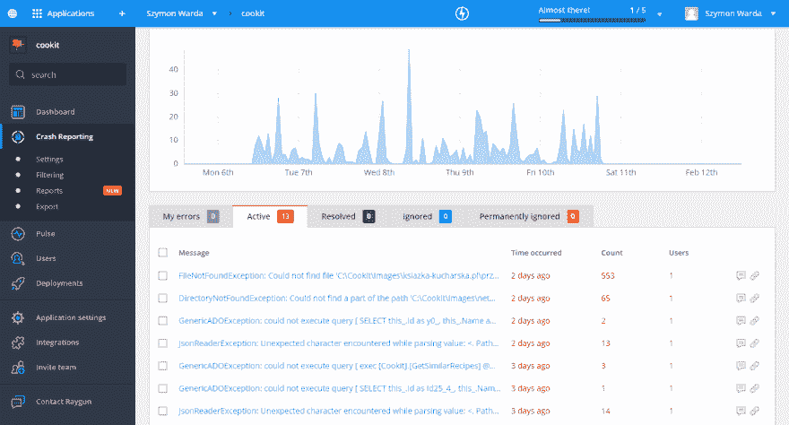](https://res.cloudinary.com/practicaldev/image/fetch/s--8NiuME22--/c_limit%2Cf_auto%2Cfl_progressive%2Cq_auto%2Cw_880/https://indexoutofrange.com/data/2017-02-12-Choosing-centralized-logging-and-monitoring-system/Raygun_panel.png)

**好人**

*   这个标志让我想起了一个老游戏[蚯蚓吉姆](https://en.wikipedia.org/wiki/Earthworm_Jim)，哦，回忆...:)
*   非常精心设计的 UI。
*   易于设置(NuGet 包+ web 配置更改)
*   将错误检查为已修复效果很好
*   过滤不允许您过滤不存在的值。例如，这可以防止拼错浏览器类型。小，但有用的功能。

**坏的**

*   at 注册(演示)需要电话号码、公司名称、公司规模和角色。
*   它只是一种日志聚合机制
*   过滤只有很少的字段可以使用

[T4】](https://res.cloudinary.com/practicaldev/image/fetch/s--TDI8B5KH--/c_limit%2Cf_auto%2Cfl_progressive%2Cq_auto%2Cw_880/https://indexoutofrange.com/data/2017-02-12-Choosing-centralized-logging-and-monitoring-system/Datadog.png)

## Datadog

我早就听说过 [Datadog](https://www.Datadoghq.com) ，但之前从未检查过。第一印象非常好，但很快一切开始走下坡路(见**坏**一节)。
很快就清楚了，Datadog 的目标用户是管理员和需要全面了解他们所拥有的服务器和服务的人。这是一个比我正在寻找的应用程序视图更高的视图。

[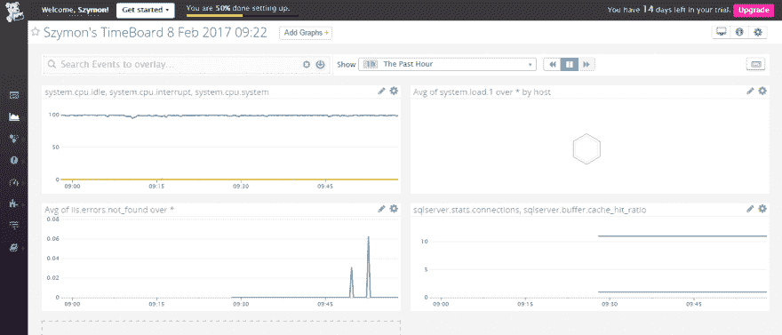T2】](https://res.cloudinary.com/practicaldev/image/fetch/s--EaY85_Va--/c_limit%2Cf_auto%2Cfl_progressive%2Cq_auto%2Cw_880/https://indexoutofrange.com/data/2017-02-12-Choosing-centralized-logging-and-monitoring-system/Datadog_panel.png)

**好人**

*   它可以集成大量的系统(唯一可以监控 Solr 和 Docker 容器的工具)
*   当我终于设法找到一个仪表板，它看起来真的很好。
*   非常可定制的仪表板。让我强烈地想起了格拉芙娜
*   它有基础设施地图
*   它有一个多达 5 台主机的免费(功能有限)版本。

**坏的**

*   代理安装很奇怪。这是通过在命令窗口中运行命令来完成的，之后什么也没有发生。几分钟后(大约 10 分钟)，统计数据开始出现，所以我已经在谷歌搜索是否有人有类似的问题。
*   代理在安装后做最少的工作。它的功能可以通过在网站上添加集成来扩展。这是好的部分。不太好的是，添加新功能需要在服务器上手动更改代理配置和其他服务。这意味着更多的配置和没有干净的卸载:(折回显示如何做得更好。
*   配置文件(必须手动编辑)对制表符敏感(？？！！)
*   没有日志聚合
*   要添加集成，您必须:保存配置文件(在代理中编辑)，启用监控并重新启动代理。
*   我花了比我希望的更长的时间来让 SQL 和 IIS 监控工作

# 对照表

| 服务 | 谷歌分析 | ELK +石墨/ Graphana | 新遗迹 | 追溯 | 应用洞察 | 射线枪 | 数据狗 |
| --- | --- | --- | --- | --- | --- | --- | --- |
| **测井** |  |  |  |  |  |  |  |
| 集中记录 | 普通 | Y | Y | Y |  | Y | Y |
| 日志查询 | 普通 | Y | S | Y |  | Y | N*9 |
| 自定义日志报告 | Y | Y | S | Y |  | Y | 普通 |
| **APM** |  |  |  |  |  |  |  |
| 浏览器错误集合 | 普通 | 加州调查局*4 | Y | 普通 | [Y](https://docs.microsoft.com/en-us/azure/application-insights/app-insights-javascript) | 普通 | 普通 |
| 服务器端性能 | 英国工业联盟 | Y | Y | Y | Y | 普通 | Y |
| 浏览器端性能 | Y | 加州调查局*4 | Y | 普通 | [Y](https://docs.microsoft.com/en-us/azure/application-insights/app-insights-javascript) | 普通 | 普通 |
| 环境绩效 | 英国工业联盟 | 第三方工具*5 | Y | Y | Y | 普通 | 普通 |
| 自定义指标 | 英国工业联盟 | Y | Y | [Y](http://support.stackify.com/hc/en-us/articles/205419705-Custom-Metrics-Overview) | [Y*7](https://docs.microsoft.com/en-us/azure/application-insights/app-insights-search-diagnostic-logs) | 普通 | Y *10 |
| 警报 | 普通 | Y | Y | Y | Y | 普通 | Y |
| 实时视图 | Y | Y | Y | Y | Y | 普通 | Y |
| 自定义性能。报告 | Y | Y | [N](https://docs.newrelic.com/docs/apm/reports) | 普通 | S | 普通 | [Y](https://www.Datadoghq.com/blog/learn-from-your-alerts-with-the-weekly-monitor-trend-report/) |
| 请求相关性详细信息 | 普通 | 普通 | Y | 普通 | Y | 普通 | 普通 |
| **让生活更轻松** |  |  |  |  |  |  |  |
| 移动接入 | Y *13 | 第三方*6 | Y *13 | 普通 | 作品*2 | Y | S |
| OAuth | Y | 普通 | 普通 | 普通 | 普通 | Y | 普通 |
| **特性** |  |  |  |  |  |  |  |
| 应用地图 | 普通 | 普通 | Y | 普通 | Y | 普通 | N*11 |
| 价格 | [有限制的自由]((https://developers.google.com/analytics/devguides/collection/analyticsjs/limits-quotas)) | $60*14 | $150*8 | [$300](https://stackify.com/retrace/) | 免费*3 | [$588](https://raygun.com/pricing#crashreporting) | [自由*12](https://www.Datadoghq.com/pricing/) |

**图例:**

*   CbI -可以实现
*   *2 - Azure portal 可以在移动设备上使用，但不是移动设备的首次体验；)
*   * 3-Application Insights[每月免费高达 1gb](https://azure.microsoft.com/en-us/pricing/details/application-insights/)。还有一个数据上限和数据采样选项，因此保持在限制内是现实的。
*   *4 -您必须实现浏览器端和代理
*   *5 -有第三方工具可用，尽管质量有所不同。
*   *6 -有一个安卓 app [Graphitoid](https://play.google.com/store/apps/details?id=com.tnc.android.graphite&hl=en) 用来看石墨(没试过)。基巴纳似乎[不在手机上工作](https://discuss.elastic.co/t/kibana-charts-dashboards-not-rendering-on-mobile/48614)
*   *7 - Application Insights 有三种类型的事件:事件(发生了一些事情)、指标(一些事情花费了 x 时间)和依赖关系(如果自动检测没有发现这种情况)。也可以记录时间)
*   *8 - New Relic 的定价没有那么直截了当。它基于机器实例的类型和它将运行的小时数。这是我能找到的最便宜的选择。
*   *9 -它支持基本查询，但不允许过滤错误文本，所以对我来说，它是否定的。
*   *10 -如果您将此指标记录为性能计数器，Datadog 可以读取它。
*   *11 -只有基础设施图。
*   *12 -免费版本不包括提醒。
*   *13 -专用应用程序
*   *14 - Kibana 和 Graphite 是免费的，但由于我不想把它安装在我的服务器上，我必须找到一个 SaaS(托管)产品。我能找到的最便宜的是数字海洋。此外，logz.io 有高达 1GB 的免费服务，但没有[定价](http://logz.io/pricing/)(？)在禁用所有添加拦截器和类似扩展后，定价小部件出现在 Edge 上。

# 我有什么选择？

请记住，我正在寻找一个工具，将在我的边项目中使用。这意味着我将花自己的钱，我不喜欢花太多。对过度消费的厌恶是我挥霍无度的主要原因之一(它每年花费我大约 320 美元)。所以价格很重要。

这就是说，我承认我被震惊了，但是**应用洞察**提供了什么和定价。我喜欢它是针对开发者的，仍然非常容易理解。定价模式是最适合我的，因为我可以很容易地控制我是否愿意支付以及支付多少。仍然有一些事情会让我更开心:

*   使用谷歌登录。这是网上最受欢迎的 OAuth 账户，会让我的生活变得轻松一些。我明白为什么这不是选择，但仍然。
*   更快的用户界面。我不了解门户网站中的水疗理念。在一个模块的范围内移动是很棒的，但我不介意从仪表板到 AI 时重新加载
*   更稳定的用户界面。有的窗口全屏打开，有的作为刀片打开(内部 Azure 名)。有时候他们不开门。

第二名是**新遗迹**。它很贵，并不完全是我想要的，但如果我必须向非技术人员报告性能，这将是我选择的服务。它很简单，看起来很漂亮(这比你想象的更重要)，但却能提供足够的信息让你一瞥正在发生的事情。

第三名去**从 Stackify** 回撤。它比前两名有更好的提醒，但没有单一的请求分析，这就是它排名第三的原因。尽管如此，它仍然是一个非常好的工具。另一个好处是，它有一个类似于 Raygun 的静音错误选项。