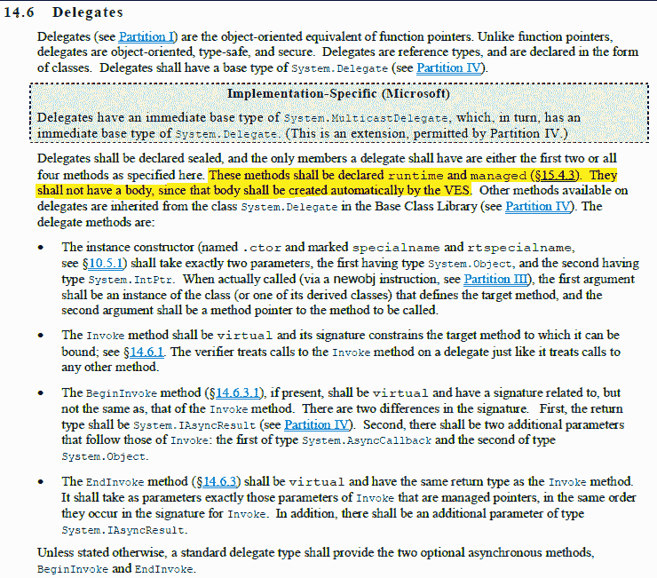
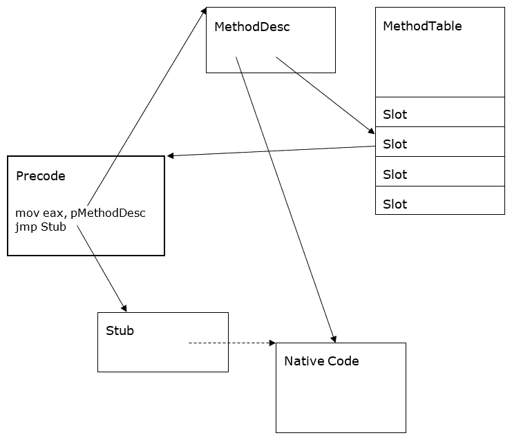

# 你好。网络代表工作？

> 原文:[https://dev.to/mattwarren/how-do-net-delegates-work](https://dev.to/mattwarren/how-do-net-delegates-work)

委托是。虽然你很少直接创建它们，但每次你在 LINQ 使用 lambda(`=>`)或使用`Func<T>` / `Action<T>` to [使你的代码更具功能性](https://blogs.msdn.microsoft.com/madst/2007/01/23/is-c-becoming-a-functional-language/)时，它们就在*幕后*。但是它们实际上是如何工作的，当你使用它们的时候 CLR 中会发生什么呢？

* * *

### IL 代表和/或 lambdas

```
 public delegate string SimpleDelegate(int x);

    class DelegateTest
    {
        static int Main()
        {
            // create an instance of the class
            DelegateTest instance = new DelegateTest();
            instance.name = "My instance";

            // create a delegate
            SimpleDelegate d1 = new SimpleDelegate(instance.InstanceMethod);

            // call 'InstanceMethod' via the delegate (compiler turns this into 'd1.Invoke(5)')
            string result = d1(5); // returns "My instance: 5"
        }

        string InstanceMethod(int i)
        {
            return string.Format("{0}: {1}", name, i);
        }
    } 
```

如果您想看看`SimpleDelegate`类的 IL，那么`ctor`和`Invoke`方法看起来是这样的:

```
 [MethodImpl(0, MethodCodeType=MethodCodeType.Runtime)]
    public SimpleDelegate(object @object, IntPtr method);

    [MethodImpl(0, MethodCodeType=MethodCodeType.Runtime)]
    public virtual string Invoke(int x); 
```

事实证明，这种行为是由规范管理的，来自 [ECMA 335 标准-公共语言基础设施(CLI)](http://www.ecma-international.org/publications/files/ECMA-ST/ECMA-335.pdf) :

[T2】](https://res.cloudinary.com/practicaldev/image/fetch/s--ivTX09Fv--/c_limit%2Cf_auto%2Cfl_progressive%2Cq_auto%2Cw_880/https://d1ax1i5f2y3x71.cloudfront.net/items/173L2w0x1l2l082P1O1e/Screen%2520Shot%25202017-03-06%2520at%252011.28.14%2520AM.png%3FX-CloudApp-Visitor-Id%3D2119651)

因此，委托的内部实现(负责调用方法的部分)是由运行库创建的。这是因为需要对这些方法进行完全控制，委托是 CLR 的基本组成部分，任何安全问题、性能开销或其他低效率都将是一个大问题。

以这种方式创建的方法在技术上被称为`EEImpl`方法，来自“运行时之书”(BOTR)章节[方法描述符-方法描述的种类](https://github.com/dotnet/coreclr/blob/32f0f9721afb584b4a14d69135bea7ddc129f755/Documentation/botr/method-descriptor.md#kinds-of-methoddescs):

> **EEImpl** 委托方法，其实现由运行时提供(Invoke，BeginInvoke，EndInvoke)。参见 [ECMA 335 分区 II -代表们](https://github.com/dotnet/coreclr/blob/32f0f9721afb584b4a14d69135bea7ddc129f755/Documentation/project-docs/dotnet-standards.md)。

这两篇优秀的文章[也提供了更多的信息。NET 类型内部——从微软 CLR 的角度来看](https://www.codeproject.com/Articles/20481/NET-Type-Internals-From-a-Microsoft-CLR-Perspecti?fid=459323&fr=26#16)(关于“委托”的部分)和[理解。净代表和活动，按惯例](https://www.codeproject.com/Articles/26936/Understanding-NET-Delegates-and-Events-By-Practice#Internal)(关于“内部代表”的章节)

* * *

## 运行时如何创建委托

### 委托构造器的内联

我们已经看到运行时负责创建委托方法的主体，但是这是如何完成的呢？按照[“方法描述符”](https://github.com/dotnet/coreclr/blob/master/Documentation/botr/method-descriptor.md)上的 BOTR 页面，它从连接委托构造器(ctor)开始

> 在非托管代码中实现的内部方法。这些是用 method impl attribute(method impl options)标记的方法。InternalCall)属性、**委托构造函数**和 tlbimp 构造函数。

在运行时，当 JIT 编译包含用于创建委托的 IL 代码的方法时，就会发生这种情况。在[编译器::fgOptimizeDelegateConstructor(..)](https://github.com/dotnet/coreclr/blob/0d04afc8f5919edcbb371c1e0c4f832f76aed09f/src/jit/flowgraph.cpp#L7031-L7167)，JIT 首先获得对[正确委托 ctor](https://github.com/dotnet/coreclr/blob/32f0f9721afb584b4a14d69135bea7ddc129f755/src/vm/comdelegate.cpp#L3609) 的引用，在简单的情况下是`CtorOpened(Object target, IntPtr methodPtr, IntPtr shuffleThunk)` [(链接到 C#代码)](https://github.com/dotnet/coreclr/blob/01a9eaaa14fc3de8f11eafa6155af8ce4e44e9e9/src/mscorlib/src/System/MulticastDelegate.cs#L622-L627)，在最后连接`ctor`，[之前，如果可能的话内联](https://github.com/dotnet/coreclr/blob/0d04afc8f5919edcbb371c1e0c4f832f76aed09f/src/jit/importer.cpp#L7366)以获得最大性能。

### [T1】委托 Invoke()方法的创建](#creation-of-the-delegate-invoke-method)

但是更有趣的是在创建`Invoke()`方法时发生的过程，使用一种涉及代码“存根”(原始程序集)的技术，它知道如何定位关于目标方法的信息，并且可以跳转控制到它。这些“存根”实际上在各种各样的场景中使用，例如在[虚拟方法分派](https://github.com/dotnet/coreclr/blob/master/Documentation/botr/virtual-stub-dispatch.md#stubs)期间，以及通过抖动的[(当一个方法第一次被调用时，它命中导致该方法被 JIT 化的“预编码存根”，然后“存根”被对 JIT 化的“本机代码”的调用所替换)。](https://github.com/dotnet/coreclr/blob/master/Documentation/botr/method-descriptor.md#precode)

在委托的特殊情况下，这些存根被称为“混洗 thunks”。这是因为他们必须做的部分工作是“混洗”传递给`Invoke()`方法的参数，以便在调用“target”方法时，这些参数处于正确的位置(堆栈/寄存器)。

为了理解发生了什么，看看下面的图表是很有帮助的，它取自 BOTR 页面上的[方法描述符和预编码存根](https://github.com/dotnet/coreclr/blob/master/Documentation/botr/method-descriptor.md#precode)。我们讨论的“混洗 thunks”是“stub”的一种特殊情况，位于图中相应的方框中:

[T2】](https://res.cloudinary.com/practicaldev/image/fetch/s--ZtK_tLeD--/c_limit%2Cf_auto%2Cfl_progressive%2Cq_auto%2Cw_880/http://mattwarren.oimg/2017/01/Figure%25203%2520The%2520most%2520complex%2520case%2520of%2520Precode%2C%2520Stub%2520and%2520Native%2520Code.png)

### 如何设置“随机思维”

因此，让我们来看看我们在本文开头的示例中创建的委托的代码流，特别是一个“open”委托，调用一个实例方法(如果您想知道 open 和 closed 委托之间的区别，请阅读[“Open Delegates vs . Closed Delegates”](http://blog.slaks.net/2011/06/open-delegates-vs-closed-delegates.html))。

我们从`impImportCall()`方法开始，深入。NET JIT，当遇到代表的[“调用”操作码](https://msdn.microsoft.com/en-us/library/system.reflection.emit.opcodes.call(v=vs.110).aspx)时触发，然后它通过以下函数:

1.  [编译器::impImportCall(..)](https://github.com/dotnet/coreclr/blob/0d04afc8f5919edcbb371c1e0c4f832f76aed09f/src/jit/importer.cpp#L7348-L7353)
2.  [编译器::fgOptimizeDelegateConstructor(..)](https://github.com/dotnet/coreclr/blob/0d04afc8f5919edcbb371c1e0c4f832f76aed09f/src/jit/flowgraph.cpp#L7031-L7167)
3.  [com delegate::GetDelegateCtor(..)](https://github.com/dotnet/coreclr/blob/32f0f9721afb584b4a14d69135bea7ddc129f755/src/vm/comdelegate.cpp#L3440-L3691)
4.  [com delegate::SetupShuffleThunk](https://github.com/dotnet/coreclr/blob/c5abe8c5a3d74b8417378e03f560fd54799c17f2/src/vm/comdelegate.cpp#L584-L632)
5.  StubCacheBase::规范化(..)
6.  [shuffle thunkcache::compile stub()](https://github.com/dotnet/coreclr/blob/c5abe8c5a3d74b8417378e03f560fd54799c17f2/src/vm/comdelegate.cpp#L473-L483)
7.  EmitShuffleThunk(针对不同 CPU 架构的特定汇编代码)
    *   [手臂](https://github.com/dotnet/coreclr/blob/32f0f9721afb584b4a14d69135bea7ddc129f755/src/vm/arm/stubs.cpp#L1534-L1716)
    *   [arm64](https://github.com/dotnet/coreclr/blob/32f0f9721afb584b4a14d69135bea7ddc129f755/src/vm/arm64/stubs.cpp#L1634-L1676)
    *   [i386](https://github.com/dotnet/coreclr/blob/375948e39cf1a946b3d8048ca51cd4e548f94648/src/vm/i386/stublinkerx86.cpp#L3989-L4240)

下面是来自 [arm64 版本](https://github.com/dotnet/coreclr/blob/32f0f9721afb584b4a14d69135bea7ddc129f755/src/vm/arm64/stubs.cpp#L1634-L1676)的代码(选择它是因为它是三个版本中最短的一个！).您可以看到，它发出汇编代码从`MethodPtrAux`获取真正的目标地址，循环遍历方法参数，并将它们放入正确的寄存器(即，将它们“洗牌”到位)，最后发出一个尾调用跳转到与委托相关联的目标方法。

```
 VOID StubLinkerCPU::EmitShuffleThunk(ShuffleEntry *pShuffleEntryArray)
    {
      // On entry x0 holds the delegate instance. Look up the real target address stored in the MethodPtrAux
      // field and save it in x9\. Tailcall to the target method after re-arranging the arguments
      // ldr x9, [x0, #offsetof(DelegateObject, _methodPtrAux)]
      EmitLoadStoreRegImm(eLOAD, IntReg(9), IntReg(0), DelegateObject::GetOffsetOfMethodPtrAux());
      //add x11, x0, DelegateObject::GetOffsetOfMethodPtrAux() - load the indirection cell into x11 used by ResolveWorkerAsmStub
      EmitAddImm(IntReg(11), IntReg(0), DelegateObject::GetOffsetOfMethodPtrAux());

      for (ShuffleEntry* pEntry = pShuffleEntryArray; pEntry->srcofs != ShuffleEntry::SENTINEL; pEntry++)
      {
        if (pEntry->srcofs & ShuffleEntry::REGMASK)
        {
          // If source is present in register then destination must also be a register
          _ASSERTE(pEntry->dstofs & ShuffleEntry::REGMASK);

          EmitMovReg(IntReg(pEntry->dstofs & ShuffleEntry::OFSMASK), IntReg(pEntry->srcofs & ShuffleEntry::OFSMASK));
        }
        else if (pEntry->dstofs & ShuffleEntry::REGMASK)
        {
          // source must be on the stack
          _ASSERTE(!(pEntry->srcofs & ShuffleEntry::REGMASK));

          EmitLoadStoreRegImm(eLOAD, IntReg(pEntry->dstofs & ShuffleEntry::OFSMASK), RegSp, pEntry->srcofs * sizeof(void*));
        }
        else
        {
          // source must be on the stack
          _ASSERTE(!(pEntry->srcofs & ShuffleEntry::REGMASK));

          // dest must be on the stack
          _ASSERTE(!(pEntry->dstofs & ShuffleEntry::REGMASK));

          EmitLoadStoreRegImm(eLOAD, IntReg(8), RegSp, pEntry->srcofs * sizeof(void*));
          EmitLoadStoreRegImm(eSTORE, IntReg(8), RegSp, pEntry->dstofs * sizeof(void*));
        }
      }

      // Tailcall to target
      // br x9
      EmitJumpRegister(IntReg(9));
    } 
```

### 调用`SetupShuffleThunk(..)`的其他功能

下面列出了代码中也会发出这些“混洗思维”的其他地方。它们用于显式创建委托的各种场景，例如通过“Delegate.CreateDelegate(..).

*   [COMDelegate::BindToMethod(..)](https://github.com/dotnet/coreclr/blob/7200e78258623eb889a46aa7a90818046bd1957d/src/vm/comdelegate.cpp#L881-L1099) -实际[调用`SetupShuffleThunk(..)`](https://github.com/dotnet/coreclr/blob/7200e78258623eb889a46aa7a90818046bd1957d/src/vm/comdelegate.cpp#L1019)
*   [com delegate::delegate construct(..)](https://github.com/dotnet/coreclr/blob/7200e78258623eb889a46aa7a90818046bd1957d/src/vm/comdelegate.cpp#L1938-L2174) (ECall impl) -实际[调用`SetupShuffleThunk(..)`](https://github.com/dotnet/coreclr/blob/7200e78258623eb889a46aa7a90818046bd1957d/src/vm/comdelegate.cpp#L2052)
*   [com delegate::GetDelegateCtor(..)](https://github.com/dotnet/coreclr/blob/7200e78258623eb889a46aa7a90818046bd1957d/src/vm/comdelegate.cpp#L3440-L3691) -实际[调用`SetupShuffleThunk(..)`](https://github.com/dotnet/coreclr/blob/7200e78258623eb889a46aa7a90818046bd1957d/src/vm/comdelegate.cpp#L3618)

* * *

## 不同类型的代表

既然我们已经了解了一种类型的委托是如何工作的(下表中的#2“实例打开非虚拟”)，那么了解运行时处理的其他不同类型将会很有帮助。从 CLR 中非常翔实的 [**委托种类表**](https://github.com/dotnet/coreclr/blob/32f0f9721afb584b4a14d69135bea7ddc129f755/src/vm/comdelegate.cpp#L3547-L3567) 来源:

| # | 委托类型 | _ 目标 | _ 方法 Ptr | _methodPtrAux |
| --- | --- | --- | --- | --- |
| one | 实例已关闭 | ‘this' ptr | 目标方法 | 空 |
| Two | **实例打开非虚拟** | **委托** | **shuffle thunk** | **目标方法** |
| three | 实例打开虚拟 | 代表 | 虚拟存根调度 | 方法 id |
| four | 静态关闭 | 第一个参数 | 目标方法 | 空 |
| five | 静态关闭(特殊信号) | 代表 | 特别是 thunk | 目标方法 |
| six | 静态打开 | 代表 | 洗牌铛 | 目标方法 |
| seven | 安全的 | 代表 | 呼叫 thunk | MethodDesc (frame) |

**注:**列映射到代理(从`System.Delegate`)的[内部字段](https://github.com/dotnet/coreclr/blob/b1f5c6acca00ca471818237d698baca317851b1f/src/mscorlib/src/System/Delegate.cs#L23-L38)

因此，我们(特意)研究了简单的情况，但更复杂的情况都遵循类似的原则，只是根据需要使用不同的和更多的存根 thunk，例如“虚拟存根调度”或“调用 thunk”。

* * *

## 代表们特别！！

除了负责创建委托，运行库还特别处理委托，以加强安全性和/或类型安全。您可以在下面的链接中看到这是如何实现的

在 MethodTableBuilder.cpp 中:

*   [对于委托，我们不允许四个特殊方法中的任何一个有任何非运行时实现的主体](https://github.com/dotnet/coreclr/blob/32f0f9721afb584b4a14d69135bea7ddc129f755/src/vm/methodtablebuilder.cpp#L3341-L3352)
*   [不允许 EnC(编辑并继续)替换其中一个运行时内置方法](https://github.com/dotnet/coreclr/blob/32f0f9721afb584b4a14d69135bea7ddc129f755/src/vm/methodtablebuilder.cpp#L6316-L6336)
*   [不允许覆盖四个特殊运行时实现的委托方法中的任何一个](https://github.com/dotnet/coreclr/blob/32f0f9721afb584b4a14d69135bea7ddc129f755/src/vm/methodtablebuilder.cpp#L6706-L6719)

在 ClassCompat.cpp 中:

*   [目前唯一运行时实现的函数是委托实例方法](https://github.com/dotnet/coreclr/blob/32f0f9721afb584b4a14d69135bea7ddc129f755/src/vm/classcompat.cpp#L2749-L2792)
*   [对于委托，我们不允许四个特殊方法中的任何一个有任何非运行时实现的主体](https://github.com/dotnet/coreclr/blob/32f0f9721afb584b4a14d69135bea7ddc129f755/src/vm/classcompat.cpp#L2869-L2880)

* * *

在[/r/编程](https://www.reddit.com/r/programming/comments/5q2w1t/how_do_net_delegates_work/)和 [/r/csharp](https://www.reddit.com/r/csharp/comments/5q3ges/how_do_net_delegates_work/) 中讨论这个帖子

* * *

## 其他链接:

如果你已经读到这里，干得好！！

作为奖励，下面是一些额外的链接，涵盖了你可能想知道的关于代表的更多内容！！

### 一般信息:

*   [委托关键字与 lambda 符号-堆栈溢出](http://stackoverflow.com/questions/299703/delegate-keyword-vs-lambda-notation)
*   【lambdas 和 delegates 在。NET 框架？
*   [为什么 jit 不能内联生成的代码？](https://news.ycombinator.com/item?id=13198805)
*   [传递给函数的内联文字委托](https://github.com/dotnet/coreclr/issues/6737)
*   [代表和事件](http://csharpindepth.com/Articles/Chapter2/Events.aspx)
*   [开放式代表与封闭式代表](http://blog.slaks.net/2011/06/open-delegates-vs-closed-delegates.html)
*   使用 Windbg 自己回答实现问题(委托调用可以内联吗？)
*   [【问题】虚拟存根调度可以“内联”吗？](https://github.com/dotnet/coreclr/issues/8819)
*   [BOTR -虚拟存根调度](https://github.com/dotnet/coreclr/blob/master/Documentation/botr/virtual-stub-dispatch.md)

### 内部代表信息

*   C#代表反击——好奇是福(大多来自单声道 P.O.V)
*   [为通用接口方法](http://stackoverflow.com/questions/7136615/open-delegate-for-generic-interface-method)打开委托(CLR 中的错误)
*   [【ARM/Linux】ARM-soft FP 委托代码生成问题](https://github.com/dotnet/coreclr/issues/5275)
*   [考虑到所有特性，x86 上有四种可能的调用点](https://github.com/dotnet/coreclr/blob/32f0f9721afb584b4a14d69135bea7ddc129f755/src/vm/virtualcallstub.h#L122-L134)
*   VirtualCallStubManager 是存根调度逻辑的核心。参见本书的运行时条目
*   [StubDispatchNotes](https://github.com/dotnet/coreclr/blob/32f0f9721afb584b4a14d69135bea7ddc129f755/src/vm/virtualcallstub.h#L912-L948)
*   [剖析 Go 中的函数调用](https://syslog.ravelin.com/anatomy-of-a-function-call-in-go-f6fc81b80ecc)

### 调试委托人

*   [有用。净委托内部](http://geekswithblogs.net/akraus1/archive/2012/05/20/149699.aspx)
*   [从 MemoScope.Net 委派目标](https://github.com/fremag/MemoScope.Net/wiki/Delegate-Targets)
*   [来自 MemoScope.Net 的 DelegatesAnalysis.cs】](https://github.com/fremag/MemoScope.Net/blob/master/MemoScope/Modules/Delegates/DelegatesAnalysis.cs)
*   [获取委托实例的方法名](https://github.com/Microsoft/clrmd/issues/35)
*   [用 WinDbg 从委托中获取方法名](http://stackoverflow.com/questions/3668642/get-method-name-from-delegate-with-windbg)
*   SOS:用 WinDbg 查找绑定到 EventHandler 的方法。
*   [。NET 及时编译并预热您的系统](https://blogs.msdn.microsoft.com/abhinaba/2014/09/29/net-just-in-time-compilation-and-warming-up-your-system/)

* * *

帖子[如何做。网络代表工作？](http://mattwarren.org/2017/05/25/Lowering-in-the-C-Compiler/)最先出现在我的博客上【mattwarren.org T2】