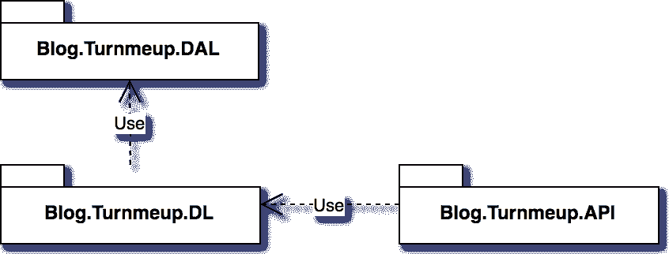
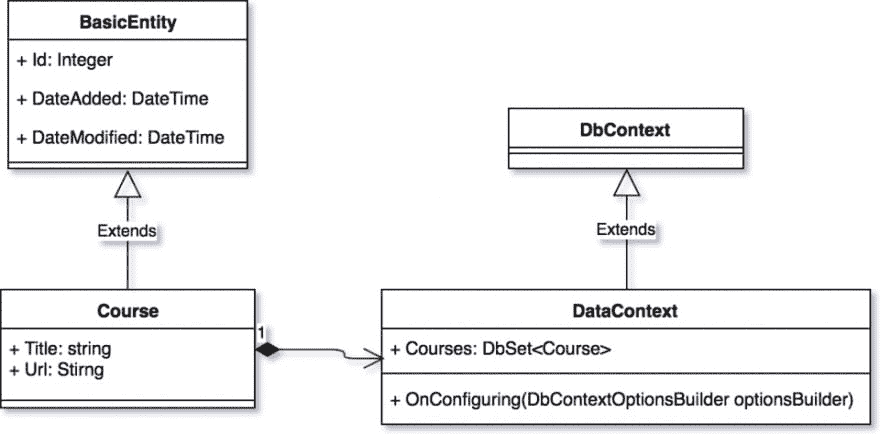
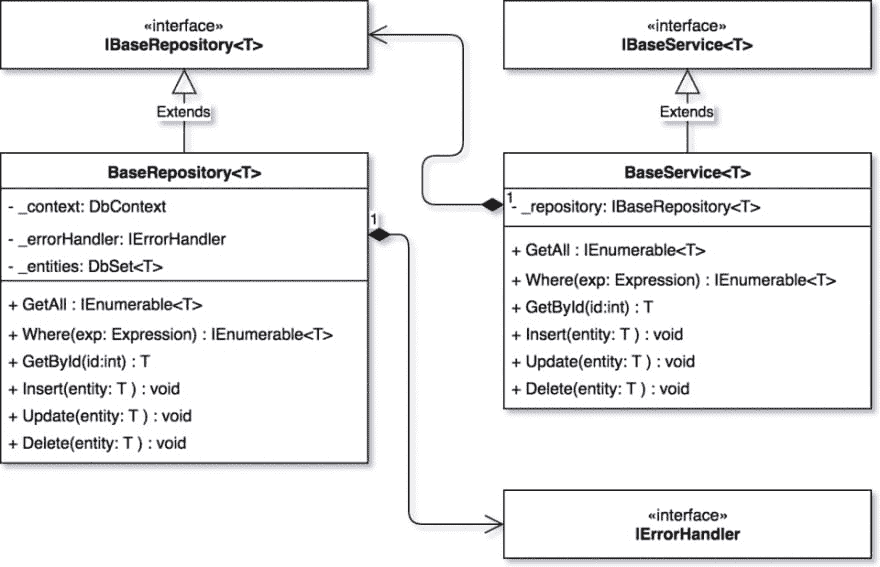
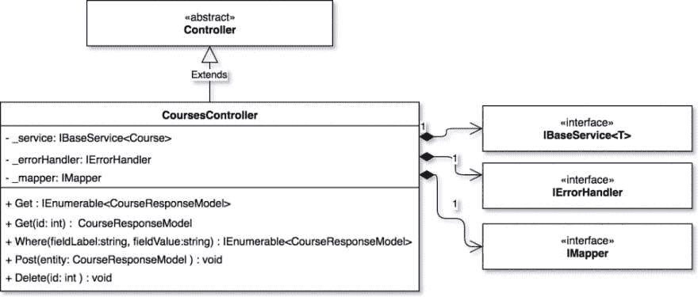

# 使用 ASP.NET 核心实现 SOLID REST API

> 原文:[https://dev . to/samueleresca/implementing-solid-rest-API-using-aspnet-core](https://dev.to/samueleresca/implementing-solid-rest-api-using-aspnet-core)

*最初发布于[我的博客](https://samueleresca.net)T3】*

下面这篇文章展示了如何使用[ASP.NET 核心](https://www.asp.net/core/overview/aspnet-vnext)实现 SOLID REST API。该解决方案使用**通用存储库模式**在数据库上执行 CRUD 操作，并使用 [**xUnit**](https://xunit.github.io/) 作为测试运行器。该解决方案将包含三个关键名称空间:

*   * *数据访问:它将实现关于领域模型和实体间关系的信息。它还将包含有关数据上下文的信息；
*   领域逻辑:它将实现我们的 web APIs 所使用的存储库和服务；
*   API: 它将实现控制器和中间件来管理传入的请求；

该项目在 Github 上[可用。](https://github.com/samueleresca/Blog.Turnmeup)

##### 项目概述

下面是项目结构的简要模式:[](https://res.cloudinary.com/practicaldev/image/fetch/s--1I00YI5o--/c_limit%2Cf_auto%2Cfl_progressive%2Cq_auto%2Cw_880/https://samueleresca.net/wp-content/uploads/2017/02/Blog_Turnmeup_overview.png)—`Blog.Turnmeup.DAL`表示数据访问名称空间，`Blog.Turnmeup.DL`表示域逻辑名称空间，最后`Blog.Turnmeup.API`公开 Rest APIs。

##### 项目测试

单元测试和集成测试涵盖了解决方案的关键部分。Test 项目将使用 [Moq](https://github.com/moq) 作为模拟库，使用[T3】xUnitT5 作为测试运行器。所有测试将包含在两个名称空间中:](https://xunit.github.io/)

*   **DL。测试:**它将包含域逻辑测试；
*   **API。测试:**它将包含 API 测试；

#### 使用实体框架进行数据访问

数据访问层使用[实体框架核心](https://docs.microsoft.com/en-us/ef/core/)作为 ORM。 **[项目](https://github.com/samueleresca/Blog.Turnmeup/tree/master/src/Blog.Turnmeup.DAL)** ( `Blog.Turnmeup.DAL`)包含描述模型数据的实体类。名称空间还定义了包含一些公共属性的模型类。`BaseEntity`是由其他实体类扩展而来的。域逻辑名称空间引用模型来检索数据。下面是项目的模式: [](https://res.cloudinary.com/practicaldev/image/fetch/s--ICERh5xu--/c_limit%2Cf_auto%2Cfl_progressive%2Cq_auto%2Cw_880/https://samueleresca.net/wp-content/uploads/2017/02/Blog_Turnmeup_DAL_Schema-960x473.png) 为了生成数据库模式，您需要在项目的目录中运行以下命令:

```
dotnet ef database update
```

#### 域逻辑层概述

这个 **[项目](https://github.com/samueleresca/Blog.Turnmeup/tree/master/src/Blog.Turnmeup.DL)** ( `Blog.Turnmeup.DL`)实现了领域逻辑层。它将通用存储库模式与通用服务类结合使用。下面是项目概述: [](https://res.cloudinary.com/practicaldev/image/fetch/s--Y625RZVh--/c_limit%2Cf_auto%2Cfl_progressive%2Cq_auto%2Cw_880/https://samueleresca.net/wp-content/uploads/2017/02/Blog__Turnmeup_DL-960x619.png)

##### 单元测试

领域逻辑层被单元测试所覆盖。项目`Blog.Turnmeup.DL.Tests`定义了`CourseServiceTests`类中的单元测试。下面是测试的源代码:[https://gist . github . com/samueleresca/74d c 45 a 58 f 61232 fdf 74c 7 AE 71 B2 E8 a 3](https://gist.github.com/samueleresca/74dc45a58f61232fdf74c7ae71b2e8a3)

##### 模型定义

领域逻辑层还定义了`BaseResponseModel`。`Blog.Turnmeup.API`使用`BaseResponseModel`通过 HTTP 响应序列化数据。`Blog.Turnmeup.API`将使用[自动映射器](http://automapper.org/)将数据访问层模型映射到域逻辑模型。

#### API 命名空间概述

`Blog.Turnmeup.API`定义了通过 HTTP 返回数据的控制器类。`CourseController`处理传入的 HTTP 请求，并调用域逻辑层来检索或更新数据。下面是这个项目的概要: [](https://res.cloudinary.com/practicaldev/image/fetch/s--kiYYw61Z--/c_limit%2Cf_auto%2Cfl_progressive%2Cq_auto%2Cw_880/https://samueleresca.net/wp-content/uploads/2017/02/Blog_turnmeup_API_schema-960x409.png)

##### 依赖注入和类映射

项目使用依赖注入将具体的类注入到接口中。它还使用 [Automapper](http://automapper.org/) 包将`Blog.Turnmeup.DAL`映射到`Blog.Turnmeup.DL`响应模型。依赖注入在`Startup.cs`文件中管理，类映射由`Infrastructure.Mapper`类管理:[https://gist . github . com/samueleresca/59 bea 93 e 513 b 81838 ee 4a 405 fadd e 199](https://gist.github.com/samueleresca/59bea93e513b81838ee3a405fadde199)

##### 单元测试

单元测试涵盖了 Rest APIs 层。项目`Blog.Turnmeup.API.Tests`定义了`CourseControllerTests`类中的单元测试。测试使用`TextFixture`类初始化测试服务器并检索依赖项服务:[https://gist . github . com/samueleresca/8 bcc 68857041 f 9 c 7 D2 B4 bb B4 beb 9 D5 f 7](https://gist.github.com/samueleresca/8bcc68857041f9c7d2b4bbb4beb9d5f7)

#### 最终的想法

你可以在 Github 上找到代码[。该项目可以扩展到其他模型类和其他控制器。在下一篇文章中，我们将使用 ASP.NET 的核心身份](https://github.com/samueleresca/Blog.Turnmeup)来发现认证部分。封面图片由[科拉多·泽妮](http://www.corradozeni.it/)拍摄。干杯:)