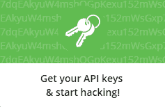

# 在你的应用、网站或其他地方添加条纹支付的最简单方法

> 原文:[https://dev . to/sibizavic/the-easy-way to-add-stripe-payments-in-your-app-website-or-otherwise](https://dev.to/sibizavic/the-easiest-way-to-add-stripe-payments-in-your-app-website-or-elsewhere)

*你可以在这里* 下载本教程的完整源代码

无论您是建立市场、移动应用程序、在线店面还是订阅服务，Stripe 都有您快速入门所需的功能。因此，Lyft、TaskRabbit、Instacart 和许多其他知名公司大量使用它也就不足为奇了。这种支付网关的一个主要优势是，它是为开发者构建的，着眼于易于集成。这是一个重要的优势；将开发时间花在实现支付基础设施上有助于开发人员专注于他们应用程序中更重要的方面。

# 挑战

然而，集成支付仍然有其挑战和缺点。社区面临的一个主要问题是支付服务器的集成。尽管 Stripe 的文档非常详细，但仍然有许多未解的问题，尤其是如果您以前从未实现过服务器的话。此外，一旦你成功地集成了一个服务器，你就需要与你的客户端建立联系，然后找到一种方法在一个 VPS 上 24/7 运行它，比如 Heroku，Cloud9 等等。这可能是一项成本高昂的任务，因为您会发现自己很容易为未使用的服务器容量支付过多的费用。

# 解

在本教程中，我将向您介绍一种集成条纹支付的新方法，它消除了我们刚才提到的所有缺点。我们将利用新的但令人惊叹的 [Stripe 支付 API](https://market.mashape.com/noodlio/noodlio-pay-smooth-payments-with-stripe) (也称为 Noodlio Pay)来取代我们的服务器端。正如您将看到的，这将为您节省大量学习新的服务器语言、测试、验证等宝贵时间。

# 这种方法的好处

*   **很快**:你可以在几分钟内建立一个工作的支付服务器。
*   **无需服务器端设置**:只需从客户端向 Noodlio Pay API 发送`HTTP POST`个请求，剩下的就交给我们了。
*   **经济高效**:全天候托管完整的服务器端可能是一项成本高昂的任务。这将不再是一个担忧:因为 Noodlio 付费服务器已经为您托管，您不必花钱购买未使用的服务器容量。
*   **瞬时**:由于 Stripe 设置，您将看到资金立即转移到您的 Stripe 账户
*   **无限制**:通过 Noodlio Pay 服务器发送的请求数量没有限制。
*   **广泛支持**:您可以通过`HTTP POST`请求向您的客户收取任何客户端语言的费用(例如`Angular`、`React`、`Javascript`等)。).此外，还支持专用的服务器语言，如`CURL`、`Java`、`NodeJS`、`PHP`、`Python`、`Objective-C`、`Ruby`和`.NET`。
*   **测试、预配置和维护**:团队一直在监控、测试和更新服务器，以适应最新的发展。
*   安全:服务器是安全的，它们从不存储任何交易数据。

# 工作原理

## 0。条纹和 Mashape 设置

我们首先需要在应用程序中定义几个常数。如果您正在使用角度/离子`v1.x`，转到`app.js`，复制并粘贴以下内容:

```
// Stripe Payments API
// Obtain from:
// - https://market.mashape.com/noodlio/noodlio-pay-smooth-payments-with-stripe
var NOODLIO_PAY_API_URL         = "https://noodlio-pay.p.mashape.com";
var NOODLIO_PAY_API_KEY         = "<YOUR-MASHAPE-API-KEY>";

// Stripe Account
// Connect on both:
// - https://www.noodl.io/pay/connect and
// - https://www.noodl.io/pay/connect/test
var STRIPE_ACCOUNT_ID           = "<YOUR-STRIPE-ACCOUNT-ID>"

// Define whether you are in development mode (TEST_MODE: true) or production mode (TEST_MODE: false)
var TEST_MODE = false; 
```

`NOODLIO_PAY_API_URL`基本上是服务器的位置，是固定的。变量`TEST_MODE`简单地取值`true`或`false`，并定义我们是处于测试模式(开发)还是生产模式(实际上向用户收费)。现在让我们定义两个常数:

**玛莎佩**

要使用 Stripe Payments API，我们需要获得我们唯一的`NOODLIO_PAY_API_KEY`。为此，前往 [Mashape](https://market.mashape.com/noodlio/noodlio-pay-smooth-payments-with-stripe) ，点击右边的“获取你的 API 密匙并开始破解”或点击“免费注册”。

[T2】](https://market.mashape.com/noodlio/noodlio-pay-smooth-payments-with-stripe)

登录后，您将在 [Stripe Payments API 页面](https://market.mashape.com/noodlio/noodlio-pay-smooth-payments-with-stripe)的请求示例中找到您的唯一 API 密钥:

```
curl -X POST --include 'https://noodlio-pay.p.mashape.com/charge/token' \
  -H 'X-Mashape-Key: <YOUR-MASHAPE-API-KEY>' \
  -H 'Content-Type: application/x-www-form-urlencoded' \
  -H 'Accept: application/json' \
  ... other values 
```

用该唯一标识符替换`NOODLIO_PAY_API_KEY`。

**条纹账户**

如果你还没有[注册一个条纹账户](https://www.stripe.com)。之后，您需要检索您的唯一 Stripe 帐户 ID(字段:`stripe_account`)，您可以在以下页面获得该 ID(注意:您需要访问两个链接一次):

*   生产方式:[https://www.noodl.io/pay/connect](https://www.noodl.io/pay/connect)
*   发展模式:[https://www.noodl.io/pay/connect/test](https://www.noodl.io/pay/connect/test)

条带帐户 ID 看起来有点像`acct_12abcDEF34GhIJ5K`。在定义常量`STRIPE_ACCOUNT_ID`的地方替换它。

就是这样。我们的服务器已经配置好，可以接收付款了。

## 1。获取条纹令牌(`source`)

现在我们可以开始有趣的部分，开始在我们的应用程序中集成支付。为此，我们首先需要获得关键参数`source`。该参数可以是令牌(我们将在本练习中获得)或客户 ID(主要用于经常性付款，我们将在另一个教程中讨论)。由于我们将从客户的信用卡中收费，因此我们需要获得令牌。请注意，在获取令牌时，服务器还会验证用户的信用卡输入。

有两种方法可以获得条带令牌:

### 选项 1:使用条纹支付 API (Noodlio Pay)

这对应于向[条纹支付 API (Noodlio Pay)](https://market.mashape.com/noodlio/noodlio-pay-smooth-payments-with-stripe) 的路径 [`/tokens/create`](https://market.mashape.com/noodlio/noodlio-pay-smooth-payments-with-stripe#tokens-create) 发送带有信用卡输入(`number`、`cvc`、`exp_month`和`exp_year`)的`HTTP POST`请求。为此，我们需要实现一个自定义表单，您的客户可以添加他们的信用卡信息。表单数据随后被发送到 Stripe Payments API，并在成功时返回令牌。

**添加 HTML 表单**

让我们从集成表单和信用卡信息开始。在角度`v1.x`中，我们可以这样做:

```
<div ng-controller="ExampleCtrl">
  <!-- html form -->
  <label class="item item-input">
    <span class="input-label">Card number</span>
    <input type="text" size="20" ng-model="FormData.number" placeholder="4242 4242 4242 4242"/>
  </label>

  <label class="item item-input">
    <span class="input-label">Exp. Mth (MM)</span>
    <input type="text" size="2" ng-model="FormData.exp_month"/ placeholder="01">
  </label>

  <label class="item item-input">
    <span class="input-label">Exp. Year (YYYY)</span>
    <input type="text" size="4" ng-model="FormData.exp_year"/ placeholder="2020">
  </label>

  <label class="item item-input">
    <span class="input-label">Sec. Code (CVC)</span>
    <input type="text" size="4" ng-model="FormData.cvc"/ placeholder="123">
  </label>
</div> 
```

以及一个提交按钮，它通过函数`charge()`链接到我们的控制器`ExampleCtrl`:

```
<div class="padding center">
  <button class="button button-block button-balanced" ng-click="charge()">Submit</button>
</div> 
```

**扩展`HTTP`表头**

要将 FormData 发送给 Stripe Payments API，我们需要向`NOODLIO_PAY_API_URL`发出一个 HTTP 请求，这在 Angular `v1.x`中可以通过依赖关系`$http`来实现。因此，我们将控制器定义如下:

```
.controller('ExampleCtrl', ['$scope', '$http', function($scope, $http) {

  // ...

}]); 
```

*注意:为了达到最佳实践，您应该在工厂或服务部门进行此操作*

因为它是通过 Mashape 托管的，所以我们还需要在请求中添加身份验证头。我们可以通过使用`NOODLIO_PAY_API_KEY`并将其包含在`$http`方法的头中来做到这一点。如果您查看路由`charge/token` 的[文档，cURL 请求的第一部分看起来像这样:](https://market.mashape.com/noodlio/noodlio-pay-smooth-payments-with-stripe#charge-token)

```
curl -X POST --include 'https://noodlio-pay.p.mashape.com/charge/token'
  -H 'X-Mashape-Key: 3fEagjJCGAmshMqVnwTR70bVqG3yp1lerJNjsnTzx5ODeOa99V'
  -H 'Content-Type: application/x-www-form-urlencoded'
  -H 'Accept: application/json'
  ... other variables 
```

从中我们可以看到，为了向 API 发送请求，我们需要包含头`X-Mashape-Key`、`Content-Type`和`Accept`。在角度`v1.x`中，这转化为:

```
.controller('ExampleCtrl', ['$scope', '$http', function($scope, $http) {

  // add the following headers for authentication
   $http.defaults.headers.common['X-Mashape-Key']  = NOODLIO_PAY_API_KEY;
   $http.defaults.headers.common['Content-Type']   = 'application/x-www-form-urlencoded';
   $http.defaults.headers.common['Accept']         = 'application/json';

}]); 
```

**获取令牌**

既然我们的头已经配置好了，我们可以继续实现函数来获取我们的`source`参数的令牌。以下是我们用来获取条带令牌的示例代码:

```
// part of ExampleCtrl

$scope.FormData = {
    number: "4242424242424242",
    cvc: "256",
    exp_month: "08",
    exp_year: "2018",
    test: TEST_MODE,
  };

$scope.charge = function() {

  // init for the DOM
  $scope.ResponseData = {
    loading: true
  };

  // create a token and validate the credit card details
  $http.post(NOODLIO_PAY_API_URL + "/tokens/create", $scope.FormData)
  .success(
    function(response){

      if(response.hasOwnProperty('id')) {
        var token = response.id; $scope.ResponseData['token'] = token;

        // --> success, proceed with charging the user
        proceedCharge(token);
      } else {
        $scope.ResponseData['token'] = 'Error, see console';
        $scope.ResponseData['loading'] = false;
      };

    }
  )
  .error(
    function(response){
      $scope.ResponseData['token'] = 'Error, see console';
      $scope.ResponseData['loading'] = false;
    }
  );
}; 
```

从这个例子中可以看出，我们向 url `NOODLIO_PAY_API_URL + "/tokens/create"`发送了一个`HTTP POST`请求，其中包含与用户信用卡信息对应的表单编码参数。当响应有一个属性`id`，即一个令牌(`source`，那么我们继续通过函数`proceedCharge(token)`向用户收费(我们将在下面讨论)。我们将变量`ResponseData`绑定到`$scope`来通过 DOM 更新用户的支付状态(这是可选的)。你可以在[官方文档](https://market.mashape.com/noodlio/noodlio-pay-smooth-payments-with-stripe#tokens-create)中看到一个成功的回复(在回复正文的右边)。

### 选项 2:使用 Stripe 的原生结账形式

结帐表单是一个可嵌入的支付表单，适用于桌面、平板电脑和移动设备。它在你的网站内工作:客户可以立即支付，而不需要被重定向来完成交易。

结帐表单的集成将在另一个教程中讨论。如果您想自己集成它，您可以获得一个示例源代码，或者阅读关于如何在您的应用程序中嵌入结帐表单的指南/教程，使用以下语言: [Ionic/Angular](https://github.com/noodlio/noodlio-pay-ionic-example) 、 [Sinatra](https://stripe.com/docs/checkout/sinatra) 、 [Rails](https://stripe.com/docs/checkout/rails) 、 [Flask](https://stripe.com/docs/checkout/flask) 和 [PHP](https://stripe.com/docs/checkout/php)

## 2。向客户收费

现在您已经从步骤 1 中获得了令牌(`source`)，让我们继续向用户收费。我们可以通过向 Stripe Payments API 的另一个路径发送另一个`HTTP POST`请求来做到这一点: [`charge/token`](https://market.mashape.com/noodlio/noodlio-pay-smooth-payments-with-stripe#charge-token) 。正如我们从文档中看到的，表单编码参数在这种情况下是`amount`、`description`(可选)、`currency`和`stripe_account`。随着第 1 步中集成的完成，这已经是小菜一碟，对应于:

```
// part of ExampleCtrl
// includes also the header extensions at the top

// charge the customer with the token from Step 1
function proceedCharge(token) {

  var param = {
    source: token,
    amount: 100, // amount in cents
    currency: "usd",
    description: "Your custom description here",
    stripe_account: STRIPE_ACCOUNT_ID,
    test: TEST_MODE,
  };

  $http.post(NOODLIO_PAY_API_URL + "/charge/token", param)
  .success(
    function(response){

      // --> success
      $scope.ResponseData['loading'] = false;

      if(response.hasOwnProperty('id')) {
        // success, check your Stripe account
        var paymentId = response.id; $scope.ResponseData['paymentId'] = paymentId;
      } else {
        $scope.ResponseData['paymentId'] = 'Error, see console';
      };

    }
  )
  .error(
    function(response){
      $scope.ResponseData['paymentId'] = 'Error, see console';
      $scope.ResponseData['loading'] = false;
    }
  );
}; 
```

设置是类似的，如果响应有一个`id`，那么这对应于`paymentId`(存储在您的数据库中以供参考)，这相当于一次成功的充电。这也意味着你应该已经收到了你的 Stripe 账户上的资金，可以在你的[仪表盘](https://dashboard.stripe.com/dashboard)中看到。不要忘记用美分来定义`amount`。因此，参数`stripe_account`指示资金应该转移到哪个条账户。确保您包含了正确的 ID(参见步骤 0)。
你可以在[官方文档](https://market.mashape.com/noodlio/noodlio-pay-smooth-payments-with-stripe#charge-token)中看到一个成功的回复(在回复正文的右边)。

# 包装完毕

就是这样，你成功地将条纹支付融入到了你的工作中。正如你所看到的，这实际上是小菜一碟，设置非常短。现在你可以专注于你的应用程序的更重要的方面，并开始从中赚钱。

如果您有任何问题、意见或建议，请告诉我们。我们很高兴收到您的来信。

# 模板&源代码

**离子 1.x /角度 1.x**

你可以从这个库下载完整的源代码。它还包括一个带检验的例子。虽然这些例子是在 Ionic 应用程序中用 AngularJS 编写的，但是在其他项目中重用大部分代码是很容易的(无论是原生的还是混合的)

**离子 2.x /角度 2.x**

如果你正在寻找一个由最新版本的 Ionic 2.x / Angular 2.x 构建的启动器，那么看看[这个伟大的启动器](https://www.noodl.io/market/product/P201702241736843/stripe-with-ionic2-quickly-and-easily-integrate-stripe-in-your-ionic2-app)。

**自己的模板**

如果你已经用 Stripe Payments API (Noodlio Pay)实现了自己的模板/入门/教程，并且想在这里列出来，请[让主人知道](mailto:noodlio@seipel-ibisevic.com)，你就可以获得奖励。

# 定价

Mashape 上托管的 API 的使用是免费的，您可以提出无限的请求。 [**点击此处查看补充许可**](https://www.noodl.io/pay/plans)