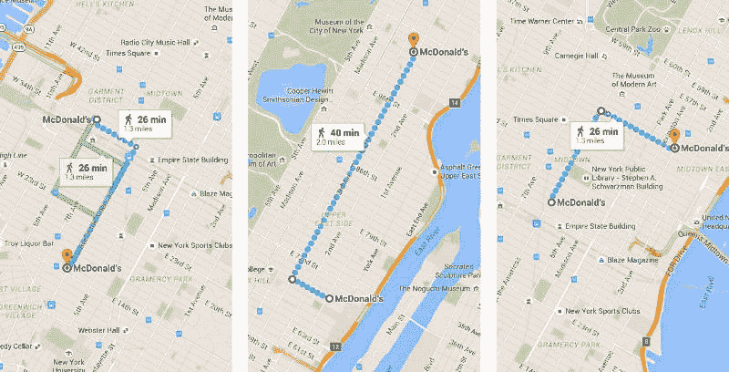
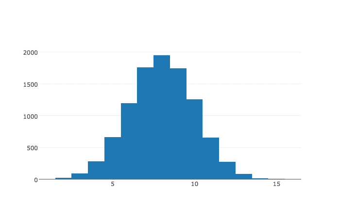
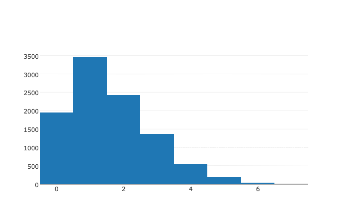

# 网格解锁:使用 Python 模拟演示更快的行走方式

> 原文：<https://dev.to/walker/grid-unlock>

我是一名数据科学家，喜欢在他的家乡纽约市进行实验。本文使用 Python 中内置的一些简单的模拟器来比较两种路线选择方法，结果显示在 plot.ly.

在纽约市漫步时，我最讨厌的事情之一就是我的同行者选择了一条低效的路线去我们的目的地。特别是，似乎许多步行者无意识地坚持在终点之间走“L”型路线，而事实上，红绿灯的存在创造了一个机会，通过更频繁地转弯来节省你的旅程时间。

这种疏忽可能是由于我们将网格理解为仅用两条线连接点的方式，也是数字地图在建议路线时给我们的强化，这些路线通常是单圈的:

[T2】](https://res.cloudinary.com/practicaldev/image/fetch/s--fB6B9L9_--/c_limit%2Cf_auto%2Cfl_progressive%2Cq_auto%2Cw_880/https://cdn-images-1.medium.com/max/800/1%2A3gtE46rOKowJ6xvgWO8pog.jpeg)

当然，如果你被限制在一个预定的单行道上，你就要受街区之间的任何“走/不走”标志的支配。尽管纽约人在迎面而来的车辆之间选择过马路的时间是一门名副其实的科学，但在某些路口，你只能等待。

另一方面，如果你愿意多次转弯，曲折地到达目的地，如果你遇到一只红色的手，你可以自由地沿着另一条轴线移动。根据定义，这些转弯的动机是确保它们可以立即使用:在一个标准的十字路口，一条路上的车辆会停下来，这样它就可以在另一条路上行驶。最后，解决这些延误不会延长你旅行的实际距离，因为无论如何，你路线中的路段会增加整个行程。

我们中的许多人可能已经有意或无意地将这一逻辑融入了我们的行走中。但是我想用 Python 建立一个简单的模拟器来量化我们到底能节省多少时间。

假设你在一个 8×8 的网格上，你需要从西南角到东北角，距离是 16 个单位。在每一个转折点都有一个红灯，我们每次都有 50%的机会停止你的前进，并增加一分钟的延迟。

```
import random
def dumbwalk(up, over):
    # set timer and position
    delay = 0
    up_progress = 0
    over_progress = 0

    # walks north until nothern boundary is reached 
    # confronts stoplight (flip) before each block
    while up_progress < up:
        flip = random.randint(0,1)
        if flip == 1:
            delay += 1
        up_progress += 1

    # then walks east until finish line 
    # confronts stoplight (flip) before each block
    while over_progress < over:
        flip = random.randint(0,1)
        if flip == 1:
            delay += 1
        over_progress += 1

    return delay 
```

如果您对此过程运行 10，000 次试验，然后绘制结果图，您将得到一个以 8 分钟延迟为中心的良好正态分布:

```
import plotly.plotly as py
import plotly.graph_objs as go

dumb_delays = [dumbwalk(8,8) for i in range(10000)]
data = [go.Histogram(x=dumb_delays)]
py.iplot(data, filename='basic histogram') 
```

[T2】](https://res.cloudinary.com/practicaldev/image/fetch/s--QnPrdNug--/c_limit%2Cf_auto%2Cfl_progressive%2Cq_auto%2Cw_880/http://i.imgur.com/087x7l3.png)

我们从图表中得到了这个特殊的形状，因为我们面对红灯的场景类似于连续 16 次投掷硬币，所以我们得到了以 8 为中心的[二项式分布](https://en.wikipedia.org/wiki/Binomial_distribution)。

这次让我们来模拟一下更聪明的，转向重的方法。

```
def smartwalk(up, over):
    # set timer and position
    delay = 0
    up_progress = 0
    over_progress = 0

    # begins by walking vertically
    direction = "up"

    while up_progress < up or over_progress < over:
        # approximates dumbwalk on either border
        if up_progress == up:
            flip = random.randint(0,1)
            if flip == 1:
                delay += 1
            over_progress += 1

        elif over_progress == over:
            flip=random.randint(0,1)
            if flip == 1:
                delay += 1
            up_progress += 1

        # otherwise walker will continue in direction for greens and pivot for reds
        else:
            if direction == "up":
                flip = random.randint(0,1)
                if flip == 1:
                    direction = "over"
                    over_progress += 1
                else:
                    up_progress += 1

            elif direction == "over":
                flip = random.randint(0,1)
                if flip == 1:
                    direction = "up"
                    up_progress += 1

                else:
                    over_progress += 1

    return delay 
```

现在，如果你还没有到达你的水平或垂直边界，你可以每次简单地改变方向，而不是被要求在你遇到的每个红灯前等待。这实际上节省了多少时间？让我们再进行 10，000 次试验:

```
smart_delays = [smartwalk(8,8) for i in range(10000)]
data = [go.Histogram(x=smart_delays)]

py.iplot(data, filename='basic histogram') 
```

[T2】](https://res.cloudinary.com/practicaldev/image/fetch/s--wjZkhvDR--/c_limit%2Cf_auto%2Cfl_progressive%2Cq_auto%2Cw_880/http://i.imgur.com/FBJ5PLg.png)

如直方图所示，通过使用“智能行走”方法，您可以在 20%的时间内实现无延迟行走，在 80%的时间内实现两次或更少的延迟。这和平均被红灯打断 8 次有天壤之别！

这种方法的概率质量函数比“哑铃步”及其二项式模拟要复杂得多。我花了很多咖啡和皱巴巴的纸才弄明白，如果你感兴趣的话，在这篇博文中有[的解释。](https://perplex.city/grid-unlock-explanation-of-smart-walk-model-5c07491879d7#.t7nnznu0l)

否则，感谢你的阅读，下次当你走过一个城市时，记住:网格最大的礼物不是你可以在遥远的地点之间制造的一个大 L，而是你可以用许多小 L 来代替它。