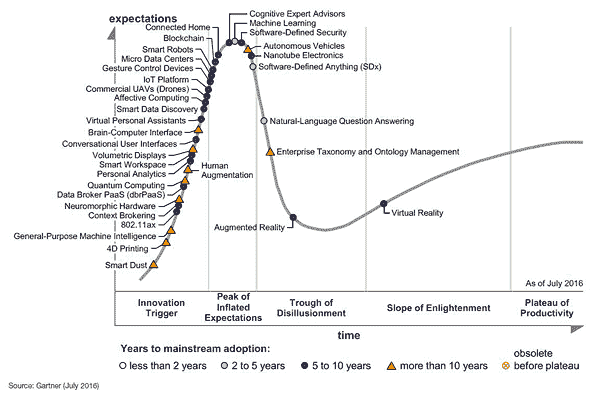
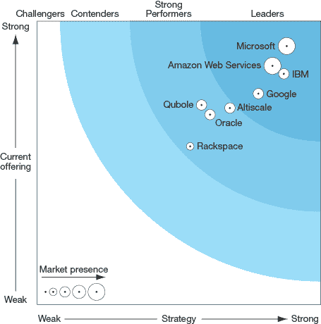
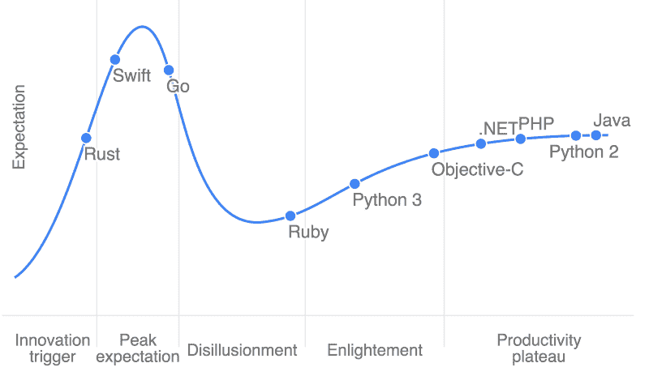
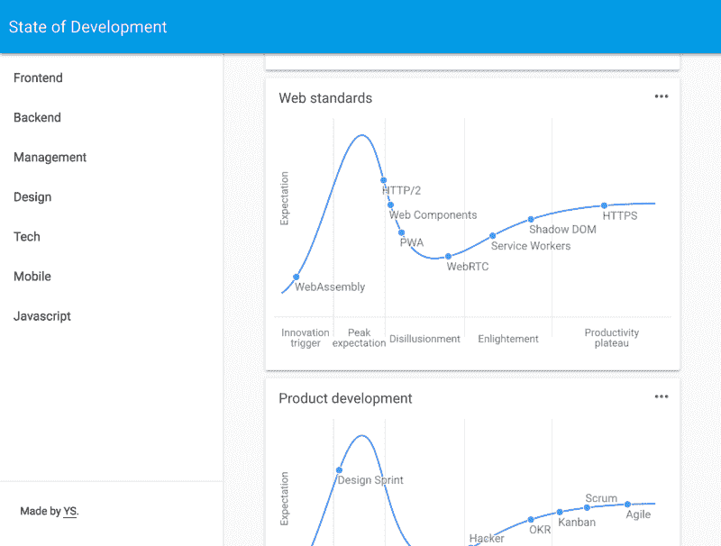

# 发展状态:当前发展状态的可视化

> 原文:[https://dev . to/yvoschaap/stateoffdev-visualization-of-the-current-state-of-the-development](https://dev.to/yvoschaap/stateofdev-visualization-of-the-current-state-of-development)

# 发展状态

今天我发布了 [State.of.dev](https://stateofdev.com/) ，这是一个可视化当前开发状态的项目，按照关键主题进行划分。太棒了，太棒了，你会喜欢的…

我喜欢数据的可视化。乍看之下，它提供了一个快速概览，但放大后，它也提供了关系之间更深层次的含义。我最喜欢的一个形象化的例子是 Gartner 炒作周期:

[T2】](https://res.cloudinary.com/practicaldev/image/fetch/s--FKozrKa9--/c_limit%2Cf_auto%2Cfl_progressive%2Cq_auto%2Cw_880/https://cdn-images-1.medium.com/max/800/1%2ArK5YUxV3tjnHRFgNGeywgQ.png)

IT 咨询公司 Gartner 几十年来一直在创造这种模式。他们试图通过将炒作与生产力分开来捕捉新兴技术的状态。

它将来自 VR、AR、机器学习、物联网和量子计算的主题放在一个视觉表示中。一张图表。横轴表示技术阶段，纵轴表示预期。

这种可视化之所以如此吸引人，是因为它为你了解和探索某个市场及其关键技术提供了一个
起点。

这些信息可以帮助你决定是将你的时间和金钱投入到一项新兴技术中，还是等待炒作过去。

另一个例子是另一家咨询公司 Forrester，他制作了下面的图表来捕捉大数据
Hadoop 云玩家的状态:

[T2】](https://res.cloudinary.com/practicaldev/image/fetch/s--lULV1tx---/c_limit%2Cf_auto%2Cfl_progressive%2Cq_66%2Cw_880/https://cdn-images-1.medium.com/max/800/1%2Adn274lyUoylpBUFJSSDldg.gif)

就个人而言，它包含了太多的信息(战略质量、产品提供深度和市场存在)，但提供了对市场中参与者定位的有趣概述。

在此基础上，stateofdev.com 背后的理念得以发展。它提供了广泛的专家主题、特定的市场图表类型，并通过定位相关(新兴)技术所处的阶段来识别它们。

[T2】](https://res.cloudinary.com/practicaldev/image/fetch/s--5-3nsOXF--/c_limit%2Cf_auto%2Cfl_progressive%2Cq_auto%2Cw_880/https://cdn-images-1.medium.com/max/800/1%2AYkm98Z2TW8Si8lFgB-mWNQ.png)

State.of.dev 有交互式图表，代表主题中的当前开发状态:[技术](http://stateofdev.com/t/technology)、 [javascript 框架](http://stateofdev.com/t/javascript-frameworks)、 [web 标准](http://stateofdev.com/t/web-standards)、[设计趋势](http://stateofdev.com/t/design)、 [SEO](http://stateofdev.com/t/seo) 以及超过 15 个主题，按特定的专家分组，如[前端](https://stateofdev.com/c/frontend)、[初创公司](https://stateofdev.com/c/startups)或
、移动。

### 它解决了什么

*   对市场内正在发生的事情(创新、采用、趋势)的直升机式概述，而不必从新闻网站、时事通讯、论坛等中单独提取。
*   了解最新的新兴技术、范例、趋势和工具。
*   对关键趋势的成熟度和采用生命周期做出可行决策的基础。

### 它应该进化成什么样子

*   最新技术创新资源。
*   可视化一个(专家)主题的状态，识别当前的相关趋势及其状态。
*   更深入研究的起点。
*   专家和/或社区对每个版本的意见。
*   技术发展趋势的时间表。
*   广泛的操作主题(超越网络开发)。

### 现在是什么样子

*   一个非常早期的测试版本，有第一个版本的图表和背景信息。
*   web 开发的状态，基于我自己的专业知识(还没有外部的贡献)。

[来看看](https://stateofdev.com/)。

[T2】](https://res.cloudinary.com/practicaldev/image/fetch/s--n8EjYpER--/c_limit%2Cf_auto%2Cfl_progressive%2Cq_auto%2Cw_880/https://cdn-images-1.medium.com/max/800/1%2A4aMW5uI0wNL1rpjeGgzhkQ.png)

PS:如果想投稿 ping 我 [@yvoschaap](https://twitter.com/@yvoschaap) 。