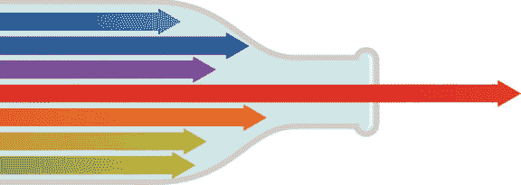
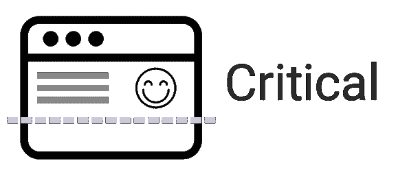

# 在你的网站上实现关键的 CSS

> 原文:[https://dev . to/gaijinity/implementing-critical-CSS-on-your-website-110 b](https://dev.to/gaijinity/implementing-critical-css-on-your-website-110b)

# 在你的网站上实现关键的 CSS

### 实现关键的 CSS 是现代网站开发的重要组成部分，本文将向您展示如何实现

安德鲁·韦尔奇

[T2】](https://res.cloudinary.com/practicaldev/image/fetch/s--YxntSGvq--/c_limit%2Cf_auto%2Cfl_progressive%2Cq_auto%2Cw_880/https://nystudio107-ems2qegf7x6qiqq.netdna-ssl.com/img/blog/_1200x675_crop_center-center_82_line/critical-css-stopwatch.jpg)

当我批评许多前端开发人员调用 CSS 时，我经常会遇到一种混淆和怀疑的情况。“哦，你是那种人，”他们想。*流苏。*

但是，我称之为 CSS 的批评并不仅仅是为脖子上的胡子保留的理论实践；这是现代 web 开发的重要部分。关于它是什么和它做什么有很多争议，所以让我们来解释一下。

<aside>Our goal is sim­ply to get the web­page to ren­der as quick­ly as we can for our user. Crit­i­cal CSS is an impor­tant tool to help us reach that goal.</aside>

我称之为 CSS 的关键是对网站访问者的尊重和 T2 的尊重。他们已经大胆地访问了我们的网站——有些营销型的人花了大量的时间和金钱来创造机会——我们有责任让他们确信他们做了一个好的决定，并尊重他们的时间。

这意味着我们不会让他们等待。人们讨厌等待。由于[一个公正的网站是不够的](https://dev.to/gaijinity/a-pretty-website-isn-8217-t-enough-1nbj-temp-slug-3932740)文章详细讨论，他们可能会从各种设备和环境的角度来看我们的网站，在这种情况下耐心是不可能的。

我称之为 CSS 的关键是构建一个个性化的 mant 网站的一个方面，使我们的用户愉快，并使我们的搜索引擎结果页面(SERP)愉快。我不会在这里讨论 SEO 的本质，但是如果你感兴趣，你可以在[现代 SEO:蛇油与物质](https://dev.to/gaijinity/modern-seo-snake-oil-vs-substance-4l5k-temp-slug-8632935)文章中读到更多。

[T2】](https://res.cloudinary.com/practicaldev/image/fetch/s--lfbA0-rr--/c_limit%2Cf_auto%2Cfl_progressive%2Cq_auto%2Cw_880/https://nystudio107-ems2qegf7x6qiqq.netdna-ssl.com/img/blog/_1200x675_crop_center-center_82_line/happy-people.jpg)

这是我们的目标。现在我们来看看怎么做。

## 那么，我称之为 CSS 到底是什么意思呢？

我称之为 CSS 是简单的一种方法，只提取在网站上显示“文件夹之上”的内容所需的 CSS，然后在我们的网页上链接 CSS。通过这样做，我们可以确保浏览者可以立即阅读用户看到的页面。

“折叠以上”这个短语来自于我们以前用枯树做的一个叫做“新闻报纸”的东西。任何在报纸“折页上方”的东西，都会被浏览折叠报纸头版的人立即看到。

[T2】](https://res.cloudinary.com/practicaldev/image/fetch/s--c074Z3vW--/c_limit%2Cf_auto%2Cfl_progressive%2Cq_auto%2Cw_880/https://nystudio107-ems2qegf7x6qiqq.netdna-ssl.com/img/blog/_992x558_crop_center-center_82_line/newspaper-above-the-fold.jpg)

因此，我们将这个短语用于我们现代的“物联网”世界，意思是用户在他们的设备上无需任何滚动就可以看到的内容。我们希望它能快速加载，所以我们使用了 CSS。

不需要等待加载一个基于框架的 CSS，不需要浏览器构建大量的子目录树，也不需要额外的请求来加载 CSS。就在那里。

然后，当用户正在阅读我们的网页，可能正在啜饮他们的咖啡时，我们异步加载整个网站的 CSS *并缓存在他们的设备上。*

<aside>This con­tributes enor­mous­ly to per­ceived per­for­mance, a key met­ric of vis­i­tor satisfaction</aside>

在你向异教徒扔石头之前，是的，我们正在联系 CSS。这并不是一件本质上的坏事；事实上，谷歌的聪明人已经把它作为谷歌标准的一部分[强制执行。](https://dev.to/gaijinity/google-amp-should-you-care-3din-temp-slug-933989)

但是我们做得很聪明。当他们第一次访问我们的网站时，我称之为 CSS 的评论是内联的。毕竟，第一印象非常重要。在那之后，因为我们知道他们已经下载并缓存了我们整个网站的 CSS，我们只需设置一个 cook ie，这样我们就不再需要额外加载 CSS 了。

这使得它很快。我们建立 mant 网站的目标是消除瓶颈，使浏览者能以最快的速度阅读我们的网页，让浏览者微笑。

即使图像和其他网页元素仍然在加载，至少在*的时候*，人们将能够阅读网站上的文本。任何事情都比从空白的白色屏幕开始要好。

此外，我们根据 Craft CMS 中的[优化图像来优化我们的图像加载，对吗？](https://dev.to/gaijinity/creating-optimized-images-in-craft-cms-2hc5-temp-slug-2354251)

在一个典型的网页上，非临界 CSS 的大小通常在`10k`到`30k`之间，这取决于设计者对 CSS 选择的疯狂程度。所以它一点也不差，与图片和其他典型的网页负载相比，它的积极意义要小得多。

[T2】](https://res.cloudinary.com/practicaldev/image/fetch/s--jT4a4cs8--/c_limit%2Cf_auto%2Cfl_progressive%2Cq_auto%2Cw_880/https://nystudio107-ems2qegf7x6qiqq.netdna-ssl.com/img/blog/_576x205_crop_center-center_100_line/bottleneck.jpg)

你可能已经在一个网站上运行过 [Google Page Speed Insights](https://developers.google.com/speed/pagespeed/insights/) ，并且不知道为什么它在上面的内容中解释了**取消了对 JavaScript 和 CSS 的限制。这就是我们使用我称之为 CSS 的 Crit 的目的。**

CSS 部分，无论如何，对于阻塞 JavaScript，你需要使用一个异步 JavaScript 加载器，如[Load JS as a Light weight JavaScript Loader](https://dev.to/gaijinity/loadjs-as-a-lightweight-javascript-loader-3c1k-temp-slug-8245779)&[使用 Sys temJS as a JavaScript Loader](https://dev.to/gaijinity/using-systemjs-as-a-javascript-loader-54ff-temp-slug-340380) 文章中所述。

以免你认为`http2`会为你解决这个问题，它不会。虽然`http2`支持关键资源的服务器推送，但并不是所有的 web 服务器都支持它，也不是所有的 web 浏览器都支持它。

即使他们这样做了，你仍然只有*个*管道，你试图把这些资源推下去，所以我们仍然不想在我们的网站可以加载之前把我们全部的 CSS 推下去。我们*仍然*需要一种方法来提取需要的 CSS 来定义“在折叠之上”的内容，即使有`http2`。

我们在这里做的基本上是 [PRPL 模式](https://developers.google.com/web/fundamentals/performance/prpl-pattern/)，这是设计现代网站时使用的一个非常重要的模式:

*   **推送**初始 URL 路由的关键资源。
*   这是第一条路线。
*   **预缓存**剩余路线(见[服务人员和离线浏览](https://dev.to/gaijinity/serviceworkers-and-offline-browsing-2gi2-temp-slug-4847358))。
*   **延迟装载**并按需创建剩余路线。

如果这听起来像是男人们在说的话，其实并不难做到。你正在阅读的这个网站正在使用它，效果很好:

[T2】](https://res.cloudinary.com/practicaldev/image/fetch/s--umYEk8JV--/c_limit%2Cf_auto%2Cfl_progressive%2Cq_auto%2Cw_880/https://nystudio107-ems2qegf7x6qiqq.netdna-ssl.com/img/blog/_768x700_crop_center-center_100_line/pagespeed_insights.png)

你将需要使用某种形式的前端工作流程自动化工具；这是否意味着[咕哝](http://gruntjs.com/)或[吞咽](http://gulpjs.com/)或 [npm 脚本](https://medium.freecodecamp.com/why-i-left-gulp-and-grunt-for-npm-scripts-3d6853dd22b8#.bfemirh8o)取决于你。如果您还没有使用，您可以在 2017 年 front tend Dev Best practices 文章中了解更多信息。

那么这只是一个设置东西的问题。

## 用 Craft CMS 实现 Crit i cal CSS

说得够多了，我们如何让这件事发生？这里列出的技术将展示我们如何用 [Craft CMS](https://craftcms.com/) 实现 Crit i cal CSS，但是它的大部分将适用于任何 CMS 系统或前端开发工作流。

整个技术很简单，我们为每个用户面*模板*生成了一大块关键的 CSS。例如，虽然这个网站上有很多博客，并且每个博客的内容都不一样，但是只有一个`blog`模板。

类似地，我们只需要一个名为 CSS 的 Crit i cal 来处理所有的博客页面，因为尽管内容是动态的和不同的，但是应用于它们的样式保持不变。

首先，我们需要使用被我称为“npm 包”的“风扇任务”[和“杠杆年龄”](https://github.com/addyosmani/critical)[和](https://www.npmjs.com/package/penthouse)[潘·汤姆斯](https://www.npmjs.com/package/phantomjs)来完成繁重的工作。所以`npm install --save-dev critical`或`yarn add critical --dev`我们出发吧！

[T2】](https://res.cloudinary.com/practicaldev/image/fetch/s--KO88Lkeq--/c_limit%2Cf_auto%2Cfl_progressive%2Cq_auto%2Cw_880/https://nystudio107-ems2qegf7x6qiqq.netdna-ssl.com/img/blog/_576x270_crop_center-center_100_line/critical-logo.png)

给`critical`一个 URL，它就会在*无头*的眉毛下显示实际的网页。然后，它抓取被浏览过的网页，寻找任何被浏览过的“文件夹之上”的 CSS，并返回给你。

很漂亮，是吧？我们只需要做一点设置工作来发送正确的东西。

因此，让我们设置主要的模板，我们需要关键的 CSS 我在我的`package.json`文件中按照[A better package . JSON for the Fron tend](https://dev.to/gaijinity/a-better-package-json-for-the-frontend-1gal-temp-slug-5184040)文章:

```
 "critical": [
        { "url": "", "template": "index" },
        { "url": "blog/stop-using-htaccess-files-no-really", "template": "blog/_entry" },
        { "url": "blog", "template": "blog/index" },
        { "url": "offline", "template": "offline" },
        { "url": "wordpress", "template": "wordpress" },
        { "url": "404", "template": "404" }
    ], 
```

在这个 JSON 数组中，我们在网站上只有 6 个主要页面。我们提供了追加到我们的`critical` url 的`url`(实际上它应该被称为 URI 或路径，但无论如何),并且我们将`template`与该页面相关联。

同样，所有这些都显示在《T2》一文的[better package . JSON 中，所以我不会在这里重复，但我们的`package.json`中有所有这些东西的常量，以保持干燥。](https://dev.to/gaijinity/a-better-package-json-for-the-frontend-1gal-temp-slug-5184040)

接下来，我们将设置一个`gulp`任务来生成我们的 Crit，我称之为 CSS。下面是我的样子:

```
 //critical css task
gulp.task('criticalcss', ['css'], (callback) => {
    doSynchronousLoop(pkg.globs.critical, processCriticalCSS, () => {
        // all done
        callback();
    });
}); 
```

`['css']`只是确保我们在运行`criticalcss`之前通过 gulp `css`任务构建我们的站点 CSS，这样我们的 CSS 总是最新的。我通常只在部署前的最后一步运行`gulp criticalcss`,因为它可能会很长，所以我们不想每次都重新构建它。

上面的代码可能看起来有点傻，为什么我们要调用 ing `doSynchronousLoop()`？原因是每个吞咽任务都是不同步的。这意味着如果你正在生成大量我称之为 CSS 的关键任务，我们将会产生大量的关键任务*同时运行*。这会让你的电脑哭着求饶。

因此，我们通过方便的`doSynchronousLoop()`函数一次运行一个。理解它如何工作并不重要，重要的是它能做什么。如果你愿意，你可以只使用[吞咽运行序列](https://www.npmjs.com/package/gulp-run-sequence)插入来实现同样的事情。无论如何，当 Gulp 4.0 发布时，这都不是问题。

下面是`doSynchronousLoop()`的样子；这是一个通用函数，当你需要在 JavaScript 中同步做一些事情时，你可以随时使用它:

```
 // Process data in an array synchronously, moving onto the n+1 item only after the nth item callback
function doSynchronousLoop(data, processData, done) {
    if (data.length > 0) {
        const loop = (data, i, processData, done) => {
            processData(data[i], i, () => {
                if (++i < data.length) {
                    loop(data, i, processData, done);
                } else {
                    done();
                }
            });
        };
        loop(data, 0, processData, done);
    } else {
        done();
    }
} 
```

别担心，我也花了点时间才弄明白它是怎么工作的。很聪明。

我们传入我们想要处理的`data`(我们的`pkg.globs.critical`数组)，处理数据的`processData`函数(我们的`processCriticalCSS()`函数)，以及当同步循环完成时被调用的`done`回调函数(我们的匿名函数调用`callback()`来告诉 gulp 这个任务已经完成)。

最后，我们将会看到一些我称之为 CSS 的评论。下面是`processCriticalCSS()`函数的样子:

```
 // Process the critical path CSS one at a time
function processCriticalCSS(element, i, callback) {
    const criticalSrc = pkg.urls.critical + element.url;
    const criticalDest = pkg.paths.templates + element.template + '_critical.min.css';

    $.fancyLog("-> Generating critical CSS: " + $.chalk.cyan(criticalSrc) + " -> " + $.chalk.magenta(criticalDest));
    $.critical.generate({
        src: criticalSrc,
        dest: criticalDest,
        inline: false,
        ignore: [],
        css: [
            pkg.paths.dist.css + pkg.vars.siteCssName,
        ],
        minify: true,
        width: 1200,
        height: 1200
    }, (err, output) => {
        if (err) {
            $.fancyLog($.chalk.magenta(err));
        }
        callback();
    });
} 
```

我们传递给 crit i cal war rant 解释的一些参数:

*   `src` —我们想要抓取的网页的 URL，我称之为 CSS
*   `dest` —一个文件系统路径，我们希望在其中保存提取的标准，称为 CSS 我把它保存在我的`craft/templates`目录下，就在实际树枝模板的旁边，但是文件名后面附加了`_critical.min.css`
*   `ignore` —如果我们愿意，我们可以告诉 crit i cal 忽略某些 CSS 选择符(使用 ful 表示我们不想包含的“动作完成”选择符)
*   `css`—CSS 的文件系统路径的数组，我们希望将其用作 CSS 规则的“字典”;你也可以省略它，如果你愿意，让 crit i cal 计算出你在页面上包含的 CSS
*   `width`&`height`——眉心的大小想用它来任德去。我将它设置为一个大的正方形，以使我们提取的 CSS 更加清晰

就是这样！把所有的部分放在一起，你就可以为你的网站上的每个主要模板创建一个 CSS 生成器。可能看起来不像，但这实际上很好地扩展了属性，并且在一些非常大的网站上使用。

如果你想更深入地了解你能进入`critical`的内容，请查看[关键文档](https://github.com/addyosmani/critical)。

那么现在我们有了 CSS，我们如何把它放到我们的模板中呢？首先，在我们的`layout.twig`中，我们需要这样的东西:

```
 {# -- CRITICAL CSS -- #}
    
    
        {{ setCookie('critical-css', staticAssetsVersion, now | date_modify("+7 days").timestamp ) }}
        
        
        <link rel="preload" href="{{ baseUrl }}css/site.combined.min.{{staticAssetsVersion}}.css" as="style" onload="this.onload=null;this.rel='stylesheet'">
        <noscript><link rel="stylesheet" href="{{ baseUrl }}css/site.combined.min.{{staticAssetsVersion}}.css"></noscript>
        <script>
            {{ source('_inlinejs/loadCSS.min.js') }}
            {{ source('_inlinejs/cssrelpreload.min.js') }}
        </script>
    
        <link rel="stylesheet" href="{{ baseUrl }}css/site.combined.min.{{staticAssetsVersion}}.css">
     
```

这可能看起来很复杂，或者至少不复杂，但也没那么糟。我们来分解一下。

首先，我们使用我的[厨师](https://github.com/nystudio107/cookies)插件来获取`critical-css`厨师的值(尽管我们也可以使用 JavaScript)。这只是通过在 cookie 中存储 CSS 的*版本*来存储我们整个站点的 CSS 是否已经下载。

对于我的网站，我使用[服务器端基于文件名的缓存溢出](http://nystudio107.com/blog/simple-static-asset-versioning),这样当我更改 CSS 或 JS 时，我可以增加这个数字，缓存将为访问我的网站的人共享，他们将获得最新的。

你真正需要知道的是，`staticAssetsVersion`是一个附加到资源上的数字，所以`site.combined.min.css`就变成了，比如说，`site.combined.min.762.css`。在服务器端，它去掉了这个数字，只加载了`site.combined.min.css`文件，但是这个数字完成了它的工作，迫使缓存被破坏。

你不需要使用这个确切的技术来使用我称为 CSS 的 Crit，我只是解释它在做什么。我们将`staticAssetsVersion`与存储在`critical-css` cook ie 中的值进行比较，如果它们不匹配(或者 cook ie 不存在)，那么我们需要内联我们的关键调用 CSS！这是通过这种方式完成的，而不是简单的布尔运算，所以如果我们在网站上更改了 CSS，我们可以确保我们的关键调用 CSS 被加载。

[T2】](https://res.cloudinary.com/practicaldev/image/fetch/s--RW0c2H3H--/c_limit%2Cf_auto%2Cfl_progressive%2Cq_auto%2Cw_880/https://nystudio107-ems2qegf7x6qiqq.netdna-ssl.com/img/blog/_1200x675_crop_center-center_82_line/yummy-cookies.jpg)

然后，我们将`staticAssetsVersion`存储在`critical-css` cook ie 中，并将其设置为持续 7 天，这样，当他们已经下载了整个网站的 CSS 时，我们就不会在链接 Crit i cal CSS 了。假设 CSS 将一直缓存在他们的设备上，几天是比较合理的时间。

然后，我们为我们的模板声明块````,仅当关键的 C SS 应该被加载时才扩展我们的`layout.twig`,我们使用 [load C SS](https://github.com/filamentgroup/loadCSS) 来同步加载我们的整个站点的 CSS，使用他们建议的`<link rel="">`模式。

**注意:**使用 [load C SS](http://github.com/filamentgroup/loadCSS) 从 2.0 版本开始，我们实际上只需要*的*JavaScript 来处理`<link rel="preload">`模式。只有当我们想通过 JavaScript 直接调用`loadCSS()`时，才需要`loadCSS.js`脚本本身，所以如果不需要的话，你可以安全地从你的项目中删除`loadCSS.js`。

记住，只有当我们的厨师告诉我们需要加载我称之为 CSS 的关键代码时，这一切才会发生。一旦用户加载了页面，我们就知道整个网站的 CSS 已经下载并缓存在他们的设备上，所以我们只需要为我们的网站 CSS 做一个常规的`<link rel="stylesheet">`。

最后，我们需要给每个扩展我们的`layout.twig`的模板一个机会来输入它想要使用的 Crit i cal CSS(记住，每个模板都是唯一的)。这是它在我的`blog/_entry.twig`模板中的样子:

```
 
    <style>
        {{ source ('blog/_entry_critical.min.css', ignore_missing = true) }}
    </style>
 
```

所有这些都是使用 Twig `source`函数将我们最小化的关键 CSS 拉入到````中。我们结束了。

如果你想变得非常聪明，你甚至可以像这样做

```
 {{ source (_self.getTemplateName() ~ '_critical.min.css', ignore_missing = true) }} 
```

如果这看起来像是一大堆工作，请记住，一旦你做了一次，你可以重复 1000 次而不需要付出额外的汗水。

*而且值得*。让网络成为每个人更好的地方。

## 真正的动态内容

如果您正在执行真正的动态内容，例如使用 Craft CMS 文章中的[创建内容生成器中描述的内容生成器，您仍然可以使用 critical cal CSS。](https://dev.to/gaijinity/creating-a-content-builder-in-craft-cms-29ap-temp-slug-2753628)

很多时候，人们认为他们在创建动态内容，但事实并非如此，因为当数据改变时，CSS 规则不会改变。记住，我正在为这个博客使用一个内容构建器，但是上面折叠内容*的 CSS 规则不会根据每个博客而改变*。

但是，如果你真的是这样做的，上面的折叠内容 CSS 在不同的条目之间是不同的，你可以做的是建立每个矩阵块的 Crit，然后结合起来，为每个页面建立你的 Crit。

这听起来可能有点困难，但也没那么糟糕…试试看。如果人们感兴趣的话，我可以把它作为未来的顶级集成电路来探索。

## 进一步阅读

如果你想获得新文章的通知，请在 Twitter 上关注[纽约时报 107](https://twitter.com/nystudio107) 。

版权所有 2020 nystudio107。由 nystudio107 设计