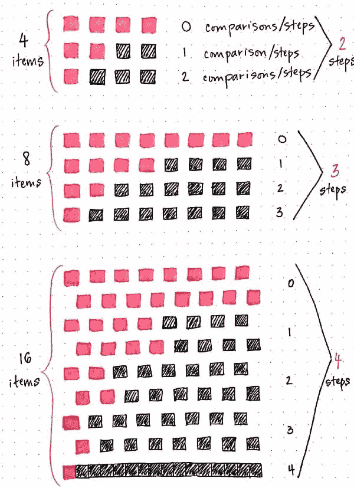
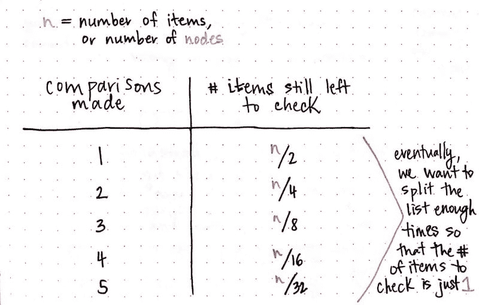
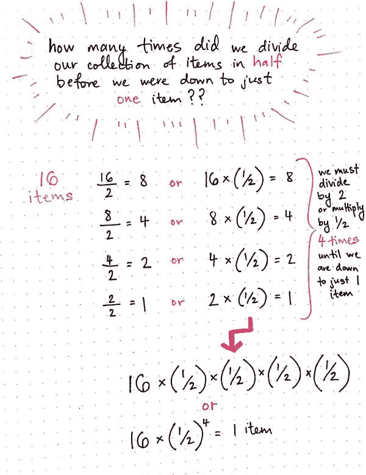
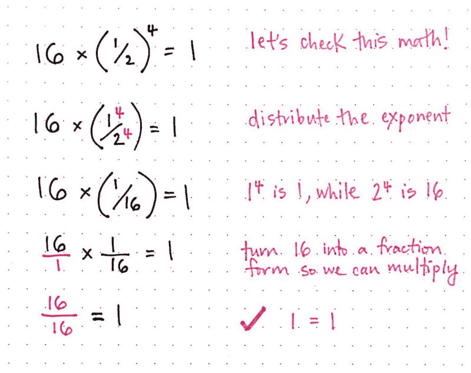
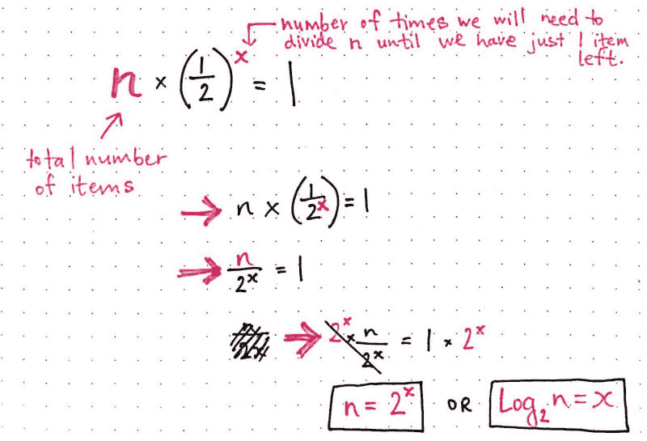
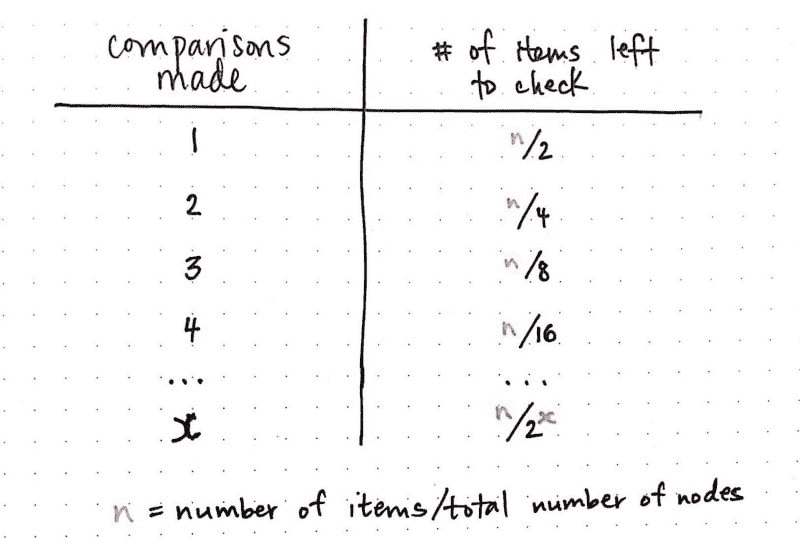
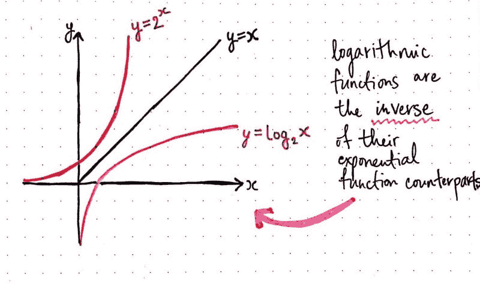
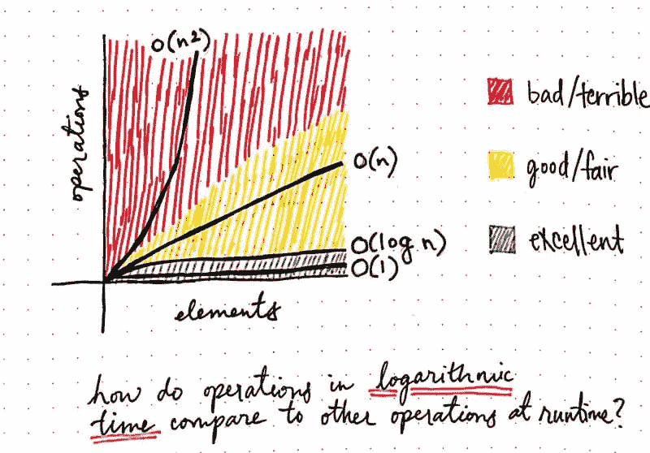

# 寻找对数背后的逻辑

> 原文:[https://dev . to/vaidehijoshi/寻找对数背后的逻辑](https://dev.to/vaidehijoshi/looking-for-the-logic-behind-logarithms)

当我第一次试图找出这个系列的主题时，我做了任何开发者都会做的事情:当然，我问了互联网！

好吧，说得更具体一点，我从谷歌搜索我以前听说过但完全不理解的算法开始，想了解更多。然而，我很快意识到我将不得不逆向工作——也就是说，我将回到起点，填补所有我不知道的空白。在我能够真正理解我真正想了解的超级复杂的算法之前，我必须学习基础知识，回到最基础的地方。

当你看 CS 入门课程和它们的教学大纲时，你会注意到的一件事是，至少在大部分情况下，一切都是在*效率*的背景下教授的。数据结构和它们的遍历算法在上下文中解释了它们有多快，需要多少时间，以及运行它们需要多少空间。到目前为止，我只是浏览了时空复杂性的表面。当我们学习[链表](https://dev.to/vaidehijoshi/whats-a-linked-list-anyway-part-2)时，我们无意中发现了大 O 符号。以防你需要快速复习(我知道我需要！)，**大 O 符号**是一种表示函数、动作或算法运行所需时间的方式，基于我们传递给该函数的元素数量。

然而，事情是这样的:在链表的上下文中，我们仅仅触及了大 O 符号的表面。大 O 不仅仅是常数和线性时间。有很多不同的函数来描述一个算法运行得有多好，多快，有多有效。现在是时候让我们更深入地挖掘其中一个功能了，这是我到目前为止一直在回避的一个功能。

不过，不用担心！既然我们已经知道了[树数据结构](https://dev.to/vaidehijoshi/how-to-not-be-stumped-by-trees)和[二进制搜索](https://dev.to/vaidehijoshi/leaf-it-up-to-binary-trees)，我们就有了所有合适的工具来最终了解这个函数。

但是…我一直说的这个功能到底是什么*？为什么，当然是对数函数！*

### 分解二分搜索

一旦我们理解了二分搜索法，就很容易发现它。在非常基本的层面上，它看起来像这样:

1.  确保你的数据集是有序的。
2.  找到数据集中的中间元素，并决定它是大于还是小于您正在寻找的元素。
3.  排除一半数据集的可能性，继续重复这个过程，直到只剩下一个元素。

二分搜索法的美妙之处——并将其应用于二叉查找树———在于这样一个简单的事实，即我们在遍历树的过程中每走一步，就消除了一半必须搜索的元素。事实上，这种简单性是二叉树如此强大的原因:在缩小搜索集的过程中，我们还删除了一半的搜索空间。

但是*高效*吗？一个更好的问题是:仅仅是***有多高效？***

 ***为了理解效率，我们必须在数量级的背景下思考二分搜索法。另一种思考方式是回答这个问题:

> 随着数据集的增长，我们搜索单个元素的算法是如何开始变化的？需要更多时间吗？我们必须做更多的工作吗？

当遍历一个二叉查找树(或者甚至只是在一个排序的数组上执行一个二分搜索法)时，我们最关心的是*我们需要走多少步才能找到一个元素*。这是为什么呢？嗯，这是因为**二分搜索法总是以单个元素**结束:它*可能是我们正在寻找的元素，或者它可能是值*最接近我们正在寻找的元素的元素*(在这种情况下，我们可以很容易地确定我们正在寻找的元素甚至不在树中！).在这两种情况下，我们都将数据集分割了一半，只剩下一个项目，而且不能再分割了，这意味着我们的搜索正式完成了！*

所以，这就是我们要关注的——我们要采取多少步骤，直到我们找到一个元素。让我们在不同规模的数据集上试验一下二分搜索法，看看我们是否能找到一种模式。

我们将从两个元素开始。好吧，这很简单。我们甚至不需要画出草图。当我们只有两个元素时，只需一步就可以拆分数据，然后我们就只剩下一个元素了。

现在，让我们进一步扩大我们的数据集。记住，如果我们想在二叉查找树上搜索，树必须是平衡的**；*这意味着，如果我们想在我们的树中再增加一层，节点的数量将呈指数级增长。所以，我们必须在不同的场景中尝试这个实验:2 个元素，4 个元素，8 个元素，16 个元素，然后是 32 个元素。*

 *[T2】](https://res.cloudinary.com/practicaldev/image/fetch/s--Qfnfibg8--/c_limit%2Cf_auto%2Cfl_progressive%2Cq_auto%2Cw_880/https://cdn-images-1.medium.com/max/600/1%2AIbrTkuq_s-tBWxi5-QV3rw.jpeg)

好吧，那 4 个元素呢？我很难把事情记在脑子里，所以让我们用图画来记录。看起来像是**当我们有 4 个元素时，我们必须采取 2 个步骤**:第一步将我们的数据集分割成我们忽略的 2 个项目，以及我们将再次分割的 2 个项目。

那么，如果我们把这个变得更大呢？如果我们的数据集是 8 项，会发生什么？嗯，和 4 项差不多是*和*吧？但是多了一步，我们把 8 个项目分成 4 个。似乎**当我们的数据集中有 8 个项目时，我们需要采取 3 个步骤**来减少到只剩下一个项目。

好吧，让我们再画一次:有 16 个项目！也许你不用看也能猜到要走多少步。使用二分搜索法，**我们需要 4 个步骤将 16 个项目分解成一个元素**。

好了，现在有 32 个元素。(开个玩笑。那是一堆粉红色的小方块！)

随着二分搜索法树呈指数增长，我们或许可以继续绘制出所有不同大小的树，但这将开始变得有点笨拙！因此，让我们试着寻找一种模式，而不是画出 32 个元素需要多少步骤。我有一种感觉，这里面一定有某种模式*在某个地方*！

让我们重新整理一下我们从这个练习中收集到的信息，以便更容易看到发生了什么。如果这看起来很奇怪，请不要担心——我保证这是完全相同的信息，只是以不同的方式重写:

[T2】](https://res.cloudinary.com/practicaldev/image/fetch/s--WtD_7Qd---/c_limit%2Cf_auto%2Cfl_progressive%2Cq_auto%2Cw_880/https://cdn-images-1.medium.com/max/800/1%2Ahw5Qyi4q30-LVpd4aClswA.jpeg)

在上表中， ***n*** 代表项目或节点的总数(在一个树中)。根据我们之前画出的数据集的不同场景，我们可以用这些数字中的任何一个来代替 ***n*** ，我们的画应该还是正确的。例如，当我们有 16 个项目时，我们需要 4 个步骤，因为 16/16 是我们只剩下一个项目需要检查的唯一情况。

那么，我们该如何对此进行概括呢？嗯，只要看看这个表的右栏，我们就可以立即看到一个模式:看看分数中的每个分母，它用于确定还有多少项需要检查。它们每次都翻倍:2、4、8、16 等等。有意思。

但是当我们看表中的左栏时,*变得更加有趣了,*我们必须进行的比较——换句话说，我们必须采取多少步骤才能得到一个元素。这里也有一个模式。它们逐渐增加，只有一个。

然而，如果我们把它们放在一起看，我们可以开始看到另一种模式出现:

> 如果我们对左列中的步骤数进行 2 次幂，我们将得到分数的分母，它表示右列中仍有待检查的项目数。

现在，即使没有画出 32 个项目，我们也可以猜测需要多少步:2 等于 32，因此我们可以确定如果 ***n*** 等于 32，我们将需要 5 步来将我们的搜索集缩小到只有一个项目。

万岁！我们只是在野外偶然发现了一个对数。现在，让我们弄清楚早期实际上意味着什么。

### 寻找对数的节奏

如果你在想，“嘿，等等，对数只是一个指数！”…嗯，你是对的。log*是*的指数，但在某种程度上是翻转的。一个**对数**是一个数必须被提高到的幂，以便等于另一个数。思考对数的另一种方式是回答这个问题:

> 变量 **a** 的幂(指数)必须是多少才能让我得到 x？

酷，我想那很好。但是对数和二进制搜索有什么关系呢？事实证明，有很多！说明这一点的最好方式是从不同的角度来看我们的二分搜索法算法。让我们回到前面的例子——我们有 16 个项目，我们想在这个数据集中二分搜索法，直到只剩下一个项目。

当我们开始研究这背后的数学本质时，请记住我们最关心的一个重要问题是:*在我们只剩下一件物品之前，我们把所有的物品分成了多少份？*

当我们有 16 个项目时，我们必须将数据集分成四等份，直到只剩下一个项目。我们一次把 16 除以 2，然后把 8 除以 2，再把 4 除以 2，最后把 2 除以 2。

[T2】](https://res.cloudinary.com/practicaldev/image/fetch/s--1xBGgi_Z--/c_limit%2Cf_auto%2Cfl_progressive%2Cq_auto%2Cw_880/https://cdn-images-1.medium.com/max/600/1%2AH_V8ZBg79w4IFX0Jk02Irg.jpeg)

到目前为止一切顺利，对吧？我们已经知道这是真的，因为我们写下并画出了一切！但是还有另外一种写法。除以二等于乘以 1/2。这意味着我们也可以这样说:*当我们有 16 个项目时，我们必须将我们的数据集乘以 1/2，四次，直到我们只剩下一个项目。*

好吧。我们应该稍微清理一下。让我们重写它。

因为我们知道我们需要乘以 1/2 四次，我们也可以说我们需要乘以 16 ×( 1/2)——直到我们只剩下一项。

好吧！现在我们有进展了。在我们继续之前，让我们确保我们做对了。(此外，我想向你证明，我没有在这里做任何奇怪的数学魔术——这些数字仍然是正确的！)

[T2】](https://res.cloudinary.com/practicaldev/image/fetch/s--a4Oe5nEQ--/c_limit%2Cf_auto%2Cfl_progressive%2Cq_auto%2Cw_880/https://cdn-images-1.medium.com/max/800/1%2Aee-bXs6DRI0n6WLu5VSmag.jpeg)

好吧，酷。还和我在一起吗？很好。

现在，我们*确定*这适用于数字 16，也就是说:这适用于我们有 16 个项目的数据集。但是，我们是程序员！让我们抽象一下，这样我们就有了一个公式，可以应用于*任何*大小的数据集。

让我们使用一些更通用的变量，而不是 16 x(1/2 )= 1。我们将使用 ***n*** 代替 16，来表示项目的总数。我们将 4 替换为*，而不是(1/2 ),其中 ***x*** 表示我们需要除以 *n* 的次数，以便最终得到一个单项。*

 *[T2】](https://res.cloudinary.com/practicaldev/image/fetch/s--6Q8NPs_U--/c_limit%2Cf_auto%2Cfl_progressive%2Cq_auto%2Cw_880/https://cdn-images-1.medium.com/max/800/1%2ApcyUuwTaG7KiPwKYIQFgDQ.jpeg)

不错！我们使用了一些简单的代数规则，重写了我们的抽象！我们最后得到了什么？一个对数！我们可以这样理解: *n 等于 2 的 x 的幂*，或者换句话说，*n 的对数 2 等于 x 的幂*。

还记得之前的那个问题吗？为了让我得到 *x* ，变量 *a* 必须被提升到什么幂(指数)？在这种情况下，我们可以说，我们需要将 2 的幂乘以我们需要将数据集分成两半的次数。或者，换一种说法:总元素的数量等于 2 的幂次方，我们需要采取的步骤，以降低到一个元素。

我认为我们可以安全地重新查看之前的表，并添加我们的抽象:

[T2】](https://res.cloudinary.com/practicaldev/image/fetch/s--GDtv3Srw--/c_limit%2Cf_auto%2Cfl_progressive%2Cq_auto%2Cw_880/https://cdn-images-1.medium.com/max/800/1%2AzFJ8M_4wfL0U6WKMRLFh8Q.jpeg)

太棒了——我们现在有了一个*对数函数*来帮助我们确定随着数据集(或二叉查找树)的增长，我们需要进行多少次最大数量的比较。

### 认识一下 O(log n)，你的新闺蜜！

我们已经偏离了我们开始的地方，不是吗？我们画了一些画，也做了很多数学，但是…这和计算机科学到底有什么关系？

嗯，对数在算法的效率上扮演着重要的角色。还记得我们最初想了解什么吗？二分搜索法到底有多高效？

现在，我们已经通过绘制二分搜索法并通过背后的数学运算，直接看到了它的效率，我们希望可以看到，二分搜索法算法是一种对数运算，在对数时间内运行。

我非常喜欢 Dave Perrett 在他的博客文章中描述对数算法的方式:

> *任何一个每次把问题切成两半的算法都是 O(log n)。*
> 
> O(log n)运算在*对数时间*内运行——随着输入大小的增加，运算将花费更长的时间，但是一旦输入变得相当大，它就不会变化到令人担心的程度。如果你加倍 *n* ，你就得多花一点时间 *t* 来完成任务。如果 *n* 再次翻倍， *t* 不会翻倍，而是增加一个不变的量。

这正是我们之前分解二分搜索法时很自然地发现的！每当我们将树或数据集加倍时，我们只需多走一步就可以找到一个元素。这就是为什么搜索 32 个元素比搜索 16 个元素最多只需要一次额外的比较——我们使用的算法是对数算法，每次搜索都会将问题减半。

这是二进制搜索在计算机科学中如此受欢迎的原因之一——对于任意增长的数据集，二进制搜索超级有效。

但是作为程序员，对数感兴趣还有另一个原因。它们是指数函数的反函数，希望这能让你不寒而栗，因为**指数算法是坏消息**！

[T2】](https://res.cloudinary.com/practicaldev/image/fetch/s--iH74eTv7--/c_limit%2Cf_auto%2Cfl_progressive%2Cq_auto%2Cw_880/https://cdn-images-1.medium.com/max/800/1%2Aqs1LheQZSftxDpPA9QUMug.jpeg)

随着数据集以指数级增长，指数函数增加了我们必须进行的运算数量；另一方面，对数函数是相反的。它以对数增长。当我们把这两个函数画在图上，并与一个线性函数比较时，我们可以看到这两个函数是如何互为逆函数的，而线性函数需要恒定的时间。

但是作为程序员，我们并没有真的绘制图表或思考这些。我们这些需要考虑二分搜索法树或二分搜索法树的人可能已经知道,**二分搜索法算法的效率是 O(log n)** 。

我们唯一真正需要考虑这个问题的时候是在大 O 符号的上下文中。Big O Cheatsheet 的团队有一个漂亮的图表，展示了 O(log n)与其他算法的比较。这是一个不太漂亮但更简单的图表版本，它将 O(log n)与我们在本系列中看到的其他算法进行了比较: **O(1)** ，或常数时间， **O(n)** ，或线性时间，以及**O(n)**，或二次时间:

[T2】](https://res.cloudinary.com/practicaldev/image/fetch/s--fAemkQmc--/c_limit%2Cf_auto%2Cfl_progressive%2Cq_auto%2Cw_880/https://cdn-images-1.medium.com/max/800/1%2A2XtiweAoVq4TAxZHZR_Z9Q.jpeg)

一般来说，O(log n)是一个很好的算法。即使你再也不用去想它，现在你知道它实际上是如何工作的了！

### 资源

你喜欢记录吗？好消息——还有很多要学的东西，我无法在这篇文章中一一介绍！如果你想了解更多，你可能会喜欢这些资源。

1.  [comp sci 101–Big-O 符号](http://www.daveperrett.com/articles/2010/12/07/comp-sci-101-big-o-notation/)，戴夫·佩雷特
2.  [对数函数及其图形](https://people.richland.edu/james/lecture/m116/logs/logs.html)，詹姆斯·琼思教授
3.  [大 O 复杂度图](http://bigocheatsheet.com/)，大 O 备忘单
4.  [二分搜索法](https://interactivepython.org/runestone/static/pythonds/SortSearch/TheBinarySearch.html)，布拉德·米勒，大卫·拉纳姆
5.  [日志 N](https://www.youtube.com/watch?v=kjDR1NBB9MU) ，马特·加兰*****