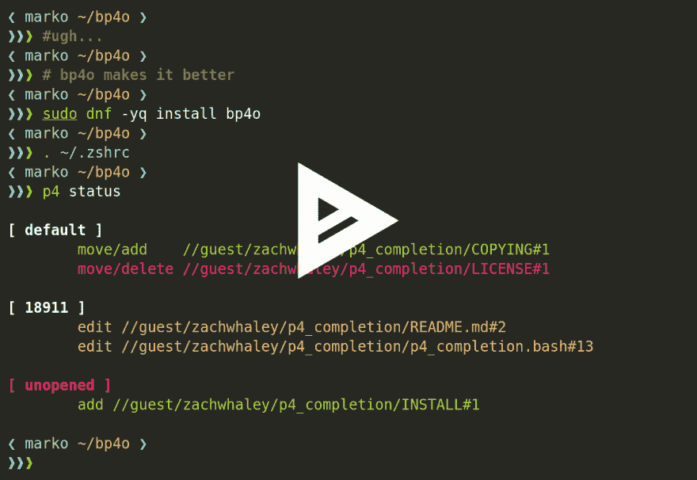

# 更好的 P4 输出

> 原文:[https://dev.to/zachwhaley/better-p4-output](https://dev.to/zachwhaley/better-p4-output)

## P4 输出

如果你正在使用 Perforce 进行版本控制，并且你正在使用他们的命令行工具 p4，
你可能知道 p4 不是一个很好的工具。
Perforce 本身是一个不错的版本控制管理器，它当然不是最差的(*cough* CVS)，
但 p4 工具只是没那么伟大的ðÿ˜ž

*   p4 的输出难以阅读且不一致
*   p4 的各种命令使用不一致的选项和参数
*   而且 p4 的返回码和自己 API 的返回码不一样！

对于最后两个问题，除了糟糕的输出，我无能为力。那是我可以解决的事情。

## 更好的 P4 输出

我写了一个名为 [Bp4O](http://zachwhaleys.website/bp4o/) (更好的 P4 输出)的程序来提高 P4 的输出和可读性。

[T2】](https://asciinema.org/a/96884)

没有 BP4O，你会得到大量分散在屏幕上的文本。
查找文件、它们的更改以及它们共享的更改列表是困难的，而且几乎不可能一目了然，
并且在更改和命令之间保持信息的一致性甚至更困难。

使用 BP4O，我们将同样的输出转换成一个可读的块，由部分、列和颜色合理地分开。相关信息，如变更列表中有哪些文件，以及文件是如何被修改的，都是很容易看到的。

BP4O 还将为您的 diffs 着色，输出页面长，并提供别名命令！

总的来说，Bp4O 在不改变你如何使用 p4 的情况下，让使用 P4 变得更好。

## 安装 BP4O

BP4O 可以与 Bash、Zsh [*](https://github.com/zachwhaley/bp4o#zsh-users) 和 Fish shell 一起工作，并可用于

苹果电脑:

```
brew tap zachwhaley/beer
brew install bp4o 
```

<svg width="20px" height="20px" viewBox="0 0 24 24" class="highlight-action crayons-icon highlight-action--fullscreen-on"><title>Enter fullscreen mode</title></svg> <svg width="20px" height="20px" viewBox="0 0 24 24" class="highlight-action crayons-icon highlight-action--fullscreen-off"><title>Exit fullscreen mode</title></svg>

Ubuntu:

```
sudo add-apt-repository ppa:zachwhaley/ppa
sudo apt update
sudo apt install bp4o 
```

<svg width="20px" height="20px" viewBox="0 0 24 24" class="highlight-action crayons-icon highlight-action--fullscreen-on"><title>Enter fullscreen mode</title></svg> <svg width="20px" height="20px" viewBox="0 0 24 24" class="highlight-action crayons-icon highlight-action--fullscreen-off"><title>Exit fullscreen mode</title></svg>

Fedora/CentOS:

```
sudo dnf copr enable zachwhaley/bp4o
sudo dnf install bp4o 
```

<svg width="20px" height="20px" viewBox="0 0 24 24" class="highlight-action crayons-icon highlight-action--fullscreen-on"><title>Enter fullscreen mode</title></svg> <svg width="20px" height="20px" viewBox="0 0 24 24" class="highlight-action crayons-icon highlight-action--fullscreen-off"><title>Exit fullscreen mode</title></svg>

## 代码

BP4O 的代码在 [GitHub](https://github.com/zachwhaley/bp4o) 上开源

欢迎投稿！

[http://zachwhaleys.website/2017/01/05/bp4o/](http://zachwhaleys.website/2017/01/05/bp4o/)