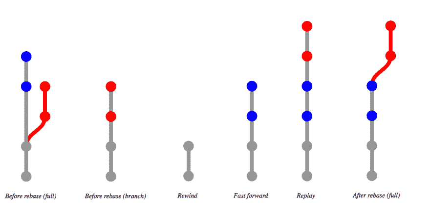

# git rebase 的详细介绍

> 原文:[https://dev.to/gonedark/a-closer-look-at-git-rebase](https://dev.to/gonedark/a-closer-look-at-git-rebase)

我最近写的关于我每天使用的 3 个 Git 命令的文章和[何时提交 Git](https://dev.to/gonedark/when-to-make-a-git-commit)的大部分评论都提到了使用`git rebase`。

所以，我们来说说`git rebase`。直接切入正题，我使用`git rebase`有两个原因:

1.  更新过时的分支。
2.  更改一组未合并的提交。

让我们仔细看看这两者。

## 更新分支

对于某些人来说，`git rebase`属于 Git 命令的*魔法*的一端。然而，如果我们分解一下`git rebase`采取的行动，我们就能理解其中的神奇之处。

当可视化 Git 命令时，*树*是 goto 类比，我发现*视频编辑*也有助于描述`git rebase`。

在使*陈旧的*分支更新的情况下，让我们考虑下面的树进展。

[T2】](https://res.cloudinary.com/practicaldev/image/fetch/s--BTsRd9V4--/c_limit%2Cf_auto%2Cfl_progressive%2Cq_auto%2Cw_880/https://jason.pureconcepts.nimg/tree-progressing-git-rebase.png)

从完整的树开始，我们有一个*陈旧的*分支(红色的)从*主*分支上脱落。如果我们放大，我们会看到分支是*陈旧的*，因为它缺少来自*主*的最近提交(蓝色)。

当我们运行`git rebase`时，它首先会*将两个分支*回退到它们提交历史匹配的第一个点(灰色)。从这一点开始，`git rebase`将*快进到*主*分支上的提交，并将它们应用到*失效*分支。最后，`git rebase` *重放*来自*陈旧*分支的提交。*

生成的树就好像你刚刚从*主*创建了一个新的分支并提交了你的提交。通过这样做，`git rebase`促进了干净的合并。

## 更改一组提交

我也喜欢使用`git rebase`来改变一组提交。通常这些是我在一个*特性*分支上快速提交的，我想在合并之前*清理*。通过压缩提交或改进它们的提交消息。

为此，我将运行`git rebase -i`。`-i`代表*交互*，因为`git rebase`允许你编辑*提交列表*。

输出看起来类似于`git log --oneline`的输出。然而，每次提交都以一个*命令*为前缀。注释包含每个命令的图例。

[T2】](https://res.cloudinary.com/practicaldev/image/fetch/s--L1ezt38j--/c_limit%2Cf_auto%2Cfl_progressive%2Cq_auto%2Cw_880/https://jason.pureconcepts.nimg/git-rebase-interactive-message.png)

我通常会使用`r`到*来改写*一个快速提交和`f`到*修正*一个提交到之前的提交，而不改变消息。尽管许多人谈论*挤压提交*，但我使用*修正*的频率远远高于*挤压*，因为后者需要额外的编辑提交消息的步骤。

保存后，`git rebase -i`将使用您指定的命令让*重放*这些提交。

## 几点注意事项

*   可以有*冲突*。
*   被重放的*提交得到一个新的提交 SHA。*

如果您正在进行小型的、内聚的提交(如[何时进行 Git 提交](https://dev.to/gonedark/when-to-make-a-git-commit)中所述)，任何冲突都应该很容易解决。

最后，需要注意的是`git rebase`将改变任何*重放的*提交的 SHA。因此，如果你*与他人*共享你的提交或者将它们合并到另一个分支，Git 将不再认为这些提交是相同的。

***想掌握更多 Git 命令？**这篇文章改编自我的视频系列[得到 Git](https://gettinggit.com) 。它包含 50 多个视频，涵盖了 Git 命令以及您每天都会遇到的使用 Git 的场景。Vimeo 上提供了 [Master: git rebase](https://vimeo.com/201459481) 。*