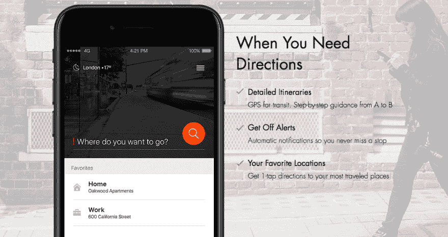
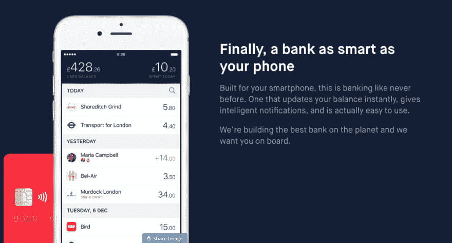
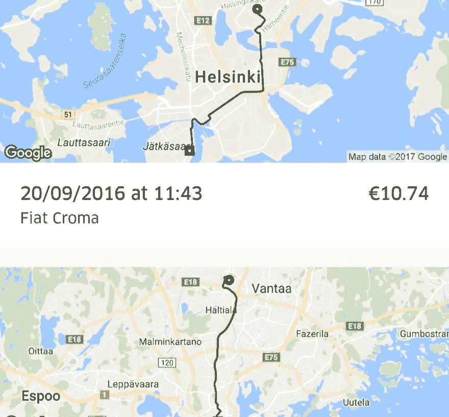
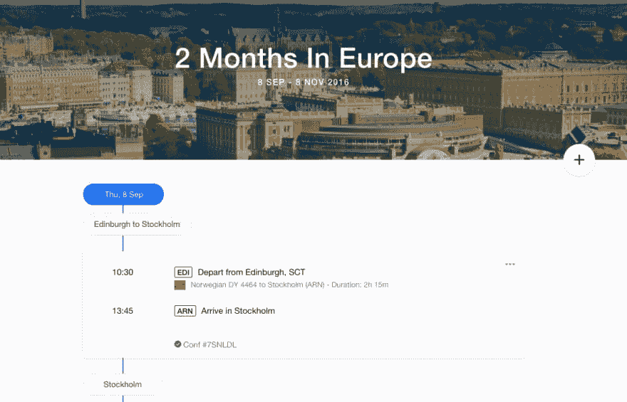
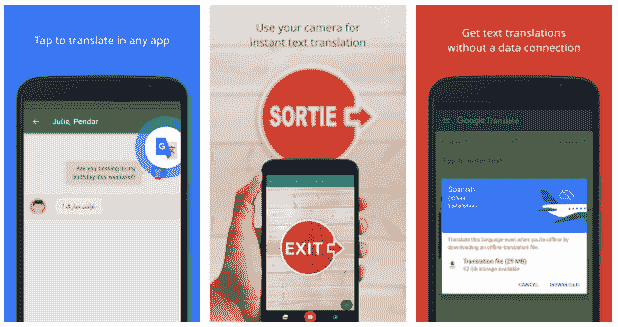
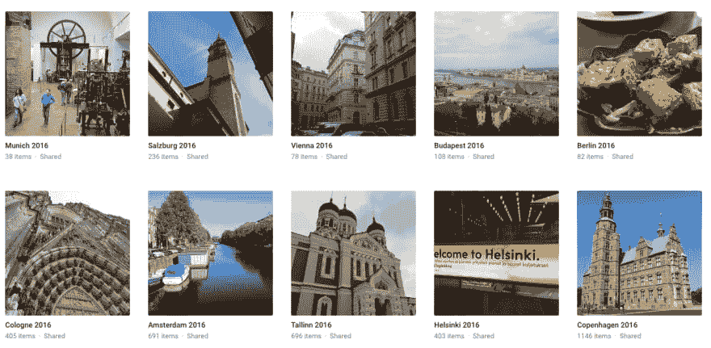

# 必备旅行应用

> 原文：<https://dev.to/scottrobertson/essential-travel-apps-54i8>

你们中的一些人可能知道，Libby 和我最近花了 [2 个月环游欧洲](https://gingerbreadbuttons.com/my-travel-plans/)。下面是一些我们在那个时代离不开的应用程序。

### 穆维特

[T2】](https://res.cloudinary.com/practicaldev/image/fetch/s--p0NCpbsc--/c_limit%2Cf_auto%2Cfl_progressive%2Cq_auto%2Cw_880/https://s3-eu-west-2.amazonaws.com/scottrobertson-blog/2017/02/Screen-Shot-2017-02-19-at-14.08.25-1.png)

当你第一次到达一个陌生的城市，经过几个小时的旅行，你想做的第一件事就是去你的酒店。在一个城市中导航可能是困难的，尤其是当优步不是一个选项的时候。Moovit 通过提供全面的公共交通指南填补了这一空白。

Moovit 允许你选择一个目的地，它会提供你需要的所有信息。所有的交通选择(公共汽车、火车、地铁等)，以及时间表(在一些城市，它提供实时信息)，最重要的是“下车提醒”。这些提示会告诉你什么时候到站，什么时候下车。它们在你不说这种语言的国家特别有用，因为很容易看错公交车站等。

### 蒙三

旅行中最昂贵的东西之一是大多数人甚至不知道存在的，那就是货币汇率。你要么去兑换店，要么用你的银行卡。这两家公司都可能提供“免费”汇率，但他们没有提到的是，他们正在调整汇率，以便从中获利。

[T2】](https://res.cloudinary.com/practicaldev/image/fetch/s--kVfq_3yI--/c_limit%2Cf_auto%2Cfl_progressive%2Cq_auto%2Cw_880/https://s3-eu-west-2.amazonaws.com/scottrobertson-blog/2017/02/Screen-Shot-2017-02-19-at-14.19.03.png)

Monzo 是一家初创公司，其目标是建立一个更好的银行。作为他们服务的一部分，他们免费提供中间市场汇率。这意味着你得到了当时最好的汇率。

使用该应用程序，我们可以在旅行时为我们的 Monzo 账户充值，我们可以像在家里一样使用我们的银行卡(除非你在德国，但那是另一天的狂言)。

实时平衡也非常有用，因为当一杯咖啡的价格是 1500 匈牙利福林时，你很容易忘记自己花了多少钱。

### 优步

每个人都知道优步是什么，所以我没有必要解释这个。

[T2】](https://res.cloudinary.com/practicaldev/image/fetch/s--6jvztY9---/c_limit%2Cf_auto%2Cfl_progressive%2Cq_auto%2Cw_880/https://s3-eu-west-2.amazonaws.com/scottrobertson-blog/2017/02/Screenshot_20170219-142429--3-.png)

不过我要注意的一点是，优步是以当地货币收取费用的，所以将它与 Monzo 之类的东西配对非常重要，这将消除任何汇率费用。

### 皮划艇旅行

Kayak 以其允许你购买机票、预订酒店和租车的网站而闻名。然而，他们有另一个产品叫做 Kayak Trips。

[T2】](https://res.cloudinary.com/practicaldev/image/fetch/s--fw5zPBIY--/c_limit%2Cf_auto%2Cfl_progressive%2Cq_auto%2Cw_880/https://s3-eu-west-2.amazonaws.com/scottrobertson-blog/2017/02/Screen-Shot-2017-02-19-at-14.22.06.png)

Trips 本质上是一个旅行助手。它保存了您所有的预订、航班和活动。当你每 4 天从一个城市搬到另一个城市时，在一个地方拥有所有这些是非常有用的！

它不仅存储所有这些信息，而且您还可以获得航班延误和登机口信息等事件的实时警报。

有几个替代皮划艇旅行的选择，如 TripIt，也很好，但我发现皮划艇旅行对我们来说是完美的。

### 谷歌翻译

老实说，我们实际上很少需要这个应用程序，因为绝大多数欧洲国家的英语都很好。

[T2】](https://res.cloudinary.com/practicaldev/image/fetch/s--Bk7NIgNW--/c_limit%2Cf_auto%2Cfl_progressive%2Cq_auto%2Cw_880/https://s3-eu-west-2.amazonaws.com/scottrobertson-blog/2017/02/Screen-Shot-2017-02-19-at-18.18.13.png)

然而，在我们偶尔使用这个应用的时候，它通常使用相机模式。这允许你把手机指向某个文本，它会立刻翻译出来。这对于菜单或方向尤其有用(当 Moovit 不可用时)。

### Google 相册

这是那些直到你真正需要它的时候才会感激的应用之一。像我一样，在旅行时，我相信你会拍下数百张照片。

[T2】](https://res.cloudinary.com/practicaldev/image/fetch/s--Aj8VTFr7--/c_limit%2Cf_auto%2Cfl_progressive%2Cq_auto%2Cw_880/https://s3-eu-west-2.amazonaws.com/scottrobertson-blog/2017/02/Screen-Shot-2017-02-19-at-14.44.14.png)

Google Photos 允许您备份所有这些照片，不仅允许您保护它们的安全，还意味着您可以清理您的手机/相机，以便拍摄更多照片！

你可以选择以原始格式存储照片，也可以选择谷歌的压缩格式。后者不计入你的存储限制，虽然我发现质量仍然很好，但我仍然喜欢存储原件，特别是当照片不是来自手机时。

### 三(宾至如归的感觉)

虽然不是一个应用程序，但我想我会提到三的家庭服务。

> 嗯，谢谢三位[https://t.co/JjIkePXC9Q](https://t.co/JjIkePXC9Q)pic.twitter.com/LV5u3QO4TO[T3】](https://t.co/LV5u3QO4TO)
> 
> —斯科特·罗伯逊(@ scottymeuk)[2016 年 11 月 7 日](https://twitter.com/scottymeuk/status/795691316776730626)

“宾至如归”让您可以在全球多个国家正常使用手机，无需额外付费。因为我有无限的数据，这意味着我不需要担心在需要的时候使用手机。

这项服务有一些限制，但它们通常不会妨碍您。你不能限制网络，虽然你可以使用 3G，但是所有的流量都是通过英国传输的，所以在某些时候会感觉有点慢。

但是你也看到了，它帮我省了很多钱和压力，所以完全值得。

如果你有什么推荐的应用，那么[告诉我](https://twitter.com/scottymeuk)。