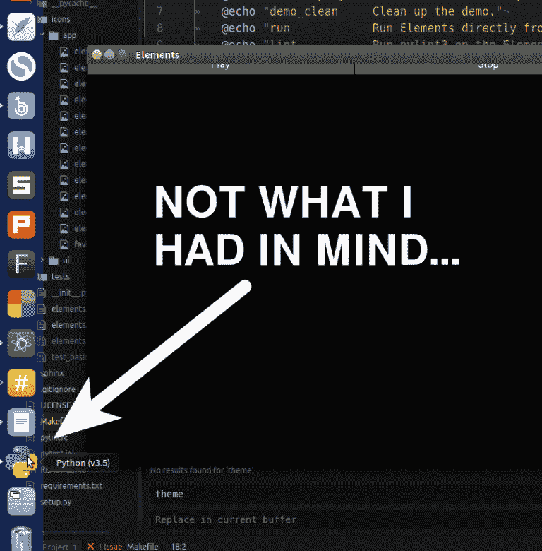
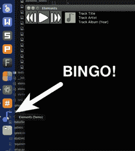

# 图标、Python 和 Ubuntu

> 原文：<https://dev.to/codemouse92/icons-python-and-ubuntu>

*最初发布于[indeliblebluepen.com](http://www.indeliblebluepen.com/?p=1012)。*

在我的空闲时间(是的，我实际上设法拼凑了一些！)，我已经开始着手一个计划了相当长时间的项目——构建我梦想中的音乐库应用程序！我拿起我最喜欢的语言 Python，一头扎了进去。

至于图形用户界面，在我公司的渗透者游戏项目发生了一次特别严重的事件后，我最近发誓不再使用任何形式的 GTK。我的一个 IRC 朋友给我指了一个现代的 Python GUI 库 Kivy，我立刻就爱上了它。

挑战是，Kivy 仍然有一些粗糙的边缘，这虽然是一个潜在的挫折来源，但也意味着许多冒险的机会！

这对我来说是一个磨练技能的好机会，我将在这里用不可磨灭的蓝笔分享来自元素项目的各种发现、技巧和故事。还可以关注 Github 上的 [Elements 项目。](https://github.com/CodeMouse92/Elements)

* * *

我敢打赌，对于许多开发人员来说，添加一个应用程序图标会让你的项目感觉更“真实”。没有它你当然不能出货！

我喜欢把我的图标放在存储库中，放在与我的 Python 文件相关的目录中，以便于访问。基本上，我的存储库结构看起来像这样…

```
Elements
└── elements
     ├── (My Python files)
     ├── icons
     │   ├── app
     │   │   └── (Application icons)
     │   └── ui
     │   └── (Other interface icons)
     └── tests
     └── (My tests.) 
```

Enter fullscreen mode Exit fullscreen mode

我在 SVG 中创建了我的图标。从 512°—512 到 16°—16，几乎每种常见图标尺寸的 png 图像。我在我的“元素/图标/应用程序”路径中删除了它们。

大多数 GUI 工具包使添加图标变得相当容易。例如，Kivy 只要求你在你的`build(self)`函数中设置`self.icon`...

```
class ElementsApp(App):
  """
  Application-level class, builds the application
  """

  def build(self):
    self.title = "Elements"
    self.icon = "icons/app/elements_icon_512.png"

    elements_app = ElementsWindow()
    return elements_app 
```

Enter fullscreen mode Exit fullscreen mode

很简单，对吧？当然可以！在大多数操作系统上，甚至在 Windows 上，这两行代码设置了应用程序的名称和图标，你就可以开始了。

Ubuntu Unity 就不是这样了！无论我做什么，当我启动应用程序时，图标都不会出现在 Unity 启动器中。

[T2】](https://res.cloudinary.com/practicaldev/image/fetch/s--Uo2HqW-h--/c_limit%2Cf_auto%2Cfl_progressive%2Cq_auto%2Cw_880/http://www.indeliblebluepen.com/wp-content/uploads/2017/02/icon_notwhatihadinmind-768x780.png)

在#kivy Freenode IRC 房间里令人沮丧地解决了这个问题后，我开始研究其他 GUI 工具包是如何做的，我很快发现 Qt 也有同样的问题！嗯。

我记得我已经能够为 Redstring 设置一个图标，这是我参与的另一个 Python 应用程序项目。Redstring 是用 GTK 的 Python 绑定构建的，是 Ubuntu Unity 的首选 GUI。也许他们能接触到一些特殊的 API？

结果，是…也不是！虽然 GTK 允许设置图标，但许多开发者抱怨说图标“模糊”。

经过一番挖掘，我发现设置应用程序图标(或者应用程序名称)的唯一可靠方法是创建一个. desktop 文件。问题解决了，对吧？

# 【绝对】混乱

的问题是。桌面文件的一个缺点是它们需要*到可执行文件和图标的绝对路径*，并且 bash 变量都不起作用。我的项目是从我的主文件夹中的一个存储库的本地克隆运行的，这意味着我必须以“/home/jason/…”开始这些路径，这很难移植。我将是唯一一个能够用图标测试元素的人，但我对此并不满意。

现在，。桌面文件之所以有效，是因为程序和它们的资源都存储在共同的地方，比如“/usr/bin”和“/usr/share/icons”。我真的不想仅仅为了一个演示而把东西安装到那些神圣的系统路径上——那只是*自找麻烦。其次，不得不使用 root 权限来运行演示感觉是错误的。*

但是，如果我将应用程序及其资源复制到某个*不需要 root 权限的系统路径，会怎么样呢？因为演示安装至少是一次性执行的，所以“/tmp”目录完全符合要求。你可以把任何你想要的垃圾放入“/tmp”，你的电脑不会在意——当你重启系统时，它会派它的数字管理员把那个目录清空。*

通过安装到“/tmp”，我将拥有一个可以在任何 Linux 系统上工作的绝对路径！

现在我需要一个地方来放。桌面文件。系统在两个地方查找这些文件:对于系统范围的应用程序，在“/usr/share/applications”中查找，在“~/”中查找。本地/共享/应用程序”仅适用于当前用户。因为只有当前用户会关心演示，而我不想使用 root 权限，所以第二个选项是显而易见的选择。

我打出了我的。桌面文件，我会将它保存在我的存储库中，并复制到我以后需要它的地方。

```
[Desktop Entry]
Version=1.0
Name=Elements (Demo)
Comment=A demo version of Elements, installed to /tmp.
Exec=python3 /tmp/bin/elements/elements.py
Icon=/tmp/bin/elements/icons/app/elements_icon_512.png
Terminal=false
Type=Application 
```

Enter fullscreen mode Exit fullscreen mode

我怀疑这将是以某种形式部署我的应用程序所需要的最后一个文件，所以我在我的存储库中创建了一个方便的“deploy/”文件夹，并将“elements_tmp.desktop”放入其中。

现在我只需要一种自动执行所有这些魔术的方法，所以我求助于我的首选 Linux 魔术师:Makefile。

# 使魔法

即使在 Python 项目中，我也喜欢手边有一个 Makefile。运行“make run”比运行“python3 elements/elements.py”要容易得多。

因此，要部署我的应用程序的测试版本，我只需要在 Makefile 中添加几个目标。

```
demo_deploy: demo_clean
    @mkdir -p /tmp/bin
    @cp -rf elements /tmp/bin/elements
    @cp -f deploy/elements_tmp.desktop ~/.local/share/applications/
    @gtk-launch elements_tmp
    @rm -f ~/.local/share/applications/elements_tmp.desktop

demo_clean:
    @rm -rf /tmp/bin/elements
    @rm -f ~/.local/share/applications/elements_tmp.desktop

.PHONY: demo_clean demo_deploy 
```

Enter fullscreen mode Exit fullscreen mode

我们来分析一下。注意,“demo_deploy”目标调用“demo_clean”目标，我将很快介绍这一点。

要进行部署，首先我们需要在“/tmp”中创建一个新文件夹来存储我们的演示。因为我打算重用这个方法，所以我认为为所有临时二进制文件创建一个公共目录会很有帮助，所以我将它命名为“bin/”。

通过将`-p`标志传递给`mkdir`，我确保了如果目录已经存在，目标不会失败。从技术上讲，如果父目录不存在，这个标志也会创建父目录，但是因为“/tmp”已经存在，所以这是一个有争议的问题。

其次，我们将包含应用程序及其资源的目录从运行 Makefile 的存储库中复制到“/tmp/bin”路径。显然，我们需要`-r`来复制目录，需要`-f`来“强制”复制(因为如果不必要的话，我们不希望失败)。

第三，我们将“elements_tmp.desktop”复制到系统将要查找它的目录中。

第四，我们不想等待 Unity Dash 自己刷新来开始我们的演示，所以我们将使用它从命令行启动它。桌面文件。(此命令基于 AskUbuntu 上的[这个回答。)](http://askubuntu.com/a/664272/23786)

最后，由于我在“/tmp”中的部署会在计算机重新启动后立即被删除，所以我真的不想有任何被破坏的机会。桌面文件四处浮动。因为系统已经从。桌面文件当我启动时，我们实际上不再需要它，所以我在这里删除它。

清理目标非常简单:删除临时部署和。桌面文件(如果碰巧在身边的话)。

有些人可能认为最后一步没有意义，因为我总是删除。桌面文件在部署目标的最后，但我在计算机周围工作了足够长的时间，知道“不可能发生”*会在你最不期望的时候发生。总而言之，有那个指挥在那里也无妨。*

 *最后，我只需运行 make demo_deploy 和...

[T2】](https://res.cloudinary.com/practicaldev/image/fetch/s--jIHVhJxW--/c_limit%2Cf_auto%2Cfl_progressive%2Cq_auto%2Cw_880/http://www.indeliblebluepen.com/wp-content/uploads/2017/02/icon_elementsworking-267x300.png)

# 总结

一般来说，这应该可以在任何使用。桌面文件。然而，你需要仔细检查“gtk-launch”是否已经安装并运行，因为这个程序在一些旧版本的 Ubuntu 中是没有的。

这种方法很酷的一点是，它适用于任何类型的项目，Python 或其他。您可以修改 Makefile 来复制演示部署所需的任何目录，并调整。桌面文件的“Exec”属性来正确启动您的应用程序。

这对你有帮助吗？对于在其他类型的项目中使用这种方法，你有什么建议吗？留言评论！*