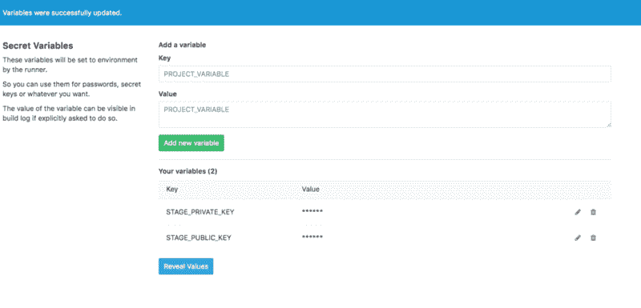

# 使用 Docker 引擎在 GitLab CI 中为 Django 项目设置测试

> 原文:[https://dev . to/kostjapalovic/setting-up-tests-in-git lab-ci-for-django-project-with-docker-engine](https://dev.to/kostjapalovic/setting-up-tests-in-gitlab-ci-for-django-project-with-docker-engine)

你好！

在本文中，我将描述我们如何设置 GitLab CI 来为 Django 项目运行测试。

但是首先要说一下我们使用的工具。

### 我们在 GitLab 之前拥有的——Atlassian

几年来，我们在开发过程中一直使用 Atlassian stack。我们有 JIRA、Confluence、Stash(现在叫做 BitBucket Server)和 Bamboo。

起初，我们对这种设置很满意，因为所有的应用程序都可以很好地相互集成。

我们可以看到与当前开放的问题相关的所有提交，并且我们可以看到在 build in Bamboo 中包含了哪些问题和提交。

一开始看起来很棒，但是过了一段时间我们注意到:

*   JIRA 开始消耗我们所有的时间，即使是敏捷董事会
*   让这个堆栈保持最新是一个巨大的痛苦。我会花整个周末来更新和修复所有四个应用程序，因为它们改变了对 Mysql 设置的要求，并且 Atlassian 产品的日志被深埋在不同的目录中
*   Atlassian apps 的每个新版本都引入了大量的错误和界面变化(明显缺乏质量保证导致了更多的错误)

此外，我们只有一个 16GB 内存的服务器用于所有这些工具。

因此，我们没有做好自己的工作，而是把所有的时间都花在了应对 JIRA 上。

加入我们团队的新开发人员对 JIRA 界面感到失望。

去年年底，我们认为:“这就够了，我们需要用更简单、更高效的工具来取代这个以企业为中心的庞然大物。”

起初，我们开始寻找任务跟踪功能的替代品。为此，我们尝试了许多应用程序和服务，但所有这些应用程序和服务虽然有一些强大的功能，但也存在一些问题或缺乏功能，妨碍了我们的工作效率。

然后我尝试了 GitLab，突然我们不仅找到了方便的任务跟踪工具的解决方案，而且我们找到了如何替换整个 Atlassian 堆栈。

同样令人惊奇的是，我们可以免费得到一切！(worker 除外，不过我有没用过的 linux 盒子，现在当 worker 用)。

GitLab 有一个干净简单的界面，而不是吉拉的企业疯狂的工作流程，问题有标签，有 CI 管道，wiki，问题描述，评论和 Wiki 文章的 markdown，以及许多其他伟大的事情。

### 我们已经转到 GitLab.com 了

GitLab 项目解决了我们所有的问题——不再需要维护，没有影响工作效率的界面问题，所有这些都在一个解决方案中。

所以 gitlab 项目提供了 git 仓库托管、问题跟踪器、wiki、CI/CD 管理系统。但我们需要的是线人。运行者做实际的工作，执行构建、测试和部署工作。

正如我已经说过的，我有一个未使用的 linux 盒子，现在用于 runner。

这里介绍的 ubuntu 的 Runner 安装:

[https://docs . git lab . com/runner/install/Linux-repository . html](https://docs.gitlab.com/runner/install/linux-repository.html)

我们使用 docker 来运行我们的构建。

### 从竹子迁移到 GitLab CI/CD

在 Bamboo 中，构建和部署计划是从 GUI 中设置的。

对于 gitlab `.gitlab-ci.yml`，必须在 git 资源库的根目录下创建。

在我提供这个文件的例子之前，我必须指出我们使用 Postgres 作为数据库。多亏了 docker，我们可以要求 runner 使用该文件中的凭证将其作为服务运行。

`.gitlab-ci.yml`

```
image: kpavlovsky/backoffice:latest  

services: 
  - postgres:latest

stages: 
  - test  
  - deploy

variables:  
  POSTGRES_DB: dev  
  POSTGRES_USER: dev  
  POSTGRES_PASSWORD:dev  

all_tests:  
  stage: test  
  script: 
  - bash ./tests_gitlab.sh 
```

<svg width="20px" height="20px" viewBox="0 0 24 24" class="highlight-action crayons-icon highlight-action--fullscreen-on"><title>Enter fullscreen mode</title></svg> <svg width="20px" height="20px" viewBox="0 0 24 24" class="highlight-action crayons-icon highlight-action--fullscreen-off"><title>Exit fullscreen mode</title></svg>

逐行:

`image: kpavlovsky/backoffice:latest`是我们用来运行容器的 docker 映像。

这张图片基于 python:3-onbuild。我们将所有长期运行的 pip 安装和 apt-get 任务转移到那里。通过这样做，我们实现了两件事:1)每个构建运行得更快，因为它不涉及包的安装 2)我们没有通过每天下载包 10 秒或 100 秒的时间来滥用 apt 和 pip 库 3)我们减少了每个构建的时间，所以我们更快地获得测试结果(谁想在每个`git push`后等待 15 分钟？).

在服务中，列出了服务的 docker 图像。我们这里只有 postgres。

在变量部分设置 postgres 数据库及其凭证。postgres 的主机名将是“postgres”。

`stages`中元素的顺序定义了构建执行的顺序:

1.  相同阶段的构建并行运行。
2.  前一阶段的作业成功完成后，将运行下一阶段的构建。

“测试”阶段的作业先进行。“部署”阶段的作业在“测试”阶段之后进行。

`all_tests`是管道的一项工作，属于“测试”阶段。`script`保存所有将要发出的命令。我们只有一个命令来运行测试。

```
#!/bin/bash 
coverage run --source="app1,app2,app3" manage.py test --noinput --
testrunner="xmlrunner.extra.djangotestrunner.XMLTestRunner" 
app1.tests app2.tests app3.tests  
coverage report --skip-covered 
```

<svg width="20px" height="20px" viewBox="0 0 24 24" class="highlight-action crayons-icon highlight-action--fullscreen-on"><title>Enter fullscreen mode</title></svg> <svg width="20px" height="20px" viewBox="0 0 24 24" class="highlight-action crayons-icon highlight-action--fullscreen-off"><title>Exit fullscreen mode</title></svg>

单独的`kpavlovsky/backoffice:latest`图像的 Dockerfile 看起来是这样的:

```
FROM python:3-onbuild  
ENV PYTHONUNBUFFERED 1  
ENV PYTHONDONTWRITEBYTECODE 0  
ENV DJANGO_SETTINGS_MODULE project.settings.docker  
RUN apt-get update && apt-get install -y --force-yes mc nano htop python python-pip netcat gettext && rm -rf /var/lib/apt/lists/*  
RUN mkdir /code  
WORKDIR /code  
COPY requirements.txt /code/  
RUN pip install --upgrade pip  
RUN pip install -r requirements.txt  
CMD ["bash"] 
```

<svg width="20px" height="20px" viewBox="0 0 24 24" class="highlight-action crayons-icon highlight-action--fullscreen-on"><title>Enter fullscreen mode</title></svg> <svg width="20px" height="20px" viewBox="0 0 24 24" class="highlight-action crayons-icon highlight-action--fullscreen-off"><title>Exit fullscreen mode</title></svg>

因此，现在如果我们将代码推送到 repo，并且测试通过，那么我们会在 slack 和电子邮件中看到通知，告知管道成功，或者如果测试失败，则告知管道失败。

### 部署

既然我们已经迁移了构建部分，我们需要部署我们的项目，以防在“dev”分支上成功构建到 staging。

“Stage”环境是另一个 linux 盒子，没有 docker，只有 supervisor 和 gunicorn。

部署过程包括从 runner 到远程机器的 ssh，激活 virtualenv，git 拉取和运行 django 管理命令。

第一步是在`.gitlab-ci.yml`
的“部署”阶段添加作业

```
deploy_stage:  
  stage: deploy  
  script: - bash ./deploy_stage_gitlab.sh  
  when: on_success  
  only: - dev</pre> 
```

<svg width="20px" height="20px" viewBox="0 0 24 24" class="highlight-action crayons-icon highlight-action--fullscreen-on"><title>Enter fullscreen mode</title></svg> <svg width="20px" height="20px" viewBox="0 0 24 24" class="highlight-action crayons-icon highlight-action--fullscreen-off"><title>Exit fullscreen mode</title></svg>

仅当“测试”阶段成功时，此作业才会在“开发”分支上运行。

为了 ssh 到“stage”机器，我们需要将 ssh 密钥传输到 runner。

将密钥存储在存储库中是不好的做法。

借助 gitlab“变量”,我们可以通过环境变量传输密钥，将它们写入文件，然后发出 fabric 命令，在“stage”框上执行所需任务。

首先，我们需要生成不带密码短语的 ssh 密钥。为此，使用`ssh-keygen`。

公钥必须放在舞台服务器上的`~/.ssh/authorized_keys`中。

然后，我们将公钥和私钥的内容放入变量中。

用键添加变量后，gitlab 项目中的变量屏幕看起来如下:

[T2】](https://res.cloudinary.com/practicaldev/image/fetch/s--bQlHiapb--/c_limit%2Cf_auto%2Cfl_progressive%2Cq_auto%2Cw_880/https://cdn-images-1.medium.com/max/800/1%2AtFy25Ljss0uW8hKCiIvanQ.png)

`deploy_stage_gitlab.sh`看起来是这样的:

```
#!/usr/bin/env bash
mkdir ~/.ssh/  
echo $STAGE_PRIVATE_KEY > ~/.ssh/id_rsa  
echo $STAGE_PUBLIC_KEY > ~/.ssh/id_rsa.pub  
fab upd_dev 
```

<svg width="20px" height="20px" viewBox="0 0 24 24" class="highlight-action crayons-icon highlight-action--fullscreen-on"><title>Enter fullscreen mode</title></svg> <svg width="20px" height="20px" viewBox="0 0 24 24" class="highlight-action crayons-icon highlight-action--fullscreen-off"><title>Exit fullscreen mode</title></svg>

快速注意:在 python3.5 环境下使用 fabric3！

fabric function 登录到远程服务器，获取所有信息，运行迁移，并使用 supervisorctl 重新启动该项目的流程组。

另请参见:[允许非超级用户访问超级用户](https://coffeeonthekeyboard.com/using-supervisorctl-with-linux-permissions-but-without-root-or-sudo-977/)

### 结论

有了`.gitlab_ci.yml`,我们有能力改变管道，所以它反映了我们代码中的变化。这对于 Bamboo 及其 GUI 中的构建/部署设置来说更难实现。当然，我们可以让一些 bash 脚本来完成所有的任务，它可以从提交更改为提交。在这种情况下，不可能添加/删除/更改阶段等。

另外，Bamboo 的 guy build/deploy 设置需要更多的时间来设置，我没有找到从一个项目到另一个项目克隆它的方法，这用`.gitlab_ci.yml`很容易做到。

从现在开始，我们不需要单独的大型服务器来安装 Atlassian tools，我们不用花周末的时间来更新它们。最好的部分是:我们可以专注于做真正的工作，开发和交付我们的应用程序，而不是在 Atlassian 的应用程序上浪费时间。

快乐发展！

如果您有任何关于 gitlab CI 的想法，如何改进所描述的工作流程的想法-发表评论，我将非常高兴听到并讨论它们！