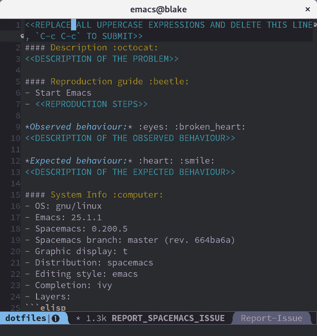

# 有缺陷的软件，忠诚的用户:为什么缺陷报告是留住用户的关键

> 原文:[https://dev . to/itamarst/buggy-software-loyable-users-why-bug-reporting-is-key-to-user-retention](https://dev.to/itamarst/buggy-software-loyal-users-why-bug-reporting-is-key-to-user-retention)

*(本文最初发表于[我的博客](https://codewithoutrules.com/2017/02/10/voice-exit-user-retention/))。*

你的软件有缺陷。抱歉，我的也是。

不管你测试了多少，也不管 QA 测试了多少，有些 bug 还是会通过的。除非你是 NASA，否则你可能负担不起对你的软件进行足够的测试。

这意味着你的用户会为你找到漏洞。他们会发现你的网站不能在 IE 8.2 上运行。他们点击了一个按钮，一个空白的屏幕出现了。你承诺的功能在哪里？为什么这不起作用？！

从个人经验来看，用户不喜欢找 bug。现在你有错误的软件和不满意的用户。你打算怎么办？

幸运的是，1970 年，经济学家艾伯特·赫希曼给出了这个问题的答案。

## 退出，声音和忠诚

在他的经典论文《退出、声音和忠诚》中，赫希曼指出，对产品不满意的用户有两种选择。只有两个，不能再多了:

1.  *退出*，即放弃你的产品。
2.  说出他们的担忧。

已经放弃你的软件的人不太可能告诉你他们的问题。而且，一个足够关心提交 bug 的人不太可能离开你的软件。最后，忠诚的用户会留下来使用他们的声音，否则他们会选择退出。

现在，你的软件没有用户就没有了目的。所以你很有可能想要阻止他们离开(尽管也许没有他们中的一些人你会更好——见第二条)。

事情是这样的:只有两个选择，发声或者退出。如果你能说服你的用户用他们的声音来抱怨，并且他们感觉被听到了，你的用户就会留下来。

此时你可能会想，“伊塔马尔，你为什么要告诉我这么明显的事情？当然，如果我们修复了用户的漏洞，他们会留下来。”但这不是你留住用户的方法。你通过允许用户表达他们的声音，通过确保他们*感到被倾听*来留住用户。

有时你可能没有修复 bug，但仍然有满意的用户。有时你可能修复了一个 bug，但仍然无法让他们感到被倾听；比不修复 bug 要好，但是你可以做得更好。

为了让你的用户在遇到 bug 时有被倾听的感觉，你需要确保:

1.  他们可以尽可能轻松地报告错误。
2.  他们会收到你的回信。
3.  如果您选择修复错误，您实际上可以从他们的错误报告中找出问题。
4.  bug 修复实际上已经交付给他们了。

让我们一个一个地检查这些需求。

## 漏洞报告

一旦你的用户注意到一个问题，你希望他们立即向你传达这个问题。这将确保他们选择声音的道路，而不是考虑退出到你隔壁领域的闪亮的竞争对手。

更快的交流也使得错误报告更有可能有用。如果错误发生在 10 秒钟前，用户可能会记得发生了什么。如果是几个小时后，你会听到一些关于“屏幕上出现了一只飞行的驼鹿？或者一只鬣狗？”记住:用户是人，就像你和我一样，人类很难记住事情(有时我们会忘记这一点。)

为了确保快速(或者根本)报告错误，你需要让用户尽可能容易地报告问题。每增加一个步骤，例如在问题跟踪器中创建一个帐户，就意味着更多的用户退出了报告流程。

实际上，许多应用程序都被设计成尽可能难以报告错误。你将访问一个网站，突然:

> 出现错误，请刷新浏览器

当然，如果问题再次出现，这个页面不会给出你应该如何或者向哪里报告的提示，而且运行这个网站的人会关心你的问题吗？

确保在出现错误时，你不是这样对待你的用户的。

### 改进缺陷报告

假设你包含了一个错误报告页面的链接，假设用户不必通过重重关卡和电子邮件验证来注册，然后填写 JIRA 或 Bugzilla 认为非常重要的 200 个字段，你愿意从下面的列表中告诉我们你最常见的童年噩梦吗？我们将假设 bug 报告很容易找到，也很容易填写，就像它应该的那样。

但是...你需要从用户那里得到一些信息。比如，他们使用的程序版本，操作系统等等。你确实需要这些信息。

但是用户只是想把这件事做完，你要求的每一条额外信息都可能让他们放弃并离开。怎么办？

这里有一个解决方案:为他们包含它。

我一直在使用相当优秀的 [Spacemacs](http://spacemacs.org/) 编辑器，像往常一样，当我使用新软件时，我必须报告一个错误。事情是这样的。

无论如何，要报告 Spacemacs 中的错误，你只需按下错误报告组合键。你会看到一个错误报告页面。在你的编辑器里。它会填入 Spacemacs 版本和 emacs 版本以及您所做的所有配置。然后你关闭缓冲区，它会用所有这些信息预先填充一个新的 GitHub 问题，你点击提交，你就完成了*。*

 *这太棒了。不需要找到正确的网页或复制下每一个配置和环境参数来报告错误:只需运行错误报告命令。

另外，请注意，这比自动崩溃报告要好得多。我参与并解释了对我来说很重要的部分，而不是“是的，我们报道了事故信息，说实话，你不会真的相信有人会看这些吧？”-从特定软件获得的感应。

您可以使用命令行工具或基于 web 的应用程序做同样的事情。每次出现错误或用户遇到问题时(例如，用户运行`yourcommand --help`):

1.  在终端中，或者在网页的上下文中询问用户的反馈，然后为他们提交错误报告。
2.  自动收集尽可能多的信息，并将其包含在错误报告中，这样用户只需报告他们关心的部分。

## 响应错误报告

你要做的下一件事就是回复错误报告。当我写这篇文章时，我提交的 Spacemacs 问题正坐在那里，所有的悲伤和孤独都没有得到答复，这有点烦人。我明白，开源志愿者运行的项目和所有。(这就是忠诚的来源。)

但是对于我购买的商业产品，我想知道我的问题是否被听到了。有时答案可能是“抱歉，我们不打算在本季度解决这个问题。”没关系，至少我知道我的立场。但是沉默是不行的。

回复你的错误报告，告诉你的用户你正在做什么。不幸的是，自动回复还不够好。

## 诊断 bug

如果你已经决定修复这个 bug，你现在可以着手去做了...如果你能找出实际的问题是什么。如果诊断问题是不可能的，或者甚至过于昂贵，你就无法解决问题。这意味着你的用户会继续受到这个 bug 的影响。

让我们来看一个常见的错误报告:

> 我点击了保存，你的程序崩溃了，删除了我一天的希望和梦想。

这是非常糟糕的:一个不高兴的用户，而且通常情况下，用户根本没有你需要的信息来弄清楚发生了什么。

即使错误报告很有用，也很难重现问题。测试在受控的环境中进行，这使得研究和复制更加容易。现实世界的使用发生在野外，所以祝你好运重现崩溃。

还记得我们讨论过在错误报告中自动包含尽可能多的信息吗？你做到了，对吗？包括所有相关的日志？

如果您不知道，现在是时候考虑一下了:尽量确保日志、核心转储等等对于错误报告总是可用的。并尝试尽可能地自动提交它们，同时仍然让用户能够报告他们对问题的具体看法。

(别忘了尊重你用户的隐私！)

## 分发补丁

现在你已经诊断并修复了你的 bug:问题解决了！或者说，问题*差不多*解决了。如果用户没有得到 bug 修复，所有这些工作都是浪费时间。

您需要快速发布，并且在可能的情况下需要自动更新。如果修复程序需要很长时间才能到达你的用户，那么实际上你的用户没有被听到。(总有例外:在某些业务中，你的用户将稳定性看得比其他任何东西都重要。)

## 良性循环

如果你做对了:

1.  你的用户会感到被倾听，并选择语音而不是退出。
2.  你会得到偶尔有用的错误报告，允许你改进你的产品。
3.  所有用户都将很快从这些改进中受益。

当然，还有更多的事情要做:许多漏洞可以而且应该被提前发现。而且很多用户永远不会告诉你他们的问题，除非你问。

但是这是一个让你的用户快乐和忠诚的良好开端，即使他们偶尔会遇到错误。

-

顺便说一句，我并没有拿我的软件有缺陷开玩笑:我曾经编写过在生产过程中每天凌晨 4 点崩溃的软件，崩溃到完全无法使用的软件，毫无目的地浪费用户时间的软件...这是一个很长的列表。

如果你想避免犯这些错误，以及我在过去 20 年中犯的许多其他错误，我正在写一封每周一封的电子邮件，列出我的一个错误以及你如何避免它。[注册时事通讯，避免我的许多软件和职业错误！](https://softwareclown.com)*