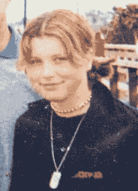
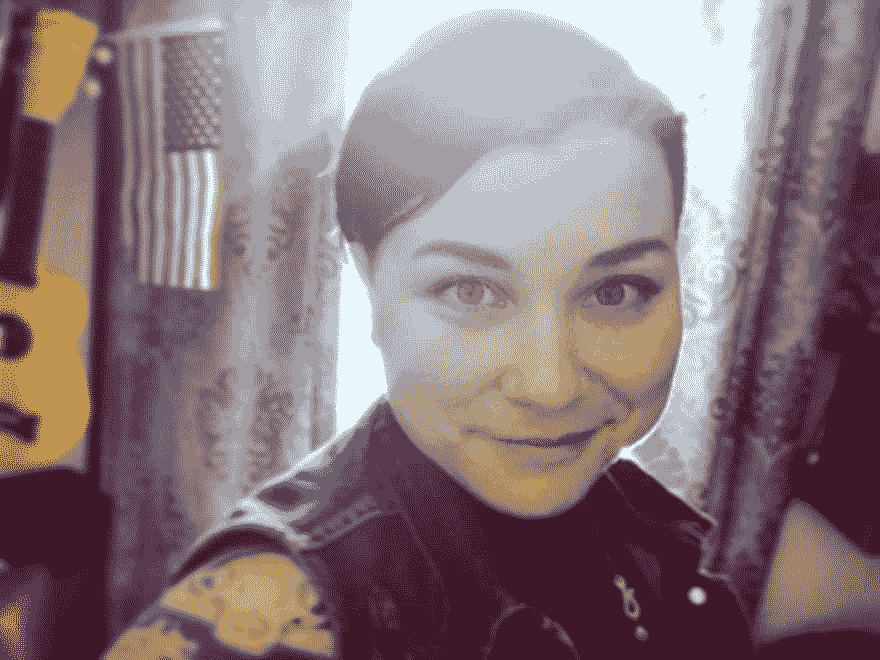

# Web 开发的曲折之路

> 原文:[https://dev . to/rachelralston/a-meandering-path-to-web-development](https://dev.to/rachelralston/a-meandering-path-to-web-development)

最终，我们都不知道自己在做什么。我们都有一种感觉，在生活的某个阶段，我们都是骗子。我们都在猜测并尽我们所能保持参与和成长。跟随你生命中的转折，在你创造它的过程中找到满足感是可以的。这是我成为专业全栈开发者的曲折之路。

 

<figcaption>【永远的多边形轨迹】</figcaption>

对我的孩子来说，电脑是奇怪的盒子，给了我有趣的游戏。五年级的一个决定性的日子，我第一次听到了拨号调制解调器的警报声，我突然意识到万维网可以打开我的小世界。我被迷住了。一旦我得到了一份*的虚拟 HTML 和一个盗版 Photoshop，你就不能把我从家用电脑旁撬走。我仍然记得经过几个小时的挣扎后，我第一次让浏览器显示我制作的图像时的那种[纯净水晶般的喜悦。](https://admin.mashable.com/wp-content/uploads/2013/07/excited-baby.gif)*

 

<figcaption>omg omg omg omg 成功了！</figcaption>

几年来，我一直在奔波。我创建了粉丝网站，拥有最酷的 myspace 页面，并且如饥似渴地阅读相关书籍。但随着初中进入高中，我的热情冷却下来，我最终将注意力重新集中在软技能上。

<figcaption>90 年代末的哥特风很好看。</figcaption>

回想起来，我意识到我做了典型的少女的事情:我下意识地爱上了女孩不擅长科学和数学的文化信息以及我的同龄人的微进步。虽然落后的部分原因是真正的学习障碍，但我的心态让我相信，我轻微或巧合的挫折是我无法成功的证据。尽管我很早就喜欢计算机科学，但在高中结束时，我对追求科学的想法非常反感，以至于我去了艺术学校，心想我再也不用上数学或科学课了。

快进到 2008 年大学毕业和几个月的失业。事实证明，当经济处于自由落体状态时，油画中的 BFA 对于有报酬的工作来说并不是特别有用。我审视了自己的技能，并开始发展自己，将我的艺术培训转变为图形设计技能，重温我十年来对网页开发的爱好。

几年后，在经历了从清洁厕所到客户服务的各种工作后，我创办了一家品牌公司，帮助中小型企业找到自己真正的声音，并建立自己的网站。创业令人惊叹，让我对自己有了更多的了解，但也令人疲惫不堪，极具挑战性。

在那之后，我进入了设计和营销主管的职位，这是一个很有职业回报的职位，但对我个人来说并不是很适合。我感谢这份工作给我带来的挑战，因为它让我意识到，虽然我一生只想做东西，但我的职业生涯已经发生了变化，用我的技能说服人们买东西。那一刻的探索让我回顾了我的一生，思考什么能真正让我开心，而不仅仅是什么能让我吃饱。几个月后，我辞掉了那份工作，转而从事网络开发，参加了学员协会的全日制强化专业学徒项目。

 

<figcaption>学员公会的第一天。他们不是长得很快吗？</figcaption>

进入工程界就像回家一样。我开始用我的创造力来寻找复杂问题的优雅解决方案，用我的企业家系统思维来思考大型项目，用我的同理心和人际交往技能来团队工作和倡导卓越的用户体验。

现在的世界和我小时候不一样了。拨号连接的歌曲已经成为历史，现在当互联网不在我的指尖回答我每一个短暂的突发奇想时，感觉很奇怪。回顾整个故事，我为年轻的自己感到难过，因为她放弃了自己的技术能力。令我惊讶的是，我现在意识到我其实很擅长这个。我希望我的工作可以帮助激励下一代相信自己，突破障碍。

*本帖最初发表于[medium.com](https://medium.com/@rachelralston/a-meandering-path-to-web-development-e6fc3389fd6f)T3】*