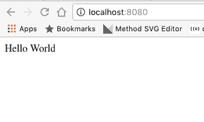

# 与 Python 同构并做出反应

> 原文:[https://dev . to/_ _ amol _ _/going-同构-with-python-and-react](https://dev.to/__amol__/going-isomorphic-with-python-and-react)

同构 web 应用程序的部分或全部代码都在服务器和客户机上执行。服务器和浏览器共享部分或全部代码。

同构解决方案可以实现的最大目标之一是改善单页面应用程序的 SEO，但是到目前为止，这些功能主要是为 JavaScript 开发人员提供的，他们可以在浏览器和节点上运行相同的代码。

由于浏览器只支持 JavaScript(除非涉及到深奥的技术),所有可用于创建同构应用程序的广泛使用的库和框架都期望在 JavaScript 上运行，作为 Python 开发者，我们几乎别无选择。

对这种情况的不满促使我开发了 [DukPy](https://github.com/amol-/dukpy) ，这是一个 Python 库，旨在从我的工作工具链中消除对 NodeJS 的需求(希望对其他人也是如此)。

最广泛的同构 web 框架之一是 [React](https://facebook.github.io/react/) ，它允许渲染 React 组件服务器，并在组件到达浏览器时附加动态行为。

几个月前，我写了一篇关于如何在不需要 NodeJS 或 WebAssets 的情况下在 Python web 应用程序中使用 ES2015 和 JSX 的短文。

但它没有涵盖如何创建同构应用程序，应用程序的 javascript 代码仍在浏览器上运行，React 组件无法提供预渲染版本。所以我决定开始这篇文章，展示如何使用 DukPy 和 React 一起用 Python 编写同构的 web 应用程序，甚至不用安装 NodeJS。

如果您还没有阅读，请务必阅读 ES2015 文章，因为这篇文章将理所当然地阐述已知的概念。

* * *

我想当然地认为你已经安装了所有需要的 Python 包，如 [ES2015 文章](https://medium.com/@__amol__/es2015-and-react-in-pure-python-environment-b326dc15012c) :
中展示的

```
$ pip install TurboGears2
$ pip install Kajiki
$ pip install tgext.webassets
$ pip install dukpy 
```

<svg width="20px" height="20px" viewBox="0 0 24 24" class="highlight-action crayons-icon highlight-action--fullscreen-on"><title>Enter fullscreen mode</title></svg> <svg width="20px" height="20px" viewBox="0 0 24 24" class="highlight-action crayons-icon highlight-action--fullscreen-off"><title>Exit fullscreen mode</title></svg>

一旦所有需要的部分都准备就绪，我们就可以开始制作一个在客户端呈现 React 组件的应用程序，然后我们将在服务器上呈现相同的组件，并让浏览器从那里接管。

为此，我们将创建一个 **statics/js** 目录，在那里我们将放置所有的 JavaScript

```
$ mkdir statics
$ mkdir statics/js 
```

<svg width="20px" height="20px" viewBox="0 0 24 24" class="highlight-action crayons-icon highlight-action--fullscreen-on"><title>Enter fullscreen mode</title></svg> <svg width="20px" height="20px" viewBox="0 0 24 24" class="highlight-action crayons-icon highlight-action--fullscreen-off"><title>Exit fullscreen mode</title></svg>

确保将 **react** 和 **react-dom** 下载到该目录中，以便它们可用于我们的网络应用

```
$ cd statics/js
$ curl -O 'https://cdnjs.cloudflare.com/ajax/libs/react/15.3.2/react-dom.js'
$ curl -O 'https://cdnjs.cloudflare.com/ajax/libs/react/15.3.2/react.js' 
```

<svg width="20px" height="20px" viewBox="0 0 24 24" class="highlight-action crayons-icon highlight-action--fullscreen-on"><title>Enter fullscreen mode</title></svg> <svg width="20px" height="20px" viewBox="0 0 24 24" class="highlight-action crayons-icon highlight-action--fullscreen-off"><title>Exit fullscreen mode</title></svg>

最后但同样重要的是，我们需要组件本身，它将是一个简单的 *HelloWorld* 组件。
我们的组件将在一个**statics/js/hello world . jsx**文件中声明:

```
export class HelloWorld extends React.Component {
  render() {
    return (
      <div className="helloworld">
        Hello {this.props.name}
      </div>
    );
  }
} 
```

<svg width="20px" height="20px" viewBox="0 0 24 24" class="highlight-action crayons-icon highlight-action--fullscreen-on"><title>Enter fullscreen mode</title></svg> <svg width="20px" height="20px" viewBox="0 0 24 24" class="highlight-action crayons-icon highlight-action--fullscreen-off"><title>Exit fullscreen mode</title></svg>

然后，我们将创建一个 **app.py** 文件，我们将在其中放置启动 web 服务器的 Python 代码，创建 web 应用程序，将 JSX 编译为普通 js，并提供将呈现组件本身的索引页面:

```
import tg
from tg import AppConfig
from tg import TGController
from tg import expose
import kajiki

page = kajiki.XMLTemplate(u'''<html>
    <head></head>
    <body>
      <div id="isomor"></div>

      <script py:for="m in g.webassets['bundle.js'].urls()"
              src="$m">
      </script>
      <script>
ReactDOM.render(
    React.createElement(HelloWorld.HelloWorld, { name: "World" }),
    document.getElementById('isomor')
);
      </script>
    </body>
</html>
''', mode='html5')

class RootController(TGController):
    @expose()
    def index(self):
        return page(dict(
            g=tg.app_globals
        )).render()

config = AppConfig(minimal=True, root_controller=RootController())
config.renderers = ['kajiki']
config.serve_static = True
config.paths['static_files'] = 'statics'

from webassets.filter import register_filter
from dukpy.webassets import BabelJSX
register_filter(BabelJSX)

import tgext.webassets as wa
wa.plugme(
    config,
    options={
        'babel_modules_loader': 'umd'
    },
    bundles={
        'bundle.js': wa.Bundle(
            'js/react.js',
            'js/react-dom.js',
            wa.Bundle(
                'js/HelloWorld.jsx',
                filters='babeljsx',
            ),
            output='assets/bundle.js'
        )
    }
)

application = config.make_wsgi_app()

from wsgiref.simple_server import make_server
print("Serving on port 8080...")
httpd = make_server('', 8080, application)
httpd.serve_forever() 
```

<svg width="20px" height="20px" viewBox="0 0 24 24" class="highlight-action crayons-icon highlight-action--fullscreen-on"><title>Enter fullscreen mode</title></svg> <svg width="20px" height="20px" viewBox="0 0 24 24" class="highlight-action crayons-icon highlight-action--fullscreen-off"><title>Exit fullscreen mode</title></svg>

如果你试着运行保存的包含这些内容的 **app.py** 文件，并且所有的依赖项都正确就位，你应该看到类似于

```
$ python app.py
No handlers could be found for logger "tg.configuration.app_config"
Serving on port 8080... 
```

<svg width="20px" height="20px" viewBox="0 0 24 24" class="highlight-action crayons-icon highlight-action--fullscreen-on"><title>Enter fullscreen mode</title></svg> <svg width="20px" height="20px" viewBox="0 0 24 24" class="highlight-action crayons-icon highlight-action--fullscreen-off"><title>Exit fullscreen mode</title></svg>

将你的浏览器指向 [http://localhost:8080](http://localhost:8080) 应该会用*“你好，世界”*来问候你

[T2】](https://res.cloudinary.com/practicaldev/image/fetch/s--my8Qux0j--/c_limit%2Cf_auto%2Cfl_progressive%2Cq_auto%2Cw_880/https://cdn-images-1.medium.com/max/800/1%2ASD4GWZEbEW7gsmejEndYYg.png)

如果有任何不清楚的地方，确保你从之前的[纯 Python](https://medium.com/@__amol__/es2015-and-react-in-pure-python-environment-b326dc15012c) 帖子开始，因为那会一步一步解释到目前为止发生了什么。

* * *

现在我们的应用已经就绪，我们可以开始引入 React 的服务器端渲染了。

这需要一个额外的组件，我们将不得不下载到我们的 **statics/js** 目录，即 **react-dom-server** 库，它允许 React
的服务器端渲染

```
$ cd statics/js
$ curl -O 'https://cdnjs.cloudflare.com/ajax/libs/react/15.3.2/react-dom-server.js' 
```

<svg width="20px" height="20px" viewBox="0 0 24 24" class="highlight-action crayons-icon highlight-action--fullscreen-on"><title>Enter fullscreen mode</title></svg> <svg width="20px" height="20px" viewBox="0 0 24 24" class="highlight-action crayons-icon highlight-action--fullscreen-off"><title>Exit fullscreen mode</title></svg>

然后，我们将把我们的组件渲染到我们的 Python web 应用程序中，为此，我们将依赖 DukPy 进行实际渲染，并依赖 WebAssets 提供所需的依赖关系

```
import json
from dukpy import JSInterpreter, jsx_compile
from markupsafe import Markup

class ReactRenderer(object):
    def __init__(self, jspath):
        self.jspath = jspath
        self.jsi = JSInterpreter()
        self.jsi.loader.register_path(self.jspath)
        self.components = {}
        self.initialized = False

    def _init(self):
        if self.initialized:
            return

        bundle_js = tg.app_globals.webassets['bundle.js']
        self.jsi.evaljs(
            [f.data() for f in bundle_js.build()] +
            ["var ReactDOM = require('react-dom-server');"]
        )
        self.initialized = True

    def render(self, component, **kwargs):
        self._init()
        code = "ReactDOM.renderToString(React.createElement({component}, {args}), null);".format(component=component, args=json.dumps(kwargs))
        return Markup(self.jsi.evaljs(code)) 
```

<svg width="20px" height="20px" viewBox="0 0 24 24" class="highlight-action crayons-icon highlight-action--fullscreen-on"><title>Enter fullscreen mode</title></svg> <svg width="20px" height="20px" viewBox="0 0 24 24" class="highlight-action crayons-icon highlight-action--fullscreen-off"><title>Exit fullscreen mode</title></svg>

*ReactRenderer* 是一个方便的类，它将创建一个 DukPy 解释器，预加载了 **React** 和 **HelloWorld** 组件(通过我们已经声明的**bundle . js**web assets bundle)以及通过**加载的**React-DOM-server**requires**

事实上，该类由一个单独的 **render()** 方法组成，该方法将初始化解释器(如果还没有初始化的话),然后呈现指定的 React 组件。所以我们可以使用这个类来呈现我们的 **bundle.js** 中可用的任何组件，包括 HelloWorld 组件。

唯一剩下的部分是我们需要创建它，并将其提供给我们的 **index()** 动作，以便它可以使用它来呈现组件。为了方便起见，通常我需要随处可用的 ReactRenderer 对象，我将在我的应用程序配置中使用它

```
import os
config.react_renderer = ReactRenderer(
   os.path.join(os.path.dirname(__file__), 'statics', 'js')
) 
```

<svg width="20px" height="20px" viewBox="0 0 24 24" class="highlight-action crayons-icon highlight-action--fullscreen-on"><title>Enter fullscreen mode</title></svg> <svg width="20px" height="20px" viewBox="0 0 24 24" class="highlight-action crayons-icon highlight-action--fullscreen-off"><title>Exit fullscreen mode</title></svg>

确保在创建 TurboGears 应用程序之前添加这一行(所以在`make_wsgi_app`之前)。提供给 ReactRenderer 的参数是路径，它可以在该路径中找到任何将通过 **require** 加载的额外 javascript 模块，在本例中，我们在 **statics/js** 中下载了 *react-dom-server* ，这是指定的路径。
现在我们的 ReactRenderer 已经就位，我们可以编辑我们的 **index** 动作，并为我们的 HTML 模板
提供 react 渲染器

```
class RootController(TGController):
    @expose()
    def index(self):
        return page(dict(
            render_react=tg.config['react_renderer'].render,
            g=tg.app_globals
        )).render() 
```

<svg width="20px" height="20px" viewBox="0 0 24 24" class="highlight-action crayons-icon highlight-action--fullscreen-on"><title>Enter fullscreen mode</title></svg> <svg width="20px" height="20px" viewBox="0 0 24 24" class="highlight-action crayons-icon highlight-action--fullscreen-off"><title>Exit fullscreen mode</title></svg>

如果您正确地将`render_react`值添加到控制器动作提供给`page`模板的值中，我们现在可以更改模板本身来呈现组件。

如果你记得我们之前有一个空的`isomor` div

```
<div id="isomor"></div> 
```

<svg width="20px" height="20px" viewBox="0 0 24 24" class="highlight-action crayons-icon highlight-action--fullscreen-on"><title>Enter fullscreen mode</title></svg> <svg width="20px" height="20px" viewBox="0 0 24 24" class="highlight-action crayons-icon highlight-action--fullscreen-off"><title>Exit fullscreen mode</title></svg>

该 div 仅充当我们的`ReactDOM.render`调用的目标，该调用呈现组件并将其放入 div 中。

这一点非常明显，因为我们的页面在加载时有一段时间是空的，过了一会儿 React 能够呈现内容时，内容才出现。

我们要做的是用一个预先渲染了组件的 div 替换那个空的 div:

```
<div id="isomor">${render_react('HelloWorld.HelloWorld', name='World')}</div> 
```

<svg width="20px" height="20px" viewBox="0 0 24 24" class="highlight-action crayons-icon highlight-action--fullscreen-on"><title>Enter fullscreen mode</title></svg> <svg width="20px" height="20px" viewBox="0 0 24 24" class="highlight-action crayons-icon highlight-action--fullscreen-off"><title>Exit fullscreen mode</title></svg>

可调用的`render_react`实际上是我们从动作中提供的`ReactRender.render`方法。如果你记得第一个参数是应该被渲染的组件(在这个例子中是来自`HelloWorld`模块的`HelloWorld`),任何额外的关键字参数作为组件的属性被传递。在本例中，我们提供了`name=World`属性(与我们在`React.createElement`调用中所做的一样)。

请注意，在 python 中呈现组件时，提供给组件的任何属性都必须与提供给 JS 中的 *React.createElement* 调用的属性相匹配，否则 React 将会抱怨并替换 div 内容，而不是重用它(如果您错误地在呈现的组件之前或之后放置空格，也会发生同样的情况)。

* * *

如果一切都按预期运行，页面空白的那一瞬间应该已经消失了。该组件现在由 python 进行了服务器预渲染，React 将在浏览器上继续 Python 的工作。

恭喜你！我们在纯 Python 中实现了第一个同构应用！:D

本文中使用的代码的要点可以在 GitHub 上获得:[https://gist . GitHub . com/amol-/4563 C7 DC 27 c 94d 8 ea 58 faba cb4 CD 71 c 6](https://gist.github.com/amol-/4563c7dc27c94d8ea58fabacb4cd71c6)

*本文原载于[https://medium.com/@__amol__](https://medium.com/@__amol__)T3】*