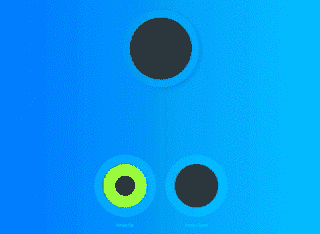

# 我如何通过 CSS 欺骗整个聚会给我他们的浏览器历史

> 原文:[https://dev . to/active node/how-I-tricked-the-all-meetup-into-giving-me-their-browser-history-through-CSS-ajd](https://dev.to/activenode/how-i-tricked-the-whole-meetup-into-giving-me-their-browser-history-through-css-ajd)

这一切都开始于一个深夜和深思熟虑的编码夜，直到凌晨 4 点我才能闭上眼睛。那天晚上，我突然想到:我可以通过 CSS 读取用户历史记录——不是吗？🐒

被访问的伪类似乎对我的邪恶计划如此坚定。结合类似 window.getComputedStyle 的东西，人们可以很容易地向一个站点添加一大堆链接，并检查具有:visited 样式的样式。

是的，有些时候你完全可以做到这一点(在火狐 2 还新鲜的时候)。幸运的是，这个问题很久以前就被报道过(例如，在这里阅读或在这里阅读)，很高兴知道我们是安全的。

#### 但是等等！我可以骗你告诉我你去了哪里

让我们总结一下:我不能以编程方式检测:访问过的样式。但是我可以友好地请求用户批准:visited 状态😈

所以我做了一个简单的*游戏*,它有 3 个 SVG 圆圈:一个黑色或绿色的大圈和下面两个黑色和绿色的圆圈。然后要求用户按下上面圆圈中显示的相应按钮。这样做，用户告诉我，如果它是一个链接:访问过的风格或没有。**逮到你了！**

<figure> 

<figcaption>我的讲述历史游戏</figcaption>

</figure>

#### 这是现在的一大安全隐患吗？

与其说是重大安全风险，不如说是个人层面的隐私风险。这件事的坏处是太偷偷摸摸了。

如果你是那种认为这是一个非常虚构的场景，并且不会上当的人，那你就大错特错了。用同样的技术，你可以制作看不见的按钮。例如，在登陆页面上，我可以用这个来确定你是否已经登陆过竞争对手的网站，并为你提供更大的折扣(事实上这对你来说是件好事)。

只要想得更远一点——让你的创造力流动起来。

### 结论

当你在一个你不熟悉的网页上，并且意图不是 100%清楚的时候:如果你觉得不完全安全和舒服，在采取任何行动之前使用你的隐名模式。可能是你的朋友只是为了好玩而查看你的历史。