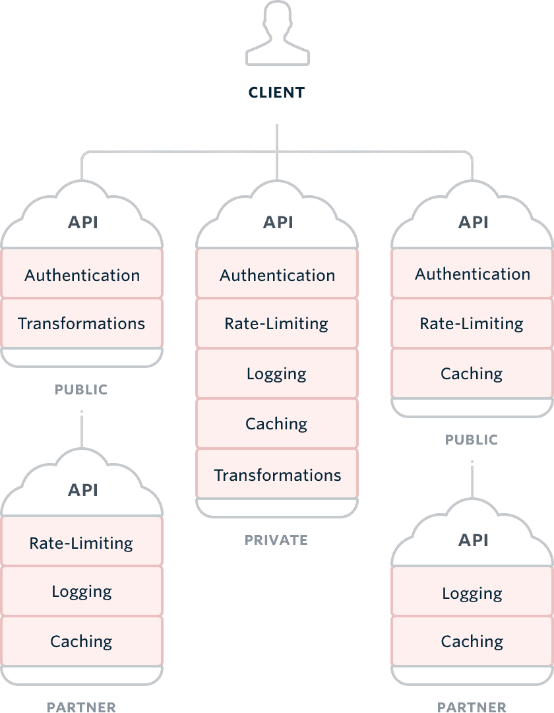
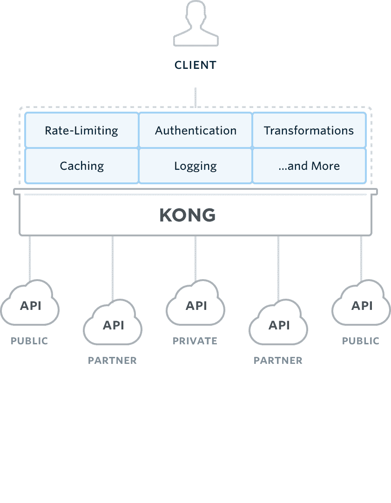

# 在你的 API 上统治你与 Kong

> 原文:# t0]https://dev . to/d3rwan/regret-sur-vos-APIs-con-kong-179 p

[mashup](https://www.mashape.com/)是 API 的公开目录，允许其用户共享其 API 或使用他人的 API。为了保护和管理其目录中的大约 15000 个微服务，mashape 创建了一个 API 管理解决方案 [Kong](https://getkong.org/) 。

Kong 是一个基于 nginx 的开放源代码解决方案，它可以满足 mashape 每月处理数十亿个查询的要求。

[T2】](https://res.cloudinary.com/practicaldev/image/fetch/s--tJeJGeF2--/c_limit%2Cf_auto%2Cfl_progressive%2Cq_auto%2Cw_880/https://d3rwan.github.io/d3rwan-blog/media/kong/modules.png)

Kong 还依赖 Cassandra 数据库(PostgreSQL 功能)和一组插件。默认情况下，该解决方案已经提供了一个模块托架，可实现身份验证、安全性、速率限制或监控。如果需要创建自己的插件(参见官方文档

在您的基础架构中，API manager 会将服务放在前台(反向代理方法)，并支持您委托给它的功能。因此，您的每一个业务部门都不再需要处理这些技术问题，而是可以专注于核心业务。

[T2】](https://res.cloudinary.com/practicaldev/image/fetch/s--YfU-BN0H--/c_limit%2Cf_auto%2Cfl_progressive%2Cq_auto%2Cw_880/https://d3rwan.github.io/d3rwan-blog/media/kong/archi-wo-kong.png)

 *建筑遗产 vs 建筑东方 API*

无论您需要管理一组微服务、一个开始流行的 API，还是仅仅是一个 web/移动后端，现在都是开始管理 API 的时候了。

## 入门

在这一部分中，我们将使用网站[【http://anapioficeandfire . com/](http://anapioficeandfire.com/)所展示的 API 作为合作伙伴，展示有关宝座游戏宇宙的数据。

为了部署 Kong，我们将使用由 docker-compose 编排的 docker 容器。堆栈配置如下: