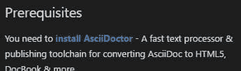
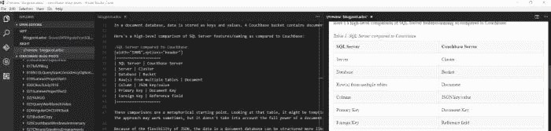

# 牦牛刮毛历险记:包含 Visual Studio 代码、Ruby 和 Gem 的 AsciiDoc

> 原文：<https://dev.to/mgroves/adventures-in-yak-shaving-asciidoc-with-visual-studio-code-ruby-and-gem>

*这是一篇来自横切关注点的转贴:[牦牛毛历险记:带有 Visual Studio 代码、Ruby 和 Gem 的 AsciiDoc](http://crosscuttingconcerns.com/Adventures-in-Yak-Shaving-AsciiDoc-with-Visual-Studio-Code-Ruby-and-Gem)T3】*

我去年在博客上写了关于我从 Markdown 切换到 AsciiDoc 的事情，我当时使用的是 [AsciiDocFX](http://asciidocfx.com/) 。

我仍然喜欢 AsciiDoc，但 AsciiDocFX 已经让我心烦意乱:

*   它没有一个非常好的更新系统。它检查新版本，但似乎我必须 a)卸载旧版本，b)重新安装新版本，否则我会遇到问题。我可能做错了，但这让我想少更新。
*   用户界面有点不稳定。实时预览有时似乎会在击几个键后更新，这意味着预览和文档不同步。它往往会被锁定，直到我点击恢复按钮，然后最大化按钮。

尽管如此，我还是用了。

但是，我这周造了一台新电脑。我在上面安装了我的软件。我认为有必要看看是否有针对 Visual Studio 代码的 AsciiDoc 插件。当然有，因为显然代码扩展生态系统正在蓬勃发展！

所以，我安装了若奥·平托的 [AsciiDoc，因为它有一个实时预览。但是，它要求我实际安装 asciidoc 命令行工具。](https://marketplace.visualstudio.com/items?itemName=joaompinto.asciidoctor-vscode)

[T2】](https://res.cloudinary.com/practicaldev/image/fetch/s--_efDmXgf--/c_limit%2Cf_auto%2Cfl_progressive%2Cq_auto%2Cw_880/https://crosscuttingconcerns.blob.core.windows.nimg/asciidoc%2520prereq.jpg)

看到了吗？

所以，我想，这应该很容易。我去了 [AsciiDoc 网站](http://asciidoctor.org/docs/install-toolchain/)并开始按照指示安装 Windows。

**安装 Ruby**

好了，现在我需要安装 Ruby。应该很容易。我已经有了 Chocolatey NuGet，所以我只运行`choco install ruby`。没问题。我知道红宝石配宝石，所以我应该都准备好了。

**安装 AsciiDoc**

根据 AsciiDoc...文件（documents 的简写）...我只要用`gem install asciidoctor`就可以了。

但是，不。没那么简单。否则我不会写这篇博客。我收到一条错误消息:

`SSL_connect returned=1 errno=0 state=SSLv3 read server certificate B: certificate verify failed`

我相信你们所有的 Ruby 人或 Mac 人或其他人都已经知道这将走向何方，但我不知道。所以我谷歌了一下。我在 StackOverflow 上找到了一大堆建议。有些解决方案有意义，但不适用于 Windows，反之亦然。我最终在 rubygems.org 偶然发现了[一些随机家伙的要点和 SSL 升级，这导致我在 rubygems.org](https://gist.github.com/luislavena/f064211759ee0f806c88)[看到了这个关于 SSL 更新的页面](http://guides.rubygems.org/ssl-certificate-update/#installing-using-update-packages)。

**修复 RubyGems 证书之类的东西**

因此，按照字面意思:

`gem install --local C:\rubygems-update-2.6.7.gem`

然后

`update_rubygems --no-ri --no-rdoc`

最后

`gem uninstall rubygems-update -x`

所以，我想这是固定的...什么事？在我上面链接的要点中有描述。但是我真的不明白为什么对于一个全新安装的 ruby 来说这还是一个问题。不是抱怨！成功了！

**好了，现在安装 AsciiDoc**

所以现在`gem install asciidoctor`起作用了。现在我得到了 Visual Studio 代码中的 AsciiDoc 的实时预览。

[T2】](https://res.cloudinary.com/practicaldev/image/fetch/s--XocLFdF1--/c_limit%2Cf_auto%2Cfl_progressive%2Cq_auto%2Cw_880/https://crosscuttingconcerns.blob.core.windows.nimg/asciidoc%2520with%2520visual%2520studio.jpg)

我会在更多的时间写博客后回来报道，看看我是否喜欢这样，或者我是否最终会回到 AsciiDocFx。