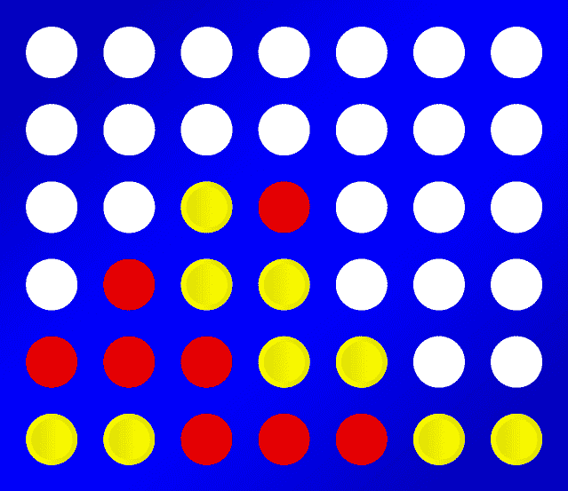

# 辅助项目-连接 4

> 原文:[https://dev.to/funkysi1701/side-project-connect-4-22al](https://dev.to/funkysi1701/side-project-connect-4-22al)

喂？

你可能和我一样几乎忘记了这个博客。在过去的几个月里，生活变得困难了，但是让我们看看我是否能重新开始我的博客习惯。

[T2】](https://res.cloudinary.com/practicaldev/image/fetch/s--f1pYe5xQ--/c_limit%2Cf_auto%2Cfl_progressive%2Cq_auto%2Cw_880/https://storageaccountblog9f5d.blob.core.windows.net/blazor/wp-content/uploads/2017/02/Connect4.png%3Fw%3D639%26ssl%3D1)

出于几个原因，我想在 2017 年开始一个副业项目。我想提高我的编码技能，看看我在日常工作中通常不会看到的东西。

我一直在试图决定建造什么。实际的项目并不太重要，最重要的是我在构建过程中使用的技术。我想要的东西，我可以开始作为一个 windows 应用程序，然后扩展到网络或移动应用程序。

我开始考虑魔方应用程序，然而我最初的代码让我相信它对我的第一个应用程序来说可能太复杂了。

去年，在纽约 Code Dojo 的一次会议上，我花了一个晚上的时间研究 Connect 4。我认为这应该足够复杂，我可以编写一些逻辑来有效地解决这个游戏，但是不要太复杂，我会在构建太多之前被打败。

到目前为止，我已经建立了一个控制台应用程序，通过控制台显示。写()命令，一个代表游戏的格子，0 代表空，1 代表红，2 代表黄，等等。我目前正在研究解决游戏的逻辑，一旦我有了一个好的状态，我就可以扩展到 winforms 应用程序，web(很可能是 MVC)应用程序，最后是移动应用程序(我还不知道如何做到这一点，但我希望有一天可以尝试)。

过去几天我听了？他们讨论了渐进式网络应用。这听起来对我来说是一个巨大的挑战。渐进式网络应用程序是一个网站，它可以自动检测各种属性，为您提供一个无论互联网连接状态如何、无论您使用何种浏览器都可以正常运行的应用程序。

我有很多东西要学，但我可以把它分成小部分，我可以建立一些展示我的一些技能。