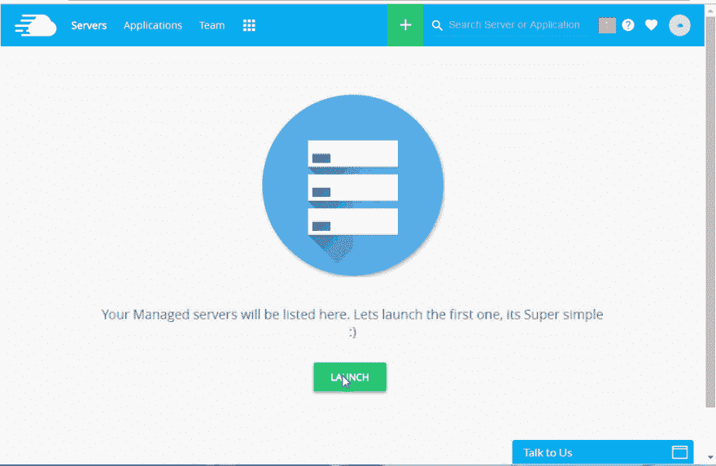
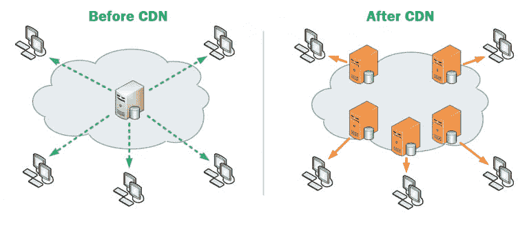
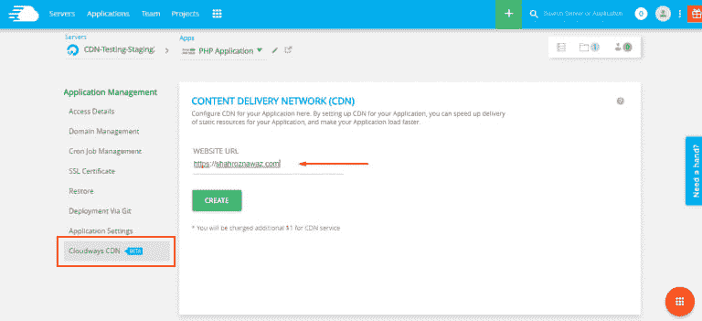

# 1 美元 CloudwaysCDN——让您的 PHP 应用程序走向全球

> 原文：<https://dev.to/_shahroznawaz/1-cloudwayscdn--get-global-reach-for-your-php-applications-24a>

多年来，PHP 已经巩固了其作为遗留和实时项目首选开发语言的地位。随着最近 PHP 版本的发布，这种语言现在处于一个非常有利的位置，可以帮助开发人员快速启动支持 RAD 的应用程序。

在 Cloudways，我们试图方便 PHP 开发人员启动他们的项目，而不用担心服务器管理的麻烦。我们即将发布的内容交付系统(CDN)是这一承诺的延续。在本文中，我将介绍为 PHP 应用程序启用和配置 CloudwaysCDN 的过程。

## 先决条件

*   [带有 PHP 应用程序的 Cloudways 服务器](https://www.cloudways.com/blog/host-php-on-digitalocean/)
*   [安装在服务器](https://www.cloudways.com/blog/install-symfony-3-on-cloud/)上的 Symfony(或支持 Symfony Flex 的应用程序)
*   您的域应该被映射

您可以按照下面的 GIF 在 Cloudways 上启动一个服务器和一个 PHP 应用程序。默认情况下，你会得到 PHP 7.0 但是，您可以降级或升级到 PHP 5.6 或 7.1。

[T2】](https://res.cloudinary.com/practicaldev/image/fetch/s--h9MSE7Je--/c_limit%2Cf_auto%2Cfl_progressive%2Cq_66%2Cw_880/http://www.cloudways.com/blog/wp-content/uploads/php-server-stack-1-2-2.gif)

首先说一下 CDN，以及为什么需要把它集成到 PHP 项目中。

## 什么是 CDN？

CDN 是一个由多个服务器组成的系统，向用户提供静态内容(如文本、图像)。CDN 不是从原始服务器提供静态内容，而是确保从最近的位置(也称为存在点或 pop)向用户提供数据。每个 PoP 包含许多缓存服务器，负责向其附近的访问者提供内容。

[T2】](https://res.cloudinary.com/practicaldev/image/fetch/s--ZwB-nzC1--/c_limit%2Cf_auto%2Cfl_progressive%2Cq_auto%2Cw_880/https://www.cloudways.com/blog/wp-content/uploads/cdn-structure-768x329.png)

## CDN 为什么有必要？

CDN 确保内容的快速传送，从而提高网站和网络应用的速度。当 CDN 处于活动状态时，网站的实际位置并不重要。CDN 确保访问者从最近的位置接收数据。由于 Symfony 以支持金融科技和电子商务应用而闻名，CDn 在加快用户体验方面发挥着核心作用。

## 在 Cloudways 上为 PHP 应用启用 CDN

当您登录到您的服务器时，移动到 Application 选项卡并打开 PHP 应用程序。您将在选项的末尾看到用于配置 CDN 的选项卡。当您点击选项卡时，您将进入 CDN 配置屏幕。在这里，您将找到要插入网站 URL 字段的应用程序的 URL，然后单击“创建”按钮。

[T2】](https://res.cloudinary.com/practicaldev/image/fetch/s--q9FQtWa1--/c_limit%2Cf_auto%2Cfl_progressive%2Cq_auto%2Cw_880/https://www.cloudways.com/blog/wp-content/uploads/cdn-config-768x351.png)

接下来，您将获得为您的 Symfony 应用程序新生成的 URL:

[T2】](https://res.cloudinary.com/practicaldev/image/fetch/s--3QCd8Qfw--/c_limit%2Cf_auto%2Cfl_progressive%2Cq_auto%2Cw_880/https://www.cloudways.com/blog/wp-content/uploads/cdn-app-url-768x350.png)

这里需要注意几件事:

*   您可以在此屏幕上查看带宽使用情况。
*   您可以随时使用“清除”按钮清除 CDN 中的旧内容。
*   您可以随时删除您的订阅。

## 在应用资产中集成 CDN URL

在核心 PHP 应用中，开发人员喜欢创建自己的用例来集成 CDN。一个用例是用 php 定义 CDN url，如下所示:

```
<?php
define('CDN', 'https://3971-7889-2-raikfcquaxqncofqfm.stackpathdns.com/');
?> 
```

Enter fullscreen mode Exit fullscreen mode

现在，将它添加到每个资产 URL，这里的资产是指所有的 JS、Css 和图像文件:

```
images/portfolio/big/css.png"/>
<script type="text/javascript" src="<?php echo CDN ?>js/modernizr.custom.26633.js"></script> 
```

Enter fullscreen mode Exit fullscreen mode

为资产生成的 URL 现在将如下所示:

```
<script type="text/javascript" src="<?php echo CDN ?>https://3971-7889-2-raikfcquaxqncofqfm.stackpathdns.com/js/modernizr.custom.26633.js"></script> 
```

Enter fullscreen mode Exit fullscreen mode

这只是一个例子，尽管开发者在网站上尝试不同的用例。

Symfony 为 CDN 服务提供了简单的配置选项。如果你知道`base_url`，你就可以走了。在标准 Symfony 安装中，移动到**应用>T5 配置**并打开`config.yml`。

您需要在框架配置中找到资产设置。由于我们的 CDN 是基于资产的，我将在 CDN Url 上以`base_url`链接到 Symfony 中的每个资产文件。

```
framework:
  assets:
      base_urls:
          - 'https://3971-7889-2-raikfcquaxqncofqfm.stackpathdns.com/' 
```

Enter fullscreen mode Exit fullscreen mode

现在，通过运行`rm -fr var/cache/*`清空您的缓存，并检查您的 Symfony 应用程序资产 URL:

如果您正在使用 [Symfony Flex 进行应用管理](https://www.cloudways.com/blog/using-symfony-flex/)，那么在您的项目文件夹中，移动到 **config > > packages** 文件夹并打开`framework.yaml`文件。如上所示添加相同的资产配置。

## 结论

Cloudways 与 StackPath(以前称为 MaxCDN)合作，为 Cloudways CDN 提供一键激活。请注意，对于单个网站，每 25GB 带宽的月订阅费用为 1 美元。你可以利用任何 PHP 网站和基于框架的应用程序。