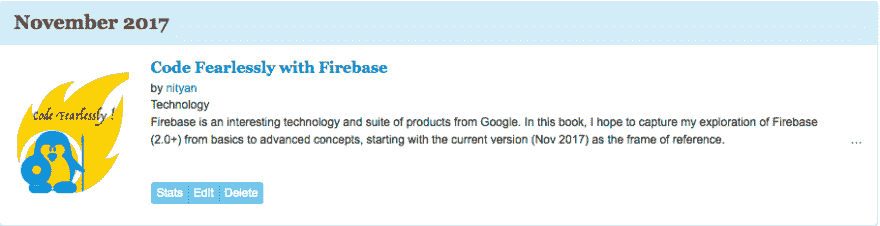

# #1 无畏地编码:起源故事

> 原文：<https://dev.to/devfestnyc/1-coding-fearlessly-origin-story-4g>

这是我将探索 Firebase 平台所有精彩之处的系列文章的第一篇，涉及好的、坏的和“OMG 发生了什么！在我看来，这些方面使它成为一个值得添加到您的开发工具箱中的工具。

### 背景

让我们从头开始。其实还是不要了。让我们开始吧。

这是我想写的一系列计划内和计划外但却意外有趣的帖子中的第一篇，涵盖了 **Firebase** 的全部内容，该平台最初是一个实时数据库，但后来已经发展成为满足移动& web 开发人员所有无服务器计算需求的一站式商店。这既是祝福也是诅咒。

**幸运的是**随着技术的快速进步，我们作为开发人员*需要*这种交钥匙解决方案和委托管理模式，可以帮助我们将更多的注意力放在*打造独特的、令人满意的用户体验上*，而不是让我们的周期旋转，编写、重写或管理服务器端所需的大量复杂性，但消费者往往看不到或不理解这些复杂性。

由于这种复杂性大多源于常见的底层需求，如身份认证、存储、数据库、托管、分析、支付、性能监控、测试、可扩展性等。“事实上，它非常适合于*后端即服务(BaaS)* 模式。通用性可以抽象为基于 API 的服务，这些服务可以从客户端代码中轻松调用，并且由 BaaS 提供商维护的标准客户端库进一步简化了流程，确保它们可靠地与不断变化或发展的服务功能保持同步&。

诅咒在于，这些平台提供了一系列重要的服务，但并不总是清楚你何时、如何或为什么需要它们。它们真的有必要吗？还是我们会被老式的促销所迷惑？如果使用制药类比，我们想要某个功能的品牌名称服务，而不是 BaaS 提供的捆绑通用药品，会怎么样？这可行吗？这是否增加了复杂性——如果是的话，权衡因素是什么？最后，*我会做出不可逆转的决定吗？*换句话说，致力于这个平台是否会让我走上更加依赖某项技术的道路——因此，如果这项技术被弃用(或者更糟，被淘汰),我就不会束手无策。先说清楚。没有零风险技术这种东西——这里的讨论更多的是关于过时的时间框架，以及随着生态系统的发展，迁移或缓解的途径。

### **目标**

首先，是我写一系列探索这一领域的文章的动机。实际上，目标观众是我。我发现把事情写下来有助于我看到自己理解中的差距———而教别人有助于我看到这些想法在不同背景下的相关性或适用性的差距。但是我永远也找不到时间做这件事，因为生活就是这样*！*

第二个，我热衷于教导他人，我突然想到，如果我想在我的“FirebaseCamp”活动中为学生创造路径，让他们以后自己探索，那么这一系列的文章可以有效地派上用场。在这种情况下，我特别想强调“**无畏编码”这个术语。_** 我经常发现成年人，也许有些人比其他人更低估自己的能力，过度分析自己的失败，因为自我形象问题往往是流行文化的产物，而不是现实。我碰巧是其中之一。

我害怕承认我不知道很多事情——在技术领域工作了 20 多年后，很难说“*我不是计算机科学专业的，我有 ECE 背景——我知道的大部分都是自学的，所以我在基础知识或理解方面有差距”*。说“*当然，我知道”更容易些*然后在熬夜学习中付出代价&无数个小时痛苦的调试，靠自己———而不是寻求帮助。这是一个令人敬畏的事实——一旦你接受自己不知道某事，你会发现肩上卸下了一个难以置信的重担，你会更自由地问问题*,实际上比以前学得更有成效*。**是的，只需说“我不知道，所以告诉我吧”,这是令人难以置信的授权，同时也是一种解放！！**

因此关注**无畏的编码。在这个系列中，我将说、做和分享我所知道的一切。当我错了的时候——我会错很多次——我希望人们会纠正我，教育我，并帮助我完善这些部分，这样我们的集体理解就会提高。*重要的是，我现在对自己的学习能力有了难以置信的信心，理解&应用想法，我想帮助其他人无所畏惧地获得积极的自尊。***

第三，技术发展如此之快，有时想法、API 或工具在几个月内就会过时，因为新的版本或竞争对手会出现。因此，这也意味着是一个*活文档*——一个我可以回来并随着情况的变化更新章节的地方，以反映当前的最佳实践。我还让它充当描述常用代码模式或快速查找方法调用示例的*代码片段*的存储库，我可以在用 Firebase 构建的个人和专业项目中重新利用这些代码片段。

### 结果

好的，很好。那么我该何去何从呢？我想写文章，并为此设定目标——但是我该如何激励自己呢？结局是什么？

很高兴你问了。

11 月是全国小说写作月(NaNoWriMo)。如果说我最近尝试养成习惯的 30 天让我明白了一件事，那就是设定目标/惯例可以让你更进一步达到预期的结果——即使你可能达不到目标或者不得不在这个过程中修改评估。

就这样开始了。我正致力于写我的系列文章，打算在 12 月 1 日前把它们整合成一部“小说”。

[T2】](https://res.cloudinary.com/practicaldev/image/fetch/s--XywaPpNC--/c_limit%2Cf_auto%2Cfl_progressive%2Cq_auto%2Cw_880/https://cdn-images-1.medium.com/max/909/1%2AkDIdn5Sd803z-JPq56FlTA.png)

11 月份的重点将是开始以文章的形式获取内容。我可以稍后再回来，调整内容，更新内容，使其更加直观，重新安排或以其他方式将内容组合在一起，形成子主题等。这将是原始内容，但这将是一个开始。

祝我好运吧！

* * *