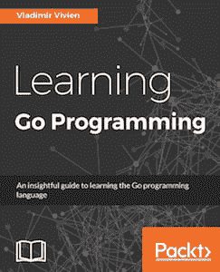

# 使用 Go 进行位黑客攻击

> 原文:[https://dev.to/vladimirvivien/bit-hacking-with-go](https://dev.to/vladimirvivien/bit-hacking-with-go)

在过去计算的好日子里，内存很贵，处理能力也很珍贵，直接破解比特是处理信息的首选(在某些情况下是唯一的)方式。今天，直接位操作在许多计算用例中仍然是至关重要的，如低级系统编程、图像处理、密码学等。

Go 编程语言支持几种按位运算符，包括:

```
 &   bitwise AND
 |   bitwise OR
 ^   bitwise XOR
&^   AND NOT
<<   left shift
>>   right shift 
```

本文的其余部分提供了对每个操作符的详细讨论，并包括如何使用它们的例子。

# &符

在 Go 中，`&`运算符在两个整数操作数之间执行按位`AND`运算。回想一下`AND`操作具有以下属性:

```
Given operands a, b
AND(a, b) = 1; only if a = b = 1
               else = 0 
```

`AND`操作符有一个很好的副作用，可以有选择地将整数值的位清零。例如，我们可以使用`&`操作符将最后 4 个最低有效位(LSB)清零。

```
func main() {
    var x uint8 = 0xAC    // x = 10101100
    x = x & 0xF0          // x = 10100000
} 
```

所有二元运算符都支持简写复合赋值形式。例如，前面的例子可以重写如下。

```
func main() {
    var x uint8 = 0xAC    // x = 10101100
    x &= 0xF0             // x = 10100000
} 
```

用`&`操作符可以做的另一个巧妙的技巧是测试一个数字是奇数还是偶数。这是因为当一个数的最低有效位被设置(等于 1)时，它就是奇数。我们可以使用`&`操作符对值为 1 的整数进行按位`AND`操作。如果结果是 1，那么原数是奇数。

```
import (
    "fmt"
    "math/rand"
)
func main() {
    for x := 0; x < 100; x++ {
        num := rand.Int()
        if num&1 == 1 {
            fmt.Printf("%d is odd\n", num)
        } else {
            fmt.Printf("%d is even\n", num)
        }
    }
} 
```

在[操场](https://play.golang.org/p/2mTNOtioNM)上跑步。

# |运算符

`|`对其整数操作数执行逐位`OR`运算。回想一下`OR`操作员有以下属性:

```
Given operands a, b
OR(a, b) = 1; when a = 1 or b = 1
              else = 0 
```

我们可以使用按位`OR`操作符的性质来有选择地为给定的整数设置单独的位。例如，在下面的例子中，我们使用`OR`运算符将第 3、第 7 和第 8 位设置为 1(从最低有效位到最高有效位(MSB))。

```
func main() {
    var a uint8 = 0
    a |= 196
    fmt.Printf("%b", a)
}

// prints 11000100
          ^^   ^ 
```

在[操场](https://play.golang.org/p/3VPv4D83Oj)上跑步。

当使用位屏蔽技术为给定的整数值设置任意位时，使用`OR`非常有用。例如，我们可以扩展前面的程序，在变量`a`中存储的值中设置更多的位。

```
func main() {
    var a uint8 = 0
    a |= 196
    a |= 3
    fmt.Printf("%b", a)
}

// prints 11000111 
```

在[操场](https://play.golang.org/p/7aJLwh3y4x)上跑步。

前面的程序不仅设置了十进制 196 的位，还设置了十进制值 3 的最后 2 个 LSB。我们可以继续对值进行“或”运算，直到整数值中的所有位字段都被设置。

### 位为配置位

现在，回想一下`AND(a, 1) = a if and only if a = 1`。我们可以使用该事实来查询其设置位的值。例如，从上面的代码中，`a & 196`将返回 196，因为该值的位确实设置在`a`中。所以我们可以结合使用`OR`和`AND`来分别指定和读取配置值。

下面的源代码片段展示了这一点。函数`procstr`转换字符串的内容。它有两个参数:第一个参数`str`是要转换的字符串，第二个参数`conf`是一个整数，用于使用位屏蔽指定多个转换配置。

```
const (
    UPPER  = 1 // upper case
    LOWER  = 2 // lower case
    CAP    = 4 // capitalizes
    REV    = 8 // reverses
)

func main() {
    fmt.Println(procstr("HELLO PEOPLE!", LOWER|REV|CAP))
}

func procstr(str string, conf byte) string {
    // reverse string
    rev := func(s string) string {
        runes := []rune(s)
        n := len(runes)
        for i := 0; i < n/2; i++ {
            runes[i], runes[n-1-i] = runes[n-1-i], runes[i]
        }
        return string(runes)
    }

    // query config bits
    if (conf & UPPER) != 0 {
        str = strings.ToUpper(str)
    }
    if (conf & LOWER) != 0 {
        str = strings.ToLower(str)
    }
    if (conf & CAP) != 0 {
        str = strings.Title(str)
    }
    if (conf & REV) != 0 {
        str = rev(str)
    }
    return str
} 
```

在 Go [操场](https://play.golang.org/p/4E05PQwj5q)上跑步。

上面的函数调用`procstr("HELLO PEOPLE!", LOWER|REV|CAP)`将降低字符串的大小写，颠倒其顺序，并大写每个单词。这是通过将参数`conf`的第 2、第 3 和第 4 位设为值 14 来实现的。然后，代码使用连续的 if 语句块提取这些位，并应用适当的字符串转换。

# ^算子

在 Go 中使用`^`应用`XOR`运算符。`XOR`，异或，具有以下属性:

```
Given operands a, b
XOR(a, b) = 1; only if a != b
     else = 0 
```

这个定义的含义是`XOR`可以用来将位从一个值切换到另一个值。例如，给定一个 16 位的值，我们可以使用下面的代码切换前 8 位(从 MSB 开始)。

```
func main() {
    var a uint16 = 0xCEFF
    a ^= 0xFF00 // same a = a ^ 0xFF00
}

// a = 0xCEFF   (11001110 11111111)
// a ^=0xFF00   (00110001 11111111) 
```

在前面的代码片段中，与 1 进行 XOR 运算的位被翻转(从 0 到 1 或从 1 到 0)。例如，`XOR`的一个实际用途是比较符号幅度。当`(a ^ b) ≥ 0`(或相反符号的`(a ^ b) < 0`)为真时，两个整数 a、b 具有相同的符号，如以下程序所示:

```
func main() {
    a, b := -12, 25
    fmt.Println("a and b have same sign?", (a ^ b) >= 0)
} 
```

在 Go [操场](https://play.golang.org/p/6rAPti5bXJ)上跑步。

前一个程序执行时，会打印:`a and b have same sign? false`。使用 Go Playground 链接更改数字的符号以查看不同的结果。

### ^为按位补码(非)

与其他语言(c/c++、Java、Python、Javascript 等)不同，Go 没有专用的一元按位求补运算符。相反，`XOR`运算符`^`也可以用作一元运算符，对一个数进行补码运算。给定位 x，在 Go <sup>x</sup> = 1 时，^ x 反转该位。我们可以在下面的代码片段中看到这一点，它使用`^a`来取变量`a`的补码。

```
func main() {
    var a byte = 0x0F
    fmt.Printf("%08b\n", a)
    fmt.Printf("%08b\n", ^a)
}

// prints
00001111     // var a
11110000     // ^a 
```

在[操场](https://play.golang.org/p/5d1fQjDAIv)上跑步。

# &^算子

`&^`运算符读作`AND NOT`，是一种简写形式，它将`AND`和`NOT`运算应用于其操作数，如以下定义所示。

```
Given operands a, b
AND_NOT(a, b) = AND(a, NOT(b)) 
```

有趣的是，如果第二个操作数为 1，则会清除第一个操作数中的位，如下所示:

```
AND_NOT(a, 1) = 0; clears a
AND_NOT(a, 0) = a; 
```

下一段代码使用`AND NOT`操作符清除变量 a 中从`1010 1011`到`1010 0000`的最后四个 LSB。

```
func main() {
    var a byte = 0xAB
     fmt.Printf("%08b\n", a)
     a &^= 0x0F
     fmt.Printf("%08b\n", a)
}

// prints:
10101011
10100000 
```

在[操场](https://play.golang.org/p/UPUlBOPRGh)上跑步。

# <<和> >运算符

与其他 C 派生语言类似，Go 使用`<<`和`>>`分别表示左移位和右移位运算符，定义如下:

```
Given integer operands a and n,
a << n; shifts all bits in a to the left n times
a >> n; shifts all bits in a to the right n times 
```

例如，在下面的代码片段中，左移运算符用于将存储在`a` ( `00000011`)中的值左移三次。每次打印结果都是为了便于说明。

```
func main() {
    var a int8 = 3
    fmt.Printf("%08b\n", a)
    fmt.Printf("%08b\n", a<<1)
    fmt.Printf("%08b\n", a<<2)
    fmt.Printf("%08b\n", a<<3)
}

// prints:
00000011
00000110
00001100
00011000 
```

在[操场](https://play.golang.org/p/_lhE8OoZxY)上跑步。

注意，每次移位时，右侧的 LSB 都是零填充。相反，使用右移运算符，一个值中的每一位都可以向右移位，MSB 在左边填零，如下例所示(有符号数例外，参见下面关于算术移位的*注释)。*

```
func main() {
 var a uint8 = 120
 fmt.Printf("%08b\n", a)
 fmt.Printf("%08b\n", a>>1)
 fmt.Printf("%08b\n", a>>2)
}

// prints:
01111000
00111100
00011110 
```

在[操场](https://play.golang.org/p/mO3SbeltxZ)上跑步。

用左右移位运算符可以实现的一些最简单的技巧是乘法和除法，其中每个移位位置代表 2 的幂。例如，下面用右移将`200`(存储在 a 中)除以`2`。

```
func main() {
    a := 200
    fmt.Printf("%d\n", a>>1)
}

// prints:
100 
```

在[操场](https://play.golang.org/p/EJi0YCARun)上跑步。

或者将该值乘以 4，左移 2:

```
func main() {
    a := 12
    fmt.Printf("%d\n", a<<2)
}
// prints:

48 
```

在[操场](https://play.golang.org/p/xuJRcKgMVV)上跑步。

移位运算符提供了在二进制值的指定位置操作位的有趣方法。例如，在下面的代码片段中，`|`和`<<`操作符用于设置变量`a`的第 3 位。

```
func main() {
    var a int8 = 8
    fmt.Printf("%08b\n", a)
    a = a | (1<<2)
    fmt.Printf("%08b\n", a)
}
// prints:
00001000
00001100 
```

在[操场](https://play.golang.org/p/h7WoP7ieuI)上跑步。

或者您可以结合 shift 和`&`操作符来测试第 n 位是否被设置为一个值，如下面的代码片段所示。

```
func main() {
    var a int8 = 12
    if a&(1<<2) != 0 {
        fmt.Println("take action")
    }
}

// prints:
take action 
```

在[操场](https://play.golang.org/p/Ptc7Txk5Jb)上跑步。

使用`&^`和移位操作符，我们可以取消一个值的第 n 位。例如，下面的代码片段重置了变量 a 中的第三位。

```
func main() {
    var a int8 = 13 
    fmt.Printf("%04b\n", a)
    a = a &^ (1 << 2)
    fmt.Printf("%04b\n", a)
}

// prints:
1101
1001 
```

在[操场](https://play.golang.org/p/Stjq9oOjKz)上跑步。

### 算术移位的一个注记

当要移位的值(左操作数)是有符号值时，转到自动应用算术移位。在右移位操作期间，复制(二进制补码)符号位以填充移位的槽。

# 结论

和其他现代语言一样，Go 支持所有的按位运算符。这篇文章只是提供了一个很小的例子，展示了使用这些操作符可以实现的各种位破解。你可以在网上找到更多的食谱，特别是肖恩·埃隆·安德森的 [Bit Twiddling Hacks](https://graphics.stanford.edu/~seander/bithacks.html) 。

在推特上关注弗拉基米尔[@ vladimirvien](https://twitter.com/VladimirVivien)！

如果你正在学习围棋，可以看看弗拉基米尔·维维安(Vladimir Vivien)的一本关于围棋的书，书名为《学习围棋编程*》，由 Packt 出版社出版。*

[T2】](https://www.packtpub.com/application-development/learning-go-programming)

这篇文章最初由作者 Vladimir Vivien 以 [*Bit Hacking with Go*](https://medium.com/learning-the-go-programming-language/bit-hacking-with-go-e0acee258827#.2hof13ia5) 发表在 Medium 上。