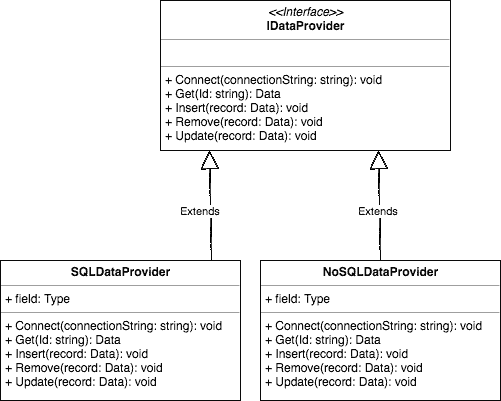

# 依赖注入概述

> 原文:[https://dev.to/samueleresca/dependency-injection-overview](https://dev.to/samueleresca/dependency-injection-overview)

*原贴于[https://samueleresca.net](https://samueleresca.net)T3】*

依赖注入是一套软件设计原则和模式，它使我们能够开发松散耦合的代码，这也是面向对象编程中最容易被误解的概念之一。依赖注入模式与实体原则严格相关，更多信息:使用类型脚本的[实体原则](https://samueleresca.net/2016/08/solid-principles-using-typescript/)DI 的主要目的是通过松耦合技术实现可维护性，下面是从*松耦合*中获得的一些**好处**:

### 后期绑定

服务可以与其他服务交换，**后期绑定**指的是不用重新编译代码就可以替换应用程序的一部分的能力。例如，以下情况允许开发人员引用 IDataProvider 接口，并在关系数据库和 NoSQL 数据库之间切换，而无需更改代码:

[T2】](https://res.cloudinary.com/practicaldev/image/fetch/s--xMqTGkOU--/c_limit%2Cf_auto%2Cfl_progressive%2Cq_auto%2Cw_880/https://samueleresca.net/wp-content/uploads/2017/01/download.png)

### 扩展性和可维护性

代码可以被扩展和重用，每个类的职责变得**清晰定义**。最后，添加新特性更加容易，因为代码的结构允许开发人员了解在哪里应用更改。

### 测试

DI 是支持单元测试的重要部分。单元测试对应用程序的状态提供了快速的反馈，但是只有当单元可以从它的依赖项中正确地分离出来时，才可能编写单元测试。通过使用 DI，开发人员能够在应用程序代码中**注入依赖关系**和**模仿**来测试应用程序的特定部分，而不会影响其他部分。

下面是一个模仿单元测试的简单例子:

```
public class DropDownDataControllerTest
{
    [TestMethod]
    public void GetDatesShouldReturnDatesFromRepository()
    {
        //Arrange
        var mockRepository = new Mock<IDropDownDataRepository>();
        var dateEntities = new[] { new DateEntity { Date = new DateTime(1990, 1, 1) }, new DateEntity { Date = new DateTime(1990, 1, 1) } };
        mockRepository
            .Setup(x => x.GetDates())
            .Returns(dateEntities);

        DropDownDataController controller = new DropDownDataController(mockRepository.Object);

        //Act 
        var response = controller.GetDates();

        //Assert
        Assert.AreEqual(dateEntities, response);
    }
} 
```

### 依赖注入容器

DI container 是一个软件库，它可以自动完成许多任务，包括编写对象和管理它们的生命周期。DI 容器通常公开一个`Resolve`方法:它解析任意类型的实例。DI 容器知道如何通过使用一种配置或注册点将抽象(或接口)映射到具体类型来组合所请求的类型。最后，DI 容器通过将它们自己的配置与来自类构造函数* *的信息相结合，固有地组成了对象图。* *

### DI 容器配置

配置 DI 容器有三种方式:

*   **静态文件 as 配置:** JSON 或 XML 存储关于 DI 映射的信息。优点是它支持替换而无需重新编译，缺点是没有编译时检查；
*   **代码作为配置:**DI 映射在代码中指定。优点是编译时检查，缺点是不支持不编译代码的替换；
*   **自动注册:**一组规则(或命名约定)定位合适的组件并构建映射。其优点是支持无需重新编译的替换，并执行约定以使代码基础更加一致。缺点是没有编译时检查；

### DI 容器模式

有一些模式描述了使用 DI 容器的正确方法:

*   **组合根:**具体类和接口之间的映射必须尽可能靠近应用程序入口点进行组合。合成根应该是应用程序中的唯一位置；
*   * *注册、解析、释放:注册、解析和释放模式描述了如何使用阿迪容器。Register Resolve Release 模式规定，阿迪容器的方法必须按照严格的顺序调用。`Register`方法向容器注册组件。`Resolve`方法基于接口解析具体的类。最后，当不再需要实例时,`Release`方法销毁它们。

### 依赖注入模式

依赖注入模式描述了在我们的应用程序中实现依赖注入的不同方式。最重要的是构造函数注入模式。

### 构造函数注入

使用依赖项的类公开了一个公共的**构造函数**，它将所需依赖项的一个实例作为构造函数的参数。将包含依赖项的字段标记为 **readonly** 是一个很好的做法，这保证了一旦构造函数的初始化逻辑执行完毕:该字段就不能被修改。下面是一个**构造函数注入的例子:**

```
class CourseController {

    private categoryRepository: ICategoryRepository;

    public CourseController(categoryRepository: ICategoryRepository) {
        this.categoryRepository = categoryRepository;
    }
}

//FAKE CLASS 
interface ICategoryRepository {
    DoStuff(searchTerm: string): string
} 
```

**构造函数注入**应该是 DI 的默认选择。它解决了最常见的场景，即一个类需要一个或多个依赖项，并且没有合理的本地缺省值可用。

### 属性注入模式

当依赖项是可选的时，我们可以公开一个可写属性，允许客户端提供一个不同于默认的类依赖项的实现。

```
class SubCategoriesController {
    public CategoryRepository: ICategoryRepository;

    public DoSomething(searchCategory: string): string {
        return this.CategoryRepository.DoStuff(searchCategory);
    }
} 
```

属性注入—
应该只在你开发的类有一个好的本地缺省值，并且你仍然想让调用者提供类的依赖的不同实现时使用。

### 法注射

调用方在每个方法调用中将依赖项作为方法参数提供，例如:

```
class SubCategoriesController {
    public DoSomething(searchCategory: string, context: ICategoryRepository): string {
        return context.DoStuff(searchCategory);
    }
} 
```

**方法注入**——最好在依赖关系随每个方法调用而变化时使用。当依赖项本身表示一个值时，可能会出现这种情况，但当调用方希望向使用者提供有关调用操作的上下文的信息时，通常会出现这种情况。

### 最终的想法

依赖注入是实现松散耦合的最佳方式，松散耦合是可维护代码的重要部分。我们从松耦合中看到的好处并不总是立竿见影的，但是在维护阶段，随着时间的推移，它们会变得显而易见。干杯:)