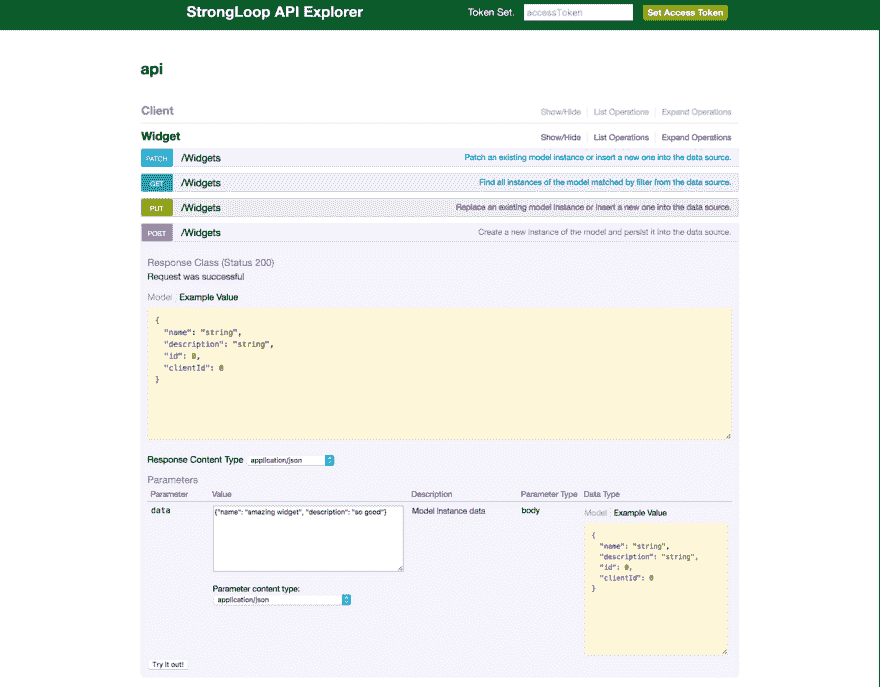
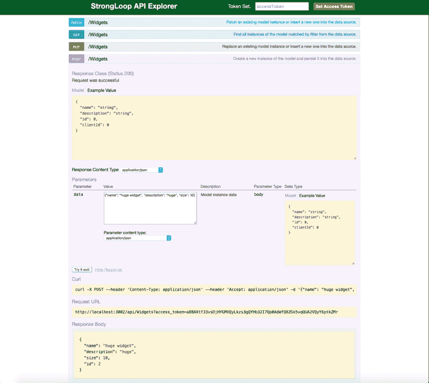
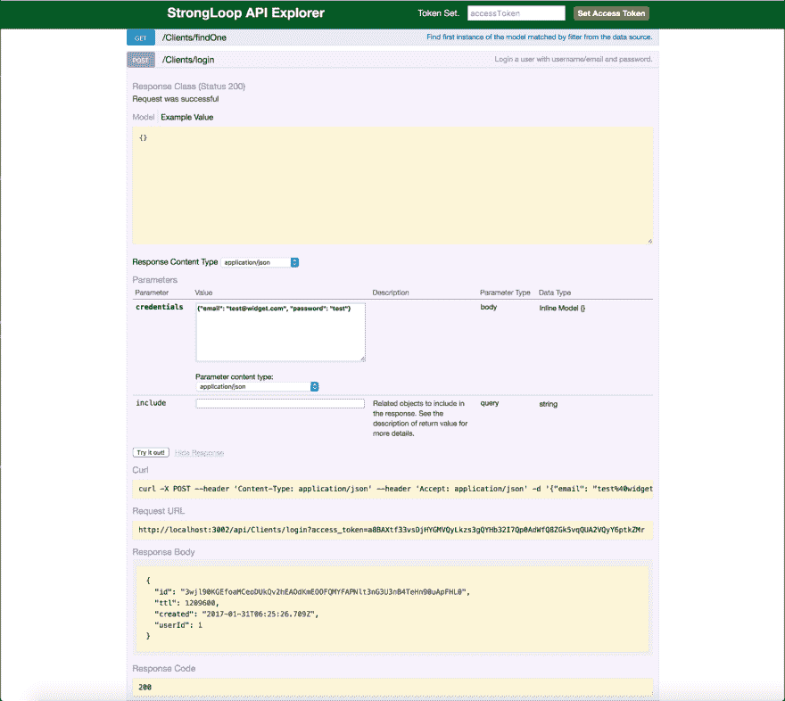

# 使用 Strongloop 的回送功能授权资源和数据库迁移

> 原文：<https://dev.to/jcolemorrison/authorized-resources-and-database-migrations-with-strongloops-loopback>

这篇文章将涵盖以下内容:

*   用 Docker 设置 Strongloop Loopback 和 MySQL 本地环境
*   用 docker-compose 连接我们的环境
*   搭建出一些基本模型
*   通过环回实现数据库迁移和更新的自动化
*   通过授权和身份验证保护 REST 端点

主要关注点将是数据库迁移/更新和认证/授权。这里有很大一部分是关于创建一个独立的 MySQL 镜像，它不会破坏本地机器上的现有版本。我觉得有必要包括前几个部分的原因是，我个人无法忍受一个指南/提示/教程刚刚开始就假定一切都已经设置好了。

如果您只是想了解数据库迁移，可以跳到指南的这一部分。这样做的脚本是可重用的，只需将您的模型替换为其中的模型。

这个库的代码可以在这里找到:

[https://github . com/jcolemorrison/strong loop-auto migration-demo](https://github.com/jcolemorrison/strongloop-automigration-demo)

#### 目录

*   [前言](#preface)
*   [设置开发环境](#setting-up)
*   [建立独立的 MySQL 数据库](#setting-up-mysql)
*   [搭建我们的模型](#scaffolding-out-models)
*   [自动化数据库迁移和更新](#database-migration)
*   [最终想法](#final-thoughts)

# [前言](#preface)

是的。 [Strongloop 的](https://strongloop.com/) [Loopback 的](http://loopback.io/)。没错。是的，我真的很喜欢。在 base ExpressJS 中做了许多许多项目之后，不用再做这些工作是一件令人耳目一新的事情

a)挖掘 npm 包汤厨房
b) ID 维护良好的包
c)连接自己家中的包汤
d)维护/定制包
e)重新发明轮子

strongloop 环回解决了一切吗？我不知道我为什么要问这个问题，因为我们都知道答案。不。没什么能。然而，构建可靠的 REST APIs、处理认证/授权、拥有多个数据源(一个模型到 mongo，一个到 sql)、路由、文档...

...所有不需要动脑但同时又能计时的小事。

我要说的是，它没有更普遍的唯一两个原因是由于两个原因:

1)非常糟糕的文档
2)面向创建 API，不一定有前端
3)糟糕的文档

第一个是大多数框架通常怀疑的对象，通常也是大多数优秀开发工具的祸根。就好像有些团队不想让我们用他们的东西..或者他们在隐藏什么..

第二个问题似乎总是与选择有关。大多数开发人员希望在一个框架中处理前端、后端、heroku 部署和免费资金。我个人喜欢它专注于 API，并将其视为一种优势而不是一个问题。这使得 It 在服务风格体系结构对话中变得更加容易。

第三。糟糕的文件。我是认真的，如果一个开发者发布了一个框架，但是没有人知道它是做什么的，那么这个开发者发布了一个框架吗？

这可能会引发一个问题——“好吧，你似乎足够喜欢它了。”我确实这么做了，因为挖掘 git 问题、通过经验学习和浏览文档的痛苦比为一个 API 配置一个完整的 express 应用程序的痛苦要小。

此外，一旦理解了基本概念，就会非常有效率。

这些都是题外话，但是对于每个想到使用 Express 之外的东西而可能会或可能不会失去理智的人来说都是如此。哦对了，Strongloop 是*维护* Express 的组织。IBM 拥有 Strongloop。因此，很有可能 Strongloop Loopback 不会去任何地方。

够了，让我们开始吧。

# [设置开发环境](#setting-up)

我们会用 Docker 很快地做到这一点(如果你读过我的其他帖子，我倾向于使用它。很多。).确保你已经安装了它，并且你也有一个[https://hub.docker.com/](https://hub.docker.com/)帐户和登录。(还要确保使用该登录名在命令行上执行`docker login`)。

从这里开始:[https://www.docker.com/products/docker](https://www.docker.com/products/docker)

虽然只使用 Strongloop 和 MySQL 的本地版本完全没问题，但我在本教程中将其分割出来，以便它完全独立，不会影响我们的其他安装。

#### 1)创建一个`code`目录，并在命令行中导航到该目录

`$ mkdir code && cd code`

可能没必要提怎么做。

#### 2)在`code`中创建一个名为`dev-images`的文件夹，并在其中创建一个名为`strongloop`的文件夹

`$ mkdir -p dev-images/strongloop`

我们将把我们的`Dockerfile`放在这里，在这里建立我们的开发 Docker 形象。

如果您不熟悉，这将允许我们在一个分段的盒子(docker 容器)中运行我们的代码，而不必直接安装任何依赖项。

#### 3)在`code/dev-images/strongloop`中创建 Dockerfile

如果我们在`code`

`$ touch dev-images/strongloop/Dockerfile`

在我们的文本编辑器中打开它

#### 4)输入以下内容:

```
From node:6.9.4

# Yarn please
RUN curl -o- -L https://yarnpkg.com/install.sh | bash

ENV PATH="/root/.yarn/bin:${PATH}"

# Installs these globally WITHIN the container, not our local machine
RUN yarn && yarn global add loopback-cli && yarn global add nodemon

# Any commands start from this directory IN the container
WORKDIR /usr/src/api 
```

Enter fullscreen mode Exit fullscreen mode

这允许我们使用 Strongloop 的 CLI、Yarn 和 Nodemon。几个注意事项:

a)每次都用纱线代替 NPM(速度、性能、较少的重复、纱线、一致性锁定)

b) Loopback-cli 是 Strongloop 的“新”cli。这是 Strongloop 希望大家迁移到 vs. `strongloop`和`slc`的原因。

#### 5)构建 Docker 图像

在`code`中建立图像`docker build -t <yourusername>/strongloop-dev dev-images/strongloop/`

其中`<yourusername>`是您的用户名。

如果您以前使用过这些中间映像/层，您可以使用`--no-cache=true`来确保它是全新安装和执行的。

#### 6)创建`docker-compose`文件

在`code`目录下创建一个`docker-compose.yml`文件。这将是一个方便的文件，我们可以同时运行 MySQL 数据库和 Strongloop 容器，查看它们的日志并管理/运行命令。

`$ touch docker-compose.yml`

在`docker-compose.yml`文件中输入以下内容:

```
# The standard now
version: '2'

# All of the images/containers compose will deal with
services:

  # our strongloop service shall be known as 'api'
  api:
    # use your user name
    image: <yourusername>/strongloop-dev

    # map the containers port of 3000 to our local 3002
    ports:
      - 3002:3000

    # mount our current directory (code) to the container's /usr/src/api
    volumes:
      - .:/usr/src/api

    # the default command unless we pass it one
    command: nodemon . 
```

Enter fullscreen mode Exit fullscreen mode

唯一需要注意的是，注释中没有的可能是我们选择使用`port` `3002`而不是`3000`。`3000`很好，但是每当我开发一个 API 时，总会有另一个容器也想要端口`3000`。显然，我们不能将两者映射到同一个。

除非我们另外指定，否则将运行的是`command`。默认情况下，将使用 Nodemon 启动应用程序，这样，如果我们对文件进行更改，我们就不必手动重启应用程序。

*确保用你的用户名*退出`<yourusername>`

#### 7)脚手架退出 Strongloop 程序

从我们的`code`目录中，我们现在可以开始使用`docker-compose`来管理我们的命令。运行以下命令:

`$ docker-compose run api lb`

这将开始应用程序搭建。使用以下设置:

您的应用程序名称是什么？按回车键保持使用当前目录

您想使用哪个版本的环回？使用 3.x

你想要什么样的应用？API-服务器

现在，它将搭建应用程序并安装依赖项。它将使用 NPM，但我们会尽快完成。

#### 8)一旦 NPM 安装完成...

运行:

`$ docker-compose run api yarn`

这将链接依赖关系，创建一个 yarn.lock 文件等等。这将在开发环境中创建依赖关系的一致性。我的意思是，如果有人在另一台机器上做这个项目，他们肯定会每次都得到所有软件包的所有正确版本。不会不小心升级一个之类的。

同样，如果你厌倦了输入 100 次`docker-compose`，只要打开你的`.bashrc`并输入以下:

```
alias dco="docker-compose"
alias dcor="docker-compose run" 
```

Enter fullscreen mode Exit fullscreen mode

然后在当前终端会话中运行

`$ source ~/.bashrc`

现在我们可以像这样运行纱线:

`$ dcor api yarn`

*注意:你只需要打开当前的终端窗口，从现在开始任何新的会话都将包括这些别名*

#### 9)测试你的新回环应用

在我们的`code`目录中，运行

`$ docker-compose up`

完成所有设置后，导航到`localhost:3002/explorer`查看您闪亮的新 api。

*注意:尽管容器会说它在`localhost:3000`上，但这并不是它在本地机器上的位置。记住，我们绘制了`3000` - > `3002`*

如果您有兴趣了解关于 docker 的更多信息，我有一个完整的指南专门介绍如何在 AWS 上建立一个完整的环境:

[ECS 上容错和负载平衡 AWS Docker 部署指南](http://start.jcolemorrison.com/guide-to-fault-tolerant-and-load-balanced-aws-docker-deployment-on-ecs/)

# [建立独立的 MySQL 数据库](#setting-up-myqsl)

现在我们需要设置 MySQL docker 镜像、容器和组合服务。老实说，在任何需要本地数据库的开发领域，这都是一个非常有用的模式。它将允许您安全地配置各种版本的 MySQL，而不用担心会破坏您本地可能有或没有的任何 MySQL 设置。

为了能够拉下本地的`mysql`图像，如开始所述，你需要一个[https://hub.docker.com/](https://hub.docker.com/)的账户。创建完成后，您需要运行:

`$ docker login`

并使用您的中心帐户凭据。

#### 10)打开我们的`docker-compose.yml`文件，并修改它以反映以下内容:

```
# The standard now
version: '2'

# All of the images/containers compose will deal with
services:

  # our strongloop service shall be known as 'api'
  api:
    # use your user name
    image: jcolemorrison/strongloop-dev

    # map the containers port of 3000 to our local 3002
    ports:
      - 3002:3000

    # mount our current directory (code) to the container's /usr/src/api
    volumes:
      - .:/usr/src/api

    # the default command unless we pass it one
    command: nodemon .

  # ADD HERE.  This is what our MySQL service shall be known as
  mysqlDb:

    # This is the official MySQL 5.6 docker image
    image: mysql:5.6

    # These are required variables for the official MySQL image
    environment:
      MYSQL_ROOT_PASSWORD: "${DB_ROOT}"
      MYSQL_DATABASE: "${DB_NAME}"
      MYSQL_USER: "${DB_USER}"
      MYSQL_PASSWORD: "${DB_PWD}"

    # Keep it mapped to the usual MySQL port
    ports:
      - 3306:3306

    # Create a separate volume on our machine to map to the container's default mysql data directory
    volumes:
      - strongloopDev:/var/lib/mysql

# These must be declared to be used above
volumes:
  strongloopDev: 
```

Enter fullscreen mode Exit fullscreen mode

这里与我们定义的前一个服务(`api`)有 3 个主要区别:

a)我们正在使用一个`environment`字段。它声明了 MySQL 镜像所需要的值，如果我们想让数据库在没有大量额外工作的情况下运行的话。你可以在这里阅读更多关于官方 MySQL 图片[。](https://hub.docker.com/_/mysql/) 

```
MYSQL_ROOT_PASSWORD: Password to our `root` user
MYSQL_DATABASE: Our DB name
MYSQL_USER: Our `user` that's not `root`
MYSQL_PASSWORD: Our `user` password 
```

Enter fullscreen mode Exit fullscreen mode

在实际的文件中，我们从哪里得到插值呢？docker-compose 将在同一个目录中查找一个`.env`文件，并使这些值在文件内部可用。我们下次再做。

b)我们正在创建一个名为`strongloopDev`的卷，并将其映射到容器的 mysql 数据目录。这就像我们在上面将当前目录挂载到容器中所做的一样。然而，代替当前目录，Docker 在我们的机器上有一个区域，它将为我们创建一个目录并挂载。这更多的是为了理解正在发生的事情的直接准确性。

试想，当我们像这样定义一个卷时，docker 会在我们的机器上创建一个文件夹(`strongloopDev`)来存放文件。它把它安装到我们传递给它的路径上，在我们的例子中是`/var/lib/mysql`。

在我们制作`.env`文件之前，为什么是 MySQL 5.6？这很简单，因为在生产中，我使用的是与 5.6 直接兼容的[亚马逊 Aurora DB](https://aws.amazon.com/rds/aurora/) 。

#### 11)在`code`目录下创建一个新文件`.env`并输入以下内容:

```
DB_NAME=strongdevdb
DB_USER=strongdevuser
DB_PWD=strongdevpwd
DB_ROOT=strongroot 
```

Enter fullscreen mode Exit fullscreen mode

太好了，现在我们的`docker-compose`文件中的那些值将会正确填充。

#### 12)在我们的`code`目录中，运行以下命令启动 api 服务器和 mysql 服务:

`$ docker-compose up`

*我们也可以运行`docker-compose up -d`让服务在后台启动，然后运行`docker-compose logs -f`查看日志*

我们来确认一下，我们的 MySQL db 确实是活的。在另一个选项卡中运行以下内容(当然是在同一个`code`目录中):

`$ docker-compose run mysqlDb mysql -h <yourlocalip> -P 3306 -u strongdevuser -p`

其中`<yourlocalip>`是您本地网络中的 IPv4 地址(即 10.0.0.100)。要找到它运行:

`ifconfig | grep 'inet '`

而且应该是两个地址中的第二个。

运行 mysql 命令后，系统会提示我们输入`strongdevuser`的密码，也就是`strongdevpwd`。

一旦内部运行:

`show databases;`

我们将看到我们的数据库已经创建。然后运行:

`use strongdevdb;`

#### 13)安装`loopback-connector-mysql`包

在我们的`code`中运行以下内容(或者在另一个新标签中，或者您可以停止我们的服务，或者在 mysql db 标签中运行它):

`$ docker-compose run api yarn add loopback-connector-mysql`

这个包允许我们将回送应用程序连接到 MySQL。

一旦安装完成，在我们的文本编辑器中，打开`server/datasources.json`。修改它以反映以下内容:

```
{  "db":  {  "name":  "db",  "connector":  "memory"  },  "mysql":  {  "name":  "mysql",  "connector":  "mysql",  "database":  "strongdevdb",  "password":  "strongdevpwd",  "user":  "strongdevuser",  "port":  3306,  "host":  "mysqlDb"  }  } 
```

Enter fullscreen mode Exit fullscreen mode

`mysql`的所有顶级键都是，只是对 loopback 的引用(正如它的 name 属性一样)。除了`host`属性之外，其他的都应该很好解释了。一般来说，如果这是一个本地数据库，我们会输入类似`localhost`或一个特定的 IP。但是因为这些是 docker 容器，所以我们引用它们作为它们的服务名！当`docker-compose`将我们的容器放在一起时，它使每个服务的名称作为它的名称对作为主机的彼此可用。

太好了，现在我们的 MySQL 和 Loopback 服务可以一起工作了。

# [搭建我们的模型](#scaffolding-out-models)

现在我们要创建两个模型。一个是我们自己的用户类型，名为`Client`，另一个是奢侈的、外来的用户类型，名为`Widget`。我们将使用这些来演示数据库迁移、认证和授权。

让我们开始`client`

#### 14)在`code`目录下，运行以下命令:

`$ docker-compose run api lb model Client`

(说真的，如果您经常使用 docker，请使用我提到的那些别名)

这将开始模型架子工。使用以下设置:

*输入型号名称:*在此按回车键使用`Client`

*选择客户端要连接的数据源:*使用`mysql`

*选择模型的基类*:向下滚动选择`User`

*通过 REST API 公开客户端？*按下`y`和`enter`

*自定义复数形式(用于构建 REST URL)* 只要按回车键，就会默认为`clients`

*仅通用型号或服务器？*使用`server`

之后，在属性上再次按回车键。我们不想增加任何额外的东西。我们将获得内置环回用户获得的所有属性。

先不说这个。为什么我们要创造一个全新的用户？因为在 Strongloop 的无限智慧中他们决定了两件事:

a)内置用户应被称为`User`
b)扩展其功能的唯一方法是用您自己的模型来扩展它

这可能是最烦人的事情之一，但却如此之小。他们可以很容易地把它叫做`BaseUser`，这样我们就可以把我们的叫做`User`。支持这里的变化:【https://github.com/strongloop/loopback/issues/3028 T2】

#### 15)通过运行以下程序创建`Widget`模型:

`$ docker-compose run api lb model Widget`

就像之前一样，我们将完成这个过程并创建一些设置。

*输入型号名称:*在此按回车键使用`Widget`

*选择客户端要连接的数据源:*使用`mysql`

*选择模型的基类*:向下滚动选择`Persisted Model`

*通过 REST API 公开客户端？*按下`y`和`enter`

*自定义复数形式(用于构建 REST URL)* 只要按回车键，就会默认为`widgets`

*仅通用型号或服务器？*使用`server`

对于属性，对于第一个:

属性名称:`name`
属性类型:`string`
必填:`n`
默认值:为空为无

第二点:

属性名称:`description`
属性类型:`string`
必填:`n`
默认值:为空为无

这两个之后，只需在第三个属性上再次按 enter 键，不输入任何内容，它就会退出。

#### 16)通过`hasMany`关系将`Widget`和`Client`联系起来:

这是一个令人敬畏的，非常 Rail-sy 功能。我们可以轻松地关联模型，并自动创建相关的 rest 端点。在我们这里的例子中，我们将使一个`Client` `hasMany` `Widget` s 通过端点:

`/clients/:id/widgets`

这也是一个非常“简单”的原始 ExpressJs 中的文件脚手架 timesink。让我们通过运行以下命令来实现这一点:

`$ docker-compose run api lb relation`

使用以下设置:

*选择要创建关系的模型:*选择`Client`

*关系类型:*选择`hasMany`

*选择与*建立关系的模式选择`Widget`

*输入关系的属性名:*按回车键接受`widgets`

*可选地输入一个自定义外键:*按回车键，它将默认使用`widgetId`

*需要直通模式？*键入`n`并按回车键

我们的关系就建立了。

我们可以通过导航到`server/models/client.json`在我们的代码中查看这一点，我们将看到这种关系，并且我们的所有属性都已搭建出来。

这也是环回的真正优点。我们通过创建一个 json 文件来定义我们的模型。脚手架工具所做的就是创建这个文件和附带的`.js`文件。

它还将新模型添加到我们的`server/model-config.json`文件中，该文件基本上是所有环回模型的主配置文件。去吧，现在就打开。你应该是这样的:

```
{  "_meta":  {  "sources":  [  "loopback/common/models",  "loopback/server/models",  "../common/models",  "./models"  ],  "mixins":  [  "loopback/common/mixins",  "loopback/server/mixins",  "../common/mixins",  "./mixins"  ]  },  "User":  {  "dataSource":  "db"  },  "AccessToken":  {  "dataSource":  "db",  "public":  false  },  "ACL":  {  "dataSource":  "db",  "public":  false  },  "RoleMapping":  {  "dataSource":  "db",  "public":  false  },  "Role":  {  "dataSource":  "db",  "public":  false  },  "Client":  {  "dataSource":  "mysql",  "public":  true  },  "Widget":  {  "dataSource":  "mysql",  "public":  true  }  } 
```

Enter fullscreen mode Exit fullscreen mode

马上，我们应该注意到一个问题。除了我们的`Client`和`Widget`型号，其他型号都使用内存存储中的`db`。更改所有这些`mysql`，并将`User`设置为属性`public: false`，因为我们必须使用我们的扩展`Client`模型。`model-config.json`文件现在应该看起来像这样:

```
{  "_meta":  {  "sources":  [  "loopback/common/models",  "loopback/server/models",  "../common/models",  "./models"  ],  "mixins":  [  "loopback/common/mixins",  "loopback/server/mixins",  "../common/mixins",  "./mixins"  ]  },  "User":  {  "dataSource":  "mysql",  "public":  true  },  "AccessToken":  {  "dataSource":  "mysql",  "public":  false  },  "ACL":  {  "dataSource":  "mysql",  "public":  false  },  "RoleMapping":  {  "dataSource":  "mysql",  "public":  false  },  "Role":  {  "dataSource":  "mysql",  "public":  false  },  "Client":  {  "dataSource":  "mysql",  "public":  true  },  "Widget":  {  "dataSource":  "mysql",  "public":  true  }  } 
```

Enter fullscreen mode Exit fullscreen mode

优秀的

#### 17)头回过头来`localhost:3002/explorer`

a)点击`Widget`选项，查看已创建的端点列表。

b)点击`GET /Widgets`

我们会看到它失败了。尽管我们已经设置了应用程序逻辑来处理模型和关系，但是我们还没有将这一变化通知我们的数据库。让我们现在做那件事。

注意，我们通过 UI 控制台而不是`curl`来做这件事，只是为了步骤更少和更简洁。我们可以通过简单地做一些类似于:
的事情来创建对 API 的请求

```
curl -H "Accept: application/json" \
     -H "Content-Type: application/json" \
     -X POST -d "{\"email\": \"user@name.com\", \"password\": \"password\"}" \ localhost:3002/api/clients/login 
```

Enter fullscreen mode Exit fullscreen mode

上面的代码将获取您的访问令牌，然后获取经过身份验证的小部件，我们将:

```
curl -H "Accept: application/json" \
     -H "Content-Type: application/json" \
     -H "Authorization: TOKEN_WE_JUST_GOT" \
     localhost:3002/api/widgets 
```

Enter fullscreen mode Exit fullscreen mode

实际上，重要的部分是如何设置 AUTH 头。除此之外，一切都很简单。

# [自动化数据库迁移和更新](#database-migration)

在围绕任何类型的数据库开发的任何类型的应用程序中，一个反复出现的问题是改变模式、表和数据结构。大多数应用程序栈，特别是 Rails，都有很好的方法来处理这个问题(至少是一种方法)。然而，在 Node 的世界里，祝你好运。Sequelize 有一些，但是和传统的开发团队一样——文档很糟糕。Knex 和 Bookshelf 都很棒，但那当然需要配置 express。Sails.js 和 friends 有 Waterline，但上次我查看 Sails.js 时，它们已经分裂了，现在我不知道它是帆、路径还是什么。

我们不要从 Mongo 开始。许多开发人员选择 mongo 仅仅是因为它看起来像 JSON 一样有趣。不可避免的是，正如大多数应用程序中的大多数数据一样，它们需要关系。一旦所有数据开始变得超级关系繁重，NoSQL 的所有好处就开始消失(很快)。

回到正题。Strongloop 的 Loopback 实际上有一个非常棒的迁移/更新系统。然而，你会认为他们不想让你知道这件事。不是没有记载，只是措辞很奇怪。有两个功能:

`automigrate` -更新您的表格，但删除现有表格中的所有数据。哎哟。

`autoupdate` -更新表格。

当我第一次读它的时候，可能只有我一个人，我认为`autoupdate`只是在表已经存在的情况下才可以执行的事情。当然，这导致了一个奇怪的难题:如果表不存在，就寻找一种方法来创建它，如果它存在，就更新它，而且只有当它需要更新时才更新。

令人欣慰的是，尽管它被可怕地记录下来，我们还是能做到这一点。

我们要做的是双重的:

**a)** 创建一个迁移脚本，该脚本将创建我们的表并删除当前的表。当我们需要刷新本地开发环境或添加种子数据时，我们可以运行这个程序。

**b)** 创建一组自动更新脚本，使我们的数据库与我们所有的`models/model.json`文件保持同步！

#### [T5 18)在我们的`code`目录下新建一个文件夹`bin`。在`bin`中创建一个名为`migrate.js`的文件](#18-create-a-new-folder-raw-bin-endraw-in-our-raw-code-endraw-directory-create-a-file-inside-of-raw-bin-endraw-called-raw-migratejs-endraw-)

因此，我们的`code`目录中的完整文件路径是`bin/migrate.js`

里面放了下面的:

```
'use strict'

const path = require('path')

// import our app for one time usage
const server = require(path.resolve(__dirname, '../server/server.js'))

// reference to our datasource that we named 'mysql'
const mysql = server.dataSources.mysql

// the basic loopback model tables
const base = ['User', 'AccessToken', 'ACL', 'RoleMapping', 'Role']

// our custom models
const custom = ['Widget', 'Client']
const lbTables = [].concat(base, custom)

// Run through and create all of them
mysql.automigrate(lbTables, function (err) {
  if (err) throw err
  console.log('  ')
  console.log('Tables [' + lbTables + '] reset in ' + mysql.adapter.name)
  console.log('  ')
  mysql.disconnect()
  process.exit(0)
}) 
```

Enter fullscreen mode Exit fullscreen mode

*随意抛在一边*

我讨厌分号和长行，所以如果你的编辑抱怨，只需修改你的`code`目录中的`.eslintrc`文件，以反映以下内容:

```
{  "extends":  "loopback",  "parserOptions":  {  "ecmaVersion":  6  },  "rules":  {  "semi":  ["error",  "never"],  "space-before-function-paren":  ["error",  "always"],  "max-len":  ["error",  100]  }  } 
```

Enter fullscreen mode Exit fullscreen mode

*/end 可选抛开*

#### 19)运行迁移脚本

在我们的`code`目录中运行以下命令:

`docker-compose run api node bin/migrate.js`

完成后，进入 mysql DB 命令行并运行

`show tables;`

我们将看到我们所有的表现在都存在。

#### 20)创造一个`Widget`

回到我们的`localhost:3002`

a)找到`POST /Widgets`

b)创建`{"name": "amazing widget", "description": "so good"}`

[T2】](https://res.cloudinary.com/practicaldev/image/fetch/s--pxwIftUS--/c_limit%2Cf_auto%2Cfl_progressive%2Cq_auto%2Cw_880/https://s3-us-west-1.amazonaws.com/www.jcolemorrison.com/blog/posts/strongloop-loopback-docker-1-29-2017/step-20.png)

c)点击`Try it out!`，将创建`Widget`。

现在解决用新模式更新表的问题。

#### 21)导航到`server/models/widget.json`并添加以下属性:

```
{  "properties":  {  "name":  {  "type":  "string"  },  "description":  {  "type":  "string"  },  "size":  {  "type":  "number"  }  },  } 
```

Enter fullscreen mode Exit fullscreen mode

其中`size`是我们的新财产。

#### 22)返回`localhost:3002/explorer`并尝试以下`Widget`:

a)找到`POST /Widgets`

b)创建`{"name": "huge widget", "description": "huge", "size": 10}`

c)点击`Try it out!`

它将会失败:

`Unknown column 'size' in 'field list'`

让我们现在创建这些`Autoupdate`脚本

#### 23)在`server/boot/base.migration.js`创建一个新文件

在这个文件中，我们将创建 Loopback 内置模型的自动更新。输入以下内容:

```
'use strict'

// the base loopback models
const models = ['User', 'AccessToken', 'ACL', 'RoleMapping', 'Role']

module.exports = function updateBaseModels (app, next) {
  // reference to our datasource
  const mysql = app.dataSources.mysql

  // check to see if the model is out of sync with DB
  mysql.isActual(models, (err, actual) => {
    if (err) {
      throw err
    }

    let syncStatus = actual ? 'in sync' : 'out of sync'
    console.log('')
    console.log(`Base models are ${syncStatus}`)
    console.log('')

    // if the models are in sync, move along
    if (actual) return next()

    console.log('Migrating Base Models...')

    // update the models
    mysql.autoupdate(models, (err, result) => {
      if (err) throw err
      console.log('Base models migration successful!')
      console.log('')
      next()
    })
  })
} 
```

Enter fullscreen mode Exit fullscreen mode

保存这个文件后，如果我们返回到我们的日志，我们会看到消息说它们是同步的。我们没有改变它们，老实说，可能甚至不会改变基本模型，但以防万一，我们需要欺骗他们。

#### 24)在`server/boot/custom.migration.js`创建一个新文件

最后，对于我们的定制模型，即使这些脚本基本上是相同的，这也是方便的，因为我们可能不得不在将来改变它们与基础模型不同的更新方式。

```
'use strict'

const models = ['Widget', 'Client']

module.exports = function updateCustomModels (app, next) {
  const mysql = app.dataSources.mysql
  mysql.isActual(models, (err, actual) => {
    if (err) {
      throw err
    }

    let syncStatus = actual ? 'in sync' : 'out of sync'

    console.log('')
    console.log(`Custom models are ${syncStatus}`)
    console.log('')

    if (actual) return next()

    console.log('Migrating Custom Models...')

    mysql.autoupdate(models, (err, result) => {
      if (err) throw err

      console.log('Custom models migration successful!')
      console.log('')

      next()
    })
  })
} 
```

Enter fullscreen mode Exit fullscreen mode

这个没有评论，因为它是一样的。

不过，有一个例外。顾名思义，这个目录包含了每次 loopback 应用程序启动时运行的脚本。因此，在这种情况下，当我们的应用程序重新启动时，它将始终寻求确保我们的模型与基于我们的`model.json`文件的数据库同步。

保存后，回到控制台，我们应该看到消息，我们的定制模型已经成功迁移！现在让我们返回并创建那个巨大的小部件。

#### 25)返回`localhost:3002/explorer`并创建巨大的部件

a)找到`POST /Widgets`

b)创建`{"name": "huge widget", "description": "huge", "size": 10}`

c)点击`Try it out!`

一切都应该按计划进行。从现在开始，如果我们更新一个模型的 json 文件并重启，MySQL 数据库将自动更新。

[T2】](https://res.cloudinary.com/practicaldev/image/fetch/s--vRn8EQPJ--/c_limit%2Cf_auto%2Cfl_progressive%2Cq_auto%2Cw_880/https://s3-us-west-1.amazonaws.com/www.jcolemorrison.com/blog/posts/strongloop-loopback-docker-1-29-2017/step-25.png)

如果你想验证这些确实存在，只要回到 Mysql 数据库，做一个`select * from Widget;`，你就会看到我们漂亮的小部件。当然，它缺少`clientID`,因为还没有通过关系创建任何变量，这是我们接下来要做的。

# [认证和授权资源](#auth-resources)

Strongloop 有一个非常出色(也很有趣)但却非常容易被记录和混淆的授权概念。它被称为 ACL 或“访问控制列表”。他们有一点学习曲线，但一旦超过这一点就非常有用。更不用说比大多数其他包汤授权库更好了。

在一个`model.json`文件中有一个名为`acls`的属性。这是一个数组，接受一组遵循
模式的对象

```
{  "accessType":  READ,  WRITE,  EXECUTE,  "principalType":  USER,  APP,  ROLE,  "principalId":  if  `Role`  then  one  of  a  few  we'll  mention  below,  "permission":  ALLOW  or  DENY,  "property":  an  array  of  methods  or  a  single  one  this  applies  too  } 
```

Enter fullscreen mode Exit fullscreen mode

我们将使用的最常见的设置是一个`principalType: ROLE`,它允许我们使用一个`principleId`:

*   `$owner` -只有资源所有者可以访问
*   `$everyone` -任何人都可以访问
*   `$authenticated` -只有登录用户可以访问
*   `$unauthenticated` -已注销的用户
*   我们可以定义自己的角色！

这些 ACL 有其应用的优先顺序。简而言之，这意味着如果您应用 3 个不同的 ACL，回送将按照设定的顺序确定最终许可。这一点实际上在他们文件的结尾已经说得很清楚了

[http://loopback . io/doc/en/lb3/Controlling-data-access . html # ACL-rule-precedence](http://loopback.io/doc/en/lb3/Controlling-data-access.html#acl-rule-precedence)

我喜欢用视觉来思考这个问题。

我有资源。在我们的例子中是一个小部件。它又大又绿。

有一条路可以让所有人进来。

为了只过滤掉我想要的流量，我将在通往小部件的道路上设置安全岗哨。

这种情况下的岗哨是 ACL。它们都有自己的一套规则来允许流量进入。

无论如何..

首先，让我们创建第一个相关的小部件。

#### 26)脑袋转到了`localhost:3002/explorer`

a)在`Client`下找到`POST /Clients`,让我们创建一个用户并使用以下内容:

`{"email": "test@widget.com", "password": "test"}`

b)创建我们的用户后，找到`POST /Clients/login`并使用以下内容(与您注册时使用的相同):

`{"email": "test@widget.com", "password": "test"}`

发布之后，它将返回一个`Access Token`的实例。

[T2】](https://res.cloudinary.com/practicaldev/image/fetch/s--CDZt9SU3--/c_limit%2Cf_auto%2Cfl_progressive%2Cq_auto%2Cw_880/https://s3-us-west-1.amazonaws.com/www.jcolemorrison.com/blog/posts/strongloop-loopback-docker-1-29-2017/step-26.png)

从这里，获取返回令牌的`id`属性，将其粘贴到导航栏中的`Set Access Token`字段并设置它。

从这一点开始，所有这些只是将我们的访问令牌添加到每个请求中。

还要注意我们的`userId`

c)找到`POST /Clients/:id/widgets`，为`id`输入您的`userId`，并发布以下小工具:

`{"name": "user widget", "description": "user awesome", "size": 5}`

我们将在这里收到一个授权错误。这是因为，默认情况下，相关资源不允许被它们的相关模型执行/读取。

#### 27)跳到`client.json`并在`acls`数组中添加以下对象:

```
{  "accessType":  "EXECUTE",  "principalType":  "ROLE",  "principalId":  "$authenticated",  "permission":  "ALLOW",  "property":  ["__create__widgets"]  } 
```

Enter fullscreen mode Exit fullscreen mode

上面的 ACL 说，如果`Client`被认证，允许一个`Client`通过相关的方法`__create__widgets`创建一个`Widget`。

所有相关的模型方法都遵循`__action__relatedModelPluralName`的模式

然而，仅仅因为我们能得到它们并不意味着我们能得到它们。再添加一个 ACL:

```
{  "accessType":  "READ",  "principalType":  "ROLE",  "principalId":  "$owner",  "permission":  "ALLOW",  "property":  ["__get__widgets",  "__findById__widgets"]  } 
```

Enter fullscreen mode Exit fullscreen mode

上面声明，如果我们的`Client`是所有者，这意味着他们的`clientId`作为外键出现在小部件上，允许他们通过完整的 get 列表或作为单独的 find by id 来获取小部件。

相关建模方法的列表*部分*见本文档:【http://loopback.io/doc/en/lb3/Accessing-related-models.html】T2

我说一些，因为我一直在寻找任何地方都没有记载的方法和别名。

最终的`client.json`应该是这样的:

```
{  "name":  "Client",  "base":  "User",  "idInjection":  true,  "options":  {  "validateUpsert":  true  },  "properties":  {},  "validations":  [],  "relations":  {  "widgets":  {  "type":  "hasMany",  "model":  "Widget",  "foreignKey":  ""  }  },  "acls":  [  {  "accessType":  "EXECUTE",  "principalType":  "ROLE",  "principalId":  "$authenticated",  "permission":  "ALLOW",  "property":  ["__create__widgets"]  },  {  "accessType":  "READ",  "principalType":  "ROLE",  "principalId":  "$owner",  "permission":  "ALLOW",  "property":  ["__get__widgets",  "__findById__widgets"]  }  ],  "methods":  {}  } 
```

Enter fullscreen mode Exit fullscreen mode

#### 28)头回`localhost:3002/explorer`和`POST`小部件

找到`POST /Clients/:id/widgets`，为`id`输入你的`userId`,发布以下小工具:

`{"name": "user widget", "description": "user awesome", "size": 5}`

现在它可以工作了。太棒了。不过还有一个问题。我们仍然可以直接`POST`到`Widgets` API。这意味着小部件可以在没有所有者的情况下创建，这可能是我们想要的，也可能不是。为了锁定`Widget` api...

#### 29)打开`server/widget.json`并添加以下 ACL:

```
{  "accessType":  "*",  "principalType":  "ROLE",  "principalId":  "$everyone",  "permission":  "DENY"  } 
```

Enter fullscreen mode Exit fullscreen mode

这直接拒绝任何人直接访问小部件。但是通过客户端的访问仍然有效。当没有提供`property`时，它假定所有。最终的`widget.json`应该是这样的:

```
{  "name":  "Widget",  "base":  "PersistedModel",  "idInjection":  true,  "options":  {  "validateUpsert":  true  },  "properties":  {  "name":  {  "type":  "string"  },  "description":  {  "type":  "string"  },  "size":  {  "type":  "number"  }  },  "validations":  [],  "relations":  {},  "acls":  [  {  "accessType":  "*",  "principalType":  "ROLE",  "principalId":  "$everyone",  "permission":  "DENY"  }  ],  "methods":  {}  } 
```

Enter fullscreen mode Exit fullscreen mode

除此之外的另一种方法就是转到我们的`model-config.json`，将`public: true`改为`public: false`。

# [最终想法](#final-thoughts)

与节点社区中的大多数东西一样，Strongloop Loopback 有许多主要的优点和强大的功能...然而，它的文档非常缺乏。我仍然是它的大力支持者，尽管仅仅是因为一个人在如此短的时间内是多么富有成效。这么多 REST APIs 有这么多共同点，为什么又都是？

设置定制的 REST 方法、角色并连接到 Passport oAuth 非常简单。更不用说与几乎任何 Express 包集成都很简单，因为它只是 Express 的一个扩展。有了一个漂亮而简单的迁移系统，这个过程就简单多了。

我有一个视频系列正在制作中，应该会在接下来的几个月内发布，其中将包括对 Strongloop 的 Loopback 的超级深入研究，将它与 Docker 一起使用，并将其部署为与 AWS 内部的一个单独的 react webservice 挂钩！

如果这个视频系列听起来很有趣，或者如果你想订阅并在你的收件箱里收到我的每周指南，注册我的邮件列表吧！

* * *

像往常一样，如果有任何技术故障或问题，请给我留下评论或留言。

* * *

这篇文章最初发布在 J .科尔.莫里森网站上:技术指南和想法

查看我的其他指南:

*   [ECS 上容错和负载平衡 AWS Docker 部署指南](http://start.jcolemorrison.com/guide-to-fault-tolerant-and-load-balanced-aws-docker-deployment-on-ecs/)
*   [在 Docker 环境中使用 SASS、Storybook 和 Yarn 创建 React 应用](http://start.jcolemorrison.com/no-eject-create-react-app-with-sass-storybook-and-yarn-in-a-docker-environment/)

* * *