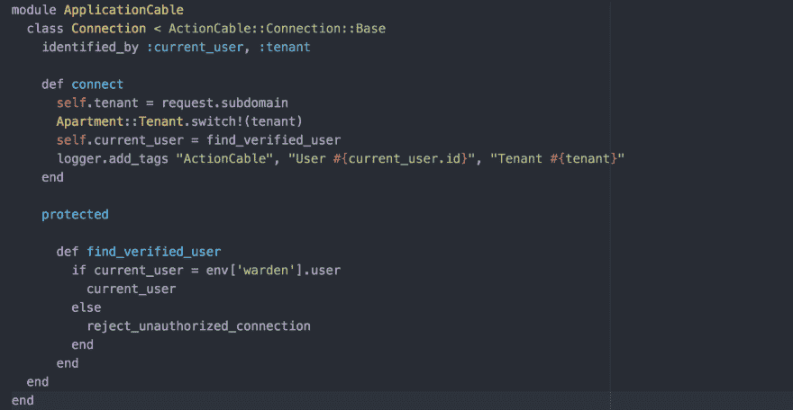
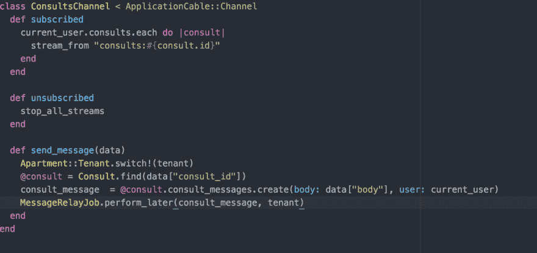

# 传奇仍在继续

> 原文:[https://dev . to/shakycode/rails-action cable-the-saga-continues](https://dev.to/shakycode/rails-actioncable-the-saga-continues)

昨天我写了一篇题为“我与 Rails ActionCable 的斗争”的文章，得到了很多好的反馈和评论。但是一夜之间，我对我面临的这个问题进行了长时间的思考，因为我无法将请求源(也称为租户)委托给 channel.rb 文件。

公寓宝石上有一个公开的问题，几个人在讨论公寓和 Actioncable。在做了自己的研究后，我看到了隧道尽头的亮光。Apartment gem 的一个贡献者找到了一些关于如何验证用户连接的文档，他在文档中发现了以下内容。

"请注意，标记为标识符的任何内容都将在通过连接创建的任何通道实例上自动创建同名的委托。"

所以我开始重构我的代码，这是我在 connection.rb 文件中得到的结果

[T2】](https://res.cloudinary.com/practicaldev/image/fetch/s--PeLYKXwT--/c_limit%2Cf_auto%2Cfl_progressive%2Cq_auto%2Cw_880/https://cdn-images-1.medium.com/max/1600/1%2Am5tzRJ4kviE1LczEAI9TCA.png)

如果您注意到 ActionCable 连接现在由`current_user`和`tenant`标识，通过简单地调用`self.tenant = request.subdomain`在`connect`方法中设置`tenant`，然后我们立即切换租户并基于租户连接到适当的通道。因为我们现在将租户委托给通道，所以用我们的`send_message`方法连接通道和切换租户是一个相对容易的解决方案。

[T2】](https://res.cloudinary.com/practicaldev/image/fetch/s--yN_G4qx_--/c_limit%2Cf_auto%2Cfl_progressive%2Cq_auto%2Cw_880/https://cdn-images-1.medium.com/max/1600/1%2AlP8CDseOefW7aDh9nF3FBA.png)

现在，如果您查看通道文件中的`send_message`方法，您会注意到我们正在像这样切换租户`Apartment::Tenant.switch!(tenant)`，这现在是可能的，因为我们从`connection.rb`文件中委托了`tenant`，以便它可用于通道。

最终结果是，ActionCable 和多租户现在全面投入使用。老实说，我还没有见过有人构建多租户 SaaS 平台并集成 ActionCable 的用例(相信我，我已经谷歌了好几个小时)。

所以现在这个特性已经接近完成，只是解决了一些 coffeescript 的错误和后台作业处理器的问题。

我希望很快就这个主题写一个完整的教程，但现在问题已经解决了，我必须非常感谢公寓和 Rails 社区帮助我朝着正确的方向解决我的特定用例。

你用 ActionCable 构建了什么？您正在实施多租户吗？如果有，给我喊一声，我们来切磋一下！

干杯！
shakycode
Twitter:[shakycode](https://twitter.com/shakycode)T4】Email:[shakycode@gmail.com](mailto:shakycode@gmail.com)

[原贴于此](https://shakycode.com/rails-actioncable-the-saga-continues-7c29301be0df#.rsxhmuduh)