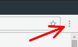
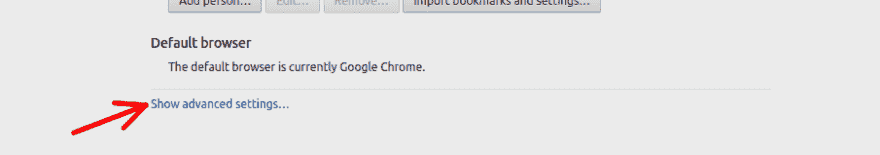
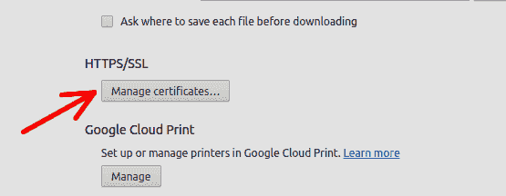
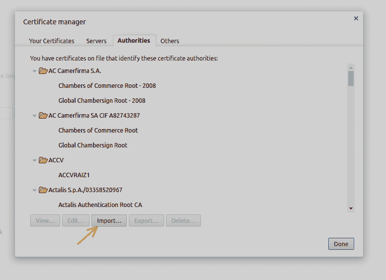
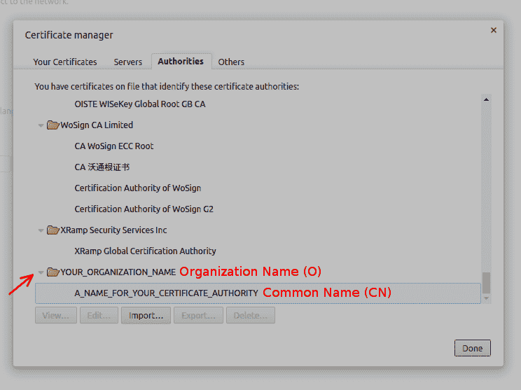

# 使用 OpenSSL 创建证书

> 原文:[https://dev . to/ruidfigueiredo/using-OpenSSL-to-create-certificates](https://dev.to/ruidfigueiredo/using-openssl-to-create-certificates)

您可能希望创建由您自己的证书颁发机构签名的数字证书，原因有几个。

您可能有一个运行在内部网络中的网站，并且您可能希望与该网站的所有交互都通过 HTTPS 进行。

创建自己的证书的另一个原因是尝试用 HTTPS 配置 web 服务器的过程。

这篇博文描述了创建数字证书的一系列步骤，您可以使用这些步骤在网站上启用 HTTPS。

[T2】](https://res.cloudinary.com/practicaldev/image/fetch/s--DWGkZROl--/c_limit%2Cf_auto%2Cfl_progressive%2Cq_auto%2Cw_880/http://www.blinkingcaret.com/wp-content/uploads/2017/01/Lock.jpg)

我们将使用 OpenSSL。您可以在 Windows 或 Linux 上执行这些步骤。如果你使用的是 Windows，你可以安装 [OpenSSL for Windows](http://gnuwin32.sourceforge.net/packages/openssl.htm) ，或者，如果你使用的是 Windows 10，你可以使用 [Bash on Ubuntu on Windows](https://msdn.microsoft.com/en-us/commandline/wsl/about) 。

如果你使用的是 Linux，在大多数发行版中(我在 Ubuntu 16.04 上试过)，你只需要打开一个终端窗口。OpenSSL 很可能已经安装了，但如果没有，您需要安装的包是`libssl1.0.0`和`libssl-dev`。

# 认证机构

为了创建我们自己的证书，我们需要一个证书授权机构来签署它(如果你不知道这意味着什么，我推荐你阅读一下 https 如何工作的简要说明)。

如果不知道什么是证书或证书颁发机构，就很难记住这些步骤。此外，如果出了问题，你可能很难找到原因。

使用 OpenSSL 创建您自己的证书颁发机构的第一步是创建一个文件夹，该文件夹将存储证书颁发机构的证书和私钥，所以让我们这样做:

```
~$ mkdir myCertificateAuthority 
```

<svg width="20px" height="20px" viewBox="0 0 24 24" class="highlight-action crayons-icon highlight-action--fullscreen-on"><title>Enter fullscreen mode</title></svg> <svg width="20px" height="20px" viewBox="0 0 24 24" class="highlight-action crayons-icon highlight-action--fullscreen-off"><title>Exit fullscreen mode</title></svg>

在新创建的文件夹中，添加一个用于存储签名证书的子文件夹:

```
~/myCertificateAuthority$ mkdir certificates 
```

<svg width="20px" height="20px" viewBox="0 0 24 24" class="highlight-action crayons-icon highlight-action--fullscreen-on"><title>Enter fullscreen mode</title></svg> <svg width="20px" height="20px" viewBox="0 0 24 24" class="highlight-action crayons-icon highlight-action--fullscreen-off"><title>Exit fullscreen mode</title></svg>

在`myCertificateAuthority`中，我们必须创建一个名为 serial(没有扩展名)的文件，其中包含文本“01”。

每次我们签署证书时，该文件都会自动更新。

在 bash 中创建带有“01”的串行文件的一种快速方法是:

```
~/myCertificateAuthority$ echo '01' > serial 
```

<svg width="20px" height="20px" viewBox="0 0 24 24" class="highlight-action crayons-icon highlight-action--fullscreen-on"><title>Enter fullscreen mode</title></svg> <svg width="20px" height="20px" viewBox="0 0 24 24" class="highlight-action crayons-icon highlight-action--fullscreen-off"><title>Exit fullscreen mode</title></svg>

我们需要创建的另一个文件名为`index.txt`。该文件可以创建为空文件。当我们签署证书时，它会自动更新。

```
~/myCertificateAuthority$ touch index.txt 
```

<svg width="20px" height="20px" viewBox="0 0 24 24" class="highlight-action crayons-icon highlight-action--fullscreen-on"><title>Enter fullscreen mode</title></svg> <svg width="20px" height="20px" viewBox="0 0 24 24" class="highlight-action crayons-icon highlight-action--fullscreen-off"><title>Exit fullscreen mode</title></svg>

唯一剩下的就是证书颁发机构的配置文件。

## 认证机构配置文件

配置文件包含关于认证机构的信息，即诸如其名称、电子邮件地址等标识信息。此外，它还包含默认值，例如将由该证书颁发机构签名的证书的默认持续时间。

这里有一个从 Ubuntu 的 [OpenSSL 帮助页面中截取的经过修改的样本，我们将很快讨论其中的一些变化。](https://help.ubuntu.com/community/OpenSSL)

```
[ ca ]
default_ca      = local_ca
#
#
# Default location of directories and files needed to generate certificates.
#
[ local_ca ]
dir             = /home/YOUR_USER/myCertificateAuthority
certificate     = $dir/certificateAuthorityCertificate.pem
database        = $dir/index.txt
new_certs_dir   = $dir/certificates
private_key     = $dir/certificateAuthorityPrivateKey.pem
serial          = $dir/serial
#
#
# Default expiration and encryption policies for certificates.
#
default_crl_days        = 365
default_days            = 1825
default_md              = sha256
#
policy          = local_ca_policy
x509_extensions = local_ca_extensions
#
#
# Copy extensions specified in the certificate request
#
copy_extensions = copy
#
#
# Default policy to use when generating server certificates.  The following
# fields must be defined in the server certificate.
#
[ local_ca_policy ]
commonName              = supplied
stateOrProvinceName     = supplied
countryName             = supplied
emailAddress            = supplied
organizationName        = supplied
organizationalUnitName  = supplied
#
#
# x509 extensions to use when generating server certificates.
#
[ local_ca_extensions ]
basicConstraints        = CA:false
#
#
# The default root certificate generation policy.
#
[ req ]
default_bits    = 2048
default_keyfile = /home/YOUR_USER/certificateAuthorityPrivateKey.pem
default_md      = sha256
#
prompt                  = no
distinguished_name      = root_ca_distinguished_name
x509_extensions         = root_ca_extensions
#
#
# Root Certificate Authority distinguished name.  Change these fields to match
# your local environment!
#
[ root_ca_distinguished_name ]
commonName              = A_NAME_FOR_YOUR_CERTIFICATE_AUTHORITY
stateOrProvinceName     = STATE_NAME
countryName             = COUNTRY_CODE_ONLY_TWO_CHARACTERS_ALLOWED
emailAddress            = EMAIL_ADDRESS
organizationName        = YOUR_ORGANIZATION_NAME
organizationalUnitName  = YOUR_ORGANIZATION_UNIT_NAME
#
[ root_ca_extensions ]
basicConstraints        = CA:true 
```

<svg width="20px" height="20px" viewBox="0 0 24 24" class="highlight-action crayons-icon highlight-action--fullscreen-on"><title>Enter fullscreen mode</title></svg> <svg width="20px" height="20px" viewBox="0 0 24 24" class="highlight-action crayons-icon highlight-action--fullscreen-off"><title>Exit fullscreen mode</title></svg>

值得注意的变化是`default_md`的值将默认散列函数设置为 *sha256* ，而不是 *sha1* 。 [*sha1* 正在被弃用](https://security.googleblog.com/2015/12/an-update-on-sha-1-certificates-in.html)，不幸的是网上找到的大多数例子都使用 *sha1* 。

用上面的内容创建一个名为 caconfig.cnf 的文件，并用适合您的情况的值替换 block capital 值。

我们现在准备好生成我们自己的认证机构的证书和私钥。

在我们这样做之前，这里有一个所需步骤的清单，这样我们可以确保我们没有遗漏任何步骤:

*   为证书颁发机构创建一个文件夹(例如 myCertificateAuthority)
*   创建一个名为 serial 的文件，其中包含文本“01”
*   创建一个名为 index.txt 的空文件
*   创建一个文件夹来存储签名的证书(例如 myCertificateAuthority/signed certificates)
*   创建证书颁发机构的配置文件(例如 caconf.cnf)

## 认证机构的自签名证书和私钥

要为我们自己的认证中心创建证书和私钥，我们首先需要将 caconf.cnf(我们刚刚创建的文件)设置为 OpenSSL 的配置文件。一个快速的方法是在`OPENSSL_CONF`环境变量中设置 caconf.cnf 文件的路径。

```
~/myCertificateAuthority$ export OPENSSL_CONF=~/myCertificateAuthority/caconf.cnf 
```

<svg width="20px" height="20px" viewBox="0 0 24 24" class="highlight-action crayons-icon highlight-action--fullscreen-on"><title>Enter fullscreen mode</title></svg> <svg width="20px" height="20px" viewBox="0 0 24 24" class="highlight-action crayons-icon highlight-action--fullscreen-off"><title>Exit fullscreen mode</title></svg>

我们现在可以运行 OpenSSL 命令来生成证书和私钥:

```
~/myCertificateAuthority$ openssl req -x509 -out certificateAuthorityCertificate.pem -newkey rsa:2048 -keyout certificateAuthorityPrivateKey.pem -days 365 
```

<svg width="20px" height="20px" viewBox="0 0 24 24" class="highlight-action crayons-icon highlight-action--fullscreen-on"><title>Enter fullscreen mode</title></svg> <svg width="20px" height="20px" viewBox="0 0 24 24" class="highlight-action crayons-icon highlight-action--fullscreen-off"><title>Exit fullscreen mode</title></svg>

当您编写`openssl req`时，您正在[访问证书请求并在 OpenSSL](https://www.openssl.org/docs/man1.0.1/apps/req.html) 中生成实用程序。OpenSSL 有许多实用程序/函数，这只是其中之一。

`-x509`表示自签名证书。这意味着将使用与证书中的公钥相匹配的私钥对其进行签名。

`-out`标志表示证书文件的名称。在这种情况下*certificate authoritycertificate . PEM*。

`-newkey rsa:2048`表示:创建一个 2048 位的新 rsa 密钥对。公钥将在证书中，私钥由参数`-keyout`指定。在这种情况下`certificateAuthorityPrivateKey.pem`

证书和私钥(`-out`和`-keyout`)的位置和名称必须与 caconf.cnf ( *证书*和*私钥*)中的内容相匹配，否则在使用该证书颁发机构签署证书时会出现问题。

`-days`用于指定认证机构的证书有效期。默认值为 1 个月。

注意，即使在 caconf.cnf 中有一个名为`default_days`的字段，该字段定义了由该证书颁发机构签署的证书的默认有效性。证书颁发机构的证书本身的有效性不受该值的影响。这意味着如果您不指定`-days`选项，您将为您的证书颁发机构获得一个仅持续一个月的证书。

当您运行该命令时，您将得到类似如下的输出:

```
Generating a 2048 bit RSA private key
...........................+++
........+++
writing new private key to 'certificateAuthorityPrivateKey.pem'
Enter PEM pass phrase: 
```

<svg width="20px" height="20px" viewBox="0 0 24 24" class="highlight-action crayons-icon highlight-action--fullscreen-on"><title>Enter fullscreen mode</title></svg> <svg width="20px" height="20px" viewBox="0 0 24 24" class="highlight-action crayons-icon highlight-action--fullscreen-off"><title>Exit fullscreen mode</title></svg>

如果您不想创建带密码的证书，您可以包含`-nodes`选项。

如果您想检查您的证书颁发机构的证书是否一切正常，您可以运行以下命令:

```
$ openssl x509 -in certificateAuthorityCertificate·pem -text 
```

<svg width="20px" height="20px" viewBox="0 0 24 24" class="highlight-action crayons-icon highlight-action--fullscreen-on"><title>Enter fullscreen mode</title></svg> <svg width="20px" height="20px" viewBox="0 0 24 24" class="highlight-action crayons-icon highlight-action--fullscreen-off"><title>Exit fullscreen mode</title></svg>

输出将包括证书的有效性(开始和结束日期)、签名算法和您在 caconf.cnf 中指定的所有信息，如 commonName、emailAddress 等。

现在我们有了自己的证书颁发机构，可以开始签署证书了。但是，要使我们的证书颁发机构得到认可，它必须被认为是可信的证书颁发机构。

## 将我们的认证机构添加到 Chrome

只有由可信证书颁发机构的签名的证书[才是可信的。要使证书颁发机构可信，必须将其证书添加为可信来源。在操作系统级别有很多方法可以做到这一点，但是这些方法都是特定于您所使用的操作系统的。](http://www.blinkingcaret.com/2017/01/18/brief-ish-explanation-of-how-https-works/)

作为适用于任何操作系统的替代方案，您可以将证书颁发机构的证书添加到您的浏览器可信证书颁发机构的存储中。例如，对于 Chrome 来说，这就是你要做的(Firefox 的过程是一样的)。

打开 Chrome，进入设置。
[T3】](https://res.cloudinary.com/practicaldev/image/fetch/s---68DbZxl--/c_limit%2Cf_auto%2Cfl_progressive%2Cq_auto%2Cw_880/http://www.blinkingcaret.com/wp-content/uploads/2017/01/ChromeSettings.png)

点击“显示高级设置”。

[T2】](https://res.cloudinary.com/practicaldev/image/fetch/s--cPxxqIzi--/c_limit%2Cf_auto%2Cfl_progressive%2Cq_auto%2Cw_880/http://www.blinkingcaret.com/wp-content/uploads/2017/01/ShowAdvancedSettings.png)

查找 HTTP/SSL，然后单击“管理证书”。

[T2】](https://res.cloudinary.com/practicaldev/image/fetch/s--5XmLhCQT--/c_limit%2Cf_auto%2Cfl_progressive%2Cq_auto%2Cw_880/http://www.blinkingcaret.com/wp-content/uploads/2017/01/ManageCertificates.png)

选择*机构*(在 Windows 中这是*可信根认证机构*)选项卡。

[T2】](https://res.cloudinary.com/practicaldev/image/fetch/s--gCtRzExM--/c_limit%2Cf_auto%2Cfl_progressive%2Cq_auto%2Cw_880/http://www.blinkingcaret.com/wp-content/uploads/2017/01/Authorities.png)

单击导入(在 Windows 中。pem 格式不会显示为选项之一，但如果您选择“显示所有文件”,您也可以导入它。

[T2】](https://res.cloudinary.com/practicaldev/image/fetch/s--R9GX0dXR--/c_limit%2Cf_auto%2Cfl_progressive%2Cq_auto%2Cw_880/http://www.blinkingcaret.com/wp-content/uploads/2017/01/ImportCACert.png)

下面是它最终的样子:

[T2】](https://res.cloudinary.com/practicaldev/image/fetch/s--9TJqTSRf--/c_limit%2Cf_auto%2Cfl_progressive%2Cq_auto%2Cw_880/http://www.blinkingcaret.com/wp-content/uploads/2017/01/FindCACertificate.png)

您在 caconf.cnf 中选择的组织名称显示为文件夹，而通用名称显示为该文件夹下的一个条目(如果您使用的是 Windows，则 UI 略有不同，它将只显示通用名称，即它不会按组织名称对证书进行分组)。

# 证书签名请求(CSR)

证书签名请求是发送给证书颁发机构进行验证的文件。它包含创建证书所需的所有信息，包括公钥。

验证信息是否有效是证书颁发机构的责任(例如，somedomain.com 的证书实际上是发给其所有者的)。

如果证书颁发机构发现 CSR 中的信息确实是正确的，它可以颁发签名证书。

因为这篇博文是关于在开发环境中这样做的，所以让我们为 localhost 创建一个 CSR。

我们可以从创建一个新文件夹开始，在这个文件夹中，我们将存储生成 CSR 和存储证书所需的所有文件。

```
~$ mkdir myCertficates
~$ mkdir myCertificates/localhost 
```

<svg width="20px" height="20px" viewBox="0 0 24 24" class="highlight-action crayons-icon highlight-action--fullscreen-on"><title>Enter fullscreen mode</title></svg> <svg width="20px" height="20px" viewBox="0 0 24 24" class="highlight-action crayons-icon highlight-action--fullscreen-off"><title>Exit fullscreen mode</title></svg>

然后在`~/myCertficates/localhost`中创建一个名为 localhost.cnf 的文件，内容如下:

```
[ req ]
prompt                  = no
distinguished_name      = server_distinguished_name
req_extensions          = v3_req

[ server_distinguished_name ]
commonName              = localhost
stateOrProvinceName     = STATE_NAME
countryName             = COUNTRY_CODE_ONLY_TWO_CHARACTERS_ALLOWED
emailAddress            = EMAIL_ADDRESS
organizationName        = THE_ORGANIZATION_NAME
organizationalUnitName  = THE_ORGANIZATION_UNIT_NAME

[ v3_req ]
basicConstraints        = CA:FALSE
keyUsage                = nonRepudiation, digitalSignature, keyEncipherment 
```

<svg width="20px" height="20px" viewBox="0 0 24 24" class="highlight-action crayons-icon highlight-action--fullscreen-on"><title>Enter fullscreen mode</title></svg> <svg width="20px" height="20px" viewBox="0 0 24 24" class="highlight-action crayons-icon highlight-action--fullscreen-off"><title>Exit fullscreen mode</title></svg>

用适合您的用例的值替换大写字母上的内容。公用名是定义该证书对哪个域有效的值。如果您要为一个不同的域(例如 myDomain.com)创建一个 CSR，您应该输入 commonName=myDomain.com

将 OpenSSL 的配置文件设置为这个新创建的文件:

```
$ export OPENSSL_CONF=~/myCertificates/localhost/localhost.cnf 
```

<svg width="20px" height="20px" viewBox="0 0 24 24" class="highlight-action crayons-icon highlight-action--fullscreen-on"><title>Enter fullscreen mode</title></svg> <svg width="20px" height="20px" viewBox="0 0 24 24" class="highlight-action crayons-icon highlight-action--fullscreen-off"><title>Exit fullscreen mode</title></svg>

并运行以下命令来生成 CSR:

```
~/myCertificates/localhost$ openssl req -out localhostCsr.pem -newkey rsa:2048 -keyout localhostPrivateKey.pem 
```

<svg width="20px" height="20px" viewBox="0 0 24 24" class="highlight-action crayons-icon highlight-action--fullscreen-on"><title>Enter fullscreen mode</title></svg> <svg width="20px" height="20px" viewBox="0 0 24 24" class="highlight-action crayons-icon highlight-action--fullscreen-off"><title>Exit fullscreen mode</title></svg>

将提示您输入私钥的密码。如果您不希望私钥受密码保护，请包含`-nodes`选项。

这个命令非常类似于我们用来为证书颁发机构生成证书的命令。唯一的区别是没有`-x509`选项。这就是 OpenSSL 的工作方式。

运行命令后，文件夹中应该有三个文件。`localhost.cnf`、`localhostCsr.pem`和`localhostPrivateKey.pem`。

# 验证 CSR 并颁发证书

验证 CSR 和发布证书的过程非常简单，您只需要将 OpenSSL 的配置设置指向证书颁发机构的配置文件:

```
$ export OPENSSL_CONF=~/myCertificateAuthority/caconf.cnf 
```

<svg width="20px" height="20px" viewBox="0 0 24 24" class="highlight-action crayons-icon highlight-action--fullscreen-on"><title>Enter fullscreen mode</title></svg> <svg width="20px" height="20px" viewBox="0 0 24 24" class="highlight-action crayons-icon highlight-action--fullscreen-off"><title>Exit fullscreen mode</title></svg>

并运行以下命令:

```
$ openssl ca -in ~/myCertificates/localhost/localhostCsr.pem -out ~/myCertificates/localhost/localhostCertificate.pem 
```

<svg width="20px" height="20px" viewBox="0 0 24 24" class="highlight-action crayons-icon highlight-action--fullscreen-on"><title>Enter fullscreen mode</title></svg> <svg width="20px" height="20px" viewBox="0 0 24 24" class="highlight-action crayons-icon highlight-action--fullscreen-off"><title>Exit fullscreen mode</title></svg>

输出应该类似于以下内容:

```
Using configuration from /home/YOUR_USER/myCertificateAuthority/caconf.cnf
Enter pass phrase for /home/YOUR_USER/myCertificateAuthority/certificateAuthorityPrivateKey.pem:
Check that the request matches the signature
Signature ok
The Subject's Distinguished Name is as follows
commonName            :ASN.1 12:'localhost'
stateOrProvinceName   :ASN.1 12:'STATE_NAME'
countryName           :PRINTABLE:'IE'
emailAddress          :IA5STRING:'EMAIL_ADDRESS'
organizationName      :ASN.1 12:'THE_ORGANIZATION_NAME'
organizationalUnitName:ASN.1 12:'THE_ORGANIZATION_UNIT_NAME'
Certificate is to be certified until Jan 25 22:24:10 2022 GMT (1825 days)
Sign the certificate? [y/n]:y

1 out of 1 certificate requests certified, commit? [y/n]y
Write out database with 1 new entries
Data Base Updated 
```

<svg width="20px" height="20px" viewBox="0 0 24 24" class="highlight-action crayons-icon highlight-action--fullscreen-on"><title>Enter fullscreen mode</title></svg> <svg width="20px" height="20px" viewBox="0 0 24 24" class="highlight-action crayons-icon highlight-action--fullscreen-off"><title>Exit fullscreen mode</title></svg>

如果您检查您的`~/myCertificateAuthority`文件夹，您会注意到`serial`文件现在包含“02 ”,您的 index.txt 也被更新并包含关于刚刚颁发的证书的信息，而`~/myCertificateAuthority/certificates`文件夹包含一个名为`01.pem`的文件。该文件是本地主机的证书。

然而，因为我们使用了`-out ~/myCertificates/localhost/localhostCertificate.pem`选项，所以您也可以在 localhost 文件夹中找到名为`localhostCertificate.pem`的证书。

# PKCS12

为了在您的网络服务器中使用证书，有时需要使用 *pfx* (个人信息交换)格式。pfx 文件是捆绑在一起的证书和私钥。要为 localhost 生成一个`pfx`,请运行以下命令:

```
$ openssl pkcs12 -export -in localhostCertificate.pem -inkey localhostPrivateKey.pem -out localhost.pfx 
```

<svg width="20px" height="20px" viewBox="0 0 24 24" class="highlight-action crayons-icon highlight-action--fullscreen-on"><title>Enter fullscreen mode</title></svg> <svg width="20px" height="20px" viewBox="0 0 24 24" class="highlight-action crayons-icon highlight-action--fullscreen-off"><title>Exit fullscreen mode</title></svg>

如果您之前选择添加一个私钥密码，系统会提示您输入私钥密码，然后您会被要求输入`pfx`文件的密码(该密码不是可选的)。

在我的下一篇文章中，我将解释如何使用 Kestrel 启用 ASP.NET 核心中的 HTTPS，并使用与此处所述相同的过程创建证书。

为了确保你不会错过它，请在 twitter 上关注我 [@ruidfigueiredo](https://dev.to/ruidfigueiredo) ，当新帖子上线时，我会通知你。